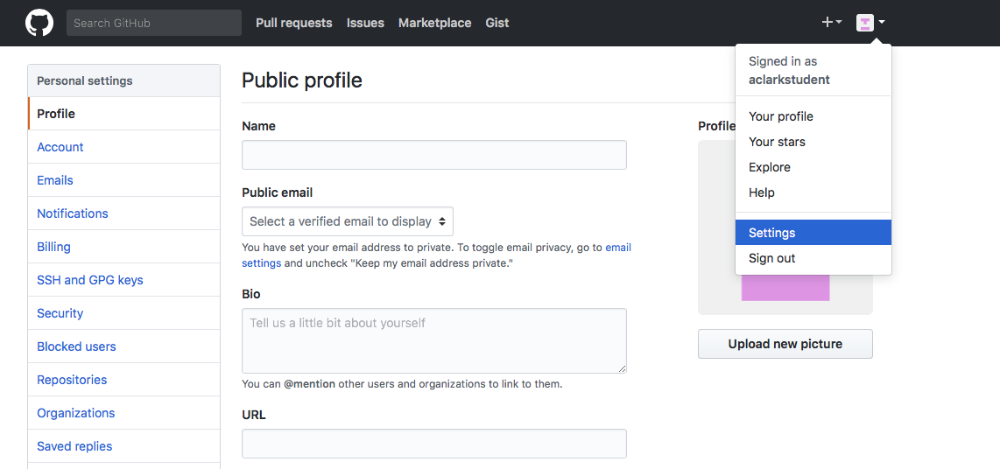
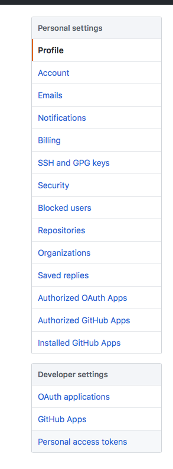
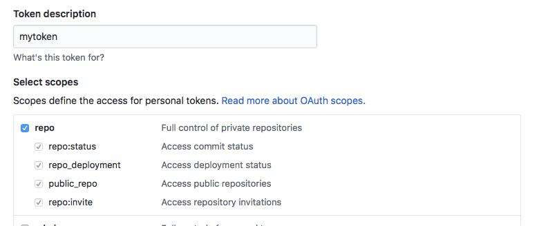
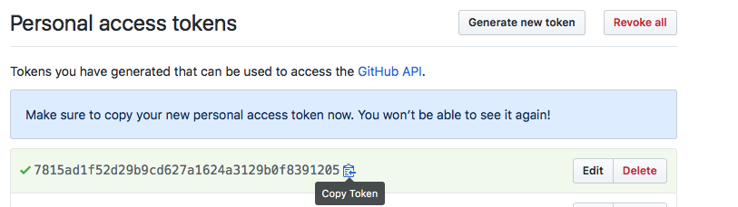
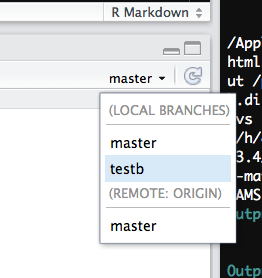

# Git/Github

## Overview

Help and how-to for certain things we will be using in this class.

## Github-related

### Set up a github access token

This is necessary for using `devtools::install_github()` to install
private packages, such as your class assignments.

1.  Go into your github account, click settings, and then developer
    settings: 

2.  Select personal access tokens: 

3.  Choose to generate a new token: 

4.  Generate a new token after naming the token something meaningful and
    checking the “repo” box:



5.  The result will look something like this. Choose copy link and then
    paste it somewhere safe. 

6.  For example, to install the class R package, you will need the token
    as follows:

    ``` r
    library(devtools)
    install_github("agroimpacts/geospaar", build_vignettes = TRUE, 
                   auth_token = "the-token-you-just-generated-pasted-here"))
    ```

### Branching and merging

A very useful reference for basic branching and merging can be found
[here](https://git-scm.com/book/en/v2/Git-Branching-Basic-Branching-and-Merging)

1.  Create a new branch, from within the terminal

    (replace with a meaningful branch name, e.g. a1)

    ``` bash
    git checkout -b <branchname>
    ```

2.  Switch branch

    - from terminal

    ``` bash
    git checkout <branchname>
    ```

    - from within Rstudio



3.  Delete a local branch (if you created one by accident, from
    terminal). Don’t do this to your master branch.

    ``` bash
    git branch -d <branchname>
    ```

4.  Push a branch to your remote GitHub repo

    ``` bash
    git push origin <branchname>
    ```

5.  Delete a remote branch

    ``` bash
    git push origin --delete <branchname>
    ```

6.  Merge two branches

    ``` bash
    git checkout <branch-you-want-to-merge-onto>
    git merge <branch-to-merge-onto-the-branch-you-are-in>
    ```

7.  Restore a previous commit

    There are multiple ways to do this, some more destructive than
    others. Perhaps the best way to do this is as follows:

    ``` bash
    git checkout -b <branch-name-for-older-project-state> <commithash>
    ```

    The commit hash is the identifier that git assigns to a particular
    commit. You can find the hashes under RStudio’s git history dialog
    in the SHA column. If you want to reset your master branch to the
    state it was in under this older commit, then one way you could do
    it that would best preserve your work up that point would be to:

    - create a new branch for the current master branch
    - delete the files in master branch and commit that change
    - merge the older branch back onto master, effectively restoring
      your master branch to the state it was in at the time of that
      older commit.

8.  Push all commits to remote

    Useful if you have multiple branches with commits that you have not
    yet pushed to GitHub. This does it all at once:

    ``` bash
    git push --all -u 
    ```

### RStudio and GitHub

1.  I can push and pull to my repo from the command line, but Rstudio’s
    git push and pull buttons are greyed out. How do I fix that? The
    answer can be found
    [here](https://landeco2point0.wordpress.com/2014/07/22/things-i-forget-pushpull-greyed-out-in-rstudio/).
    You can fix this and bring the buttons back to life if you do this,
    from the shell:

    ``` bash
    git push -u origin <branch-to-push>
    ```

    Note the -u flag. That should fix it.

------------------------------------------------------------------------

[Back to home](https://agroimpacts.github.io/geospaar/articles/index.md)

------------------------------------------------------------------------
