# Unit 2 Module 1

## Working with spatial vector data

In this section we will start to work with spatial vector data, learning
the most common forms of vector-based spatial operations. We will be
working primarily with the `sf` package, which replaces the earlier `sp`
package.

The material in this section assumes that the reader is familiar with
standard GIS operations and concepts, ranging from projections and
transformations to intersections, buffers, and differences.

## Preparation

### Set-up

Let’s start by loading `geospaar`.

``` r

library(geospaar)
```

`geospaar` imports `sf`. `sf` depends on the following external
libraries (from
[here](https://cran.r-project.org/web/packages/sf/index.html)):

> SystemRequirements: GDAL (\>= 2.0.1), GEOS (\>= 3.4.0), PROJ (\>=
> 4.8.0), sqlite3

These are external libraries that provide key geospatial capabilities
that are used by `R` and many other languages and platforms that can be
used for geospatial analytics. If you are using the docker container,
these are already installed so you don’t have to worry about them. Read
more about them by following these links: [GDAL](https://gdal.org/),
[GEOS](https://libgeos.org/), [PROJ](https://proj.org/en/9.3/),
[sqlite3](https://www.sqlite.org/index.html)

You should already have your class Rstudio project setup, with a
`notebooks/` folder within it. If you don’t already have it, create a
`data/` folder within `notebooks/`, which is where you will practice
writing spatial data files.

## Reading, writing, and making vector data

This reading introduces reading, writing, and making vector data, how to
work with their coordinate reference systems (CRS), and how to do some
basic plotting, leavened with some additional `R` programming examples.
However, the first thing we need to do is learn about simple features,
which is the representation of vector data that is employed by `sf`
(which stands for simple features).

### Simple features, explained

To learn more about what simple features are and how they work, and why
`R` developed a package for them, please read the `sf` introductory
[vignette](https://r-spatial.github.io/sf/articles/sf1.html) written by
Edzer Pebesma, the primary `sf` package developer.

### From non-spatial to spatial

We are going to start by reading in the `farmer_spatial` dataset, which
installs with `geospaar`. It contains results from a cellphone-based
survey of Zambian farmers that asks questions about crop management and
weather. This is a subset that contains the following variables:

- uuid: Unique anonymous identifier of survey respondent
- x: Longitude in decimal degrees (rounded to 3 places for anonymity)
- y: Latitude in decimal degrees (rounded to 3 places for anonymity)
- date: the last date in the 7 day survey interval.
- season: 1 (2015-2016 growing season) or 2 (2016-2017 growing season)
- rained: The answer to the question, “did it rain on your fields this
  week?”, coded as 1 for yes and 2 for no 0. There are also NA values,
  because the farmer might not have answered the question in that week.
- planted: The answer to the question “did you plant your crop this
  week?”, coded 1 or 2 yes (1) or no (2). As with the above there are
  many NAs, because the farmer might not have answered the question, but
  also because the question is only asked for a few weeks at the
  beginning of the season.

Note that there are multiple dates for most farmers, and since this is a
long format database, that means that the coordinates are duplicated
several times over.

Here’s a quick look:

``` r

# Chunk 1
farmers <- read_csv(system.file("extdata/farmer_spatial.csv", 
                                package = "geospaar"))
#
# 1
set.seed(30)
farmers %>% 
  sample_n(5) %>% 
  arrange(season, date)
#> # A tibble: 5 × 7
#>   uuid         x     y date       season rained planted
#>   <chr>    <dbl> <dbl> <date>      <dbl>  <dbl>   <dbl>
#> 1 f89c29a3  26.9 -16.3 2016-03-27      1      0      NA
#> 2 452b8e53  27.0 -16.9 2016-10-31      2      0       0
#> 3 609b90dc  25.9 -12.3 2016-11-07      2     NA       0
#> 4 67cbcae6  26.9 -16.7 2017-02-13      2      1      NA
#> 5 234938f6  27.2 -16.7 2017-05-29      2      0      NA
#
# #2
farmers %>% 
  distinct(uuid) %>% 
  count()
#> # A tibble: 1 × 1
#>       n
#>   <int>
#> 1   793
# 
# #3
farmers %>% 
  group_by(uuid, season) %>% 
  count() %>% 
  arrange(uuid)
#> # A tibble: 1,189 × 3
#> # Groups:   uuid, season [1,189]
#>    uuid     season     n
#>    <chr>     <dbl> <int>
#>  1 009a8424      1    10
#>  2 009a8424      2     6
#>  3 00df166f      1    21
#>  4 00df166f      2    29
#>  5 019d99f9      2    19
#>  6 0216b983      1     2
#>  7 0216b983      2    12
#>  8 02671a00      1    23
#>  9 02671a00      2    26
#> 10 02be9843      2    29
#> # ℹ 1,179 more rows
```

Okay, \#1 shows us that this dataset, read in as `farmers`, is a
`tibble`, which means it is non-spatial at the moment, even though its
comes with coordinates. \#2 shows us that there are 793 farmers in the
survey, and \#3 shows a varying number of observations per farmer per
season, with some farmers appearing only in one season.

Given that these are point data, we can turn them into a facsimile of
spatial data by simply plotting them and having a look.

``` r

# Chunk 2
ggplot(farmers %>% distinct(uuid, x, y)) + 
  geom_point(aes(x, y))
```

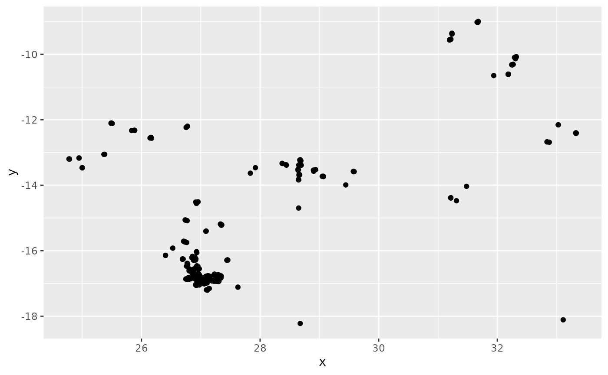

We first cut `farmers` down to just unique farmer *uuid* and coordinates
(to avoid duplicate points–remember, there is more than one observation
per farmer for most farmers), and then use `gglot` to shows us, in a
very crude way, where these points lie in space. This works, because
`farmers$x` (the longitude) is exactly analogous to the x coordinate of
a scatter plot, and `farmers$y` (latitude) is the y coordinate. But it
is still not a spatial object. So, let’s convert it to one, and then
plot it again.

``` r

# Chunk 3
# #1
farmers <- st_as_sf(farmers, coords = c("x", "y"))
farmers
#> Simple feature collection with 20984 features and 5 fields
#> Geometry type: POINT
#> Dimension:     XY
#> Bounding box:  xmin: 24.777 ymin: -18.222 xmax: 33.332 ymax: -8.997
#> CRS:           NA
#> # A tibble: 20,984 × 6
#>    uuid     date       season rained planted         geometry
#>    <chr>    <date>      <dbl>  <dbl>   <dbl>          <POINT>
#>  1 009a8424 2015-11-15      1      0       0 (27.256 -16.926)
#>  2 00df166f 2015-11-15      1      0       0 (26.942 -16.504)
#>  3 02671a00 2015-11-15      1      0       0 (27.254 -16.914)
#>  4 03f4dcca 2015-11-15      1      0       0 (27.237 -16.733)
#>  5 042cf7b3 2015-11-15      1      0       0 (27.138 -16.807)
#>  6 05618404 2015-11-15      1      0       0 (26.875 -16.611)
#>  7 064beba0 2015-11-15      1      1       0 (26.752 -16.862)
#>  8 083a46a2 2015-11-15      1      0       0 (26.977 -16.765)
#>  9 08eb2224 2015-11-15      1      0       0 (26.912 -16.248)
#> 10 0ab761d6 2015-11-15      1      0       0  (27.113 -16.95)
#> # ℹ 20,974 more rows
#
# #2
str(farmers)
#> sf [20,984 × 6] (S3: sf/tbl_df/tbl/data.frame)
#>  $ uuid    : chr [1:20984] "009a8424" "00df166f" "02671a00" "03f4dcca" ...
#>  $ date    : Date[1:20984], format: "2015-11-15" "2015-11-15" "2015-11-15" ...
#>  $ season  : num [1:20984] 1 1 1 1 1 1 1 1 1 1 ...
#>  $ rained  : num [1:20984] 0 0 0 0 0 0 1 0 0 0 ...
#>  $ planted : num [1:20984] 0 0 0 0 0 0 0 0 0 0 ...
#>  $ geometry:sfc_POINT of length 20984; first list element:  'XY' num [1:2] 27.3 -16.9
#>  - attr(*, "sf_column")= chr "geometry"
#>  - attr(*, "agr")= Factor w/ 3 levels "constant","aggregate",..: NA NA NA NA NA
#>   ..- attr(*, "names")= chr [1:5] "uuid" "date" "season" "rained" ...
#
# #2
plot(st_geometry(farmers), pch = 20, cex = 0.5)
```


In \#1, we use our first function from `sf`, which is `st_as_sf`, which
is used to “convert foreign object to an sf object”
([`?st_as_sf`](https://r-spatial.github.io/sf/reference/st_as_sf.html)).
In this case we coerce a `data.frame`/`tibble` into an `sf` POINT
object, by specifying the x and y coordinates for the “coords” argument.
The summary of `farmers`, now an `sf` object, displays metadata
describing the number of features and variables, the geometry type, the
number of dimensions, the object’s bounding box (bbox), its spatial
reference system information (EPSG string and proj4string; more on these
later), which are currently not set, and then it shows the `tibble` with
values. *x* and *y* no longer occur, and have been replaced by a
geometry column now.

Looking at `str` in \#2, we see the object is constructed of 4 classes
(`sf`, `tbl_df`, `tbl`, and `data.frame`), with the geometry variable
being of class `sfc_POINT`. Please refer back to the [how simple
features are
organized](https://r-spatial.github.io/sf/articles/sf1.html#how-simple-features-in-r-are-organized)
section on the `sf` website to understand how the geometry is
structured.

We then `plot` the new `sf` object, using `st_geometry` to strip out the
geometries of this object, dropping the other variables in the `tibble`
with associated with the object. The reason for this is that `plot`
(`sf`’s generic for plotting `sf` objects) would otherwise default to
creating one plot panel for each variable in the `tibble`. We can see
this behavior here:

``` r

# Chunk 4
plot(farmers %>% slice(1:10), pch = 20, cex = 0.5)
```

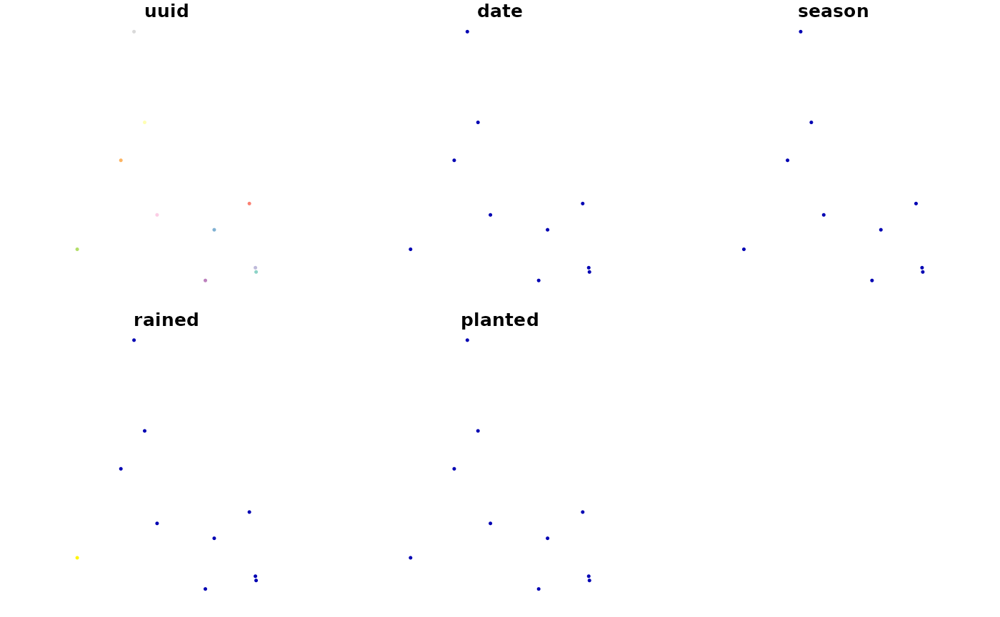

In the above, we illustrate this multi-panel plotting behavior using
just the first 10 rows of `farmers`, using `dplyr` syntax to `slice` out
those rows, in the process illustrating that `sf` is designed to work
with the `tidyverse`.

So, in Chunk 3 above, we have seen how we can coerce the non-spatial
`farmers` into a spatial object `sf`. We can coerce `farmers` back to an
ordinary `data.frame`/`tibble` by simply doing this:

``` r

# Chunk 5
farmers %>% as_tibble
#> # A tibble: 20,984 × 6
#>    uuid     date       season rained planted         geometry
#>    <chr>    <date>      <dbl>  <dbl>   <dbl>          <POINT>
#>  1 009a8424 2015-11-15      1      0       0 (27.256 -16.926)
#>  2 00df166f 2015-11-15      1      0       0 (26.942 -16.504)
#>  3 02671a00 2015-11-15      1      0       0 (27.254 -16.914)
#>  4 03f4dcca 2015-11-15      1      0       0 (27.237 -16.733)
#>  5 042cf7b3 2015-11-15      1      0       0 (27.138 -16.807)
#>  6 05618404 2015-11-15      1      0       0 (26.875 -16.611)
#>  7 064beba0 2015-11-15      1      1       0 (26.752 -16.862)
#>  8 083a46a2 2015-11-15      1      0       0 (26.977 -16.765)
#>  9 08eb2224 2015-11-15      1      0       0 (26.912 -16.248)
#> 10 0ab761d6 2015-11-15      1      0       0  (27.113 -16.95)
#> # ℹ 20,974 more rows
```

This gets us back to a `tibble`, but the *x* and *y* variables do not
reappear, instead we still have the geometry column. If we want to get
back to the original structure of the `tibble`, its more complicated:

``` r

# Chunk 6
bind_cols(farmers %>% as_tibble %>% select(-geometry), 
          st_coordinates(farmers) %>% as_tibble) %>% 
  select(uuid, date, X, Y, season, rained, planted) %>% 
  rename(x = X, y = Y)
#> # A tibble: 20,984 × 7
#>    uuid     date           x     y season rained planted
#>    <chr>    <date>     <dbl> <dbl>  <dbl>  <dbl>   <dbl>
#>  1 009a8424 2015-11-15  27.3 -16.9      1      0       0
#>  2 00df166f 2015-11-15  26.9 -16.5      1      0       0
#>  3 02671a00 2015-11-15  27.3 -16.9      1      0       0
#>  4 03f4dcca 2015-11-15  27.2 -16.7      1      0       0
#>  5 042cf7b3 2015-11-15  27.1 -16.8      1      0       0
#>  6 05618404 2015-11-15  26.9 -16.6      1      0       0
#>  7 064beba0 2015-11-15  26.8 -16.9      1      1       0
#>  8 083a46a2 2015-11-15  27.0 -16.8      1      0       0
#>  9 08eb2224 2015-11-15  26.9 -16.2      1      0       0
#> 10 0ab761d6 2015-11-15  27.1 -17.0      1      0       0
#> # ℹ 20,974 more rows
```

We use `dplyr` syntax to coerce `farmers` back to a `tibble`, dropping
the `geometry` via negative selection, and then we use
[`dplyr::bind_cols`](https://dplyr.tidyverse.org/reference/bind_cols.html)
(equivalent to `cbind`) to bind the coordinates back to the `tibble`.
The coordinates are obtained using `st_coordinates`, an `sf` function
used to “retrieve coordinates in matrix form” (`?st_coordinate`), and we
have to coerce that to a `tibble` for `bind_cols` to work. We can use
`select` to reorder the columns in their original form, and rename the
coordinate columns back to their original lower case (`st_coordinates`
returns *X* and *Y* columns).

### Read and write spatial data

That was a very quick dip into spatial waters, using a points example.
We are going to learn to read and write (in reverse order) spatial data.
We still have `farmers` back as an sf object. We are now going to write
it out to a spatial file.

``` r

# Chunk 6
st_write(obj = farmers, dsn = file.path(tempdir(), "farmers.shp"), 
         delete_dsn = TRUE)
#> writing: substituting ENGCRS["Undefined Cartesian SRS with unknown unit"] for missing CRS
#> Warning in CPL_write_ogr(obj, dsn, layer, driver, as.character(dataset_options), : GDAL Error 1:
#> /tmp/Rtmpy2lHB0/farmers.shp does not appear to be a file or directory.
#> Deleting source `/tmp/Rtmpy2lHB0/farmers.shp' failed
#> Writing layer `farmers' to data source `/tmp/Rtmpy2lHB0/farmers.shp' using driver `ESRI Shapefile'
#> Writing 20984 features with 5 fields and geometry type Point.
dir(tempdir(), pattern = "farmers")
#> [1] "farmers.dbf" "farmers.prj" "farmers.shp" "farmers.shx"
```

The code above uses `st_write` to create that old standby, the ESRI
shapefile, that clunky, annoying format that has many files for one
thing. Note that I have the option `delete_dsn = TRUE` set, which is
needed if the file already exists in that location, and you want to
recreate it (which I did in this case, because I was re-running this
code many times as I wrote this). For `st_write`, the “obj” argument
asks for the `sf` object to write, “dsn” is the name and path for the
output file. By adding the “.shp” at the end of the filename, `st_write`
knows to use the “ESRI Shapefile” driver. For this example, I used again
the [`tempdir()`](https://rdrr.io/r/base/tempfile.html) function to
write this object to a temporary directory, but, as you follow along,
***you should change the file path to correctly lead to your own
`xyz246/notebooks/data` path***.

Looking in the output directory here, we see that there are only three
files now (.dbf, .shp, and .shx). We are missing a .prj because of the
following reason:

``` r

# Chunk 7
farmers %>% st_crs()
#> Coordinate Reference System: NA
```

`farmers` does not have a coordinate reference system (CRS) associated
with it yet, even though we can tell it is in geographic coordinates.
Remember this, because we will come back to it.

Because .shp is an annoying format, we can try other types. Let’s do the
much more convenient “geojson” format, which produces a single file.

``` r

# Chunk 8
st_write(obj = farmers, dsn = file.path(tempdir(), "farmers.geojson"), 
         delete_dsn = TRUE)
#> writing: substituting ENGCRS["Undefined Cartesian SRS with unknown unit"] for missing CRS
#> Deleting source `/tmp/Rtmpy2lHB0/farmers.geojson' failed
#> Writing layer `farmers' to data source `/tmp/Rtmpy2lHB0/farmers.geojson' using driver `GeoJSON'
#> Writing 20984 features with 5 fields and geometry type Point.
dir(tempdir(), pattern = "farmers")
#> [1] "farmers.dbf"     "farmers.geojson" "farmers.prj"     "farmers.shp"     "farmers.shx"
```

We see that we have just a single file to hold the .geojson, which is
much nicer, and is an increasingly widely used file format, so you
should use it whenever possible in place of .shp. However, we will stick
with ESRI shapefiles for this class, since they are so widely used
still. So let’s read back in from the shapefile itself. I am going the
first delete the .geojson version, for the sake of directory cleanliness
(having shown you a nicer format, I am not going to work with because so
much is still done with

``` r

# Chunk 9
file.remove(dir(tempdir(), pattern = "farmers.geojson", full.names = TRUE))
#> [1] TRUE
rm(farmers) 
farmers <- st_read(dir(tempdir(), pattern = "farmers.shp", full.names = TRUE))
#> Reading layer `farmers' from data source `/tmp/Rtmpy2lHB0/farmers.shp' using driver `ESRI Shapefile'
#> Simple feature collection with 20984 features and 5 fields
#> Geometry type: POINT
#> Dimension:     XY
#> Bounding box:  xmin: 24.777 ymin: -18.222 xmax: 33.332 ymax: -8.997
#> Projected CRS: Undefined Cartesian SRS with unknown unit
```

We used `file.remove` to get rid of the .sqlite, and then used `rm` to
get rid of the existing `farmers` sf object, and then read back in the
`farmers` we had written to the .shp. So we have `farmers` back again.

Now, there are two more datasets that come with `geospaar` to read in
using `st_read`: `roads.geojson` and `districts.geojson`. The paths to
both are found with the `system.file` function. I’ll set up the first
one for you.

``` r

# Chunk 10
fnm <- system.file("extdata/roads.geojson", package = "geospaar")
roads <- st_read(dsn = fnm) #%>% st_set_crs("ESRI:102022")
#> Reading layer `roads' from data source 
#>   `/opt/R/4.6.1/lib/R/site-library/geospaar/extdata/roads.geojson' using driver `GeoJSON'
#> Simple feature collection with 473 features and 1 field
#> Geometry type: MULTILINESTRING
#> Dimension:     XY
#> Bounding box:  xmin: -292996.9 ymin: -2108848 xmax: 873238.8 ymax: -1008785
#> Projected CRS: Africa_Albers_Equal_Area_Conic
fnm <- system.file("extdata/districts.geojson", package = "geospaar")
districts <- st_read(dsn = fnm)
#> Reading layer `districts' from data source 
#>   `/opt/R/4.6.1/lib/R/site-library/geospaar/extdata/districts.geojson' using driver `GeoJSON'
#> Simple feature collection with 72 features and 1 field
#> Geometry type: POLYGON
#> Dimension:     XY
#> Bounding box:  xmin: 21.99978 ymin: -18.0751 xmax: 33.6875 ymax: -8.226213
#> Geodetic CRS:  WGS 84
```

Let’s end this section by a quick look at these data. We are going to
plot `districts`, `roads`, and `farmers` onto one plot.

``` r

# Chunk 11
par(mar = c(0, 0, 0, 0))
plot(st_geometry(districts), col = "grey")
plot(st_geometry(roads), col = "red", add = TRUE)
plot(st_geometry(farmers), pch = 20, reset = FALSE, col = "blue", add = TRUE)
```

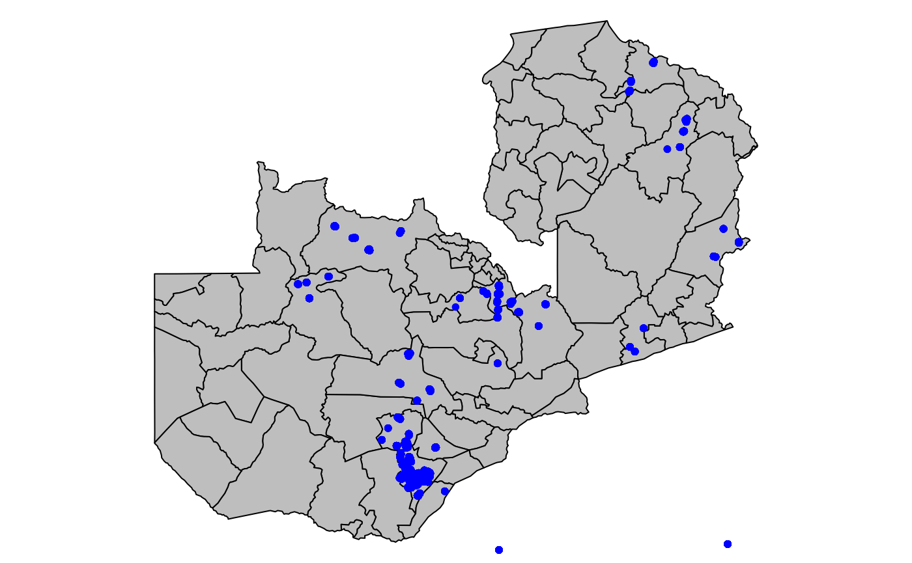

So what have we done? First, we use the `par` function with the `mar`
(margin) argument and a 4-element vector of 0s to remove the inner
margins of the plot so that the map of Zambia fills the plot frame. We
then use `plot` to draw the map of `districts` (wrapped in
`st_geometry`, to just grab the geometry part), which are administrative
boundaries for Zambia. We then use lines to add `roads` on top of that,
making them red. Finally, we add the `farmers` data as blue points. Note
the use of `add = TRUE`, which is necessary to overlay the two plots on
the `district` boundaries without creating a new plot of each.

That’s great, you say, but I see no `roads` in the map. Where are they?
And why are there two farmers outside of Zambia?

We’ll look at that in our next section, but a hint of why can be seen in
the outputs from Chunk 10. You will note that in Chunks 9 and 10 that
`st_read` (the opposite of `st_write`) gives a brief summary of the
spatial data being read into `R`.

### Coordinate Reference Systems and Projections

The reason you can’t see the roads on the previous map can be
illustrated as follows:

``` r

# Chunk 12
sfdat <- list("districts" = districts,  "roads" = roads, "farmers" = farmers)
sapply(sfdat, function(x) st_bbox(x))
#>       districts      roads farmers
#> xmin  21.999775  -292996.9  24.777
#> ymin -18.075097 -2108847.7 -18.222
#> xmax  33.687502   873238.8  33.332
#> ymax  -8.226213 -1008785.5  -8.997
```

In the code above, we add our 3 `sf` objects into a `list` (`sfdat`),
and then use `sapply` to apply `st_bbox` to each list element to get
their bounding boxes. That produces an output matrix that shows in the
westernmost (xmin), southernmost (ymin), easternmost (xmax), and
northernmost (ymax) coordinates of each object. This shows us that
`roads`’ coordinates are in different units (meters) than `districts`’
and `farmers`’, which are decimal degrees. So when we tried to plot
`roads` on the same map as `districts` and `farmers`, `roads` didn’t
appear because the units are not the same. You could get a map of
`roads` if you plotted them on their own.

#### Checking the CRS of an `sf` object

In this case, we have to do a bit more, which is to convert `roads`
coordinate reference system (CRS) to decimal degrees. How do we do that?
First, we have to know the crs we want to transform `roads` into, which
we can do by checking the `st_crs` of `farmers` or `districts`:

``` r

# Chunk 13
st_crs(districts)$proj4string
#> [1] "+proj=longlat +datum=WGS84 +no_defs"
st_crs(roads)$proj4string
#> [1] "+proj=aea +lat_0=0 +lon_0=25 +lat_1=20 +lat_2=-23 +x_0=0 +y_0=0 +datum=WGS84 +units=m +no_defs"
```

We use `st_crs`, which is `sf`’s function for checking and assigning a
CRS to an `sf` object. When you run it as we have done with
`st_crs(districts)`, it returns an object of class `crs` (you can verify
that by running `class(st_crs(districts))`). We see that `districts` and
`roads` have different values in their “PROJCRS” fields, which holds the
projection string that contains the projection parameters of the CRS. If
you want to understand the meaning of projection string parameters,
please have a look at the [documentation](http://proj4.org) for the
`proj.4` library, specifically the page on
[parameters](http://proj4.org/parameters.md).

This one basically tells us that `districts` has a geographic (longlat)
projection, and uses the WGS84 datum. Let’s check the crs for all three
objects now, using our old friend `sapply`

``` r

# Chunk 14
sapply(sfdat, function(x) st_crs(x)$proj4string)
#>                                                                                        districts 
#>                                                            "+proj=longlat +datum=WGS84 +no_defs" 
#>                                                                                            roads 
#> "+proj=aea +lat_0=0 +lon_0=25 +lat_1=20 +lat_2=-23 +x_0=0 +y_0=0 +datum=WGS84 +units=m +no_defs" 
#>                                                                                          farmers 
#>                                                                                               NA
```

These results show us that `farmers` does not have a projection string.
So how come it was able to plot on the same map as `districts`? Because
the coordinates are in the same units. However, we want to fix that
before we move to the next step, reprojecting:

``` r

# Chunk 15
st_crs(farmers) <- st_crs(districts)
#> Warning: st_crs<- : replacing crs does not reproject data; use st_transform for that
st_crs(sfdat$farmers) <- st_crs(districts)
#> Warning: st_crs<- : replacing crs does not reproject data; use st_transform for that
st_crs(sfdat$farmers)$proj4string
#> [1] "+proj=longlat +datum=WGS84 +no_defs"
```

Simple–we apply the fix to `farmers` and to `sfdat$farmers` by assigning
each the proj4string from `districts`. We can do that because we are
pretty sure that the coordinates for farmers are from a geographic
coordinate system that uses the WGS84 datum. If that is incorrect, we
are introducing some spatial error. But for now, this is fine.

Another note, when running `st_crs`, we are extracting the `proj4string`
element from the resulting `crs` object. That is because it provides a
more compact string representation of the CRS information. Running
`st_crs(sfdat$farmers)` produces a much lengthier (and more informative)
output in `wkt` format. Go ahead and try that.

#### Reprojecting

Okay, so now we want to change `roads` to the same CRS as `districts`.

``` r

# Chunk 16
sfdat$roads <- st_transform(x = sfdat$roads, crs = st_crs(districts))
```

We use `sf`‘s `st_transform` function to reproject `sfdat$roads` using
the parameters supplied by `districts`’ p4s, which is passed into the
function’s “crs” argument via the `st_crs` function applied to
`districts`.

And that’s all. We can now redo our plots. I am going to show you two
ways to do it. First, the way we have already done it with `sf:plot`:

``` r

# Chunk 17
par(mar = c(0, 0, 0, 0))
plot(sfdat$districts %>% st_geometry(), col = "grey")
plot(sfdat$roads %>% st_geometry(), col = "red", add = TRUE)
plot(sfdat$farmers %>% st_geometry(), col = "blue", pch = 20, add = TRUE)
```

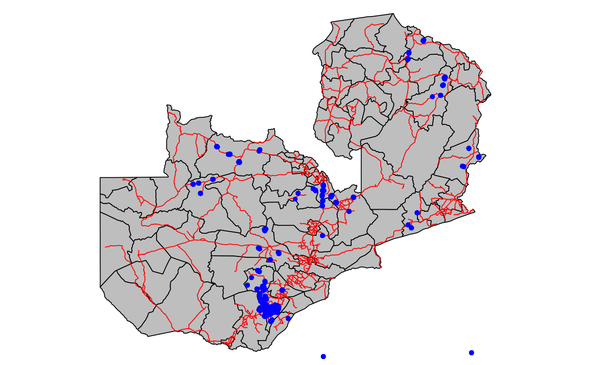

And with `ggplot`:

``` r

# Chunk 18
ggplot(sfdat$districts) + geom_sf() +
  geom_sf(data = sfdat$roads, col = "red") + 
  geom_sf(data = sfdat$farmers, col = "blue")
```

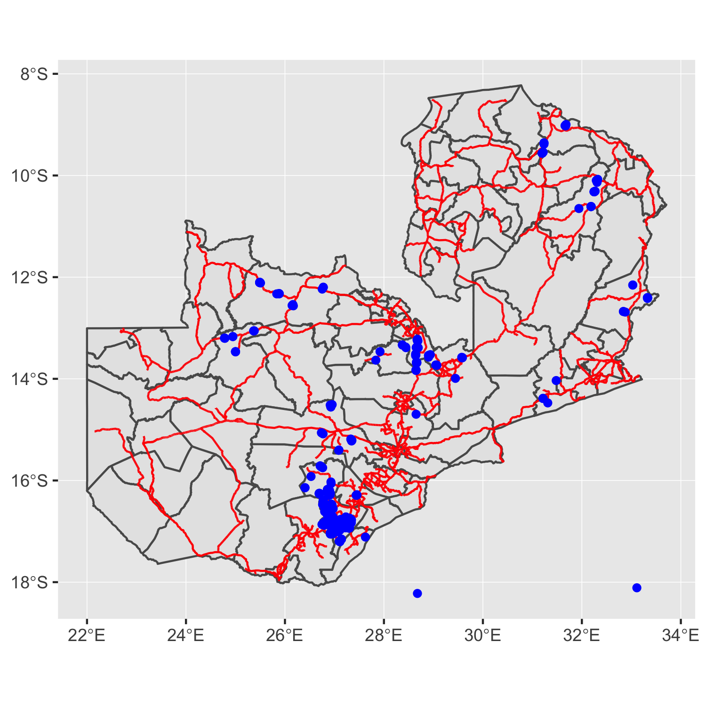

So now you see the roads appearing as red lines on the map. `ggplot`
adds a coordinate grid to the outside of the plot, and has a special
function `geom_sf` that is designed to plot `sf` geometries. However, it
is still substantially slower than
[`sf::plot`](https://r-spatial.github.io/sf/reference/plot.html) for the
time being, so we’ll mostly stick with the latter.

### Making simple features from scratch

Before ending this section, it is worth looking at how we can make our
own `sf` objects from scratch, which we might need to do from time to
time.

``` r

# Chunk 19
# #1
pt <- st_point(x = c(28, -14))
pt
#> POINT (28 -14)
#
# #2
pts <- st_multipoint(x = cbind(x = c(27.5, 28, 28.5), y = c(-14.5, -15, -15.5)))
pts
#> MULTIPOINT ((27.5 -14.5), (28 -15), (28.5 -15.5))
#
# #3
sline <- st_linestring(cbind(x = c(27, 27.5, 28), y = c(-15, -15.5, -16)))
sline
#> LINESTRING (27 -15, 27.5 -15.5, 28 -16)
#
# #4
pol <- st_polygon(list(cbind(x = c(26.5, 27.5, 27, 26, 26.5), 
                             y = c(-15.5, -16.5, -17, -16, -15.5))))
pol
#> POLYGON ((26.5 -15.5, 27.5 -16.5, 27 -17, 26 -16, 26.5 -15.5))
#
# 5
par(mar = c(0, 0, 0, 0))
plot(districts %>% st_geometry(), col = "grey")
plot(pt, add = TRUE, col = "red", pch = 20)
plot(pts, add = TRUE, col = "blue", pch = 20)
plot(sline, add = TRUE, col = "cyan", lwd = 2)
plot(pol, add = TRUE, col = "orange", lwd = 2)
```

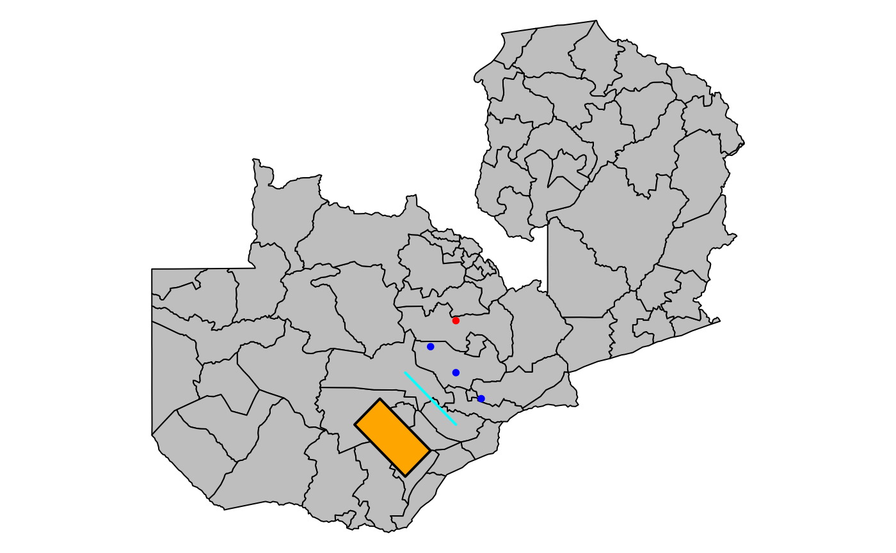

We use `st_point` in \#1 to create a single point object, based on a
two-element vector that consists of the x and y coordinate. In \#2,
`st_multipoint` create an object with three points, based on an matrix
containing the x coordinates in the first column and y coordinates in
second column. \#3 convert a similar matrix of coordinates into an
`st_linestring`, and \#4 creates a polygon object, also using a matrix
as input–note that the first and last coordinates in both the x and y
coordinates are the same, which is done in order to close the polygon.
The printout of each `sfg` (simple feature geometry) shows that they
store coordinates as point pairs separated by commas (except for `pt`,
since it is just a single point). In \#5 we plot each object over the
`districts` polygons.

We’ll go bit further in making new features in the section on [spatial
operations](#spatial-operations)

### Practice

#### Questions

1.  What are the primary simple feature geometry types?

2.  How do you convert a `tibble` (or `data.frame`) into an `sf` object?

3.  When plotting (mapping) `sf` objects, what happens if your object
    has multiple variables?

4.  When constructing new `sf` objects, in what format do you have to
    provide inputs to the `st_*` constructor functions. How does the
    input object differ in the case of a POLYGON versus MULTIPOINT or
    LINESTRING?

#### Code

1.  Working with the `farmers` `sf` object, convert it to just a set of
    points without any other variables.

2.  Write out `farmers` with it CRS set to the same as `districts` into
    an sqlite file within your `notebooks/data` folder. Remove the
    `farmers` object from your workspace, and then read back into `R`
    the sqlite you just wrote out.

3.  Examine the `class` and `str` of `districts` and `roads`.

4.  Create a plot of `roads`–just the geometries–and make the color of
    the lines blue.

5.  Create a plot of `districts`, using
    [`dplyr::select`](https://dplyr.tidyverse.org/reference/select.html)
    to choose the *distName* variable from the objects `data.frame`. Set
    the title to “Zambia Districts” using the “main” argument. Don’t
    specify a color.

6.  Create an `st_multipoint` object using x coordinates of
    `c(27, 28, 29)` and y coordinates of `c(-13, -14, -15)`, and plot
    that over `districts` as orange points.

## Spatial properties and attribute fields

We now begin to learn how to perform analyses with spatial vectors,
starting with calculating basic spatial properties and manipulating the
attribute tables associated with spatial vectors.

As you probably closed this project between Section 1 and 2, you will
also need to reload the `roads`, `districts`, and `farmers` datasets
(coercing the latter back to an `sf` object). The code in [Section
1](#section1) will show you how to do that, but here is some code to
recreate most of what we need:

``` r

# Chunk 20
roads <- system.file("extdata/roads.geojson", package = "geospaar") %>% st_read()
#> Reading layer `roads' from data source 
#>   `/opt/R/4.6.1/lib/R/site-library/geospaar/extdata/roads.geojson' using driver `GeoJSON'
#> Simple feature collection with 473 features and 1 field
#> Geometry type: MULTILINESTRING
#> Dimension:     XY
#> Bounding box:  xmin: -292996.9 ymin: -2108848 xmax: 873238.8 ymax: -1008785
#> Projected CRS: Africa_Albers_Equal_Area_Conic
districts <- system.file("extdata/districts.geojson", package = "geospaar") %>% 
  st_read()
#> Reading layer `districts' from data source 
#>   `/opt/R/4.6.1/lib/R/site-library/geospaar/extdata/districts.geojson' using driver `GeoJSON'
#> Simple feature collection with 72 features and 1 field
#> Geometry type: POLYGON
#> Dimension:     XY
#> Bounding box:  xmin: 21.99978 ymin: -18.0751 xmax: 33.6875 ymax: -8.226213
#> Geodetic CRS:  WGS 84
farmers <- system.file("extdata/farmer_spatial.csv", package = "geospaar") %>% 
  read_csv() %>% st_as_sf(coords = c("x", "y"), crs = 4326)
#> Rows: 20984 Columns: 7
#> ── Column specification ────────────────────────────────────────────────────────────────────────────
#> Delimiter: ","
#> chr  (1): uuid
#> dbl  (5): x, y, season, rained, planted
#> date (1): date
#> 
#> ℹ Use `spec()` to retrieve the full column specification for this data.
#> ℹ Specify the column types or set `show_col_types = FALSE` to quiet this message.
```

This looks a bit different than what we did before. In this
construction, we make use of `dplyr` pipes to do everything in one go
for all three datasets. We pipe the file path to `roads.geojson`
straight to
[`sf::st_read()`](https://r-spatial.github.io/sf/reference/st_read.html),
and that reads in it as a one-liner. Same goes for `districts` (despite
the line break). `farmers` gets the file path piped to `read_csv`, and
then the coercion to `sf` happens right downstream. We add the
`crs = 4326` argument to `st_as_sf` to provide the missing projection
information (4326 is the EPSG identifier for GCS WGS84)

### Spatial properties

First, due to recent changes in `sf`, and how it handles spherical
geometries, we have to set the following:

``` r

sf_use_s2(FALSE)
#> Spherical geometry (s2) switched off
```

Otherwise if we try to calculate lengths or create buffers of vectors
that are in geographic coordinates systems, we get odd results.

#### Area

Using polygons to calculate area is a fairly basic but important spatial
vector operation. To calculate meaningful areas, generally you need your
data to be projected into a coordinate system in which area is one of
the true properties. However, the function we are going to use,
[`sf::st_area`](https://r-spatial.github.io/sf/reference/geos_measures.html),
will estimate area even for data in geographic coordinates.

``` r

# Chunk 21
# #1
dist_areas <- districts %>% st_area()
dist_areas
#
# #2
dist_areas %>% units::set_units("ha")
#
# #3
dist_areas %>% units::set_units("km^2")
#> Units: [m^2]
#>  [1]  2541541123 17400358599  4582302550 13430066296  3776028206  1010088275  4322221463  1722869287
#>  [9] 15450492474  6177649097  7024667808 12002517947  3897818272  8852821646 15709144162 14530277901
#> [17]  1538935802  5779096160 17190620898 13936688829  1033321749 22983082040 17018945020 12738258307
#> [25] 10506878898 21515089682  3902545467  9223150982 18279181139   790565464   732688105  3869918418
#> [33]   921820643 11410004516 15759475788 14029544835   420504470  9833501774  5904580341  9659629715
#> [41]  3561571068  6743655796  8541546325  6188067741 17645065702  9919976404  4836298974 40093367520
#> [49]  8506242709 11966022532  9999324386  1260883094 19250963202 21495042874  9816701410  6774772311
#> [57] 20788856165  4702820132  5668360761  4316726948   974238354 10559381963  8284547079 10029114031
#> [65] 15538334760 23588837220 29837388878 16213151511  3924832242  4775308805 30067585050 14071033674
#> Units: [ha]
#>  [1]  254154.11 1740035.86  458230.26 1343006.63  377602.82  101008.83  432222.15  172286.93
#>  [9] 1545049.25  617764.91  702466.78 1200251.79  389781.83  885282.16 1570914.42 1453027.79
#> [17]  153893.58  577909.62 1719062.09 1393668.88  103332.17 2298308.20 1701894.50 1273825.83
#> [25] 1050687.89 2151508.97  390254.55  922315.10 1827918.11   79056.55   73268.81  386991.84
#> [33]   92182.06 1141000.45 1575947.58 1402954.48   42050.45  983350.18  590458.03  965962.97
#> [41]  356157.11  674365.58  854154.63  618806.77 1764506.57  991997.64  483629.90 4009336.75
#> [49]  850624.27 1196602.25  999932.44  126088.31 1925096.32 2149504.29  981670.14  677477.23
#> [57] 2078885.62  470282.01  566836.08  431672.69   97423.84 1055938.20  828454.71 1002911.40
#> [65] 1553833.48 2358883.72 2983738.89 1621315.15  392483.22  477530.88 3006758.50 1407103.37
#> Units: [km^2]
#>  [1]  2541.5411 17400.3586  4582.3026 13430.0663  3776.0282  1010.0883  4322.2215  1722.8693
#>  [9] 15450.4925  6177.6491  7024.6678 12002.5179  3897.8183  8852.8216 15709.1442 14530.2779
#> [17]  1538.9358  5779.0962 17190.6209 13936.6888  1033.3217 22983.0820 17018.9450 12738.2583
#> [25] 10506.8789 21515.0897  3902.5455  9223.1510 18279.1811   790.5655   732.6881  3869.9184
#> [33]   921.8206 11410.0045 15759.4758 14029.5448   420.5045  9833.5018  5904.5803  9659.6297
#> [41]  3561.5711  6743.6558  8541.5463  6188.0677 17645.0657  9919.9764  4836.2990 40093.3675
#> [49]  8506.2427 11966.0225  9999.3244  1260.8831 19250.9632 21495.0429  9816.7014  6774.7723
#> [57] 20788.8562  4702.8201  5668.3608  4316.7269   974.2384 10559.3820  8284.5471 10029.1140
#> [65] 15538.3348 23588.8372 29837.3889 16213.1515  3924.8322  4775.3088 30067.5850 14071.0337
```

Very simple to calculate area for each polygon in `districts`. Note that
the default is to calculate m$`^2`$, but we can change that to hectares
(in \#2) using or km$`^2`$ (#3) using the function
[`units::set_units`](https://r-quantities.github.io/units/reference/units.html)
(the `units` package is imported by `sf`).

So this was an estimate of area from a non-project dataset. How does
that compare to area from a true equal area projection, such as the
Albers Equal Area projection that `roads` is projected in:

``` r

# Chunk 21
dist_areas_alb <- districts %>% 
  st_transform(crs = st_crs(roads)) %>% 
  st_area()
absd <- mean(abs(dist_areas_alb - dist_areas)) %>% units::set_units("ha")
pctd <- as.numeric(absd / (mean(dist_areas_alb) / 10000)) * 100 
absd
#> 16.50778 [ha]
pctd
#> [1] 0.001581902
```

Using `st_transform` with the CRS from `roads` to reproject `district`,
and then calculate polygons areas, we see the mean absolute difference
between areas calculated from the projected and unprojected datasets is
around 17 ha, which is a tiny percentage (0.002%) of the average
district area. Not much to write home about, but also not nothing if
absolute accuracy of area calculations is your interest.

``` r

# Chunk 22
districts %>% 
  st_area() %>% units::set_units("km^2") %>% 
  as.numeric() %>% 
  tibble(km2 = .) %>% 
  ggplot() + 
  geom_histogram(aes(x = km2), bins = 15, fill = "blue", col = "grey") + 
  xlab(bquote("km"^2))
```

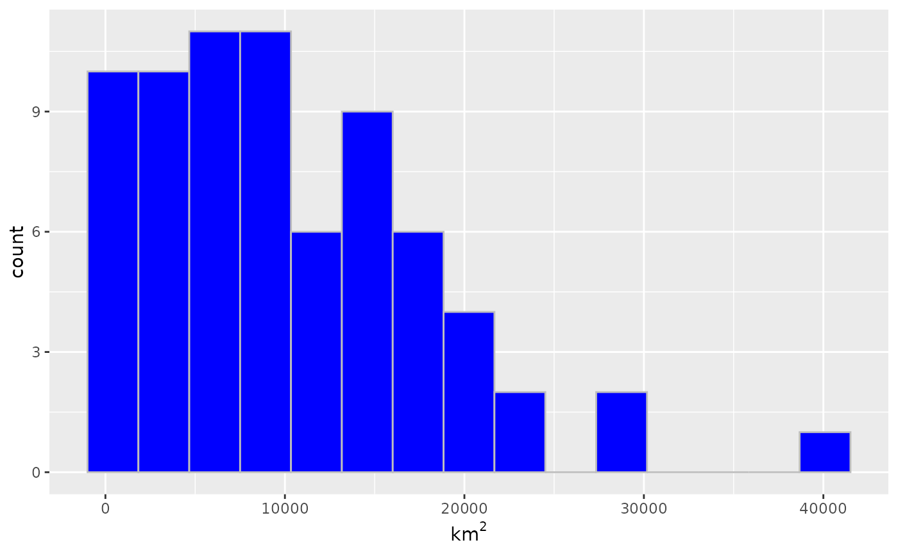

Here’s a look at the district areas (in km$`^2`$) as a histogram. Notice
the conversion steps. First we wanted to convert the calculated areas to
a numeric vector (rather than one of class `units`), using `as.numeric`,
then we made it into a `tibble`, because `ggplot` only works with
`data.frame`, and then we plotted the histogram. There is one new
addition there–in `xlab`, we use `bquote` to print a superscript 2 in
the km$`^2`$ axis label.

#### Distance

We can also calculate the distances between spatial features. To do
that, we are make use of `st_centroid` on the Albers-projected
`districts` data, which we use to find the central coordinates of each
district, and then plot the centroids on top of the districts
themselves.

``` r

# Chunk 23
# # 1
dist_cent <- districts %>% 
  st_transform(., st_crs(roads)) %>% 
  st_centroid()
#> Warning: st_centroid assumes attributes are constant over geometries
# dist_cent <- st_centroid(st_transform(districts, st_crs(roads)))  # equivalent

# #2
par(mar = c(0, 0, 0, 0))
districts %>% 
  st_transform(., st_crs(roads)) %>% 
  st_geometry() %>% 
  plot(col = "grey")
dist_cent %>% 
  st_geometry() %>% 
  plot(col = "red", pch = 20, add = TRUE)
```

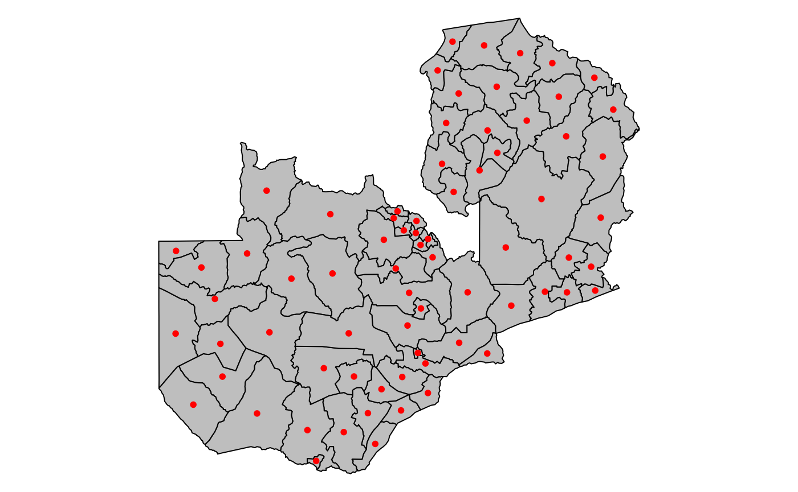

Notice that right below the centroid calculation pipeline (#1) is a
commented out line, which is the non-pipeline equivalent of the
operation. In \#2, we make the plots, setting up the plotting functions
for both the `districts` polygons and their centroids on the downstream
ends of pipelines.

Moving on, we can now find out how far apart the centroids of each
district are by using another `sf` function, `st_distance`

``` r

# Chunk 24
# #1
all_dists <- st_distance(x = dist_cent)
all_dists[1:5, 1:5]
#> Units: [m]
#>           1         2         3        4        5
#> 1       0.0  337312.0 1055917.1 478760.8 720655.9
#> 2  337312.0       0.0 1096240.8 648169.0 474828.6
#> 3 1055917.1 1096240.8       0.0 610097.6 870220.6
#> 4  478760.8  648169.0  610097.6      0.0 722235.2
#> 5  720655.9  474828.6  870220.6 722235.2      0.0
#
# #2
d1_dists <- st_distance(x = dist_cent[1, ], y = dist_cent[-1, ])
d1_dists %>% as.vector()
#>  [1]  337312.02 1055917.11  478760.82  720655.95  534294.34  424233.93  537038.59  394271.13
#>  [9]   60771.97  647975.79  365570.77  572547.13  456994.22  707936.13  877925.34  439308.17
#> [17]  463462.46 1057787.83  723943.46  503236.39  823650.12  466690.03  676122.70  460293.36
#> [25]  660199.63   70921.71  602126.69  802364.10  472548.68  820294.77  313591.52  452687.70
#> [33]  545220.16  954001.09  183780.14  471634.00  484560.25  105916.50  498981.34  416246.64
#> [41]  530454.02  581636.89  432948.27  319919.14  949478.15  590476.65  266675.75  503209.41
#> [49]  568630.85  625518.68  481062.92  762430.62  627377.88  495646.68  563040.80  861407.52
#> [57]  534885.88  642334.34  679783.92  438765.43  213904.48  126110.47  418765.15  959450.54
#> [65]  249013.82  902522.44 1047859.81  492293.96  672884.59  691456.78  989244.25
#
# #3
d1_dists %>% 
  as.vector() %>% 
  quantile() / 1000
#>         0%        25%        50%        75%       100% 
#>   60.77197  439.03680  534.29434  685.62035 1057.78783
```

There are two variants above. The first (#1) is captured in `all_dists`,
and it produces a matrix that provides the distance, in meters, between
each district centroid and every other district centroid (we show the
first 5 rows and 5 columns of the matrix, otherwise it is 72X72). To get
that, you simply pass in the `dist_cent` object into to the “x”
argument. The second variant (#2) (`d1_dists`), uses both “x” and “y”
arguments, and it simply finds the distance between the first district
centroid and all the other districts’ centroids. We coerce the matrix to
a vector for more compact printing. In \#3, we summarize `d1_dists`
using the `quantile` function, converting meters to kilometers.

#### Length

For the last example of functions that extract spatial properties, we
will calculate the line lengths and perimeters.

``` r

# Chunk 25
# #1
road_length <- st_length(roads) %>% as.numeric()
#
# #2
dist_perims <- st_length(districts) %>% as.numeric()
#
# #3
p1 <- ggplot(tibble(x = road_length), aes(x / 1000)) + 
  geom_histogram(fill = "blue", col = "grey", bins = 15) + xlab("km") + 
  ggtitle("Zambia road lengths")
p2 <- ggplot(tibble(x = dist_perims), aes(x / 1000)) + 
  geom_histogram(fill = "purple", col = "grey", bins = 10) + xlab("km") + 
  ylab("") + ggtitle("Zambia district perimeters")
cowplot::plot_grid(p1, p2)
```

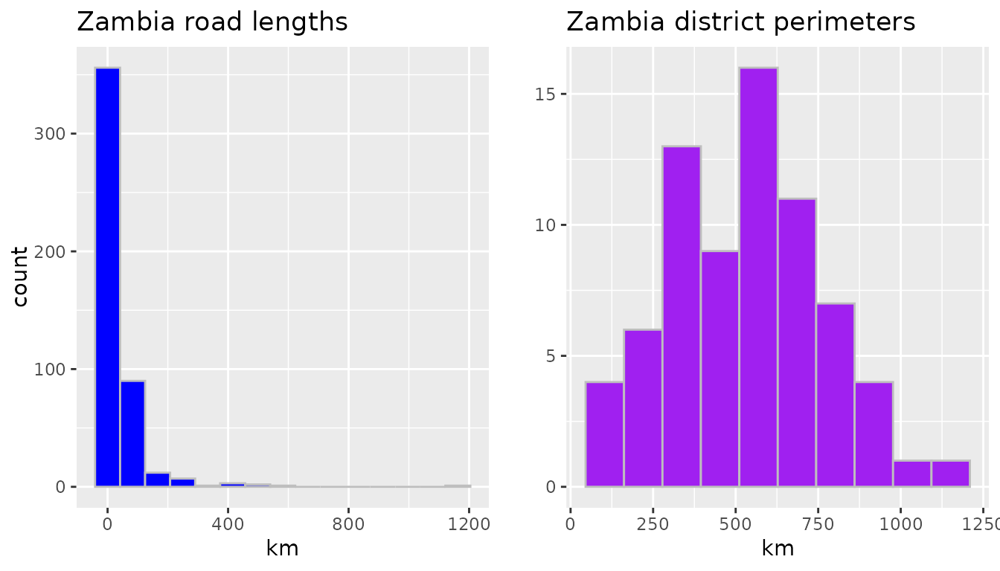

We use `st_length` to calculate the length of the line segments in
`roads` (#1) and the perimeter length of the polygons in `district`
(#2), converting both to numeric vectors. We then plot each set of
lengths as histograms (#3), converting units to kilometers (by dividing
by 1000, within `geom_histogram`), and then use
[`cowplot::plot_grid`](https://wilkelab.org/cowplot/reference/plot_grid.html)
to arrange the two histograms side-by-side.

### Manipulating attributes

`sf` objects stores attributes as `data.frame`s or `tibble`s, and they
can be manipulated using the same preparatory and analytical methods we
learned about in the previous modules. For example, let’s consider some
very basic subsetting:

``` r

# Chunk 26
par(mar = c(0, 0, 0, 0))
st_geometry(districts) %>% plot(col = "grey")
districts %>% 
  slice(1, 20, 40) %>% 
  plot(col = "blue", add = TRUE)
set.seed(123)
farmers %>% 
  sample_n(20) %>% 
  st_geometry() %>%  
  plot(col = "yellow", pch = "+", add = TRUE)
```

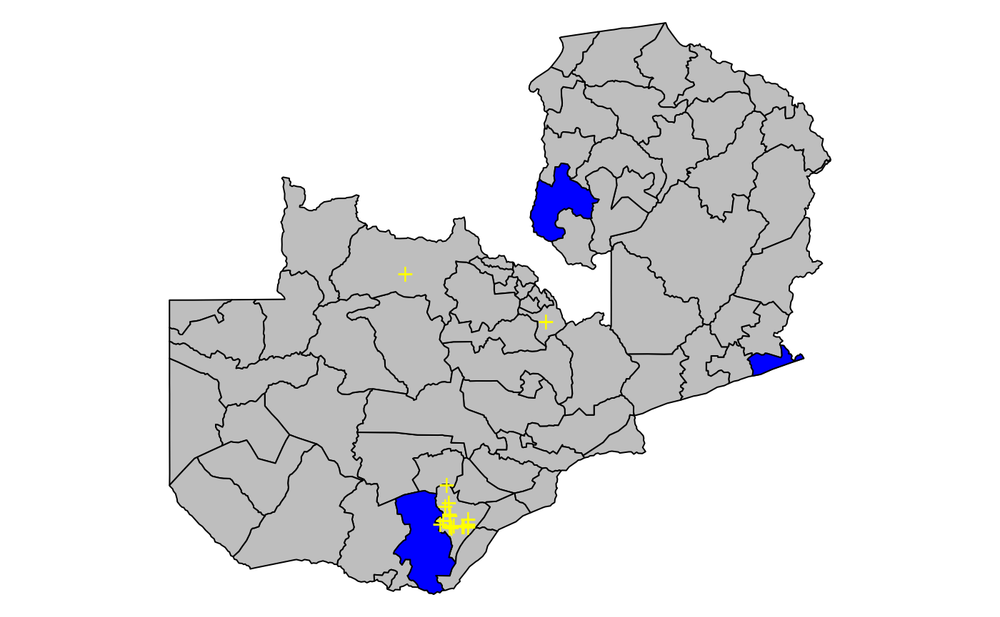

Notice the use of `dplyr` verbs to subset two datasets on the fly before
they are piped into `plot`. The plot as setup with all `districts` as a
backdrop (using `st_geometry` to strip away the attribute table), and
then we overlay on that in blue the 1st, 20th, and 40th district,
`slice`d out of `districts`. On top of that, we take a random sample of
20 observations from `farmers`, and plot those on top. You can also
index into the `sf` objects with `[]`:

``` r

# Chunk 27
par(mar = c(0, 0, 0, 0))
plot(st_geometry(districts), col = "grey")
plot(districts[c(1, 20, 40), ], col = "blue", add = TRUE)
set.seed(123)
plot(st_geometry(farmers[sample(1:nrow(farmers), 20), ]), col = "yellow", 
     pch = "+", add = TRUE)
```

The code above makes the identical plot as in Chunk 26, so we don’t
display that again, but note the indexing, as well as the lack of piping
and more conventional syntax.

#### Mutating and joining

The [Spatial Properties](#spatial-properties) showed how to calculate
area, length, and other properties as separate outputs. Why not add them
stick them in separate data objects. Now let’s see how to add those
properties back the `sf` attribute `tibble`.

``` r

# Chunk 27
districts %>% mutate(area = as.numeric(st_area(.) / 10^6))
#> Simple feature collection with 72 features and 2 fields
#> Geometry type: POLYGON
#> Dimension:     XY
#> Bounding box:  xmin: 21.99978 ymin: -18.0751 xmax: 33.6875 ymax: -8.226213
#> Geodetic CRS:  WGS 84
#> First 10 features:
#>         distName                       geometry      area
#> 1        Chadiza POLYGON ((32.3076 -14.3128,...  2541.541
#> 2          Chama POLYGON ((33.6875 -10.57932... 17400.359
#> 3        Chavuma POLYGON ((22.00014 -13.4776...  4582.303
#> 4       Chibombo POLYGON ((28.89229 -14.7998... 13430.066
#> 5        Chiengi POLYGON ((29.1088 -9.079298...  3776.028
#> 6  Chililabombwe POLYGON ((28.06755 -12.3526...  1010.088
#> 7        Chilubi POLYGON ((30.61853 -11.2516...  4322.221
#> 8       Chingola POLYGON ((27.51766 -12.2984...  1722.869
#> 9       Chinsali POLYGON ((32.34814 -9.74577... 15450.492
#> 10       Chipata POLYGON ((32.95348 -13.2636...  6177.649
```

So that’s a fairly straightforward way to do it. Just use `mutate` with
`st_area` (note that `st_area` needs the `.` in it to function
correctly). In making a new *area* column, we divide by 10$`^6`$ to
convert to km$`^2`$, and coerce the result to numeric.

Imagine that someone gave you a separate dataset that simply listed
district names and their areas for Zambia, but provided no other spatial
information. Say they did something like this:

``` r

# Chunk 28
dist_area <- tibble(distName = districts$distName, 
                    area = as.numeric(st_area(districts)) / 10^6)
```

We could use a `*_join` to merge this onto `districts`:

``` r

# Chunk 29
left_join(districts, dist_area, by = "distName")
#> Simple feature collection with 72 features and 2 fields
#> Geometry type: POLYGON
#> Dimension:     XY
#> Bounding box:  xmin: 21.99978 ymin: -18.0751 xmax: 33.6875 ymax: -8.226213
#> Geodetic CRS:  WGS 84
#> First 10 features:
#>         distName      area                       geometry
#> 1        Chadiza  2541.541 POLYGON ((32.3076 -14.3128,...
#> 2          Chama 17400.359 POLYGON ((33.6875 -10.57932...
#> 3        Chavuma  4582.303 POLYGON ((22.00014 -13.4776...
#> 4       Chibombo 13430.066 POLYGON ((28.89229 -14.7998...
#> 5        Chiengi  3776.028 POLYGON ((29.1088 -9.079298...
#> 6  Chililabombwe  1010.088 POLYGON ((28.06755 -12.3526...
#> 7        Chilubi  4322.221 POLYGON ((30.61853 -11.2516...
#> 8       Chingola  1722.869 POLYGON ((27.51766 -12.2984...
#> 9       Chinsali 15450.492 POLYGON ((32.34814 -9.74577...
#> 10       Chipata  6177.649 POLYGON ((32.95348 -13.2636...
```

In this case a `left_join` works because the number of records is
identical and each row in each dataset has a unique district name.

#### More subsetting

We have already done a bit of this a couple of sections back, but let’s
use this opportunity to do a bit more subsetting, including a previously
unseen approach:

``` r

# Chunk 30
# #1
kanyi_dists <- districts %>% filter(grepl("^Ka|^Nyi", distName))
# 
# #2
dists_gt2m <- districts %>% filter(as.numeric(st_area(.) / 10^6) > 20000)

par(mar = c(0, 0, 0, 0))
plot(st_geometry(districts), col = "grey")
plot(st_geometry(kanyi_dists), col = rgb(0, 0, 1, alpha = 0.5), add = TRUE)
plot(st_geometry(dists_gt2m), col = rgb(1, 0, 0, alpha = 0.5), add = TRUE)
```

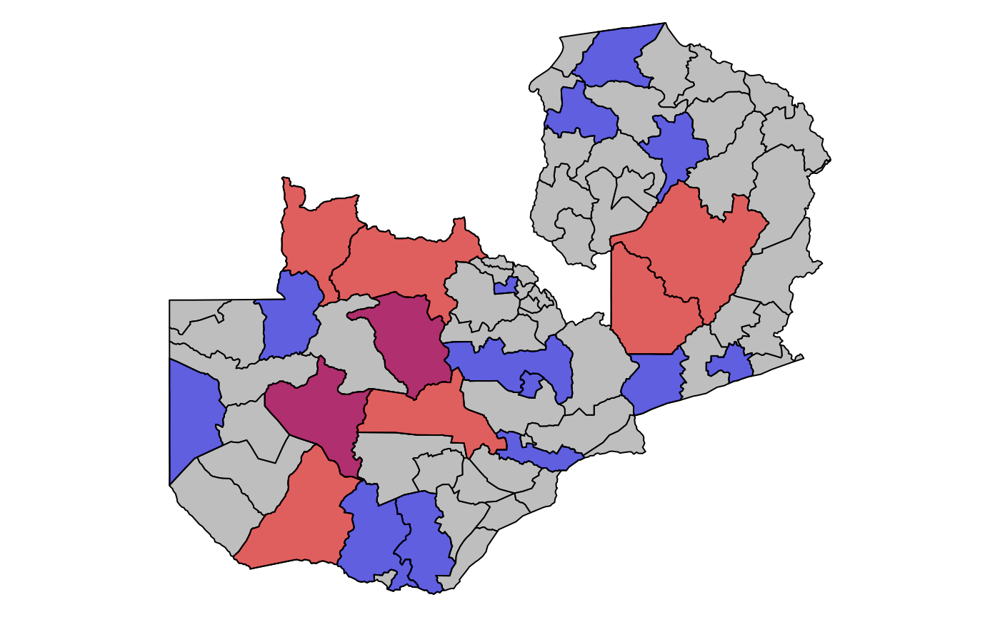

That’s two examples of subsetting that that are accomplished with
`filter`. \#1 is the new one, as it uses `grepl` to select districts
with names beginning with either “Ka” or “Nyi”. `grepl` is one of
several functions that make use of regular expressions to identify and
do things (select, substitute, split, etc) to string variables. You can
read up more on the subject by starting with
[`?grepl`](https://rdrr.io/r/base/grep.html) and
[`?regex`](https://stringr.tidyverse.org/reference/modifiers.html).
Regular expressions are quite powerful, and although they can be
somewhat arcane, they are well worth learning (although we don’t do much
with them here). \#2 creates `dists_gt2m`) by calculating area within
`filter` on the fly, and using that to select districts \>20000
km$`^2`$. The resulting subsets are plotted onto the full district map
of Zambia, using another function appearing for the first time in
`geospaar`, `rgb`, which we use to define the colors for filling the
polygons. `rgb` makes red-green-blue color combinations, and the alpha
argument allows us to define how transparent the colors are. In this
case, our two subsets selected some of the same polygons (two of the
districts with names beginning with “Ka” or “Ny” are also larger than
20,000 km$`^2`$), thus the partial transparency is needed to show where
the overlaps occur.

#### Split-apply-combine

As with plain old `data.frame`s, we might want to do split-apply-combine
operations on spatial data. Let’s demonstrate this selecting the
districts in `districts_alb2` that fall within certain area ranges,
convert the selected districts to centroid points, and then plot them.

``` r

# Chunk 30
# #1
tertiles <- function(x) quantile(x, probs = c(0, 0.333, 0.667, 1))
dist_tertiles <- districts %>% 
  mutate(area = as.numeric(st_area(.)) / 10^6) %>%
  mutate(acls = cut(area, breaks = tertiles(area), include.lowest = TRUE)) %>% 
  group_by(acls) %>% 
  summarize(mean_area = mean(area))  
#> although coordinates are longitude/latitude, st_union assumes that they are planar
dist_tertiles
#> Simple feature collection with 3 features and 2 fields
#> Geometry type: GEOMETRY
#> Dimension:     XY
#> Bounding box:  xmin: 21.99978 ymin: -18.0751 xmax: 33.6875 ymax: -8.226213
#> Geodetic CRS:  WGS 84
#> # A tibble: 3 × 3
#>   acls               mean_area                                                              geometry
#>   <fct>                  <dbl>                                                        <GEOMETRY [°]>
#> 1 [421,5.74e+03]         2879. MULTIPOLYGON (((25.67506 -17.82137, 25.62197 -17.85003, 25.61785 -17…
#> 2 (5.74e+03,1.3e+04]     9018. MULTIPOLYGON (((27.09117 -16.41171, 27.11665 -16.46667, 27.33603 -16…
#> 3 (1.3e+04,4.01e+04]    19409. POLYGON ((26.29328 -17.9525, 26.27136 -17.9349, 26.23261 -17.9344, 2…
#
# #2
par(mar = rep(0, 4))
plot(st_geometry(dist_tertiles), col = c("red", "purple", "blue"))
legend(x = "bottomright", pch = 15, col = c("red", "purple", "blue"), 
       bty = "n", legend = c("Bottom third", "Middle third", "Largest third"))
```

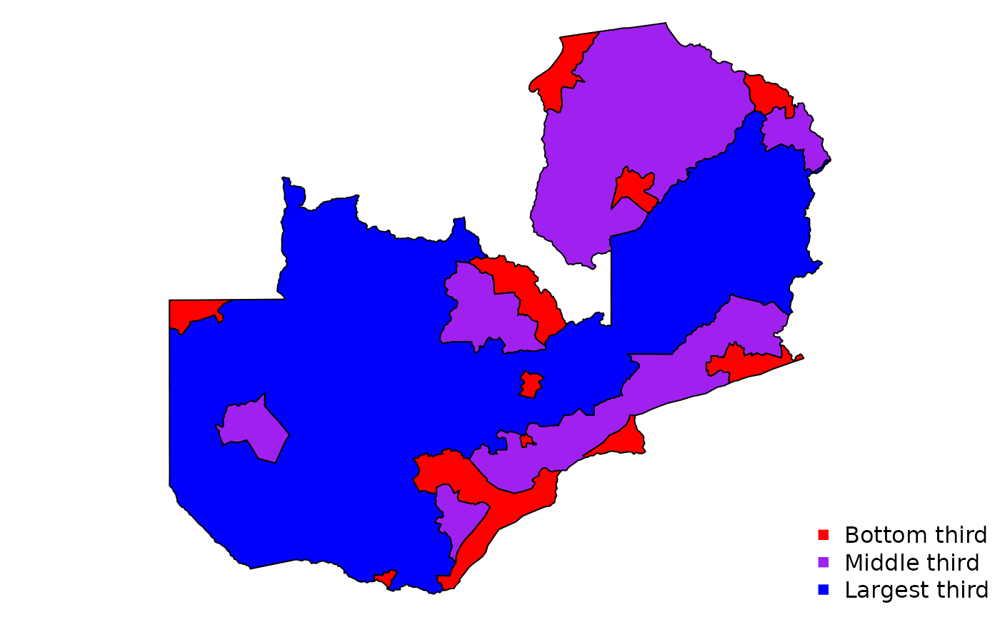

The above is a `dplyr`-based split-apply-combine, which has a fair bit
going on, so let’s explain:

- We first create a new function called `tertiles`, which will divide
  any vector `x` it is given into thirds.
- In the pipeline, the first line does the usual creation of an *area*
  variable. The second line use the `cut` function (see
  [`?cut`](https://rdrr.io/pkg/raster/man/cut.html)) to classify the
  *area* variable into thirds (i.e. districts whose areas are below the
  33rd percentile area, those between the 33rd and 66th percentile
  areas, and those above the 66th percentile), using our `tertile`
  function, resulting in a new `acls` variable.
- The third line in the pipeline groups the data by `acls`, and then
  calculates the mean area of each group. This `summarize` is spatial,
  in that it aggregates (dissolves) the polygons that are in group into
  a single large polygon for each group, while creating an output value
  describing the average area of the districts that were unioned to make
  each group. This is achieved by a generic `summarize` method defined
  for `sf` (see
  [`?summarise.sf`](https://r-spatial.github.io/sf/reference/tidyverse.html)).
- The `plot` shows the result of the union (plus a legend that we add)

We can do the same thing for standard deviation, but using a quintile
grouping:

``` r

# Chunk 31
quintiles <- function(x) quantile(x, probs = seq(0, 1, 0.2))
dist_quintiles <- districts %>% 
  mutate(area = as.numeric(st_area(.)) / 10^6) %>%
  mutate(acls = cut(area, breaks = quintiles(area), include.lowest = TRUE)) %>% 
  group_by(acls) %>% 
  summarize(sd_area = sd(area))
#> although coordinates are longitude/latitude, st_union assumes that they are planar
dist_quintiles
#> Simple feature collection with 5 features and 2 fields
#> Geometry type: GEOMETRY
#> Dimension:     XY
#> Bounding box:  xmin: 21.99978 ymin: -18.0751 xmax: 33.6875 ymax: -8.226213
#> Geodetic CRS:  WGS 84
#> # A tibble: 5 × 3
#>   acls                sd_area                                                               geometry
#>   <fct>                 <dbl>                                                         <GEOMETRY [°]>
#> 1 [421,3.9e+03]         1289. MULTIPOLYGON (((25.68999 -17.84936, 25.67506 -17.82137, 25.62197 -17.…
#> 2 (3.9e+03,6.76e+03]     924. MULTIPOLYGON (((27.53664 -17.42417, 27.45355 -17.49169, 27.41875 -17.…
#> 3 (6.76e+03,1.05e+04]   1137. MULTIPOLYGON (((27.10854 -16.33371, 27.09117 -16.41171, 27.11665 -16.…
#> 4 (1.05e+04,1.61e+04]   1702. MULTIPOLYGON (((26.71123 -16.46183, 26.70489 -16.49016, 26.71565 -16.…
#> 5 (1.61e+04,4.01e+04]   6555. POLYGON ((26.02423 -16.61146, 26.02976 -16.69325, 26.08744 -16.69583,…

cols <- heat.colors(5)
par(mar = rep(0, 4))
plot(st_geometry(dist_quintiles), col = cols)
legend(x = "bottomright", pch = 15, col = cols, bty = "n", 
       legend = paste0(1:5, c("st", "nd", "rd", "th", "th"), " quantile"))
```

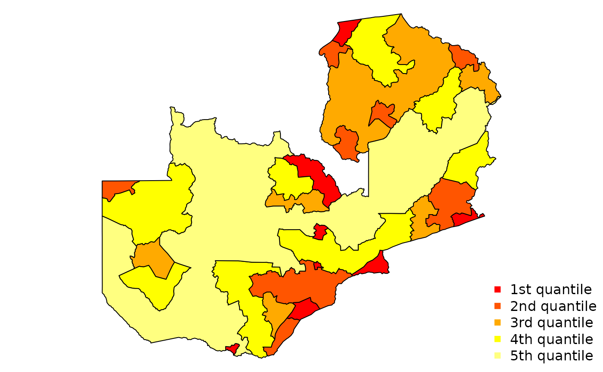

Our plot in this case uses the
[`heat.colors()`](https://rdrr.io/r/grDevices/palettes.html) function
for filling the polygons.

That was a quick introduction to SAC for `sf`. There are others we could
do (you can visit the [tidyverse
examples](https://r-spatial.github.io/sf/reference/tidyverse.html) page
for `sf` to see some others), but we will move on to the learn about
other spatial operations now.

### Practice

#### Questions

1.  How different are areas calculated using projected and unprojected
    (geographic) coordinate systems when using `st_area`? How come
    `st_area` “knows” how to calculate an area in m$`^2`$ when the CRS
    is unprojected (the answer isn’t in the material above, but can be
    found if you read through
    [`?st_area`](https://r-spatial.github.io/sf/reference/geos_measures.html))?

2.  You will note that we haven’t used `ggplot() + geom_sf()` in this
    section. Why is that?

3.  How can we create a grouping variable that we can use to split an
    `sf` object according to different levels of spatial properties
    (e.g. area)?

#### Code

1.  Using a seed of 1, randomly select (`sample_n`) 10 districts from
    `districts` and calculate their average area in hectares.

2.  Using a seed of 1, randomly select (`sample_n`) 100 road segments
    from `roads` and calculate their average length in kilometers.

3.  Plot districts with a “lightgrey” background, and then randomly
    select (seed of 1) 200 observations from farmers from the second
    season, and plot them as red circles over `districts`.

4.  From `road` select the roads that have lengths between 50 and 100 km
    and plot those in red over districts. Note that `districts` and
    `roads` are in different projections, so transform `district` to
    have the same CRS as `roads` first.

5.  Hack the code in Chunk 31 to create a map of districts merged by
    their deciles of area. Do the summary by total area. To do this, the
    `quantile` function will have to be altered (pass `seq(0, 1, 0.1)`
    to “probs”), and make sure your color vector has enough values.

## Spatial Operations

In this section we will focus on some of the more common polygon-based
spatial operations. To enable this, we are first going to create some
additional spatial data.

``` r

# Chunk 32
# #1
coords <- cbind("x" = c(25, 25.1, 26.4, 26.4, 26.4, 25), 
                "y" = c(-15.5, -14.5, -14.6, -14.8, -15.6, -15.5))
#
# #2
pol <- st_polygon(x = list(coords)) %>% 
  st_sfc %>% 
  st_sf(ID = 1, crs = 4326)
pol
#> Simple feature collection with 1 feature and 1 field
#> Geometry type: POLYGON
#> Dimension:     XY
#> Bounding box:  xmin: 25 ymin: -15.6 xmax: 26.4 ymax: -14.5
#> Geodetic CRS:  WGS 84
#>   ID                              .
#> 1  1 POLYGON ((25 -15.5, 25.1 -1...

par(mar = rep(0, 4))
plot(st_geometry(districts), col = "grey")
plot(pol, col = "purple", add = TRUE)
```

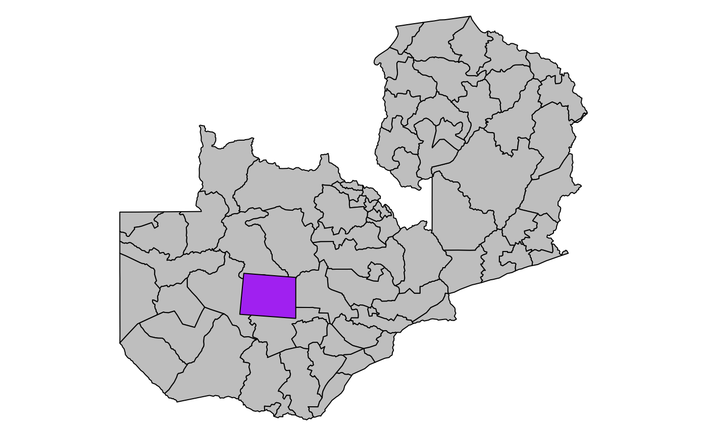

The above takes `coords`, a `matrix` of x and y coordinates (#1), and
repeats the approach we used in Chunk 19 (Section 3.6) to create an
`st_polygon` (#2), but then continues on to convert that to a simple
feature geometry list column (`st_sfc`), then to create an `sf`, a
“data.frame-like object…with a simple feature list column”
([`?st_sf`](https://r-spatial.github.io/sf/reference/sf.html)),
including the assignment of a CRS. That’s how you build up a full simple
feature with attributes.

### Overlays/spatial queries

The first thing we will do with our made-up polygon is figure out which
districts it intersects. What we are going to do in this case is the
ArcGIS equivalent of select by spatial location (if I remember my ESRI
terminology correctly–it’s been a while since I looked at it)

``` r

# Chunk 32
# #1
st_intersects(x = pol, y = districts)
#> although coordinates are longitude/latitude, st_intersects assumes that they are planar
#> Sparse geometry binary predicate list of length 1, where the predicate was `intersects'
#>  1: 15, 22, 26, 53, 54
#
# #2  
dists_int <- districts %>% slice(st_intersects(x = pol, y = districts)[[1]])
#> although coordinates are longitude/latitude, st_intersects assumes that they are planar
dists_int
#> Simple feature collection with 5 features and 1 field
#> Geometry type: POLYGON
#> Dimension:     XY
#> Bounding box:  xmin: 23.68492 ymin: -16.55543 xmax: 27.96308 ymax: -12.8613
#> Geodetic CRS:  WGS 84
#>       distName                       geometry
#> 1 Itezhi Tezhi POLYGON ((25.31517 -15.2849...
#> 2        Kaoma POLYGON ((25.59041 -14.5366...
#> 3      Kasempa POLYGON ((26.87956 -13.4341...
#> 4     Mufumbwe POLYGON ((25.57661 -12.9764...
#> 5       Mumbwa POLYGON ((27.18799 -14.3719...
# 
# #3
par(mar = rep(0, 4))
plot(st_geometry(districts), col = "grey")
plot(st_geometry(dists_int), col = "blue", add = TRUE)
plot(st_geometry(pol), border = "purple", add = TRUE)
```

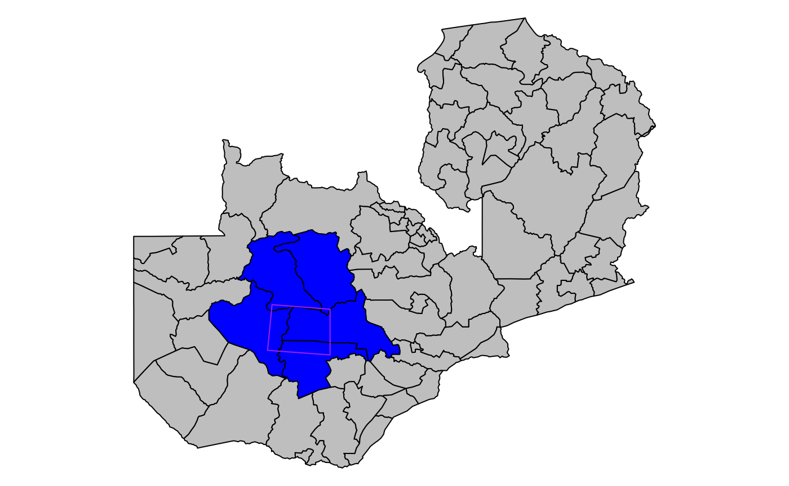

In \#1 we use `st_intersects` to identify the indices of the `districts`
that intersect `pol`. So that doesn’t give us back the actual
intersecting district polygons. To get those, we have to do a bit more.
The output from `st_intersects` is a list object, which contains the
index of the polygon in x (the “1:” in the output) followed by the
polygons in the object passed to y that it intersects (15, 22, 26, 53,
54). We can simplify that results to a vector by specifying the list
index we want (1): `st_intersects(x = pol, y = districts)[[1]]`. We plug
that into `slice` in \#2 to pull out the polygons from `districts` into
a new object `dists_int`, and then \#3 illustrates the intersected
districts in blue.

### Intersecting

We have just seen how `st_intersects` can be used to identify and
extract intersecting polygons. Now let’s look at what `st_intersection`
does.

``` r

# Chunk 33
pol_int_dists <- st_intersection(x = pol, y = districts)
#> although coordinates are longitude/latitude, st_intersection assumes that they are planar
#> Warning: attribute variables are assumed to be spatially constant throughout all geometries

par(mar = rep(0, 4))
plot(st_geometry(districts), col = "grey")
plot(st_geometry(pol_int_dists), col = rainbow(n = nrow(pol_int_dists)), 
     add = TRUE)
```

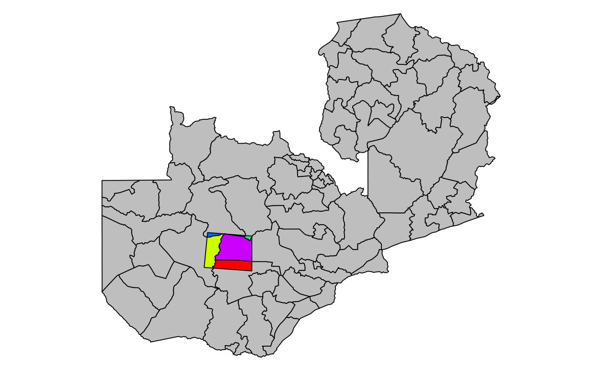

Seems pretty clear what `st_intersection` does, and how it differs from
`st_intersects`: it crops the intersected districts to the boundaries of
`pol`, and returns the intersected district polygons. It also spits out
a warning about the attribute variable being spatially constant, as well
as the usual warning about the data not being in planar coordinates. We
also introduced another color function (`rainbow`) to distinguish the
different intersected districts.

### Aggregating/Dissolving

Now that we have intersected boundaries, let’s dissolve them. We’ve
actually already seen this (in section 4.2.3), but let’s have a second
look:

``` r

# Chunk 34
# #1
pol_int_dists %>% summarize
#> although coordinates are longitude/latitude, st_union assumes that they are planar
#> Simple feature collection with 1 feature and 0 fields
#> Geometry type: POLYGON
#> Dimension:     XY
#> Bounding box:  xmin: 25 ymin: -15.6 xmax: 26.4 ymax: -14.5
#> Geodetic CRS:  WGS 84
#>                                .
#> 1 POLYGON ((25 -15.5, 25.0872...
# 
# #2
pol_int_muarea <- pol_int_dists %>% 
  mutate(area = as.numeric(units::set_units(st_area(.), "km^2"))) %>% 
  summarize(area = mean(area))
#> although coordinates are longitude/latitude, st_union assumes that they are planar
pol_int_muarea
#> Simple feature collection with 1 feature and 1 field
#> Geometry type: POLYGON
#> Dimension:     XY
#> Bounding box:  xmin: 25 ymin: -15.6 xmax: 26.4 ymax: -14.5
#> Geodetic CRS:  WGS 84
#>       area                              .
#> 1 3225.024 POLYGON ((25 -15.5, 25.0872...

par(mfrow = c(1, 2))
pol_int_dists %>% 
  st_geometry() %>% 
  plot(col = rainbow(n = nrow(pol_int_dists)), main = "Intersections")
pol_int_muarea %>% 
  st_geometry() %>% 
  plot(col = "blue", main = "Dissolved intersections")
```

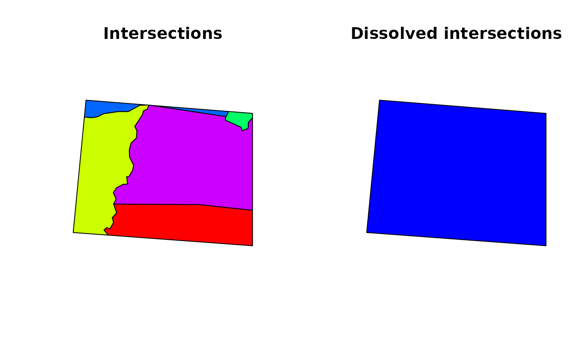

`sf`’s generic for `summarize` does the job for us. In \#1, we run
`summarize` without specifying a variable to summarize, and it returns a
field-less (attribute-less) single polygon (which is identical to `pol`,
but not mapped). In \#2, we add a variable that is meaningful to
summarize, which is the area of the intersected districts. Our summary
is the average area of those intersected districts.

For a GIS person, it might be confusing to run a function called
summarize when you specifically want to do a dissolve operation.
Shouldn’t there be a function named that, or something close to it?
Well, there is one: `st_union`, which is actually called by
`summarise.sf` (which is called by the generic `summarize` or
`summarise` in the presence of an `sf` object) by default. We can see
its behavior here:

``` r

# Chunk 35
pol_int_dists %>% st_union()
```

Same result, although in this case it produces a geometry set, and,
unlike `summarize`, `st_union` does not retain information about the
data values associated with the polygons.

### Casting

Sometimes a spatial operation will result in mixed geometry types within
a single `sf` object, or a more complex geometry type than you actually
need. You might need to make all the geometries in the object uniform
(to prevent problems with other functions that don’t want mixed geometry
types), or simplify. Doing this is the job of `st_cast`. Let’s look
again at `pol_int_dists`

``` r

# Chunk 36
pol_int_dists
#> Simple feature collection with 5 features and 2 fields
#> Geometry type: GEOMETRY
#> Dimension:     XY
#> Bounding box:  xmin: 25 ymin: -15.6 xmax: 26.4 ymax: -14.5
#> Geodetic CRS:  WGS 84
#>     ID     distName                              .
#> 1    1 Itezhi Tezhi POLYGON ((26.4 -15.6, 25.27...
#> 1.1  1        Kaoma POLYGON ((25.08724 -14.6275...
#> 1.2  1      Kasempa POLYGON ((26.4 -14.6, 26.4 ...
#> 1.3  1     Mufumbwe MULTIPOLYGON (((25.1 -14.5,...
#> 1.4  1       Mumbwa POLYGON ((25.60665 -14.5389...

rbcols <- rainbow(n = nrow(pol_int_dists))
par(mar = rep(0, 4))
pol_int_dists %>% 
  st_geometry %>% 
  plot(col = rbcols)
```

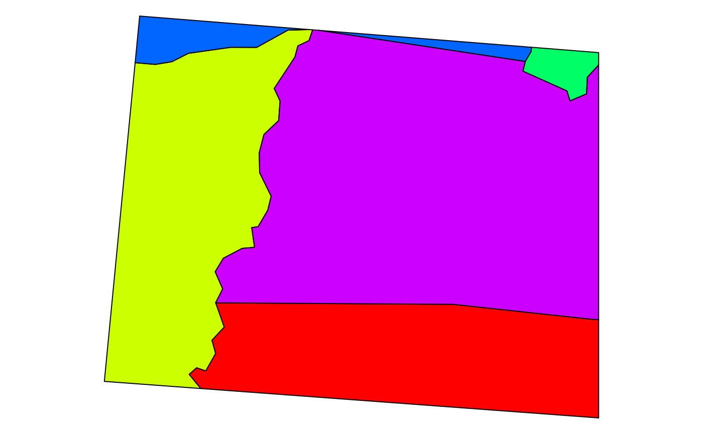

Notice how the object contains three polygons and one multipolygon,
which is the blue district (Mufumbwe), which needs to be MULTIPOLYGON
because the light green district (Kaoma) drives a wedge between it,
making it two pieces. Let’s run `st_cast`:

``` r

# Chunk 37 
pol_int_dists %>% st_cast
#> Simple feature collection with 5 features and 2 fields
#> Geometry type: MULTIPOLYGON
#> Dimension:     XY
#> Bounding box:  xmin: 25 ymin: -15.6 xmax: 26.4 ymax: -14.5
#> Geodetic CRS:  WGS 84
#>     ID     distName                              .
#> 1    1 Itezhi Tezhi MULTIPOLYGON (((26.4 -15.6,...
#> 1.1  1        Kaoma MULTIPOLYGON (((25.08724 -1...
#> 1.2  1      Kasempa MULTIPOLYGON (((26.4 -14.6,...
#> 1.3  1     Mufumbwe MULTIPOLYGON (((25.1 -14.5,...
#> 1.4  1       Mumbwa MULTIPOLYGON (((25.60665 -1...
```

That converts all POLYGONS to MULTIPOLYGONs, the simplest common
geometry type that can be shared by all 4 geometry features. One can
also specify the type of geometry you want it to be:

``` r

# Chunk 38
pol_int_dists %>% st_cast("POLYGON")
#> Warning in st_cast.MULTIPOLYGON(X[[i]], ...): polygon from first part only
#> Simple feature collection with 5 features and 2 fields
#> Geometry type: POLYGON
#> Dimension:     XY
#> Bounding box:  xmin: 25 ymin: -15.6 xmax: 26.4 ymax: -14.5
#> Geodetic CRS:  WGS 84
#>     ID     distName                              .
#> 1    1 Itezhi Tezhi POLYGON ((26.4 -15.6, 25.27...
#> 1.1  1        Kaoma POLYGON ((25.08724 -14.6275...
#> 1.2  1      Kasempa POLYGON ((26.4 -14.6, 26.4 ...
#> 1.3  1     Mufumbwe POLYGON ((25.1 -14.5, 25.57...
#> 1.4  1       Mumbwa POLYGON ((25.60665 -14.5389...
```

It throws a warning, because Mufumbwe can’t be reduced to a POLYGON
without jettisoning one of two pieces, so it let’s us know that it had
to do that. We can see the result:

``` r

# Chunk 39
par(mfrow = c(1, 3), mar = c(0, 0, 1, 0))
pol_int_dists %>% 
  st_geometry %>% 
  plot(col = rbcols, main = "Uncast")
pol_int_dists %>% 
  st_cast() %>% 
  st_geometry %>% 
  plot(col = rbcols, main = "Cast to MULTIPOLYGON")
pol_int_dists %>% 
  st_cast("POLYGON") %>% 
  st_geometry %>% 
  plot(col = rbcols, main = "Cast to POLYGON")
#> Warning in st_cast.MULTIPOLYGON(X[[i]], ...): polygon from first part only
```

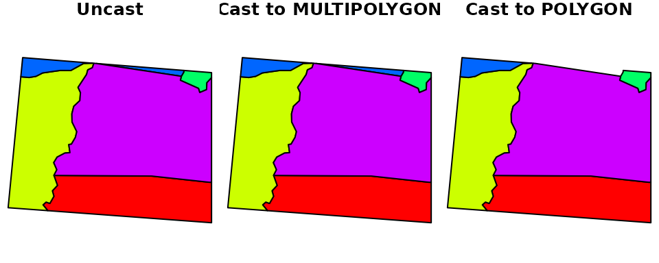

No difference between the original `pol_int_dists` and the straight cast
of it, but when we try cast to POLYGON, the top sliver of the blue
district disappears.

**Plotting tip**: note how we add titles to the plots and also tweak the
margins to add space to the top margin so that those titles can be
displayed.

We can also cast the polygons to lines, and even to points:

``` r

# Chunk 40
par(mfrow = c(1, 2), mar = c(0, 0, 1, 0))
pol_int_dists %>% 
  st_cast("MULTILINESTRING") %>% 
  st_geometry %>% 
  plot(col = rbcols, main = "Cast to MULTILINESTRING")
pol_int_dists %>% 
  st_cast("MULTIPOINT") %>% 
  st_geometry %>% 
  plot(col = rbcols, main = "Cast to MULTIPOINT", pch = 20)
```

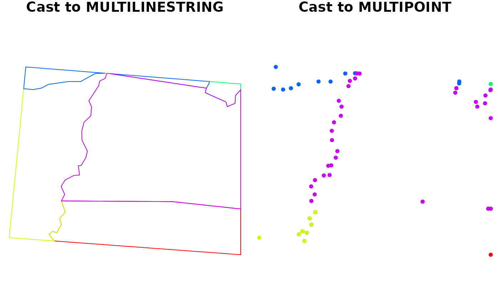

    #> null device 
    #>           1

So that’s `st_cast`. Not really a spatial operation *per se*, but can be
important for transitioning between spatial operations, as indicated by
this passage from `sf`’s [3rd
vignette](https://cran.r-project.org/web/packages/sf/vignettes/sf3.html):

> When functions return objects with mixed geometry type (GEOMETRY),
> downstream functions such as st_write may have difficulty handling
> them. For some of these cases, st_cast may help modifying their type.
> For sets of geometry objects (sfc) and simple feature sets
> (sf),st_cast\` can be used by specifying the target type, or without
> specifying it.

To learn more `st_cast` and its behavior, please read that vignette.

### Differencing

Now we are going to move on to look at another bread and butter
operation, differencing (or erasing).

``` r

# Chunk 41
d1 <- st_difference(x = districts, y = pol)
#> although coordinates are longitude/latitude, st_difference assumes that they are planar
#> Warning: attribute variables are assumed to be spatially constant throughout all geometries
d2 <- st_difference(x = pol, y = districts)
#> although coordinates are longitude/latitude, st_difference assumes that they are planar
#> Warning: attribute variables are assumed to be spatially constant throughout all geometries

par(mfrow = c(1, 2), mar = c(0, 0, 1, 0))
d1 %>% 
  st_geometry %>% 
  plot(col = "grey")
d2 %>% 
  st_geometry %>% 
  plot(col = "grey")
```

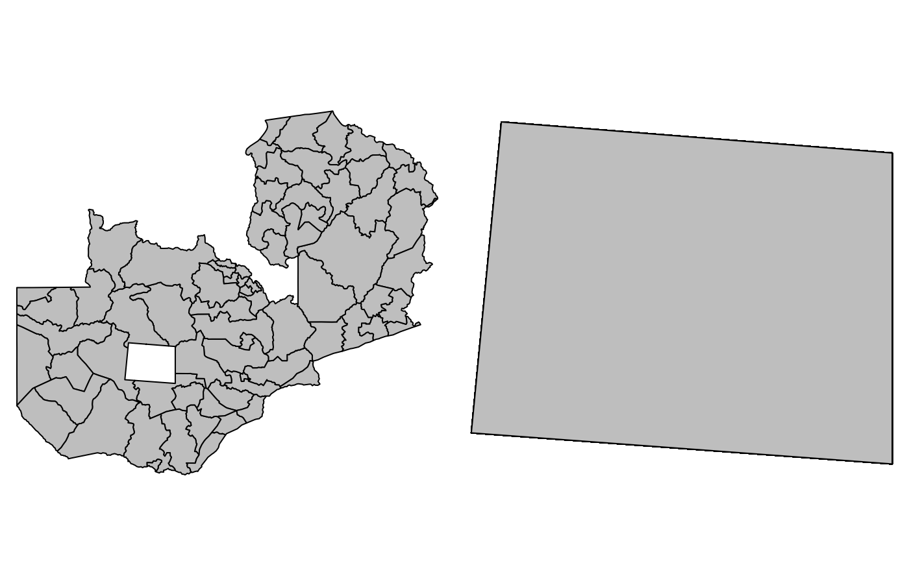

`d1` erases `pol`, leaving a hole, whereas `d2`, by reversing the order
of objects into the “x” and “y” arguments, does the same thing as an
intersection, by erasing all the districts surrounding `pol`.

### Unioning

We have already seen `st_union` in action to dissolve internal polygon
boundaries. Now let’s look at unioning two objects.

``` r

# Chunk 42
# #1
uni1 <- st_union(x = pol, y = districts)
#> although coordinates are longitude/latitude, st_union assumes that they are planar
#> Warning: attribute variables are assumed to be spatially constant throughout all geometries
uni1
#> Simple feature collection with 72 features and 2 fields
#> Geometry type: GEOMETRY
#> Dimension:     XY
#> Bounding box:  xmin: 21.99978 ymin: -18.0751 xmax: 33.6875 ymax: -8.226213
#> Geodetic CRS:  WGS 84
#> First 10 features:
#>     ID      distName                              .
#> 1    1       Chadiza MULTIPOLYGON (((25 -15.5, 2...
#> 1.1  1         Chama MULTIPOLYGON (((25 -15.5, 2...
#> 1.2  1       Chavuma MULTIPOLYGON (((25 -15.5, 2...
#> 1.3  1      Chibombo MULTIPOLYGON (((25 -15.5, 2...
#> 1.4  1       Chiengi MULTIPOLYGON (((25 -15.5, 2...
#> 1.5  1 Chililabombwe MULTIPOLYGON (((25 -15.5, 2...
#> 1.6  1       Chilubi MULTIPOLYGON (((25 -15.5, 2...
#> 1.7  1      Chingola MULTIPOLYGON (((25 -15.5, 2...
#> 1.8  1      Chinsali MULTIPOLYGON (((25 -15.5, 2...
#> 1.9  1       Chipata MULTIPOLYGON (((25 -15.5, 2...
#
# #2
uni2 <- st_union(x = districts, y = pol)
#> although coordinates are longitude/latitude, st_union assumes that they are planar
#> Warning: attribute variables are assumed to be spatially constant throughout all geometries
uni2
#> Simple feature collection with 72 features and 2 fields
#> Geometry type: GEOMETRY
#> Dimension:     XY
#> Bounding box:  xmin: 21.99978 ymin: -18.0751 xmax: 33.6875 ymax: -8.226213
#> Geodetic CRS:  WGS 84
#> First 10 features:
#>         distName ID                       geometry
#> 1        Chadiza  1 MULTIPOLYGON (((32.3076 -14...
#> 2          Chama  1 MULTIPOLYGON (((33.6875 -10...
#> 3        Chavuma  1 MULTIPOLYGON (((22.00014 -1...
#> 4       Chibombo  1 MULTIPOLYGON (((28.89229 -1...
#> 5        Chiengi  1 MULTIPOLYGON (((29.1088 -9....
#> 6  Chililabombwe  1 MULTIPOLYGON (((28.06755 -1...
#> 7        Chilubi  1 MULTIPOLYGON (((30.61853 -1...
#> 8       Chingola  1 MULTIPOLYGON (((27.51766 -1...
#> 9       Chinsali  1 MULTIPOLYGON (((32.34814 -9...
#> 10       Chipata  1 MULTIPOLYGON (((32.95348 -1...
#
# #3
par(mfrow = c(1, 2), mar = c(0, 0, 1, 0))
plot(uni1[2], reset = FALSE, main = "Union of pol with districts")
plot(uni2[2], reset = FALSE, main = "Union of districts with pol")
```

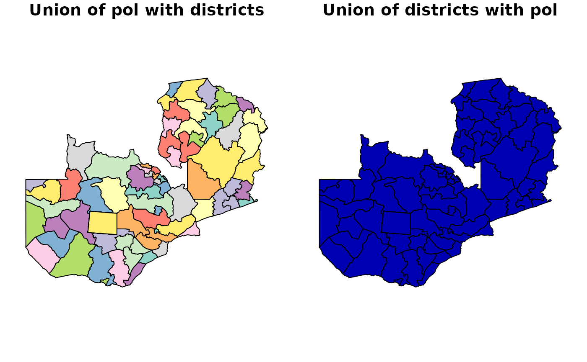

Two different order to unioning `pol` and `districts` (#1 and \#2). The
ordering simply results in the ordering of the attribute fields in the
resulting unioned datasets (the fields from the object in the “x”
argument appear first) after the overlapping polygons are merged. You
can see the difference in the ordering in the resulting plots (#3), in
which for the first time we use index notation to specify the field of
each object that we want the plot to render. In this case, we select the
second field, which is different in each unioned object, hence the
different fill patterns. This index-based referencing is a good way to
avoid having to use `st_geometry`, while letting
[`sf::plot`](https://r-spatial.github.io/sf/reference/plot.html) do the
work of selecting a color scheme.

### Buffering

This is a fairly common GIS operation that `sf` handles nicely.

``` r

# Chunk 43
# 
# #1
farmers_alb <- farmers %>% st_transform(st_crs(roads))
long_roads <- roads %>% filter(as.numeric(st_length(.)) > 500000)
districts_alb <- districts %>% st_transform(st_crs(roads))

# #2
buffs <- lapply(c(10000, 20000, 30000), function(x) { 
  set.seed(123)
  #2a
  buf_farmers <- farmers_alb %>% filter(season == 2) %>%
    st_sample(size = 5) %>% st_buffer(dist = x) # here is the buffer
  #2b
  buf_roads <- long_roads %>% st_buffer(dist = x)  # here is the buffer
  #2c
  list("farmers" = buf_farmers, "roads" = buf_roads)
})
#
# using purrr::map
# buffs <- c(10000, 20000, 30000) %>% map(function(x) { 
#   set.seed(123)
#   #2a
#   buf_farmers <- farmers_alb %>% filter(season == 2) %>%
#     st_sample(size = 5) %>% st_buffer(dist = x)
#   #2b
#   buf_roads <- long_roads %>% st_buffer(dist = x)
#   list("farmers" = buf_farmers, "roads" = buf_roads)
# })
#
# #3
par(mar = c(0, 0, 0, 0))
cols <- c("cyan", "blue2", "orange")  # 2
cols2 <- c("purple", "green4", "antiquewhite")
districts_alb %>% st_union %>% plot(col = "grey")
for(i in length(buffs):1) {  # 4
  plot(buffs[[i]]$roads, add = TRUE, col = cols2[i])  # 6
  plot(buffs[[i]]$farmers, add = TRUE, col = cols[i])  # 5
}
```

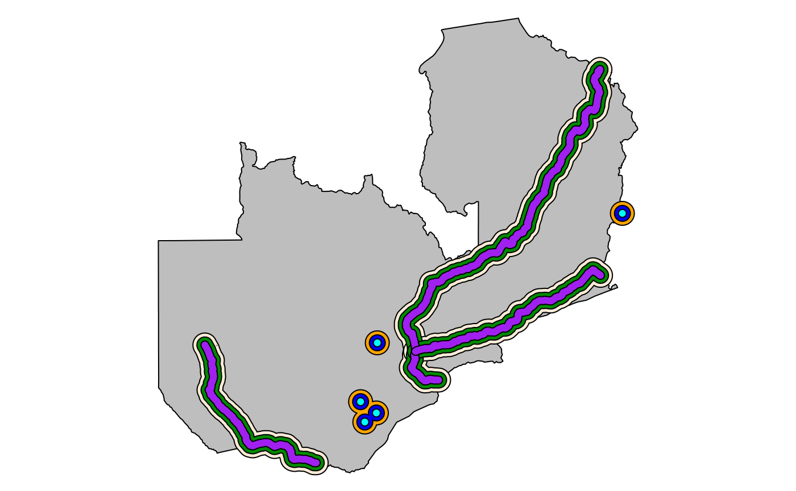

A fair bit of code up there, so let’s walk through it. In \#1 we convert
`farmers` and `districts` to Albers projections, as buffers should be
specified in meters, not decimal degrees, which one would have to do if
buffering on a GCS project. We also extract from `roads` the segments
that are longer than 500 km. In \#2, we then insert our buffering step
into an `lapply`, as we apply three different buffer widths (10, 20, and
30 km), specified in meters (the unit of the Albers projection) into
`st_buffer`. We first buffer around 5 randomly selected farmers from the
second season, using `st_sample` instead of `sample_n` (which we did
previously), because it allows merging of buffers where they touch,
whereas a sample drawn with `sample_n` would apply a separate buffer to
each point. We then apply `st_buffer` to the selected roads. The
commented out chunk of code shows how we can use
[`purrr::map`](https://purrr.tidyverse.org/reference/map.html) to do the
same work as `lapply`, using piping to pass the iteration vector into
the `map` function (you can also write it that way for `lapply`).

In \#3 we draw the plots, setting up an outline of Zambia by dissolving
district boundaries, then plotting the buffered shapes in a `for` loop
(note the reversed index ordering, to plot from largest to smallest
buffers).

### Sampling

We have seen a little bit of sampling already, but the previous examples
just sample from the features in an existing object. Sometimes you might
be interested in confining the sample to a particular feature or
features, for example:

``` r

# Chunk 44
par(mar = rep(0, 4))
districts %>% 
  st_union %>% 
  plot(col = "grey")
set.seed(1)
districts %>% 
  st_union %>% 
  st_sample(size = 100, exact = TRUE) %>% 
  plot(pch = 20, add = TRUE)
```

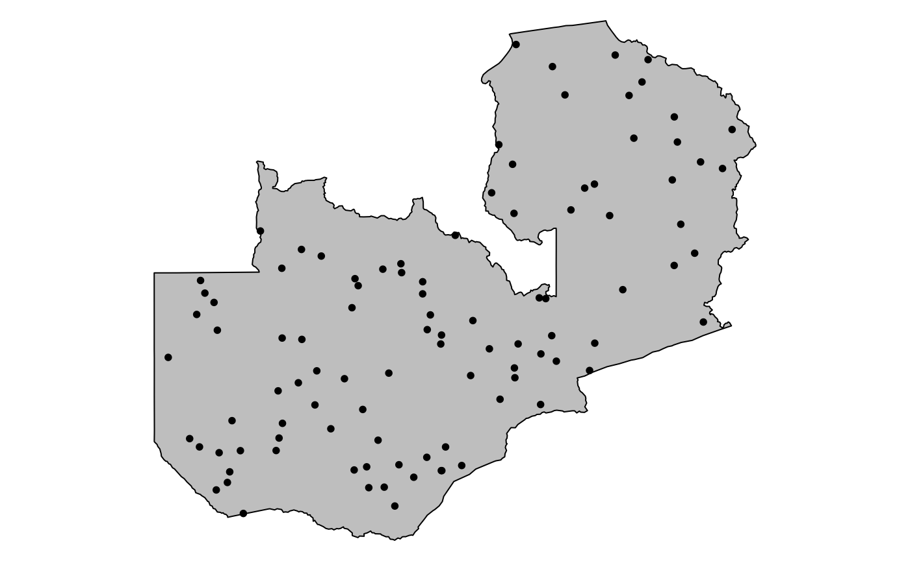

That uses `st_sample` to pull a random sample of 100 points from within
the merged district. We set the `exact = TRUE` argument to force the
returned sample to be the exact number we specify (otherwise it can
sometimes be a bit less).

Let’s look at this in a bit more depth:

``` r

# Chunk 45
# #1
seed <- 40
set.seed(seed)
dists_7 <- districts %>% sample_n(7)
#
# #2
set.seed(seed)
samp14 <- dists_7 %>% st_sample(size = 14, exact = TRUE)
# 
# #3
set.seed(seed)
samp7_2 <- dists_7 %>% st_sample(size = rep(2, nrow(dists_7)), exact = TRUE)

par(mar = rep(0, 4))
districts[2] %>% plot(col = "grey", reset = FALSE)
dists_7 %>% plot(col = "khaki", add = TRUE)
samp14 %>% plot(col = "red", pch = 20, add = TRUE)
samp7_2 %>% plot(col = "blue", pch = "+", add = TRUE)
```

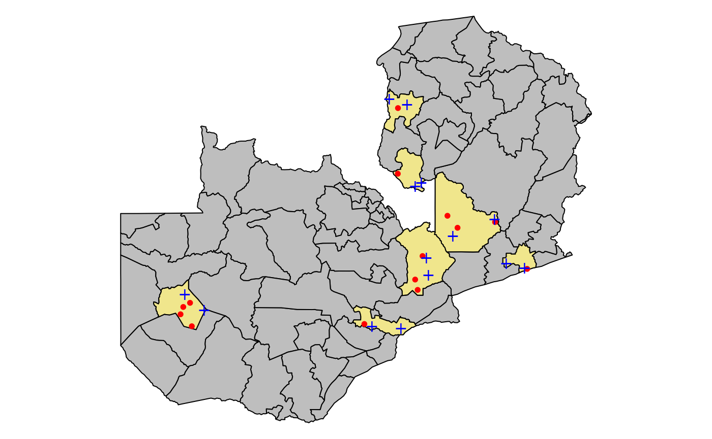

In \#1 we start by randomly selecting 7 districts from `districts`
(using `sample_n`). We then use `st_sample` to randomly select 14 points
from within those 7 randomly selected districts (#2). In \#3, we specify
that we want to randomly select 2 points within each of the 7
districts–to do that, we create a vector containing 2 repeated as many
times as there are rows in `dists_7`, so the sample size is specified
for each of the 7 sampled districts. The output plots show the
differences between the two sampling strategies. The approach used in
\#2 distributes an unequal number of points across the 7 districts, and
misses one district entirely. The approach in \#3 places two points in
each of the 7 districts. It is not hard to see that one could go from
here to create a stratified random sample in which the size was made
proportional to each district’s area.

So that’s it for this unit, which has given a brief and by no means
exhaustive introduction to do some common vector operations and ways in
which vector data are manipulated.

### Practice

#### Questions

1.  Why it is the purpose of `st_cast`, and why might we need to cast
    features?

2.  What spatial operation occurs when `summarize` is applied to an `sf`
    object?

3.  In what way does the order of unioning affect the result of
    `st_union` on two spatial objects?

#### Code

1.  Using the code in Chunk 32 as your template, create a rectangular
    `sf` polygon called `pol2` using the x coordinates 27 and 27.5
    (minimum and maximum) and y coordinates -13 and -13.5. Coordinates
    vectors should be ordered like this for x: xmin, xmax, xmax, xmin,
    xmin. And for y: ymin, ymin, ymax, ymax, ymin. In both cases, think
    of min and max in absolute terms (i.e. drop the negative sign). Plot
    the result on top of `districts` in blue. It should look like this:

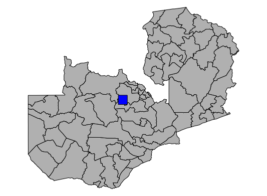

2.  Use your new `pol2` to do an `st_intersection` with `districts`.
    Call it `pol2_int_dists`. Plot it using rainbow colors on top of
    grey `districts`.

3.  Calculate the difference between 1) the sum of areas calculated from
    `pol2_int_dists` and 2) the area of `pol2`.

4.  Use `st_difference` to create a `pol2` sized hole in `districts`. Do
    the difference on the fly (i.e. don’t save it), and pipe the result
    to `plot(col = "grey")`

5.  From Chunk 43, recreate `farmers_alb`, and use the code in \#2a to
    recreate buffers of 30 km width around the 5 randomly selected
    farmer points, and plot those. Recreate the buffers, but use
    `sample_n` to do the random draw. Plot those and compare the
    difference.

6.  Select from `roads` the roads that are greater than 400 km long, and
    save the result in `roads_gt400`. Place a 25 km buffer around those
    roads. Plot the result over the Albers-projected districts (in grey)
    in green.

7.  Select a random sample of exactly 20 points within each of the 25 km
    buffers around `roads_gt400`. Plot the resulting points as red
    circles over the tan buffered roads and grey districts.

## Unit assignment

### Set-up

Make sure you are working in the master branch of your project (you
should not be working on the a3 branch). Create a new vignette named
“unit2-module1.Rmd”. You will use this to document the tasks you
undertake for this assignment.

There are no package functions to create for this assignment. All work
is to be done in the vignette.

### Vignette tasks

1.  Read in the `farmers_spatial.csv`, `districts.geojson`, and
    `roads.geojson` datasets. Reduce the size of the farmers data by
    first selecting distinct observations by *uuid*, *x*, *y*, *season*,
    i.e. use `distinct(uuid, x, y, season)`. After that convert it to an
    `sf` object. Reproject the farmers and districts data to Albers
    projection (using the CRS from roads), naming each `farmers_alb` and
    `districts_alb`. Ideally (worth an extra 0.5 points) you will do all
    the necessary steps to create `farmers_alb` and `districts_alb` in
    one pipeline.

2.  Create a plot using
    [`sf::plot`](https://r-spatial.github.io/sf/reference/plot.html)
    that shows all three datasets on one map, with `districts_alb` in
    grey, with `roads` in red over that, and `farmers_alb` as a blue
    cross over that. Use the relevant chunk arguments to center the
    figure in the vignette html, and to have a height of 4 inches and a
    width of 6 inches. The figure should have 0 margins all around.

3.  Make the same plot above using `ggplot` and `geom_sf`. When adding
    `farmers_alb` to the plot, use `pch = "+"` and `size = 3` as
    arguments to `geom_sf`. Add the function
    [`theme_bw()`](https://ggplot2.tidyverse.org/reference/ggtheme.html)
    to the `ggplot` construction chain, to get rid of the grey
    background. Make the “fill” (rather than “color”) of `districts_alb`
    grey. Center the figure using chunk options and make the figure
    width 5 inches and height 6 inches.

4.  Select from `districts_alb` the district representing the *50th
    percentile area*, i.e. the median area, and save that district into
    a new object `median_dist`. Plot it in “khaki” on top of grey
    `districts_alb`. Give the plot a title “The median area district”.
    Same plot dimensions in the vignette html as for Task 2, but a leave
    a space of 1 at the top in the plot `mar`.

5.  Convert the `median_dist` to its centroid point. Call it
    `median_distp`. `filter` the `farmers_alb` data for season 1, and
    then find the 20 closest season 1 farmers to `median_distp`. To do
    that, create the new object `closest_20farmers` by using `mutate`
    with `st_distance` to create a new variable *dist* (convert it to
    numeric), and then `arrange` by variable *dist* and slice out the
    top 20 observations. Plot `districts_alb` in grey, `median_dist`
    over that in khaki, `median_distp` as a solid purple circle,
    `farmers_alb` in blue, and `closest_20farmers` in red. Zero margins
    and width of 6 inches and height of 4 inches.

6.  Create a rectangular `sf` polygon called `mypol` using the x
    coordinates 30 and 31 (minimum and maximum) and y coordinates -10
    and -11. Assign it `crs = 4326` and transform it to Albers. Select
    from `districts_alb` the districts that intersect `mypol`, and plot
    in “grey40” over `districts_alb` in grey, and plot over that `mypol`
    without any fill but just a yellow border. Calculate the area in ha
    of `mypol` and report it in your vignette below this plot. Zero
    margins and width of 6 inches and height of 4 inches.

7.  Create `mypol_dist_int` from the intersection of `mypol` and
    `districts_alb`, recasting the intersected districts to
    multipolygons, and adding an *area* variable onto it that reports
    areas of intersections in hectares. Do all that in one pipeline.
    Plot `mypol_dist_int` in rainbow colors over `districts_alb`. Zero
    margins and width of 6 inches and height of 4 inches. Report the
    mean and median of interections in the vignette below the plot.

8.  Find the shortest and longest roads in Zambia, and place the
    selected roads into a new object (`roads_extreme`). To do this, you
    will need to `arrange` `roads` by length and then `slice` to get the
    first and last observations (of course you need to first calculate
    length). Do that as one pipeline. Then calculate a 50 km buffer
    around those two roads (`roads_extreme_buff`). Plot
    `roads_extreme_buff` in blue over `districts_alb` in grey, and add
    `roads_extreme` on top of that as red lines (use `lwd = 3` in the
    plot). Zero margins and width of 6 inches and height of 4 inches.

9.  Select a random sample of 10 points in the smallest object in
    `roads_extreme_buff`, and one of 50 in the largest object. Use a
    single call to `st_sample` to do that. Use a seed of 2. Plot those
    points as yellow solid points over the same map created in Task 8
    above. Use the same dimensions.

10. Your final task is to intersect `roads` with the buffer of the
    longest road in `roads_extreme_buff` (`roads_int`). Plot the buffer
    of the longest road in blue over the districts in grey, and then
    `roads_int` as red lines. Use the same dimensions as the previous
    two plots. Report the total distance of intersected roads in km in
    the vignette below the plot.

### Assignment output

Refer to [Unit 1 Module 4’s assignment output
section](https://agroimpacts.github.io/geospaar/articles/unit1-module4.html#assignment-output)
for submission instructions. The only differences are as follows:

1.  Your submission should be on a new side branch “a4”;
2.  You should increment your package version number by 1 on the lowest
    number (e.g. from 0.0.1 to 0.0.2) in the DESCRIPTION;
3.  Do not worry about \#3 in those instructions
4.  When asked to report the result of calculations in the vignette text
    (e.g. in Task 10), you can use another RMarkdown trick, which is to
    let the calculation be done by code inserted between a single pair
    of backticks, with the first backtick followed immediately by r and
    a space. See [here](https://rmarkdown.rstudio.com/lesson-4.html) for
    more explanation of that.

------------------------------------------------------------------------

[Back to home](https://agroimpacts.github.io/geospaar/articles/index.md)

------------------------------------------------------------------------
