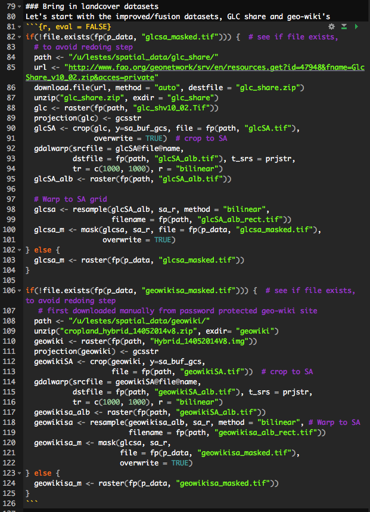
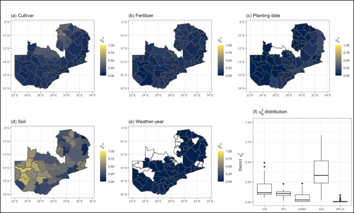
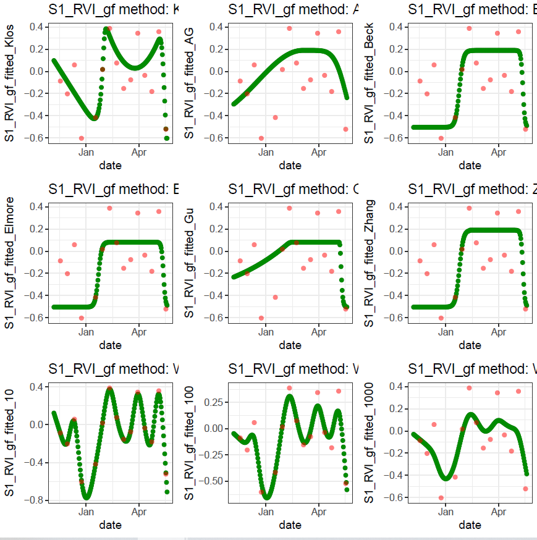
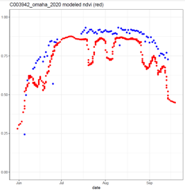
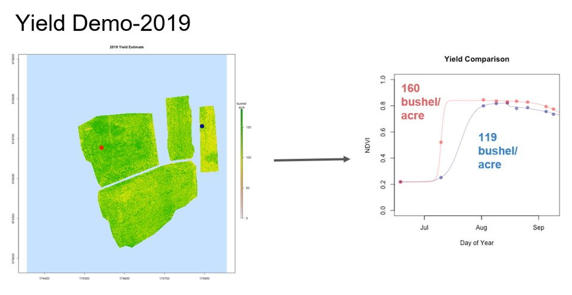
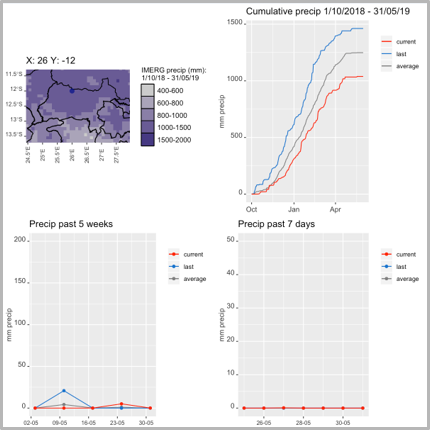

```{r setup, include=FALSE}
# knitr::opts_chunk$set(echo = FALSE)
```

```{r, eval = FALSE}
library(raster)
library(viridis)
ghana_dem <- getData(name = "alt", country = "GHA")
png("inst/slides/figures/ghana-dem.png", bg = "transparent", height = 4, 
    width = 3, res = 300, units = "in")
par(mar = c(3, 0, 0, 0))
plot(as(extent(ghana_dem), "SpatialPolygons"), lty = 0)
plot(ghana_dem, col = magma(100), add = TRUE, axes = FALSE, box = FALSE, 
     legend = FALSE)
plot(ghana_dem, col = magma(100), legend.only = TRUE, horizontal = TRUE, 
     axis.args = list(col.axis = "white", col = "white", las = 2), 
     legend.args = list(text = "", col = "white"))
dev.off()
```

---
## Introductions 

- COVID preparedness (revised)
- Zoom considerations
- Class itntroduction

---

## Class Overview

- By the end of this class, you should:
    - Be comfortable in working with R, including most common geospatial functions
    - Have a good sense of where R is headed as a language
    - Know where to look when don't know how to do something
    - Be using R as part of a ___reproducible___ workflow

- Course approach
    - (Largely) flipped model and emphasis on problem solving
        - Programming should be fun! (or at least intriguing)
    - Lab and office hours as help sessions

---

## Reproducibility 1

```{r, out.width = "70%", echo=FALSE, fig.align='center'}
knitr::include_graphics("figures/class1_1.png")
```

---

## Reproducibility 2
```{r, out.width = "50%", echo=FALSE, fig.align='center'}

```
---

## Course Requirements

- Let's have a look at the [Syllabus](syllabus.html)

---

## Some R examples
- Crop Modeling and Yield Variance

```{r, out.width = "80%", echo=FALSE, fig.align='center'}

```

---

## Some R examples
- Curve fitting (`phenofit` package)

```{r, out.width = "50%", echo=FALSE, fig.align='center'}

```

---

## Some R examples
- VI estimation

```{r, out.width = "50%", echo=FALSE, fig.align='center'}

```

---

## Some R examples
- Yield estimation

```{r, out.width = "80%", echo=FALSE, fig.align='center'}

```


---

## Some R examples
- Shiny app  

```{r, out.width = "50%", echo=FALSE, fig.align='center'}

```

---

## Projects
- Projects [page](projects.html)

---

## Tips
- Command line code 
  - Terminal (for Mac). Press Command + Space
  - Command Prompt (for Windows). Search for "cmd"
- Running code in R
  - Enter code `print('hello world')` in Console and press Enter
  - Highlight code in script. Press Ctrl + Enter (Windows) or Command + Enter (Mac)

---

## Getting Set Up/Homework

- **Github**
  - Get yourself a [GitHub](https://github.com/) account, if you haven't
  - Send Arman and Mike your GitHub name on Slack (**!!**)
  - Set up your [personal access token](https://agroimpacts.github.io/geospaar/git-github.html)
  - Go to our GitHub group page [agroimpacts](https://github.com/agroimpacts) and get yourself familiar with it (Repositories, People, Teams, etc.)
- Install
  - Install all necessary software on your local computer(s). [Instructions](software-installation.html)
- **Read** 
  - Unit1-Module 1 before section 4
  - Section 1.7 Style in Syllabus
  - Cheatsheet of RStudio and R markdown (link on class website)


