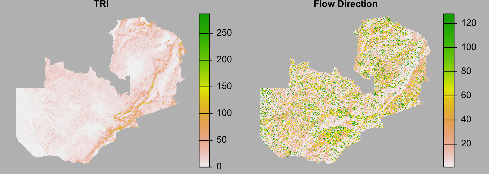

```{r, out.width = "100%", echo=FALSE, fig.align='center'}

```

---

```{r, eval=FALSE}
library(raster)
library(geospaar)
# data(dem)
topo <- lapply(c("TRI", "flowdir"), function(x) terrain(dem, x))
png(here::here("external/slides/figures/zambia_topo.png"), 
       width = 6, height = 3, res = 300, units = "in", bg = "grey")
par(mfrow = c(1, 2), mar = c(0, 1, 2, 4), oma = c(0, 1, 0, 2))
plot(topo[[1]], main = "TRI", axes = FALSE, box = FALSE)
plot(topo[[2]], main = "Flow Direction", axes = FALSE, box = FALSE)
dev.off()
```
---
# Today

- Looking at next assignment
- More looping/apply
- Data shaping
- Analysis: SAC
- Plotting

---
## Unit assignment

- [Assignment](https://agroimpacts.github.io/geospaar/unit1-module4.html#unit-assignment)

---

## Looping practice continued
### First let's create some new data
```{r, eval=FALSE}
set.seed(100)
m1 <- cbind(V1 = 1:20, V2 = sample(1:100, size = 20, replace = TRUE), 
            V3 = rnorm(n = 20, mean = 500, sd = 100))
```

- Create an `m2` and `m3` with the same settings, but use a seed of 200 for `m2` and 300 for `m3`.  

---

## Looping
### Create a list of matrices
- Create the matrices `m1`, `m2`, `m3` using an `lapply`: 
- Ingredients:
  - vector to iterate over: `c(100, 200, 300)`
  - output object: `l`
  - anonymous function to create each matrix: 
  
```{r, eval = FALSE}
function(x) {
  m <- cbind(...)  
}
```
```{r, eval=FALSE}
l <- lapply(put your iterator here, function(x) {
  m <- grab the statement from the m1 and drop in here
})
```


---
## Looping 2
### Create list of data.frames
- Create a list `l2` with three data.frames, having the same variables `V1:V3` as in m, but with a 4th variable `GRP` that is sampled from the first 5 values of `LETTERS`
- Ingredients:
  - Same code used to make `l`
  - Within the anonymous function, make a fourth variable `v` using `sample` below the code to make `m`
  - Combine `m` and `v` (naming it `GRP`) using `data.frame`

---
## Reading/writing data

Let's first write some data and read it back in:
```{r, eval=FALSE}
dummy_data <- data.frame(a = 1:10, b = sample(letters[1:5], 10, replace = TRUE))

# two ways of writing
f <- "~/Desktop/demo/dummy_data.csv"
write.csv(dummy_data, file = f, row.names = FALSE)
# readr::write_csv(dummy_data, file = f)

# two ways of reading
read.csv(f)
# readr::read_csv(f)
```

---
## Reading/writing data
With a bit of reshaping to start

- Let's take `l2` from the previous exercise
- Combine it into a single `data.frame` using the following code
```{r, eval=FALSE}
d <- do.call(rbind, l2)
```

- Now write that out using `write.csv` and `readr::write_csv`. Write it to "mybigdummydata.csv"
- And read it back in using `read.csv` and `readr::read_csv`

---
## Reading/writing and looping

- Let's write `l2` out using a `for` loop to create three output csv files
```{r, eval=FALSE}
for(i in 1:length(l2)) {
  write.csv(l2[[i]], file = paste0("~/Desktop/demo/dummy_data", i, ".csv"))
}
```

- And read those back into a list: use `lapply` to capture data in list `l3`
- Ingredients:
  - Iterate over `1:3`
  - Have `read.csv` in anonymous function body
  - Reuse the `paste0` from code chunk above
  
---
## Reshaping data

Going from long to wide and back again
```{r, eval=FALSE}
library(dplyr)
library(tidyr)

# d1 <- data.frame(a = 1:10, grp1 = rep("a", 10), grp2 = rep("b", 10))
d1 <- data.frame(i = 1:10, a = 1:10, grp = rep("a", 10))
d2 <- data.frame(i = 1:10, a = 11:20, grp = rep("b", 10))
DF <- rbind(d1, d2)

df_wide <- DF %>% pivot_wider(names_from = grp, values_from = a)
df_long <- df_wide %>% 
  pivot_longer(cols = a:b, names_to = "grp", values_to = "a")
df_long %>% select(i, a, grp) %>% arrange(grp)

```

- Reorder columns and sort by grp


---
## Reshaping data

Going from long to wide and back again
```{r, eval=TRUE, message=FALSE, warning=FALSE}
library(tidyverse)

# d1 <- data.frame(a = 1:10, grp1 = rep("a", 10), grp2 = rep("b", 10))
d1 <- data.frame(i = 1:10, a = 1:10, grp = rep("a", 10))
d2 <- data.frame(i = 1:10, a = 11:20, grp = rep("b", 10))
DF <- rbind(d1, d2)

df_wide <- DF %>% pivot_wider(names_from = grp, values_from = a)
df_long <- df_wide %>% 
  pivot_longer(cols = a:b, names_to = "grp", values_to = "a") %>%
  select(i, a, grp) %>% arrange(grp)
```


---
## New dataset

```{r, message=FALSE, warning=FALSE, out.width="40%", fig.align='center'}
set.seed(1)
price_weight <- tibble(
  year = 1951:2000, 
  price = runif(n = length(year), 20, 50),
  weight = (price * 10) * runif(n = length(year), 0.8, 1.2)
)
plot(price_weight$price, price_weight$weight)

```

---
## Practice
### Reshaping
- Reshape `price_weight` to make it *long*, using `pivot_longer`, to put the variables "price" and "weight" into a single variable "value" and the names price and weight into a variable named "element". Necessary functions: `%>%`, `pivot_longer`. Name it `price_weight_long`.
- Use pivot_wider to reshape `price_weight_long` to its original wide format. Call it `price_weight_wide`

```{r, eval=FALSE}
price_weight_long <- price_weight %>% 
  pivot_longer(cols = price:weight, names_to = "element", values_to = "value")

price_weight_wide <- price_weight_long %>% 
  pivot_wider(names_from = element, values_from = value)
```

---
## Demo
### Split-Apply-Combine

#### tidyverse
```{r, eval=FALSE}
df_long <- df_wide %>% 
  pivot_longer(cols = a:b, names_to = "grp", values_to = "a") %>% 
  select(i, a, grp) %>% arrange(grp)

df_long %>% 
  group_by(grp) %>% 
  summarize(mean = mean(a), stdev = sd(a))
```

#### Old school
```{r, eval=FALSE}
do.call(rbind, lapply(unique(df_long$grp), function(x) {
  # df_long %>% 
  #   filter(grp == x) %>% 
  #   summarize(mean = mean(a), stdev = sd(a)) %>% 
  #   mutate(grp = x) %>% select(grp, mean, stdev)
  dat <- df_long[df_long$grp == x, ]
  data.frame(grp = x, mean = mean(dat$a), stdev = sd(dat$a))
}))
```

---
## Practice
- Use `dplyr` on `price_weight_long` to calculate the mean and standard deviation of "value" by the "element" variable

```{r, eval=FALSE}
price_weight_long %>% 
  group_by(element) %>% 
  summarize(mean = mean(value), stdev = sd(value))
```
- Do the same, but with `lapply`

```{r, eval=FALSE}
do.call(rbind, lapply(unique(price_weight_long$element), function(x) {
  price_weight_long %>% 
    filter(element == x) %>% 
    summarize(mean = mean(value), stdev = sd(value)) %>% 
    mutate(element = x) %>% select(element, mean, stdev)
}))

do.call(rbind, lapply(unique(price_weight_long$element), function(x){
  dat <- price_weight_long[price_weight_long$element == x, ]
  data.frame(element = x, mean = mean(dat$value), stdev = sd(dat$value))
}))
```
---
## Plotting

- Plot values by groups

```{r, eval=FALSE}
plot(value ~ year, col = "red", pch = 16, 
     ylim = range(price_weight_long$value),
     data = price_weight_long[price_weight_long$element == "price", ])
points(value ~ year, col = "blue", pch = 16, 
       data = price_weight_long[price_weight_long$element == "weight", ])
```


---
```{r, echo = FALSE, eval = FALSE}
library(tidyverse)
set.seed(1)
tb_df <- tibble(year = rep(1951:2000, 2), 
                group = rep(sample(letters[1:5], 50, replace = TRUE), 2), 
                value = runif(n = 100, min = 50, max = 100),
                element = c(rep("Price", 50), rep("Weight", 50)))
readr::write_csv(tb_df, 
                 path = here::here("external/notebooks/data/dummy_data2.csv"))
```


```{r, eval = FALSE}
tb_df <- readr::read_csv(here::here("external/notebooks/data/dummy_data2.csv"))
tb_df %>% distinct(group, element)
# tb_df %>% distinct(group)
# tb_df %>% distinct(element)
tb_df %>% pivot_wider(names_from = element, values_from = value)
tb_df %>% select(-group) %>% 
  pivot_wider(names_from = element, values_from = value)
tb_df %>% 
  pivot_wider(names_from = element, values_from = value) %>% 
  arrange(group)
tb_df %>% pivot_wider(names_from = element, values_from = value) %>% 
  arrange(group, desc(year))
tb_df %>% pivot_wider(names_from = element, values_from = value) %>% 
  mutate(wt_price = Weight / Price)
# extra
tb_df %>% pivot_wider(names_from = element, values_from = value) %>% 
  arrange(group, desc(year)) %>%
  filter(group == "a") %>% mutate(wt_price = Weight / Price)
```
