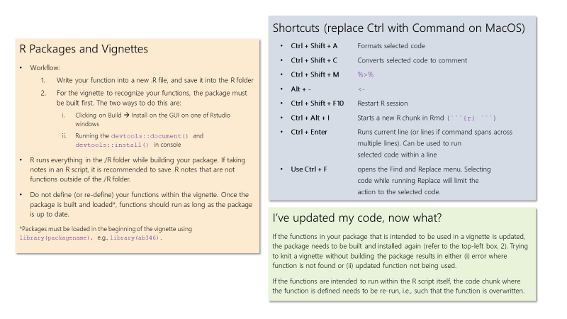
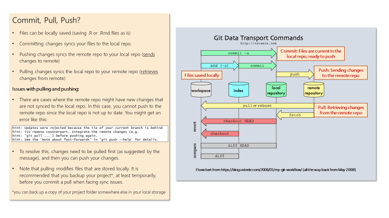

```{r, out.width = "100%", echo=FALSE, fig.align='center'}
knitr::include_graphics("figures/zambia_topo.png")
```

---

```{r, eval=FALSE}
library(raster)
library(geospaar)
# data(dem)
topo <- lapply(c("TRI", "flowdir"), function(x) terrain(dem, x))
png(here::here("external/slides/figures/zambia_topo.png"), 
       width = 6, height = 3, res = 300, units = "in", bg = "grey")
par(mfrow = c(1, 2), mar = c(0, 1, 2, 4), oma = c(0, 1, 0, 2))
plot(topo[[1]], main = "TRI", axes = FALSE, box = FALSE)
plot(topo[[2]], main = "Flow Direction", axes = FALSE, box = FALSE)
dev.off()
```
---
# Today

- Looking at next assignment
- More looping/apply
- Data shaping
- Analysis: SAC
- Plotting

---
## Unit assignment

- [Assignment](https://agroimpacts.github.io/geospaar/unit1-module4.html#unit-assignment)

---
## Exercises (1). Write csv for each site's observations.

- Read in the `cdf_corn.csv` file using the working directory path (e.g. "./inst/extdata/cdf_corn.csv". Store in a variable `data_obs`
- Using `unique()` find a list of unique site_id.  Save the unique site IDs in a variable `sites`.
- Use a `for` loop that:
  - Iterates over each `site` in `sites`
  - Filters `data_obs` to only those observations in `site`. 
  - Stores the filtered observations in an object `site_obs`.
  - Writes a csv (to your working directory) of the filtered observations for each site. The csv name should be `site_name.csv`, for the name of each site. 

---
## initial steps
- read in cdf.corn.csv
- find unique sites

```{r}
f_path <- "../inst/extdata/cdf_corn.csv"
data_obs <- read.csv(f_path)
sites <- unique(data_obs$site_id)
sites
```

---
## for loop structure
- what is the iterator? (object you loop over)
- what will you call the item? 
- what do you want to do?

```{r, eval=FALSE}
for(item in iterator){
  ##do stuff....
}
```


---
## for loop structure
- what is the iterator? (object you loop over)
  - sites
- what will you call the item? 
  - current_site
- what do you want to do?
  - filter observations by site name
  - store filtered obs. in object
  - write filtered obs to csv

```{r, eval=FALSE}
for(current_site in sites){
  print(current_site)
  # filter observations
  # store in object
  # write to csv
}

```

---
## Exercises (1) final code
```{r, eval=FALSE}
for(current_site in sites){
  print(current_site)
  # filter observations
  # store in object
  site_obs <- data_obs %>% filter(site_id == current_site)

  # write to csv
  csv_name <- paste0(current_site, ".csv") ## create a file name
  write.csv(site_obs, file = csv_name)
}

```

---
## Exercises (2). Create list to store each sites observations.

- Similar to above, but instead of writing csv's, we want to save the filtered observations for each site in a list `l`.
- So `l[[1]]` has the observations for the first site, `l[[2]]` for the second site, etc.
- Use `lapply` for this, iterating over `sites`.
- e.g. `lapply(sites, function(x){...})`
- the final result should be a list `l` .
- The names of `l` should be the site names. So l[['site_name_1']] gives the observations for site 1. 
- Use `save` to save list to a .rda file.

---
## lapply structure

- what is the iterator? (object you loop over)
  - 
- what will you call the item? 
- what do you want to do?
- what object will you return? (for loop doesn't have this)

```{r, eval=FALSE}
lapply(iterator, function(item){
  ## do stuff
  return(something)
})
```

---
## lapply structure

- what is the iterator? (object you loop over)
  - sites
- what will you call the item? 
  - current_site
- what do you want to do?
  - filter observations by site
- what object will you return? (for loop doesn't have this)
  - the filtered obs for current site

```{r, eval=FALSE}
l <- lapply(sites, function(current_site){
  ## filter observations by site
  return(filtered_obs)
})
```

---
## Exercise (2) final code

```{r, eval=FALSE}
l <- lapply(sites, function(current_site){
  filtered_obs <- data_obs %>% filter(site_id == current_site)
  return(filtered_obs)
})
```


---
## Exercises (3). Find mean SAVI for each site.

- Create a column "SAVI" in `data_obs`. It should contain the SAVI as calculated from the NIR band (b6r) and red band (b4r).
- Using `group_by`, 'summarize' (dplyr), create a table listing the sites and mean SAVI per site.
- Using `lapply` and base R, create a table listing the sites and mean SAVI per site.
- Arrange sites from highest average SAVI to lowest. 

---

## initial work
- create SAVI column.
  - SAVI = ((NIR – red) / (NIR + red + 0.5)) * (1.5)
  - `b6r` is NIR reflectance
  - `b4r` is red reflectance
  
```{r, message = F}
library(dplyr)
data_obs <- data_obs %>% mutate(SAVI = ((b6r - b4r) / (b6r + b4r + 0.5)) * (1.5))
data_obs
```

---
## split-apply-combine structure

- what data do you start with?
- what column(s) do you group by?
- what other columns will you summarize? how?

```{r, eval=FALSE}
grouped_obs <- starting_data %>% 
  group_by(some column) %>% 
  summarise(new_column = some_function(old_columns))
```

---
## Exercises (3) final code

- what data do you start with?
  - data_obs
- what column(s) do you group by?
  - site_id
- what other columns will you summarize? how?
  - summarise SAVI by taking mean
  

```{r}
grouped_obs <- data_obs %>% 
  group_by(site_id) %>% 
  summarise(mean_SAVI = mean(SAVI, na.rm = T)) %>% 
  arrange(-mean_SAVI) ## arrange from highest to lowest
grouped_obs
```

---
## Exercises (3) final code - lapply
- Base R is very tedious for SAC.

```{r}
grouped_obs <- lapply(sites, function(current_site){
  site_obs <- data_obs %>% filter(site_id == current_site)
  mean_SAVI_site <- mean(site_obs$SAVI, na.rm = T)
  one_row_df <- data.frame(site_id = current_site, 
                           mean_SAVI = mean_SAVI_site)
  return(one_row_df)
}) 
grouped_obs_DF <- do.call('rbind', grouped_obs)
grouped_obs_DF[order(-grouped_obs_DF$mean_SAVI), ]
 
```


---
## CHALLENGE Find mean SAVI for each site, separated by month.
- Using `lubridate::as_date` create a column `date` that converts the column `local` to a date object.
- Then find the `lubridate` function that can extract the month from a date.
- Use this function to create a new column `month` that stores the month for each observation. 
- Use `group_by` and `summarize` to group by both `site_ID` and `month`, and calculate the mean SAVI. 

---
## CHALLENGE answer
```{r}
data_obs$date <- lubridate::as_date(data_obs$local)
data_obs$month <- lubridate::month(data_obs$date)
grouped_obs <- data_obs %>%
  group_by(site_id, month) %>% 
  summarise(mean_SAVI = mean(SAVI, na.rm = T))
grouped_obs
  
```

---
## Package steps

```{r, out.width = "70%", echo=FALSE, fig.align='center'}

```

---
## Package steps

```{r, out.width = "70%", echo=FALSE, fig.align='center'}

```

---
## Reshaping data

Going from long to wide and back again
```{r, eval=FALSE}
library(dplyr)
library(tidyr)

# d1 <- data.frame(a = 1:10, grp1 = rep("a", 10), grp2 = rep("b", 10))
d1 <- data.frame(i = 1:10, a = 1:10, grp = rep("a", 10))
d2 <- data.frame(i = 1:10, a = 11:20, grp = rep("b", 10))
DF <- rbind(d1, d2)

df_wide <- DF %>% pivot_wider(names_from = grp, values_from = a)
df_long <- df_wide %>% 
  pivot_longer(cols = a:b, names_to = "grp", values_to = "a")
df_long %>% select(i, a, grp) %>% arrange(grp)

```

- Reorder columns and sort by grp


---
## do.call, rbind, cbind
- `do.call` takes many inputs and applies a function to them successively.
- often used with `rbind` to combine tables by rows.

```{r}
DF1 <- data.frame(v1 = 1:5, v2 = sample(1:100, 5))
DF2 <- data.frame(v1 = 6:10, v2 = sample(1:100, 5))
DF3 <- data.frame(v1 = 11:15, v2 = sample(1:100, 5))
DF_combined <- do.call('rbind', list(DF1, DF2, DF3))
DF_combined
```

---
## Reshaping data

Going from long to wide and back again
```{r, eval=TRUE, message=FALSE, warning=FALSE}
library(tidyverse)

# d1 <- data.frame(a = 1:10, grp1 = rep("a", 10), grp2 = rep("b", 10))
d1 <- data.frame(i = 1:10, count = sample(1:100, 10), grp = rep("alums", 10))
d2 <- data.frame(i = 1:10, count = sample(1:100, 10), grp = rep("students", 10))
DF <- rbind(d1, d2)
DF 
```

---
## pivot_wider

Going from long to wide 
```{r}
df_wide <- DF %>% pivot_wider(names_from = grp, values_from = count)
df_wide
```

---
## pivot_longer

Going back to long(i.e. tall)
```{r}
df_long <- df_wide %>% 
  pivot_longer(cols = c(alums, students), 
               names_to = "grp",
               values_to = "a") %>%
  select(i, a, grp) %>%
  arrange(grp)
df_long
```

---
## Joins
- [good summary](https://data-lessons.github.io/gapminder-R/12-joins.html)
```{r}
print(band_members)
print(band_instruments)
```


```{r, eval = F}
band_members %>% inner_join(band_instruments, by = "name")
band_members %>% left_join(band_instruments, by = "name")
band_members %>% right_join(band_instruments, by = "name")
band_members %>% full_join(band_instruments, by = "name")
```

---
## Correlations
- Let's calculate correlations between the following for ground sensor observations
  - NDVI = (NIR - red)/(NIR + red)
  - SAVI = ((NIR – red) / (NIR + red + 0.5)) * (1.5)
  - GCVI = (NIR/green) - 1
```{r}
f_path <- "../inst/extdata/cdf_corn.csv"
data_obs <- read.csv(f_path)
data_obs <- data_obs %>% mutate(SAVI = ((b6r - b4r) / (b6r + b4r + 0.5)) * (1.5))
data_obs <- data_obs %>% mutate(GCVI = (b6r/b3r) - 1)
```


---
## Correlations
- Let's calculate correlations between the following for ground sensor observations
  - NDVI = (NIR - red)/(NIR + red)
  - SAVI = ((NIR – red) / (NIR + red + 0.5)) * (1.5)
  - GCVI = (NIR/green) - 1
  
```{r}
cor_table <- data_obs %>% select(NDVI, GCVI, SAVI) %>% cor(., use = "complete.obs")
cor_table
```
---
## Correlations (with pvalues)
- the `Hmisc` package has the function `rcorr()`, which produces a nice matrix of p-values
- need to convert to matrix to use `rcorr`

```{r, message = F}
## install.packages("Hmisc")
library(Hmisc)
cor_table <- rcorr(data_obs %>% select(NDVI, GCVI, SAVI) %>% as.matrix())
cor_table
```

---
## Regression 

- Use case: predict GCVI from NDVI and SAVI
- format: `dependent variable ~ indep var + indep var`

```{r}
lm <-  lm(GCVI ~ NDVI + SAVI, data = data_obs)  ## dependent
lm
```

---
## Regression
```{r}
summary(lm)
```


---
## PRACTICE

---
## New dataset
```{r, message=FALSE, warning=FALSE, out.width="40%", fig.align='center'}
set.seed(1)
price_weight <- tibble(
  year = 1951:2000, 
  price = runif(n = length(year), 20, 50),
  weight = (price * 10) * runif(n = length(year), 0.8, 1.2)
)
plot(price_weight$price, price_weight$weight)
```

---
## Practice
### Reshaping
- Reshape `price_weight` to make it *long*, using `pivot_longer`, to put the variables "price" and "weight" into a single variable "value" and the names price and weight into a variable named "element". Necessary functions: `%>%`, `pivot_longer`. Name it `price_weight_long`.
- Use pivot_wider to reshape `price_weight_long` to its original wide format. Call it `price_weight_wide`

```{r, eval=FALSE}
price_weight_long <- price_weight %>% 
  pivot_longer(cols = price:weight, names_to = "element", values_to = "value")

price_weight_wide <- price_weight_long %>% 
  pivot_wider(names_from = element, values_from = value)
```

---

## Data
```{r, eval=FALSE}
set.seed(100)
dat <- data.frame(
  V1 = 1:10,
  V2 = sample(1:100, size = 10),
  V3 = runif(n = 10, min = 0, max = 50),
  V4 = sample(LETTERS[1:5], size = 10, replace = TRUE)
)
m <- cbind(V1 = 1:20, V2 = sample(1:100, size = 20, replace = TRUE), 
           V3 = rnorm(n = 20, mean = 500, sd = 100))
```

---
## Looping

### Create a list of matrices
- Create the matrices `m1`, `m2`, `m3` using an `lapply`: 
- Ingredients:
  - vector to iterate over: `c(100, 200, 300)`
  - output object: `l`
  - anonymous function to create each matrix: 
  
```{r, eval = FALSE}
function(x) {
  m <- cbind(...)  
}
```

```{r, eval=FALSE}
l <- lapply(put your iterator here, function(x) {
  m <- grab the statement from the m1 and drop in here
})
```


---
## Looping 2
### Create list of data.frames
- Create a list `l2` with three data.frames, having the same variables `V1:V3` as in m, but with a 4th variable `GRP` that is sampled from the first 5 values of `LETTERS`
- Ingredients:
  - Same code used to make `l`
  - Within the anonymous function, make a fourth variable `v` using `sample` below the code to make `m`
  - Combine `m` and `v` (naming it `GRP`) using `data.frame`


---
## Reading/writing and looping

- Let's write `l2` out using a `for` loop to create three output csv files
```{r, eval=FALSE}
for(i in 1:length(l2)) {
  write.csv(l2[[i]], file = paste0("~/Desktop/demo/dummy_data", i, ".csv"))
}
```

- And read those back into a list: use `lapply` to capture data in list `l3`
- Ingredients:
  - Iterate over `1:3`
  - Have `read.csv` in anonymous function body
  - Reuse the `paste0` from code chunk above
  
---
## Reshaping data

Going from long to wide and back again
```{r, eval=FALSE}
library(dplyr)
library(tidyr)

# d1 <- data.frame(a = 1:10, grp1 = rep("a", 10), grp2 = rep("b", 10))
d1 <- data.frame(i = 1:10, a = 1:10, grp = rep("a", 10))
d2 <- data.frame(i = 1:10, a = 11:20, grp = rep("b", 10))
DF <- rbind(d1, d2)

df_wide <- DF %>% pivot_wider(names_from = grp, values_from = a)
df_long <- df_wide %>% 
  pivot_longer(cols = a:b, names_to = "grp", values_to = "a")
df_long %>% select(i, a, grp) %>% arrange(grp)

```

- Reorder columns and sort by grp

---

## Looping practice continued
### First let's create some new data
```{r, eval=FALSE}
set.seed(100)
m1 <- cbind(V1 = 1:20, V2 = sample(1:100, size = 20, replace = TRUE), 
            V3 = rnorm(n = 20, mean = 500, sd = 100))
```

- Create an `m2` and `m3` with the same settings, but use a seed of 200 for `m2` and 300 for `m3`.  

---

## Looping
### Create a list of matrices
- Create the matrices `m1`, `m2`, `m3` using an `lapply`: 
- Ingredients:
  - vector to iterate over: `c(100, 200, 300)`
  - output object: `l`
  - anonymous function to create each matrix: 
  
```{r, eval = FALSE}
function(x) {
  m <- cbind(...)  
}
```


```{r, eval=FALSE}
l <- lapply(put your iterator here, function(x) {
  m <- grab the statement from the m1 and drop in here
})
```


---
## Looping 2
### Create list of data.frames
- Create a list `l2` with three data.frames, having the same variables `V1:V3` as in m, but with a 4th variable `GRP` that is sampled from the first 5 values of `LETTERS`
- Ingredients:
  - Same code used to make `l`
  - Within the anonymous function, make a fourth variable `v` using `sample` below the code to make `m`
  - Combine `m` and `v` (naming it `GRP`) using `data.frame`

---
## Homework
- Review Unit 1 Module 4, parts 3-4 in detail.
- Unit 1 Module 4 assignment due next Tuesday (Feb 28)

