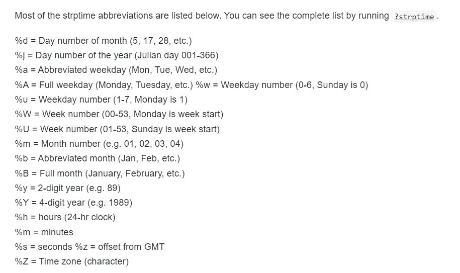

```{r, eval=FALSE}
library(terra)
library(geospaar)
# data(dem)
topo <- lapply(c("TRI", "flowdir"), function(x) terrain(rast(dem), x))
png(here::here("docs/figures/zambia_topo.png"), 
       width = 7, height = 2.5, res = 300, units = "in", bg = "grey")
par(mfrow = c(1, 2))#, mar = c(0, 1, 2, 4), oma = c(0, 1, 0, 2))
plot(topo[[1]], mar = c(0.5, 1, 1, 4), main = "TRI", axes = FALSE)
plot(topo[[2]], mar = c(0.5, 1, 1, 4), main = "Flow Direction", axes = FALSE)
dev.off()
```

---

## Today

- The [next unit](https://agroimpacts.github.io/geospaar/articles/unit1-module4.html)
- Code from last class
- File paths, reading and writing data
- Dates
- `dplyr`
- Integrative exercise
---


## Exercise from last class

Create the following:

- `dat`, a data.frame built from `V1`, `V2`, `V3`, and `V4`, where:
  - `V1` = 1:20
  - `V2` is a random sample between 1:100
  - `V3` is drawn from a random uniform distribution between 0 and 50     
  - `V4` is a random selection of the letters A-E
  - Use `set.seed(50)`
- Do this all at once (i.e. wrap the creation of V1-V4 in the `data.frame` call, precede it with `set.seed()`)

---

## Exercises

- Use a `for` to iterate over each row of `dat` and calculate it's `sum`
- Do the same with `lapply` and `sapply`
- Do the same using `rowSums`
- Select rows from `dat` containing the letter "E" in `V4`, and take the mean of values from the result in column `V3`
- Create a function called `myfun` (just in your script, not as a package function). Have it add 20% of x (input value) to x. Apply it to all eligible values in `dat`

---

## Spot the bug

```{r}
#| eval: FALSE
#| echo: TRUE

set.seed(10)
dat <= dat.frame(
  V1 = 1;20, 
  V2 = sample(1:100, size = 20, replace = True),
  V3 = runif(n = 20, min = 0, max = 50), 
  V4 = sample(letters(1:5), size = 20)
)

for(i in 1:dat) {
  print(sum(dat[i]))
}

lapply(i in 1:nrow(dat) function(x) sum(dat[i, ]))

sapply(1:nrow(dat) function(x) sum(dat[, x]))

rowSums(dat)

mean(dat[dat`V4` == "E", "V3"])
```

---

## Reading and writing data

### File paths

Let's read in a csv a few different ways.

Full path - clear for you, bad for code sharing.

```{r}
data_tib <- read.csv(
  "/home/rstudio/geospaar/inst/extdata/cdf_corn.csv"
)
str(data_tib)
```

---

System file

```{r}
data_tib <- readr::read_csv(
  system.file("extdata", "cdf_corn.csv", package = "geospaar")
)
str(data_tib)
```

---

## Working directory `"."`

- Working directory. Use `getwd()` (from console)  
- Usually set to project folder.  

```{r}
getwd() ## if in an RMD, this will show the folder of the RMD
```

Use `.` to start a file path from the working directory

```{r, eval = F}
list.files(".") ## 
```

```{r, eval = F}
data_tib <- readr::read_csv("./inst/extdata/cdf_corn.csv")
```

- Use ".." to go up one folder level
```{r, eval = F}
list.files(".") ## files in working directory
list.files("..") ## files in folder one level up
```
---

## User directory `"~"`

- Set by environment variable
- Use command below to see value

```{r}
path.expand("~")
```

```{r, eval = F}
data_tib <- readr::read_csv("~/geospaar/inst/extdata/cdf_corn.csv")
```

---

## Writing files

- Use `write.csv` or `readr::write_csv` to write

```{r, eval = FALSE}
readr::write_csv(data_tib, file = "temp.csv") 
```

- But use `tempdir()` to have write to temporary directory

```{r, eval=FALSE}
readr::write_csv(data_tib, file = file.path(tempdir(), "temp.csv")) 
```

---

## Saving/loading files

- If you want to save an R object, like a `data.frame`, `tibble` etc.
- Use save, and `.rda` extension

```{r, eval = FALSE}
save(data_tib, file = file.path(tempdir(), "temp.rda")) 
```

- Load file back to environment
```{r, eval = FALSE}
data_tib <- NULL
load(file = file.path(tempdir(), "temp.rda")) 
```
---

## Dates with `lubridate`

- The main function you want to use is `as_date`, which can convert a character to date format. 

```{r, message = FALSE}
library(lubridate)
date1 <- as_date("2022-03-01") ## date in standard YYYY-MM-DD format
date1
```
---

## Dates with `lubridate`

- More challenging with unclear date formats.

```{r}
date2 <- as_date("3/1/22") ## is month or date first?
date2
```

Include format as shown below. See list of formats at `?strptime`
```{r}
date2 <- as_date("3/1/22", format = "%m/%d/%y" )
date2
```

We can also write dates in desired format
```{r}
date2_char <- as.character(date2, format = "%A %B %d, %Y")
date2_char
```
---

## Date formats

```{r, out.width = "100%", echo=FALSE, fig.align='center'}

```

---

How can we read in this date?
```{r}
date3 <- as_date("Apr 3, 1999", format = "...")
date3
```

---

## `dplyr`

```{r, echo=FALSE}
set.seed(10)
dat <- data.frame(
  V1 = 1:20, 
  V2 = sample(1:100, size = 20, replace = TRUE),
  V3 = runif(n = 20, min = 0, max = 50), 
  V4 = sample(letters[1:5], size = 20, replace = TRUE)
)
```

```{r, eval=TRUE}
library(dplyr)
dat %>% slice(1)
dat %>% filter(V4 == "e")
```


## Exercise: `lapply` + read + write data

- Let's use `lapply` to create a list `l` of 3 `data.frame`s in which the first `data.frame` has it's `V2` column multiplied by 5, the second `data.frame` has `V2` multiplied by 10, and the third has `V2` multipled by 20. Use `dat` (see earlier slides) as the starting `data.frame`.  
- Within the `lapply`, write each `data.frame` out to `tempdir`, naming each `dataX.csv`, where `X` is replaced by the multiplier value applied to `V2`
- Use `list.dir()` to read the file names and form a file path vector from them. Name the vector `temp_files`
- Use `lapply` with `temp_files` to read the files back into a list `l2`. Compare `l` and `l2` for equivalency. 

---

## Buggy answer

```{r, eval=FALSE}
l <- lappl(c(5, 10, 20), function[x] {
  d >= datt[dat$V2 * "x"]
  readr:write.csv(d, file = filepath(tempdir(), paste0("data", X, ".csv")))
  return(d)
}})

temp-files <- list.files(tempdir(), full.names = True, row.names = FALSE)

l2 <- lapply(temp-files, function(x) readr:::read.csv(x))

for(i in 1:length(l)) print(l[[i]] == l2[[i]])
```


