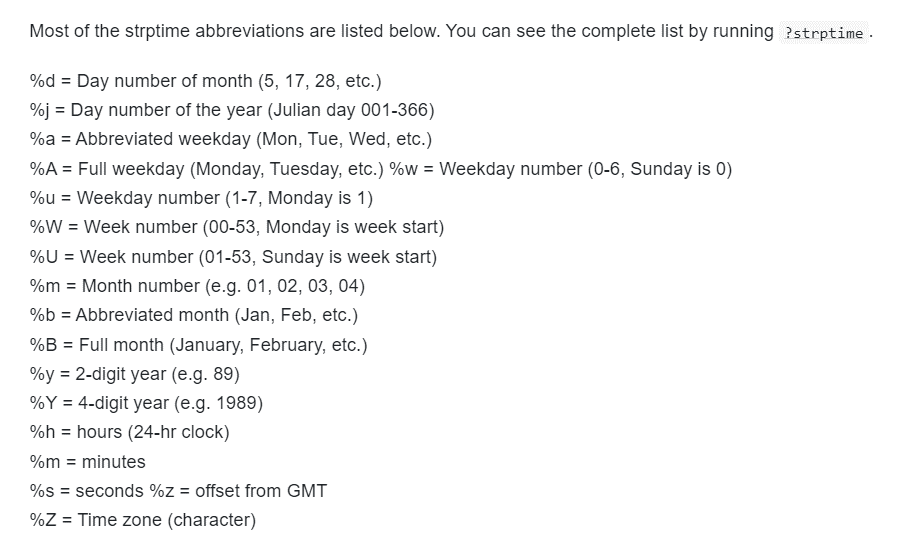

```{r, out.width = "100%", echo=FALSE, fig.align='center', message=FALSE, warning=FALSE}
library(dplyr)
library(ggplot2)
library(sf)
knitr::include_graphics("figures/tanzam_rainfall.png")
```

---


```{r, eval=FALSE}
library(dplyr)
library(ggplot2)
library(sf)
tz <- st_read(here::here("external/data/tanzania.geojson"))
sagcot <- st_read(here::here("external/data/sagcotcl.geojson"))
zambia <- st_read(
  system.file("extdata/districts.geojson", package = "geospaar")
) %>% st_union()
prec <- geodata::worldclim_global(var = "prec", res = 2.5, 
                                  path = "external/data/")
precsum <- terra::app(prec, sum)
tz_sagcot <- terra::vect(st_union(sagcot, zambia))
prec_tzzam <- terra::mask(terra::crop(precsum, tz_sagcot), tz_sagcot)

prec_stars <- stars::st_as_stars(prec_tzzam)
p <- ggplot() + 
  geom_sf(data = tz) +  
  stars::geom_stars(data = prec_stars) +
  scale_fill_viridis_c(name = "Rainfall (mm)", na.value = "transparent") + 
  geom_sf(data = zambia, fill = "transparent") +
  geom_sf(data = sagcot, fill = "transparent") +
  labs(x = NULL, y = NULL) +
  theme_linedraw()
ggsave(p, filename = "docs/figures/tanzam_rainfall.png", height = 4, 
       width = 7, units = "in", dpi = 300)  
```

---
## Reading and writing data

### File paths

Let's read in a csv a few different ways.

Full path - clear for you, bad for code sharing.

```{r}
data_tib <- read.csv(
  "/Users/lestes/Dropbox/teaching/geog246346/geospaar/inst/extdata/cdf_corn.csv"
)
str(data_tib)
```

---
```{r}
data_tib <- readr::read_csv(
  "/Users/lestes/Dropbox/teaching/geog246346/geospaar/inst/extdata/cdf_corn.csv"
)
str(data_tib)
```

---
## Working directory `"."`

- Working directory. Use `getwd()` (from console)  
- Usually set to project folder.  

```{r}
getwd() ## if in an RMD, this will show the folder of the RMD
```

Use `.` to start a file path from the working directory

```{r, eval = F}
list.files(".") ## 
```

```{r, eval = F}
data_tib <- readr::read_csv("./inst/extdata/cdf_corn.csv")
```

- Use ".." to go up one folder level
```{r, eval = F}
list.files(".") ## files in working directory
list.files("..") ## files in folder one level up
```
---
## User directory `"~"`

- Set by environment variable
- Use command below to see value

```{r}
path.expand("~")
```


```{r, eval = F}
data_tib <- readr::read_csv(
  "~/Dropbox/teaching/geog246346/geospaar/inst/extdata/cdf_corn.csv"
)
```

---
## Writing files

- Use `write.csv` or `readr::write_csv` to write

```{r, eval = FALSE}
readr::write_csv(data_tib, file = "temp.csv") ## by default writes to wd()
```

---
## Saving/loading files
- If you want to save an R object, like a `data.frame`, `tibble` etc.
- Use save, and `.rda` extension

```{r, eval = FALSE}
save(data_tib, file = "temp.rda") ## by default writes to wd()
```

```{r, eval = FALSE}
data_tib <- NULL
load(file = "temp.rda") ## loads file back to environment
```

---
## Dates with `lubridate`

- The main function you want to use is `as_date`, which can convert a character to date format. 

```{r, message = FALSE}
library(lubridate)
date1 <- as_date("2022-03-01") ## date in standard YYYY-MM-DD format
print(date1)
```
---
## Dates with `lubridate`

- More challenging with unclear date formats.

```{r}
date2 <- as_date("3/1/22") ## is month or date first?
date2
```

Include format as shown below. See [formats in this link](https://epirhandbook.com/en/working-with-dates.html)
```{r}
date2 <- as_date("3/1/22", format = "%m/%d/%y" )
date2
```

We can also write dates in desired format
```{r}
date2_char <- as.character(date2, format = "%A %B %d, %Y")
date2_char
```
---
## Date formats

```{r, out.width = "100%", echo=FALSE, fig.align='center'}

```
---
How can we read in this date?
```{r}
date3 <- as_date("Apr 3, 1999", format = "...")
date3
```
---

## Exercises

- Use `lapply` to make three `data.frame`s captured in a list `l`, each composed of one randomly sampled column `v1` (selecting from integers 1:10, with length = 20), and the second being `v2` composed of lowercase letters, randomly selected using `sample`, also of length 20.  
- The iterator in the `lapply` should be 10, 20, 30, which become the random seeds for the sampling (in the body of the `lapply`)
- After making `l`, use a `for` loop to iterate through each element of `l`, writing each out to a folder `external/data/` in your project. 
- Change the name of each as part of the iteration, so that `l[[1]]` is written out as `external/data/dataset1.csv`, etc. Hint: you can use `paste0` to make each file path and name.  
- After writing these out, use another `lapply` to read back in the three datasets into a new list `l2`.  Bonus: Use `dir` to programmatically read in the file paths from your `external/data` folder.  


