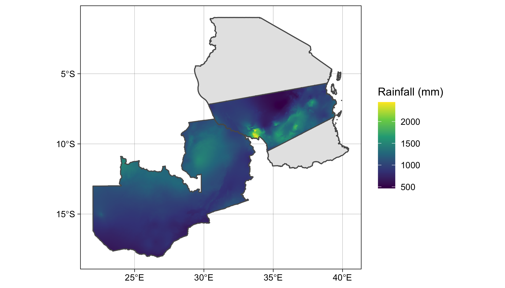

```{r, out.width = "100%", echo=FALSE, fig.align='center'}

```

---


```{r, eval=FALSE}
tz <- st_read(here::here("external/data/tanzania.geojson"))
sagcot <- st_read(here::here("external/data/sagcotcl.geojson"))
zambia <- st_read(
  system.file("extdata/districts.shp", package = "geospaar")
) %>% st_union()
prec <- raster::getData(name = "worldclim", var = "prec", res = 2.5)

precsum <- terra::app(terra::rast(prec), sum)
tz_sagcot <- terra::vect(st_union(sagcot, zambia))
prec_tzzam <- terra::mask(terra::crop(precsum, tz_sagcot), tz_sagcot)

prec_stars <- stars::st_as_stars(raster::raster(prec_tzzam))
p <- ggplot(zambia) + 
  geom_sf(data = tz) +  
  stars::geom_stars(data = prec_stars) +
  scale_fill_viridis_c(name = "Rainfall (mm)", na.value = "transparent") + 
  geom_sf(data = tz, fill = "transparent") +
  geom_sf(data = zambia, fill = "transparent") +
  geom_sf(data = sagcot, fill = "transparent") +
  labs(x = NULL, y = NULL) +
  theme_linedraw()
ggsave(p, filename = "docs/figures/tanzam_rainfall.png", height = 4, 
       width = 7, units = "in", dpi = 300)  
```


---
## Homework 
Plot values by groups, `ggplot` version

### Data
```{r, warning=FALSE, message=FALSE}
library(tidyverse)
set.seed(1)
price_weight_long <- tibble(
  year = 1951:2000, 
  price = runif(n = length(year), 20, 50),
  weight = (price * 10) * runif(n = length(year), 0.8, 1.2)
) %>% 
  pivot_longer(cols = price:weight, names_to = "element", values_to = "value")
price_weight_long
```
---
## The base way
```{r, out.width="60%", fig.align='center'}
plot(value ~ year, col = "red", pch = 16, 
     ylim = range(price_weight_long$value),
     data = price_weight_long[price_weight_long$element == "price", ])
points(value ~ year, col = "blue", pch = 16, 
       data = price_weight_long[price_weight_long$element == "weight", ])
```

---
## ggplot solution?

---
## New data
```{r}
library(tidyverse)
set.seed(1)
tb_df <- tibble(year = rep(1951:2000, 2), 
                group = rep(sample(letters[1:5], 50, replace = TRUE), 2), 
                value = runif(n = 100, min = 50, max = 100),
                element = c(rep("Price", 50), rep("Weight", 50)))
```

- Use `readr::write_csv` to write out `tb_df` to your `~/Desktop` to a csv file named `dummy_data2.csv`. 

---
## Data shaping

- Use `readr::read_csv` to read `dummy_data2.csv` into `tb_df`
- Determine the unique (distinct) values in the *group* and *element* columns
- Closely related example:

```{r}
price_weight_long %>% distinct(element)
```

---

- Spread `tb_df` so that "Price" and "Element" have their own columns
- `pivot_wider` is your friend

---

- Spread `tb_df` so that "Price" and "Element" have their own columns, but exclude the *group* variable
- Redo the `pivot_wider` that includes *group*, and then arrange by *group*
- Redo the `pivot_wider` that includes *group*, and then arrange by *group* and by *year*, with *year* in descending order
- Calculate a new column that describes the weight:price ratio

---
- Use `readr::read_csv` to read dummy_dataset.csv into `tb_df`
- Determine the unique (distinct) values in the *group* and *element* columns
- Spread `tb_df` so that "Price" and "Element" have their own columns
- Do the same as above, but exclude the *group* variable
- Redo the `pivot_wider` that includes *group*, and then arrange by *group*
- Redo the `pivot_wider` that includes *group*, and then arrange by *group* and by *year*, with *year* in descending order
- Redo the `pivot_wider` that includes *group*, and calculate a new column that describes the weight:price ratio (name it `wt_price`)
- Do the same as above, but calculate the average weight, price, and `wt_price` for each group

---

- A little extra
```{r, eval=FALSE}
tb_df %>% pivot_wider(names_from = element, values_from = value) %>% 
  arrange(group, desc(year)) %>%
  filter(group == "a") %>% mutate(wt_price = Weight / Price)

```

```{r, echo=FALSE}
# tb_df <- readr::read_csv(here::here("external/notebooks/data/dummy_data.csv"))
# tb_df %>% distinct(group, element)
# tb_df %>% pivot_wider(names_from = element, values_from = value)
# tb_df %>% select(-group) %>% 
#   pivot_wider(names_from = element, values_from = value)
# tb_df %>% 
#   pivot_wider(names_from = element, values_from = value) %>% 
#   arrange(group)
# tb_df %>% pivot_wider(names_from = element, values_from = value) %>% 
#   arrange(group, desc(year))
# tb_df %>% pivot_wider(names_from = element, values_from = value) %>%
#   mutate(wt_price = Weight / Price)
```

---
## Plotting

- Let's do a scatter plot, with Price on the x axis and weight on the y axis: both base and ggplot
- Let's plot a line graph of Price (y axis) against year (x axis): base and ggplot
- Calculate the mean Weight and Price by year, and plot as an XY scatter
- Plot Weight against Year as a line plot, with a separate series for each group
- Let's calculate a histogram of wt_price
- Do the same, but let's make a histogram for each group. 


---
## Practical
### Part 1
- read in the three `geospaar` FAO datasets into a list using `lapply`
- Reshape each of the three datasets by using `pivot_wider` to put harvested area into a new variable **harv_area** and production into **prod**, with the other variables being **crop**, **country**, and **year**. Necessary functions: `%>%`, `select`, `pivot_wider`, `rename`. 
- Combine all these into a single data.frame `crops_df`
- Best: the previous two points using `lapply` and `do.call(rbind)`
- Okay: Do this separately for each dataset and then combine with `rbind`


```{r, echo=FALSE, eval=FALSE}
library(geospaar)
fs <- dir(system.file("extdata/", package = "geospaar"), 
          pattern = "FAOSTAT", full.names = TRUE)
crops <- lapply(fs, readr::read_csv)
crops_df <- do.call(rbind, lapply(crops, function(x) {
  x %>% dplyr::select(Item, Area, Element, Year, Value) %>% 
    pivot_wider(names_from = Element, values_from = Value) %>% 
    rename(crop = Item, country = Area, year = Year, 
           harv_area = `Area harvested`, prod = Production)
}))
crops_df
```


---
### Part 2
- Create (`mutate`) a new column *yield*
- Calculate the mean of production & yield for each crop (`dplyr`)
- Calculate the mean of production & yield for each crop by country (`dplyr`)
- Advanced 1: do this with `sapply` as well as `dplyr`
- Advanced 2:`arrange` mean yield by *crop* and *country* in ascending order

```{r, echo=FALSE, eval=FALSE}
crops_df <- crops_df %>% mutate(yield = prod / harv_area)
crops_df %>% group_by(crop) %>% 
  summarize(prod = mean(prod), yield = mean(yield))
crops_df %>% group_by(crop) %>% select(prod, yield) %>% 
  summarize_all(funs(mean))

crops_df %>% group_by(crop, country) %>% select(prod, yield) %>% 
  summarize_all(funs(mean)) %>% ungroup %>% 
  arrange(crop, yield)

sapply(c("Maize", "Sorghum", "Wheat"), function(x) {
  c(mean(crops_df[crops_df$crop == x, ]$prod), 
    mean(crops_df[crops_df$crop == x, ]$yield))
})
sapply(c("Maize", "Sorghum", "Wheat"), function(x) {
  sapply(c("South Africa", "Zambia"), function(y) {
    c(mean(crops_df[crops_df$crop == x & crops_df$country == y, ]$prod), 
      mean(crops_df[crops_df$crop == x & crops_df$country == y, ]$yield))
  })
})
sapply(c("Maize", "Sorghum", "Wheat"), function(x) {
  sapply(c("South Africa", "Zambia"), function(y) {
    d <- crops_df[crops_df$crop == x & crops_df$country == y, ]
  })
})

```

---
### Part 3
- Using `ggplot2`, make a line plot of the annual maize production by country, using red for Zambia and blue for South Africa
- Using `ggplot2`, plot a histogram of maize yields for Zambia (blue fill, grey outline)
- Advanced 1: Do the same for yields, but with base plots
- Advanced 2: use `ggplot2` to make three side-by-side line plots of production for all three crops by country (red for Zambia, blue South Africa). Do the same but for yield. You need `facet_grid` for this. 
- Advanced 3: as above, but with histograms. Side by side histogram bars for each country (`position = "dodge"`)

```{r, echo = FALSE, eval=FALSE}
ggplot(crops_df) + # %>% #filter(crop == "Maize")) + 
  geom_line(aes(x = year, y = prod / harv_area, color = country)) + 
  facet_grid(cols = vars(crop)) +
  scale_color_manual(values = c("blue", "red"))
ggplot(crops_df %>% filter(crop == "Maize" & country == "Zambia")) + 
  geom_histogram(aes(x = prod), bins = 20, fill = "blue", col = "grey")

# advanced
plot(yield ~ year, 
     data = crops_df[crops_df$crop == "Maize" & 
                       crops_df$country == "South Africa", ], type = "l", 
     col = "blue", ylim = c(0, 7))
lines(yield ~ year, 
      data = crops_df[crops_df$crop == "Maize" & 
                        crops_df$country == "Zambia", ], col = "red")

ggplot(crops_df) + # %>% #filter(crop == "Maize")) + 
  geom_line(aes(x = year, y = prod / harv_area, color = country)) + 
  facet_grid(cols = vars(crop)) +
  scale_color_manual(values = c("blue", "red"))
ggplot(crops_df) + 
  geom_histogram(aes(x = prod / harv_area, fill = country), bins = 20,  
                 col = "grey", position = "dodge") + 
  scale_fill_manual(values = c("blue", "red")) + 
  facet_grid(cols = vars(crop)) + xlab("Yield (t / ha)") + 
  theme_bw()

```

