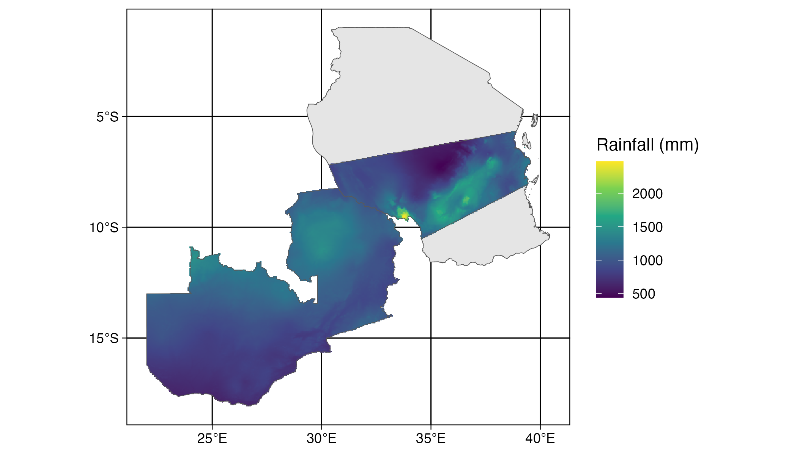

```{r, out.width = "100%", echo=FALSE, fig.align='center', message=FALSE, warning=FALSE}

library(dplyr)
library(ggplot2)
library(tidyr)
```

---


```{r, eval=FALSE}
tz <- st_read(here::here("external/data/tanzania.geojson"))
sagcot <- st_read(here::here("external/data/sagcotcl.geojson"))
zambia <- st_read(
  system.file("extdata/districts.shp", package = "geospaar")
) %>% st_union()
prec <- raster::getData(name = "worldclim", var = "prec", res = 2.5)

precsum <- terra::app(terra::rast(prec), sum)
tz_sagcot <- terra::vect(st_union(sagcot, zambia))
prec_tzzam <- terra::mask(terra::crop(precsum, tz_sagcot), tz_sagcot)

prec_stars <- stars::st_as_stars(raster::raster(prec_tzzam))
p <- ggplot() + 
  geom_sf(data = tz) +  
  stars::geom_stars(data = prec_stars) +
  scale_fill_viridis_c(name = "Rainfall (mm)", na.value = "transparent") + 
  geom_sf(data = zambia, fill = "transparent") +
  geom_sf(data = sagcot, fill = "transparent") +
  labs(x = NULL, y = NULL) +
  theme_linedraw()
ggsave(p, filename = "docs/figures/tanzam_rainfall.png", height = 4, 
       width = 7, units = "in", dpi = 300)  
```


---
# Today

- rbind, cbind, do.call
- summarise
- Plotting


---
## do.call, rbind, cbind
- `do.call` takes many inputs and applies a function to them successively.
- often used with `rbind` to combine tables by rows.

```{r, out.width = "30%"}
DF1 <- data.frame(v1 = 1:5, v2 = sample(1:100, 5))
DF2 <- data.frame(v1 = 6:10, v2 = sample(1:100, 5))
DF3 <- data.frame(v1 = 11:15, v2 = sample(1:100, 5))
DF_combined <- do.call('rbind', list(DF1, DF2, DF3)) ## combines DF1, DF2, DF3 by row
DF_combined
```

---
## summary()
- provides standard statistics for all columns
```{r, out.width = "30%"}
summary(DF_combined)
```

- select (subset) columns if needed
```{r, out.width = "30%"}
summary(DF_combined %>% select(v2))
```

---
## summarise_all()

- `summarise_all` is a dplyr method
- you can define which functions (i.e. statistics) to summarize
- put functions in a named list


```{r, out.width = "30%"}
q10 <- function(x) quantile(x, 0.10) # find 10th percentile
q90 <- function(x) quantile(x, 0.90) # find 90th percentile
DF_combined %>% summarise_all(list("median "= median, 
                                   "10th percentile" = q10,
                                   "90th percentile"= q90))
```


---

## Plotting
- Graphics (Base R) vs ggplot (dplyr)
- With `graphics`, you can directly map vectors

```{r,  out.width = "30%"}
set.seed(1)
a <- sample(1:100, 20) ## sample of size 20
b <- 1:20 
graphics::plot(a, b) ## pass an x and y vector 
```

---

## Plotting
- Graphics (Base R) vs ggplot (dplyr)
- With `ggplot2`, you must first put vectors in a dataframe/tibble

```{r, out.width = "30%"}
library(ggplot2)
set.seed(1)

a <- sample(1:100, 20) ## sample of size 20
DF <- data.frame(index = 1:20, value = a)

ggplot(DF) +
  geom_point(aes(x = index, y = value), col = 'red')


```


---
## Whittier Farms data
- Three ground sensors at sites called "down", "mid", "up"
- 4 years of data: 2018-2021

```{r, out.width = "30%"}
knitr::include_graphics("figures/whittier_pod_locations.png")
```

---
## Load Whittier data
```{r, out.width = "30%"}
folder_path <- "../inst/extdata/"
files <- list.files(folder_path, pattern = "whittier")
for(file in files){
  load(paste0(folder_path, file))
}

up_data <- whittier_up_d_h %>% select(date, 
                           lat, 
                           long,
                           device,
                           ndvi_hourly, 
                           gcvi_hourly, 
                           savi_hourly ,
                           evi2_hourly)

mid_data <- whittier_mid_d_h %>% select(date, 
                           lat, 
                           long,
                           device,
                           ndvi_hourly, 
                           gcvi_hourly, 
                           savi_hourly ,
                           evi2_hourly)

down_data <- whittier_down_d_h %>% select(date, 
                           lat, 
                           long,
                           device,
                           ndvi_hourly, 
                           gcvi_hourly, 
                           savi_hourly ,
                           evi2_hourly)
```


---
## ggplot syntax
- `ggplot()` command sets defaults
- `aes()` sets aesthetics, based on column names
- `+` combines components

```{r, out.width = "30%"}
ggplot(data = up_data) +
  geom_point(aes(x = date, y = ndvi_hourly), col = 'red')
```

---
## ggplot syntax
- you can override default set in `ggplot()`
- we add a second `geom_point` component, which uses a different table

```{r, out.width = "30%"}
ggplot(data = up_data) +
  geom_point(aes(x = date, y = ndvi_hourly), col = 'red') +
  geom_point(data = mid_data,
             aes(x = date, y = ndvi_hourly), col = 'blue') 

```

---
## ggplot syntax (exercise)
- add a third set of points for 'down' site, in green.
- change y-variable to 'gcvi_hourly'

```{r, out.width = "30%"}
ggplot(data = up_data) +
  geom_point(aes(x = date, y = gcvi_hourly), col = 'red') +
  geom_point(data = mid_data,
             aes(x = date, y = gcvi_hourly), col = 'blue') +
  geom_point(data = down_data,
             aes(x = date, y = gcvi_hourly), col ='green') 


```

---
## ggplot syntax
- `aes()` is used when you want an aesthetic to vary by column
  - x, y aesthetics used for position (always in `aes()`)
  - alpha, size, col can be used inside `aes()` if you want them to vary

Adjust size outside `aes()` to have constant size (hard-code)
```{r, out.width = "30%"}
ggplot(data = up_data) +
  geom_point(aes(x = date, y = ndvi_hourly), col = 'red', size = 5) 
```

---
## ggplot syntax

Adjust size inside `aes()` to have it vary based on column. 

Here size varies based on date.

```{r, out.width = "30%"}
ggplot(data = up_data) +
  geom_point(aes(x = date, y = ndvi_hourly, size = date), col = 'red') 
```

---
## ggplot syntax (exercise)

- Q1: What would happen if we used `size = ndvi` within `aes()`?

```{r, eval = F}
ggplot(data = up_data) +
  geom_point(aes(x = date, y = ndvi_hourly, size = ndvi_hourly), col = 'red')  
```

---
## ggplot syntax (exercise)

- Q2: Use `desc` to make size decrease with time 

```{r, eval = F}
ggplot(data = up_data) +
  geom_point(aes(x = date, y = ndvi_hourly, col = date)) 
```

---
## ggplot syntax (exercise)

- other plot components

```{r, eval = F}
ggplot(data = up_data) +
  geom_point(aes(x = date, y = ndvi_hourly), col = 'red') + 
  xlim(as_date("2020-06-01"), as_date("2020-09-01")) +
  ylim(0.5, 0.9) +
  xlab("Observation date") + 
  ylab("Measured ndvi") +
  ggtitle("2020 upslope") +
  theme_bw()
```


---
## Line plot (two vars.)
- NDVI comparison, all three sites

```{r, out.width = "30%"}
ggplot() +
  geom_line(data = up_data, aes(x = date, y = ndvi_hourly), col = 'red') +
  geom_line(data = mid_data, aes(x = date, y = ndvi_hourly), col = 'blue') +
  geom_line(data = down_data, aes(x = date, y = ndvi_hourly), col = 'green')

```
---
## Line plots (exercise)
- Modify code to focus only on year 2020, and compare gcvi_hourly


```{r, out.width = "30%"}
library(lubridate)
ggplot() +
  geom_line(data = up_data %>% 
              filter(date >= as_date("2020-06-01")) %>% 
              filter(date <= as_date("2020-09-30")),
            aes(x = date, y = gcvi_hourly), col = 'red') +
  geom_line(data = mid_data %>% 
              filter(date >= as_date("2020-06-01")) %>% 
              filter(date <= as_date("2020-09-30")),
            aes(x = date, y = gcvi_hourly), col = 'blue') +
  geom_line(data = down_data %>% 
              filter(date >= as_date("2020-06-01")) %>% 
              filter(date <= as_date("2020-09-30")),
            aes(x = date, y = gcvi_hourly), col = 'green')

```


---
## Color by group (exercise)
- Ideally all data should be in a single data.frame/tibble
- Let's add a variable `site_name`, and then combine using `rbind`

```{r, out.width = "30%"}
## add site_name column
up_data$site_name <- "up"
mid_data$site_name <- "mid"
down_data$site_name <- "down"

## combine using rbind

all_sites_data <- do.call('rbind', list(up_data, mid_data, down_data))

```

---
## Color by group (exercise)
- How can we create ggplot where color varies based on column "site_name"?
```{r, out.width = "30%"}
ggplot(all_sites_data) + 
  geom_point(aes(x = date, y = ndvi_hourly, col = site_name)) 
```

---
## Color by group (exercise)
- ggplot specifies the colors
- we can specify colors, but this is more complicated (next class)
```{r, out.width = "30%"}
ggplot(all_sites_data) + 
  geom_point(aes(x = date, y = ndvi_hourly, col = site_name)) 
```


---
## Scatter plot (two vars.)
- compare ndvi_hourly and gcvi_hourly of upslope  2018

```{r, out.width = "30%"}
library(lubridate)
ggplot(data = up_data %>% filter(date <= as_date("2018-12-31"))) +
  geom_point( aes(x = ndvi_hourly, y = gcvi_hourly), col = 'red') 
```

---
## Scatter plot (exercise)
- Create plot comparing ndvi_hourly in 2020 for midslope and upslope pod
```{r, out.width = "30%"}

```


---
## Adding a curve fit line
- NDVI vs GCVI, upslope
```{r, out.width = "30%"}
ggplot(data = up_data %>% filter(date <= as_date("2018-12-31")),
       aes(x = ndvi_hourly, y = gcvi_hourly)) +
  geom_point(col = 'red') +
  geom_smooth(col = 'green')
```

---
## Adding a trend fit line
- NDVI vs GCVI, upslope
```{r, out.width = "30%"}
ggplot(data = up_data %>% filter(date <= as_date("2018-12-31")),
       aes(x = ndvi_hourly, y = gcvi_hourly)) +
  geom_point(col = 'red') +
  geom_smooth(col = 'green', method = 'lm', se = F)
```

---
## Histogram (one var.)
NDVI histogram by site
```{r, out.width = "30%"}
ggplot(data = up_data %>% filter(date <= as_date("2018-12-31"))) +
  geom_histogram(aes(x = ndvi_hourly), bins =10) 
```

---
## Box plot (one var.)
NDVI boxplot by site
```{r, out.width = "30%"}
ggplot(data = up_data %>% filter(date <= as_date("2018-12-31"))) +
  geom_boxplot(aes(y = ndvi_hourly)) 
```

---
## Combine data in same plot (Base R)
- create initial plot using `plot()`
- add additional values using `points()` or `lines()`
```{r, out.width = "30%"}
plot(up_data$date, up_data$ndvi_hourly, col = 'red')

points(mid_data$date, mid_data$gcvi_hourly, col = 'blue')
```


---
## Combine data in same plot (ggplot2)
```{r, out.width = "30%"}
ggplot(up_data) + 
  geom_point(aes(x = date, y = ndvi_hourly), col = 'red') +
  geom_point(data = mid_data, aes(x = date, y = ndvi_hourly), col = 'blue') 
```


---
## Combine multiple plots 
- use `facet_grid()` in ggplot
- `facet_grid()` uses column name ('year') to separate plots

```{r, out.width = "30%"}
all_sites_data$year <- lubridate::year(all_sites_data$date)

all_sites_data %>% 
  ggplot(.) + geom_point(aes(x = date, y = ndvi_hourly, color = site_name)) +
  facet_grid(cols = vars(year)) +
  scale_color_manual(values = c("red", "blue", "green")) + 
  ylab("ndvi") + xlab("date")
#> `geom_smooth()` using method = 'loess' and formula = 'y ~ x'
```

---
## Combine multiple plots
- save each plot in a variable
- use `plot_grid()` to combine


```{r, out.width = "30%"}
library(cowplot)
plot_2020 <-  ggplot((all_sites_data %>% filter(year == 2020))) + geom_point(aes(x = date, y = ndvi_hourly, color = site_name)) +
  scale_color_manual(values = c("red", "blue", "green")) + 
  ylab("ndvi") + xlab("date") + 
  ggtitle("2020")

plot_2019 <- ggplot((all_sites_data %>% filter(year == 2019)) ) + geom_point(aes(x = date, y = ndvi_hourly, color = site_name)) +
  scale_color_manual(values = c("red", "blue", "green")) + 
  ylab("ndvi") + xlab("date") +
  ggtitle("2019")
```

---
## Combine multiple plots
```{r, out.width= "30%"}

cowplot::plot_grid(plot_2019, plot_2020,
                   nrow = 2,
                   align = "vh",
                   axis = "l")
```

---
## Common ggplot options
- `+ xlim()`, `+ ylim()` : axis bounds
- `+ xlab()`, `+ ylab()` : axis titles
- `+ ggtitle()` : title
- `+ theme_bw()`: add minimalist theme
- and many more!


---
## Legends are a pain
- We'll discuss Monday


---
## ggplot links
- [ggplot cheatsheet](https://www.maths.usyd.edu.au/u/UG/SM/STAT3022/r/current/Misc/data-visualization-2.1.pdf)
- [epidemiologist handbook](https://epirhandbook.com/en/ggplot-basics.html#plot-categorical-data)
- [reference](https://ggplot2.tidyverse.org/reference/#plot-basics)


---
## Homework
- Read `ggplot` from [Epidemiologist handbook](https://epirhandbook.com/en/ggplot-basics.html#plot-categorical-data) (Chap 30)
- Read about [plot_grid](https://wilkelab.org/cowplot/articles/plot_grid.html)
- Read Unit 2 Module 1, parts 1-3
- Unit 1 Module 4 assignment due next Tuesday (Feb 28)


<!-- --- -->
<!-- ## Plotting -->

<!-- - Let's do a scatter plot, with Price on the x axis and weight on the y axis -->

<!-- ```{r, out.width = "60%", echo=FALSE, fig.align='center'} -->
<!-- tb_df %>%  -->
<!--   pivot_wider(names_from = element, values_from = value) %>%   -->
<!--   mutate(wt_price = Weight / Price) %>%  -->
<!--   ggplot() + geom_point(aes(x = Price, y = Weight)) -->
<!-- ``` -->

<!-- --- -->
<!-- - Let's plot a line graph of Price (y axis) against year (x axis) -->

<!-- ```{r, out.width = "70%", echo=FALSE, fig.align='center'} -->
<!-- tb_df %>%  -->
<!--   pivot_wider(names_from = element, values_from = value) %>%   -->
<!--   mutate(wt_price = Weight / Price) %>%  -->
<!--   ggplot() + geom_line(aes(x = year, y = Price)) -->
<!-- ``` -->

<!-- --- -->
<!-- - Calculate the mean Weight and Price by year, and plot as an XY scatter -->

<!-- ```{r, out.width = "70%", echo=FALSE, fig.align='center'} -->
<!-- tb_df %>%  -->
<!--   pivot_wider(names_from = element, values_from = value) %>%   -->
<!--   group_by(year) %>% select(-group) %>%  -->
<!--   summarize_all(list(mean)) %>%  -->
<!--   ggplot() + geom_point(aes(x = Weight, y = Price)) -->
<!-- ``` -->
<!-- --- -->
<!-- - Plot Weight against Year as a line plot, with a separate series for each group -->
<!-- ```{r, out.width = "70%", echo=FALSE, fig.align='center'} -->
<!-- tb_df %>%  -->
<!--   pivot_wider(names_from = element, values_from = value) %>%   -->
<!--   ggplot() + geom_line(aes(x = year, y = Weight, color = group)) -->
<!-- ``` -->
<!-- --- -->
<!-- - Let's calculate a histogram of wt_price -->
<!-- ```{r, out.width = "70%", echo=FALSE, fig.align='center'} -->
<!-- tb_df %>%  -->
<!--   pivot_wider(names_from = element, values_from = value) %>%   -->
<!--   mutate(wt_price = Weight / Price) %>%  -->
<!--   ggplot() +  -->
<!--   geom_histogram(aes(x = wt_price), color = "black", fill = "blue", bins = 20) -->
<!-- ``` -->
<!-- --- -->
<!-- - Do the same, but let's make a histogram for each group.  -->
<!-- ```{r, out.width = "70%", echo=FALSE, fig.align='center'} -->
<!-- tb_df %>%  -->
<!--   pivot_wider(names_from = element, values_from = value) %>%   -->
<!--   mutate(wt_price = Weight / Price) %>%  -->
<!--   ggplot() +  -->
<!--   geom_histogram(aes(x = wt_price), color = "black", fill = "blue", bins = 20) + -->
<!--   facet_wrap(facets = ~group) -->
<!-- ``` -->


