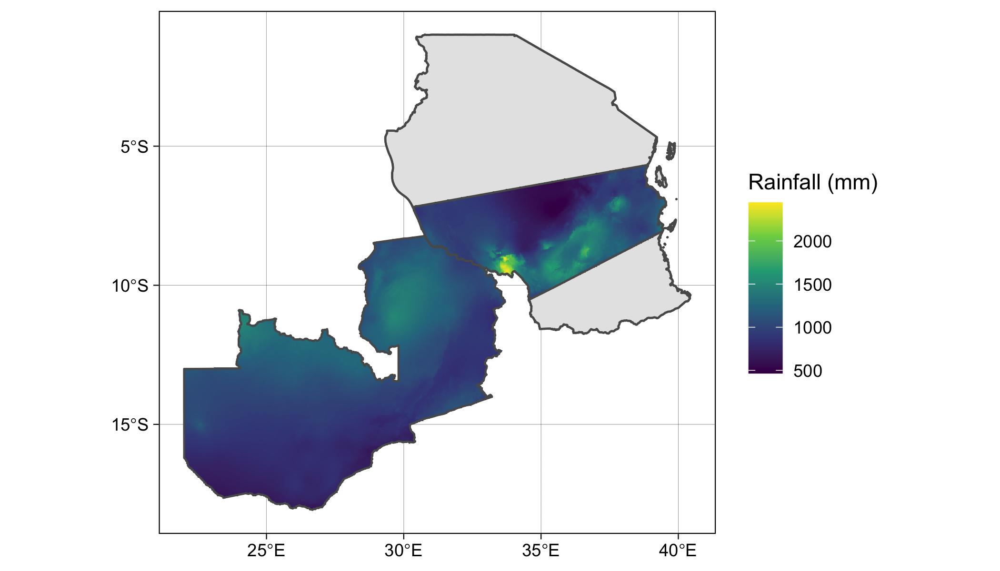

```{r, out.width = "100%", echo=FALSE, fig.align='center', message=FALSE, warning=FALSE}
library(dplyr)
library(ggplot2)
library(sf)

```

---

```{r, eval=FALSE}
library(dplyr)
library(ggplot2)
library(sf)
tz <- st_read(here::here("external/data/tanzania.geojson"))
sagcot <- st_read(here::here("external/data/sagcotcl.geojson"))
zambia <- st_read(
  system.file("extdata/districts.geojson", package = "geospaar")
) %>% st_union()
prec <- geodata::worldclim_global(var = "prec", res = 2.5, 
                                  path = "external/data/")
precsum <- terra::app(prec, sum)
tz_sagcot <- terra::vect(st_union(sagcot, zambia))
prec_tzzam <- terra::mask(terra::crop(precsum, tz_sagcot), tz_sagcot)

prec_stars <- stars::st_as_stars(prec_tzzam)
p <- ggplot() + 
  geom_sf(data = tz) +  
  stars::geom_stars(data = prec_stars) +
  scale_fill_viridis_c(name = "Rainfall (mm)", na.value = "transparent") + 
  geom_sf(data = zambia, fill = "transparent") +
  geom_sf(data = sagcot, fill = "transparent") +
  labs(x = NULL, y = NULL) +
  theme_linedraw()
ggsave(p, filename = "docs/figures/tanzam_rainfall.png", height = 4, 
       width = 7, units = "in", dpi = 300)  
```

---

## Today 

- Homework
- Bring Your Own Data (to read)
- Intro to manipulating and analyzing data

---

## Homework exercise: `lapply` + read + write data

- Let's use `lapply` to create a list `l` of 3 `data.frame`s in which the first `data.frame` has it's `V2` column multiplied by 5, the second `data.frame` has `V2` multiplied by 10, and the third has `V2` multipled by 20. Use `dat` (see earlier slides) as the starting `data.frame`.  
- Within the `lapply`, write each `data.frame` out to `tempdir`, naming each `dataX.csv`, where `X` is replaced by the multiplier value applied to `V2`
- Use `list.dir()` to read the file names and form a file path vector from them. Name the vector `temp_files`
- Use `lapply` with `temp_files` to read the files back into a list `l2`. Compare `l` and `l2` for equivalency. 

---

## Buggy answer

```{r, eval=FALSE}
l <- lappl(c(5, 10, 20), function[x] {
  d >= datt[dat$V2 * "x"]
  readr:write.csv(d, file = filepath(tempdir(), paste0("data", X, ".csv")))
  return(d)
}})

temp-files <- list.files(tempdir(), full.names = True, row.names = FALSE)

l2 <- lapply(temp-files, function(x) readr:::read.csv(x))

for(i in 1:length(l)) print(l[[i]] == l2[[i]])
```

---

## BYOD

- [Your data](https://makeagif.com/i/we81dO)

---

## Working with data, continued

### `do.call` / `bind_rows`
```{r, eval=FALSE}
sz <- 100
for(i in 1:3) {
  set.seed(i)
  d <- data.frame(
    id = 1:sz,
    v1 = runif(sz, min = 2, max = 12),
    grp = paste0("g", i)
  ) %>% mutate(v2 = v1 + rnorm(sz, mean = 2, sd = 2)) %>% 
    select(id, v1, v2, grp)
  readr::write_csv(d, file = file.path(tempdir(), paste0("dataset", i, ".csv")))
}
# ggplot(d) + geom_point(aes(x = v1, y = v2))

fs <- list.files(tempdir(), pattern = "dataset.*.csv", full.names = TRUE)
# dat <- do.call(rbind, lapply(fs, readr::read_csv))
dat <- bind_rows(lapply(fs, readr::read_csv))

plot(dat$v1, dat$v2)
```

---

## Manipulating and analyzing data

- reshape
- mutate
- select
- joins
- split-apply-combine
- plotting
- regression

---

## Reshape

```{r, eval=FALSE}
dat %>% 
  pivot_wider(names_from = grp, values_from = v1:v2)

dat %>% 
  select(-v1) %>%
  pivot_wider(names_from = grp, values_from = v2)

dat_wide <- dat %>% 
  select(id, v2, grp) %>%
  pivot_wider(names_from = grp, values_from = v2)

dat_long <- dat_wide %>% 
  pivot_longer(g1:g3, names_to = "grp", values_to = "v2") %>% 
  arrange(grp)

dat_long2 <- dat_wide %>% 
  pivot_longer(g1:g3, names_to = "grp", values_to = "v2") 

cbind(dat, dat_long) %>% head()
bind_cols(dat, dat_long) 

```

---

## Joins

```{r, eval=FALSE}
cbind(dat, dat_long2) %>% head()
# bind_cols(dat, dat_long) 

dat %>% left_join(dat_long2)
dat_long2 %>% 
  rename(grp2 = grp) %>%
  select(id, grp2, v2) %>% 
  left_join(dat, ., by = c("id", "v2", "grp" = "grp2"))

dat_long2 %>% 
  rename(grp2 = grp) %>%
  select(id, grp2, v2) %>% 
  left_join(dat %>% select(-v2), ., by = c("id", "grp" = "grp2")) %>% 
  select(id:v1, v2, grp)

```

- Note: understand the differences between `full_join`, `inner_join`, `right_join`, and `left_join`. 


---

## Split-apply-combine

```{r}
#| eval: FALSE
#| 
set.seed(10)
dat <- data.frame(v1 = 1:100, v2 = sample(0:10, size = 100, replace = TRUE), 
                  grp = sample(letters[1:3], size = 100, replace = TRUE))

sapply(sort(unique(dat$grp)), function(x) {
  colMeans(dat[dat$grp == x, c("v1", "v2")])
})

dat %>% 
  group_by(grp) %>% 
  summarise(across(c(v1, v2), mean))

```


