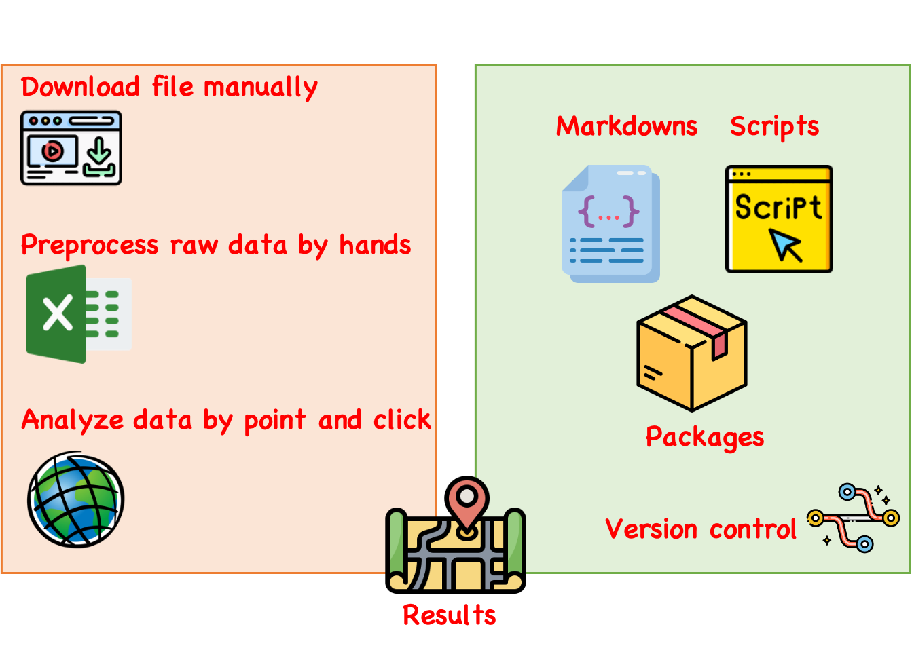

```{r setup, include=FALSE}
# knitr::opts_chunk$set(echo = FALSE)
```

## Reproducibility

```{r, echo=FALSE, fig.align='center'}

```

---

## Reproducible research

- Use version control.
- Don't do things manually and teach the machine to do everything. 
  - Let machine figure out number of row, col, or length programmatically. 
  - Don't edit raw file manually.
- Use functions, scripts, markdowns and packages.
  - Do not save outputs usually, but use data + code.
  - Here is an exception for us: if your data is huge, you could save out some necessary outputs to save time for the package to build.
- Comment your code properly.
- Set seed for random functions
- Avoid using full path. Easiest way is to use package `here` to deal with paths.
- Keep track of software environment. `sessionInfo()`

---

## Git commands

- Initialize an empty Git repo

  `git init`

- Download a repository from GitHub to local freshly
  
  `git clone repo_url`
  
- Pull changes from remote to local on the same branch

  `git pull`

- Upload changes to remote

  `git push` or `git push origin branch_name`

---

## Git commands

- Check current branch

  `git branch`
  
- Create new branch

  `git branch new_branch_name`
  
- Switch branch

  `git checkout branch_name`

---

## Git commands

- Check the current state of the repo since last commit

  ```
  git status
  ```

- Stage and commit changes

  ```
  git add . # stage all changes
  git add file_path # stage a specific file
  git commit -m 'Commit message' # commit the staged changes
  ```
- Shortcut of doing both together
  ```
  git commit -am "Commit message"
  ```
  
- Unstage a staged file

  ```
  git checkout file_name
  ```
  
---

## Git commands

- Merge changes from other branch

  `git merge origin branch_name`
  
- Pick up one file from another branch

  `git checkout branch_name file_name`

---

## Git commands

- Rename a branch locally and remotely

  ```
  git branch -m new_name
  git push origin -u new_name
  git push origin --delete old_name
  ```

- Delete a branch

  ```
  git branch -d branch_name
  git push origin --delete branch_name
  ```

`M` and `D` can be used to force the process.

---

## Practice on GitHub

Let's work on the same repo together now.

- Clone the repo to your local machine.
- Create a new branch based on the objective
- Open the file `teamwork.Rmd` to add your code.
- Stage and commit your work on this branch.
- Switch branch to main branch and pull the possible new changes.
- Merge changes from your created branch to main branch.
- Push the updated main branch to remote.

---

## Homework

- Assignment 5 is due this Friday
- Final project!! ([Form](https://clarkuedu-my.sharepoint.com/:x:/g/personal/pdelpinomarimon_clarku_edu/Eb0n9lzp98JMqiqG9M_EZL4B-5wIHoGM1fV4HnjJtrVxlQ?e=iwZV2D))

---

## Next class

- Look at a project template together to learn what you are expected to have in your repo.
- Some strategies, e.g. deal with huge files, or use raw dataset.
- Timeline and arrangement of the rest classes.
