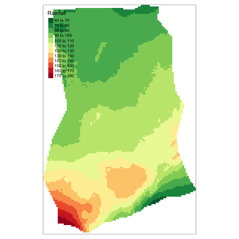

```{r setup, include=FALSE}
# knitr::opts_chunk$set(echo = FALSE)
```

## Project

Requirements:

- Assignment 6 (project proposal): section 3 assessment in https://agroimpacts.github.io/geospaar/projects.html#assignment
- Project (presentation and report): section 1.3 and 1.4 in https://agroimpacts.github.io/geospaar/assessment.html

Milestones:

- We do presentation in this room on May 26, 2021.
- Final repo should be submitted on or before midnight on May 31, 2021.

---

## Strategies

Huge files

- Avoid store the files as much as possible. E.g. use code to download directly.
- Let git ignore big files: list file path into `.gitignore` file. If you accidentally add file into Git already, do the following to remove it from git track first and then add to `.gitignore`.

  `git rm --cache file_path`

---

## Strategies

If it takes too long to run the code on fly, we could cheat a bit. Save out necessary outputs and load results back. E.g.
  
  - Assume you have a code chunk, set `eval = F` for this chunk to generate result ahead and just show the code in markdown.
    ```
    do something here
    obj <- ...
    save(obj, file = 'file_path.rda')
    ```
  - Then add another chunk, set `echo = F` for this chunk to just read the file and not show the code in markdown.
    ```
    load('file_path.rda')
    ```
---

## Strategies

Sometimes, the results are still huge that exceed the file limitation of GitHub. Then we could directly generate result figures and just show the figures in markdown. E.g.

```{r, eval = F, warning = F, message = F}
library(raster)
library(tmap)
library(dplyr)
library(here)
library(rnaturalearth)
gha <- ne_countries(continent = 'africa', returnclass = 'sf') %>%
  filter(name == 'Ghana')
rainfall <- getData(name = 'worldclim', var = 'prec', res = 2.5) %>% 
  calc(., mean)
rainfall <- mask(crop(rainfall, gha), gha)

png(here('docs/figures/rainfall.png'))
tm_shape(rainfall) + 
  tm_raster(title = 'Rainfall',
            breaks = seq(60, 180, 10),
            palette = "-RdYlGn", 
            n = length(seq(60, 180, 10)))
dev.off()
```

---

```{r, out.width = "50%", fig.align='center', message=F, warning=F}
# set echo=FALSE for this chunk
# include_graphics does not like here.

```

---

## Strategies

More functions to save out figures. E.g.

- `tmap_save` for `tmap`
- `ggsave` for `ggplot2`

---

## Class arrangement

- Monday: a time to have a weekly report group by group
- Wednesday: a time of discussion and question
- Office hours and labs: help sections
- We could schedule meetings beyond class time if necessary

---

## Homework

- Assignment 6 is due this Friday. More details on section 3 Assignment in [Semester Projects](https://agroimpacts.github.io/geospaar/projects.html).

