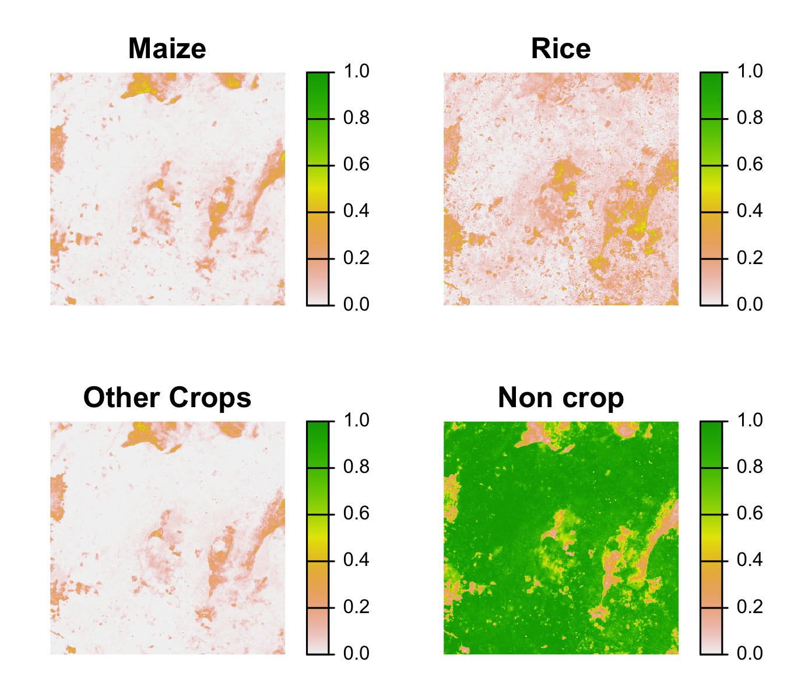

## Today

- Modeling review (random forest)
- Project update


---
## Modelling demo
### Random Forests
```{r, eval=FALSE}
# Train model
library(caTools)
library(randomForest)
library(geospaar)

# read in train set
train_ref <- system.file("extdata/train_reference.csv", 
                         package = "geospaar") %>% 
  read_csv()  %>% mutate(crop = factor(case_when(
  class == "Maize" ~ 1,
  class == "Rice" ~ 2,
  class == "Other" ~ 3,
  class == "noncrop" ~ 4
))) %>% dplyr::select(id, class, crop, !!names(.))
```

---
### Model 

```{r, eval=FALSE}
# prepare dataset
dset <- train_ref %>% filter(type == "mean") %>%
  select(-id, -class, -type, -seed)
set.seed(10)
samp <- sample.split(dset$crop, SplitRatio = 0.8)
train <- subset(dset, samp == TRUE)
test <- subset(dset, samp == FALSE)
# train %>% tidyr::drop_na()

# fit model
set.seed(123)
mod <- randomForest(crop ~ ., data = train, ntree = 1000,
                    importance = TRUE)
mod
summary(mod)

# Evaluation
pred <- predict(mod, newdata = test %>% dplyr::select(-c(crop)))
cm <- table(test$crop, pred)
# sum(diag(cm)) / sum(cm)

rf_results <- list("train" = train, "test" = test, "mod" = mod, "pred" = pred,
                   "error_mat" = cm)
```

---
```{r, eval=FALSE}
imptab <- mod$importance
nms <- rownames(imptab)
imp_tbl <- as_tibble(imptab) %>% 
  mutate(Variable = nms) %>% 
  dplyr::select(Variable, MeanDecreaseAccuracy) %>% 
  arrange(MeanDecreaseAccuracy) %>% 
  mutate(order = 1:n()) %>% 
  mutate(Variable = gsub("\\.", "_", Variable))

p <- ggplot(imp_tbl) + 
  geom_point(aes(MeanDecreaseAccuracy, factor(order))) + 
  scale_y_discrete(labels = toupper(imp_tbl$Variable)) + 
  ylab("Variable") + xlab("Mean Decrease in Accuracy") + 
  theme_linedraw() + 
  theme(axis.text = element_text(size = 7), 
        axis.title = element_text(size = 7))
p
```

---

```{r, eval=FALSE, echo=FALSE}
pred_stack <- "../external/data/rststack_1016-1063.tif"
r <- terra::rast(pred_stack)
r <- terra::crop(r, terra::ext(r) * 0.2)
writeRaster(r, "external/data/rststack_1016-1063_crop.tif")
```


# Map

Look at Rmd file to see code use to make prediction map for crop types. 
```{r, eval=FALSE, echo=FALSE}
r <- terra::rast("external/data/rststack_1016-1063_crop.tif")

# pred_stack
predvars <- rownames(mod$importance)
# pred_stack <- "external/data/rststack_1016-1063.tif"
rtemp <- r[[1]]
v <- values(r)
v_tb <- as_tibble(v) %>% 
  mutate(
    ndvi_1 = (B8_1 - B4_1) / (B8_1 + B4_1),
    ndvi_2 = (B8_2 - B4_2) / (B8_2 + B4_2),
    rg1_ndvi_1 = (B8_1 - B5_1) / (B8_1 + B5_1),
    rg1_ndvi_2 = (B8_2 - B5_2) / (B8_2 + B5_2),
    rg2_ndvi_1 = (B8_1 - B6_1) / (B8_1 + B6_1),
    rg2_ndvi_2 = (B8_2 - B6_2) / (B8_2 + B6_2),
    
    gcvi_1 = (B8_1 / (B3_1 + 0.00001)) - 1,
    gcvi_2 = (B8_2 / (B3_2 + 0.00001)) - 1,
    rg1_gcvi_1 = (B8_1 / (B5_1 + 0.00001)) - 1,
    rg1_gcvi_2 = (B8_2 / (B5_2 + 0.00001)) - 1,
    rg2_gcvi_1 = (B8_1 / (B6_1 + 0.00001)) - 1,
    rg2_gcvi_2 = (B8_2 / (B6_2 + 0.00001)) - 1,
    
    mtci_1 = (B8_1 - B5_1) / (B5_1 - B4_1 + 0.00001),
    mtci_2 = (B8_2 - B5_2) / (B5_2 - B4_2 + 0.00001),
    mtci2_1 = (B6_1 - B5_1) / (B5_1 - B4_1 + 0.00001),
    mtci2_2 = (B6_2 - B5_2) / (B5_2 - B4_2 + 0.00001),
    
    reip_1 = 700 + 40 * ((B4_1 + B7_1) / 2 - B5_1) / (B7_1 - B5_1),
    reip_2 = 700 + 40 * ((B4_2 + B7_2) / 2 - B5_2) / (B7_2 - B5_2),
    
    nbr1_1 = (B8_1 - B11_1) / (B8_1 + B11_1),
    nbr1_2 = (B8_2 - B11_2) / (B8_2 + B11_2),
    nbr2_1 = (B8_1 - B12_1) / (B8_1 + B12_1),
    nbr2_2 = (B8_2 - B12_2) / (B8_2 + B12_2),
    
    ndti_1 = (B11_1 - B12_1) / (B11_1 + B12_1),
    ndti_2 = (B11_2 - B12_2) / (B11_2 + B12_2),
    
    crc_1 = (B11_1 - B3_1) / (B11_1 + B3_1),
    crc_2 = (B11_2 - B3_2) / (B11_2 + B3_2),
    
    sti_1 = B11_1 / (B12_1 + 0.00001),
    sti_2 = B11_2 / (B12_2 + 0.00001)
  ) %>% dplyr::select(all_of(predvars))

# clean up NA and Inf
v_tb <- v_tb %>% 
  mutate_all(function(x) ifelse(is.infinite(x), NA, x)) %>% 
  mutate_at(vars(predvars), zoo::na.aggregate)  # replace NA with mean

# predict probabilities of each class
pred <- predict(mod, v_tb, type = "prob")

# create probability stack
pred_stack <- do.call(c, lapply(1:ncol(pred), function(y) {
  predr <- rtemp
  values(predr) <- pred[, y]
  predr
}))
names(pred_stack) <- c("Maize", "Rice", "Other Crops", "Non crop")

png(filename = here::here("docs/figures/crop_probs.png"), width = 4.5, 
    height = 4, units = "in", res = 300)
terra::plot(pred_stack, axes = FALSE, range = c(0, 1), plg = list(inset = -1))
dev.off()

```

```{r, echo=FALSE, out.width="60%", fig.align='center'}

```

## Advanced - parallelization
```{r, eval=FALSE}
library(parallel)
# detectCores()
# cross-platform
cl <- makeCluster(4)
clusterEvalQ(cl, library(raster))
system.time(b <- parLapply(cl, 1:2000, function(x) {  # x <- 1
  r <- raster(extent(30, 31, -14, -13), res = 0.01, 
              crs = "+proj=longlat +datum=WGS84")
  set.seed(x)
  values(r) <- sample(1:10, size = ncell(r), replace = TRUE)
  stack(r, r * runif(n = ncell(r), 0.9, 1.2), r * runif(n = ncell(r), 0.8, 1.3))
}))
stopCluster(cl)

# *nix only
system.time(bmc <- mclapply(1:1000, function(x) {
  r <- raster(extent(30, 31, -14, -13), res = 0.01, 
              crs = "+proj=longlat +datum=WGS84")
  set.seed(x)
  values(r) <- sample(1:10, size = ncell(r), replace = TRUE)
  stack(r, r * runif(n = ncell(r), 0.9, 1.2), r * runif(n = ncell(r), 0.8, 1.3))
}, mc.cores = 4))

```
---

```{r, eval=FALSE}
# serial
system.time(b2 <- lapply(1:2000, function(x) {
  r <- raster(extent(30, 31, -14, -13), res = 0.01, 
              crs = "+proj=longlat +datum=WGS84")
  set.seed(x)
  values(r) <- sample(1:10, size = ncell(r), replace = TRUE)
  stack(r, r * runif(n = ncell(r), 0.9, 1.2), r * runif(n = ncell(r), 0.8, 1.3))
}))
```

## Advanced plotting

---
### mapView
```{r, eval = FALSE}
library(mapview)
mapview(districts)
viewRGB(x = chirpsz[[1:3]])
# mapView(districts, alpha.regions = 1, legend = FALSE)
mapView(districts, alpha.regions = 0, legend = FALSE) + mapview(raintot) 

kili_data <- system.file("extdata", "kiliNDVI.tif", package = "mapview") %>%
  raster::stack(.)
mapview(kili_data[[c(1, 10, 23)]])
```

---
### tmap
```{r, eval = FALSE}
library(tmap)
data(World)
# tmaptools::palette_explorer()
tm_shape(raintot) + tm_raster(palette = "magma", breaks = seq(0, 200, 25)) +
  tm_shape(districts) + tm_borders() + 
  tm_layout(bg.color = "grey", inner.margins = 0.1) # +
  # tm_shape(World) + tm_borders()
```
---

### leaflet
```{r, eval = FALSE}
library(leaflet)
m <- leaflet() %>% addTiles()
# # m  # a map with the default OSM tile layer
# 
m %>% addProviderTiles("Esri.WorldImagery")
# 
# # set bounds
# m %>% fitBounds(0, 40, 10, 50)
# #
# # # move the center to Snedecor Hall
# m <- m %>% setView(-93.65, 42.0285, zoom = 17)
# m
# #
# # popup
# # m %>% addPopups(-93.65, 42.0285,
# #                 "Here is the <b>Department of Statistics</b>, ISU")
rand_lng <- function(n = 10) rnorm(n, -93.65, .01)
rand_lat <- function(n = 10) rnorm(n, 42.0285, .01)

# use automatic bounds derived from lng/lat data
m <- m %>% clearBounds()

# popup
m %>% addPopups(rand_lng(), rand_lat(), "Random popups")
```
---
