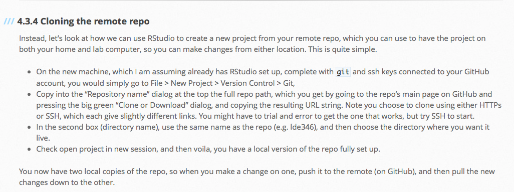

```{r setup, include=FALSE}
# knitr::opts_chunk$set(echo = FALSE)
```

```{r, eval = FALSE}
library(raster)
library(ggplot2)
library(rasterVis)
library(gstat)

# dummy grids, with spatial autocorrelation, normalized
xy <- expand.grid(1:50, 1:50)
names(xy) <- c('x', 'y')

set.seed(2)  # 2
gdummy <- gstat(formula = z ~ 1, locations = ~x + y, dummy = TRUE, beta = 1,
                model = vgm(psill = 0.35, range = 30, model = 'Sph'), 
                nmax = 20)

yy <- predict(gdummy, newdata = xy, nsim = 4)
gridded(yy) <- ~x + y
yy <- raster(yy)
yy <- focal(yy, w = matrix(1, 3, 3), mean, na.rm = TRUE, pad = TRUE)

png("inst/slides/figures/random-raster.png", height = 5, width = 5, res = 300,
    units = "in", bg = "transparent")
lattice.options(layout.heights = list(bottom.padding = list(x = 0), 
                                      top.padding = list(x = 0)),
                layout.widths = list(left.padding = list(x = 0), 
                                     right.padding = list(x = 0)))
levelplot(yy, scales = list(draw = FALSE), axes = FALSE,  
          colorkey = list(axis.line = list(col = "white"), 
                          axis.text = list(col = "white")))
dev.off()

```

---
# Today's Topics
- Finish Github syncing
- Branching in Github
- Cloning a repo
- Simple R commands
- More on installing/building `R` packages
- Tips and tricks
  - Knowing how to get help is *an important* skill

---
# Finish Github syncing
- Step 7: Sync with Github
  - 7a: Get SSH key
  - 7b: Create private repo on Github
  - 7c: Sync local repo with Github using Terminal
  - 7d: Add team members on Github
  - 7e: Push changes from local repo to Github
  
---
# Github branching
- You will create a separate "parked" branch in your repo for each assignment

---
# `git`/GitHub
- [Cheatsheets](https://agroimpacts.github.io/geospaar/cheatsheets.html)

```{r, out.width = "70%", echo=FALSE, fig.align='center', fig.cap= "kevintshoemaker.github.io/StatsChats/GIT_tutorial"}
knitr::include_graphics("https://kevintshoemaker.github.io/StatsChats/GIT1.png")
```
---
```{r, out.width = "70%", echo=FALSE, fig.align='center', fig.cap= "kevintshoemaker.github.io/StatsChats/GIT_tutorial"}
knitr::include_graphics("https://kevintshoemaker.github.io/StatsChats/GIT2.png")
```
---
```{r, out.width = "70%", echo=FALSE, fig.align='center', fig.cap= "stackoverflow.com/questions/7212740/why-git-is-called-a-distributed-source-control-system"}
knitr::include_graphics("https://i.stack.imgur.com/yof9f.png")
```
---
## Our Branching Model

```{r, out.width = "70%", echo=FALSE, fig.align='center'}
knitr::include_graphics("figures/class3_1.png")
```

---

# Tips and tricks
## Knowing how to get help is a skill

- Slack posting guide
- Getting help via the search engine
- (Eventually) posting to listserves

---
## Knowing how to get help is a skill
### Search Engine Science

 - Sometimes you just need the error message
```{r, out.width = "90%", echo=FALSE, fig.align='center'}
knitr::include_graphics("figures/class3_4.jpeg")
```

---
## Knowing how to get help is a skill
### Search Engine Science

- Sometimes you need to search
  ```
  fatal: unable to access 'https://github.com/agroimpacts/xyz346.git/': 
  error setting certificate verify locations:
   CAfile: C:/Users/xyz/Desktop/ADP/RStudio/xyz346/Git/mingw64/ssl/
   certs/ca-bundle.crt
   CApath: none
  ```
- How you search matters

---

```{r, out.width = "90%", echo=FALSE, fig.align='center'}
knitr::include_graphics("figures/class3_5.png")
```

---
## Knowing how to get help is a skill
### Listserves
```{r, out.width = "90%", echo=FALSE, fig.align='center'}
knitr::include_graphics("figures/class3_3.png")
```
---
## How to ask coding questions
- [Reproducible examples](https://stackoverflow.com/help/minimal-reproducible-example)
- [How to ask on Stack Overflow](https://stackoverflow.com/help/how-to-ask)


---
# Tips and Tricks
## Other things
- Tab completion and shortcuts
- Reusing code
- Code syntax


---
# Keeping current

- `geospaar`
- Using `git` and GitHub
- Following 4.3.4. of Unit 1 - Module 1

```{r, out.width = "80%", echo=FALSE, fig.align='center'}

```

---

# More on R packages/projects

- `devtools::install(build_vignettes = TRUE)`
- Necessary folders and files
- Package dependencies (imports/depends)

---
# Light coding

```{r}
my_number_checker <- function(x) {
  if(x < 5) {
    print("Too low!") 
  } else if(x >= 5 & x < 10) {
    print("Just right!!! :)")
  } else {
    print("Too high!")
  }
}  
```

---
# Some useful R commands

- Variable assignment and printing
```{r}
a <- 5
print(a)
```

- Math operations, vector creation
```{r}
a <- 10
b <- 3
v <- c(a + b, a - b, a * b, a/b, a^b, a %% b)
print(v)
```
---
# Some useful R commands

- Sequence creation
```{r}
s <- 1:100
t <- seq(1, 100, 2)
print(s)
print(t)
```

- Sampling
```{r}
s <- 1:100
s1 <- sample(s, 1)
s2 <- sample(s, 5)
print(s1)
print(s2)
```

---
# Some useful R commands

- Sequence creation
```{r}
s <- 1:100
t <- seq(1, 100, 2)
print(s)
print(t)
```

---
# Some useful R commands

- Sampling
```{r}
s <- 1:100
s1 <- sample(s, 1)
s2 <- sample(s, 5)
print(s1)
print(s2)
```

---
# = vs ==

- == checks for equality
```{r}
a <- 8
print(a == 2^3)
print(a == 3^2)

```

- = is used for assignment, similar to <- . Most often used in functions
```{r}
my_number_checker(x = 3)
my_number_checker(x = 20)

```

---
## Coding practice

Modify `my_number_checker` function to do the following:
- (1) Update the response messages to something you create.
- (2) Change the target value to 8. Check if the value is less, greater, or equal to 8.
- (3) Change the target value to a random integer between 1 and 20. The function should allow you to guess this value multiple times.
- (4) Have the function update the target value each time your run it. The target is an integer between 1 and 10. So you only get one guess!
- CHALLENGE: Same as (3), but when you guess a correct answer, the function updates the target to a new value. You may need to use the global assignment operator [(see here)](https://www.educative.io/answers/what-is-the-global-assignment-operator-in-r)


---

## Getting Set Up/Homework

- **Read** 
  - Unit1-Module 2 (Part 1)
  - Stack Overflow How to Ask [Part 1](https://stackoverflow.com/help/minimal-reproducible-example), [Part 2](https://stackoverflow.com/help/how-to-ask)
- Read/work through [RMarkdown example](https://gist.github.com/jeromyanglim/2716336)
  - Download ZIP
  - Open RMD in RStudio. Click knit to view html
  - Work through code chunks in RStudio while also comparing to knit HTML
- Assignment 1 due Friday


