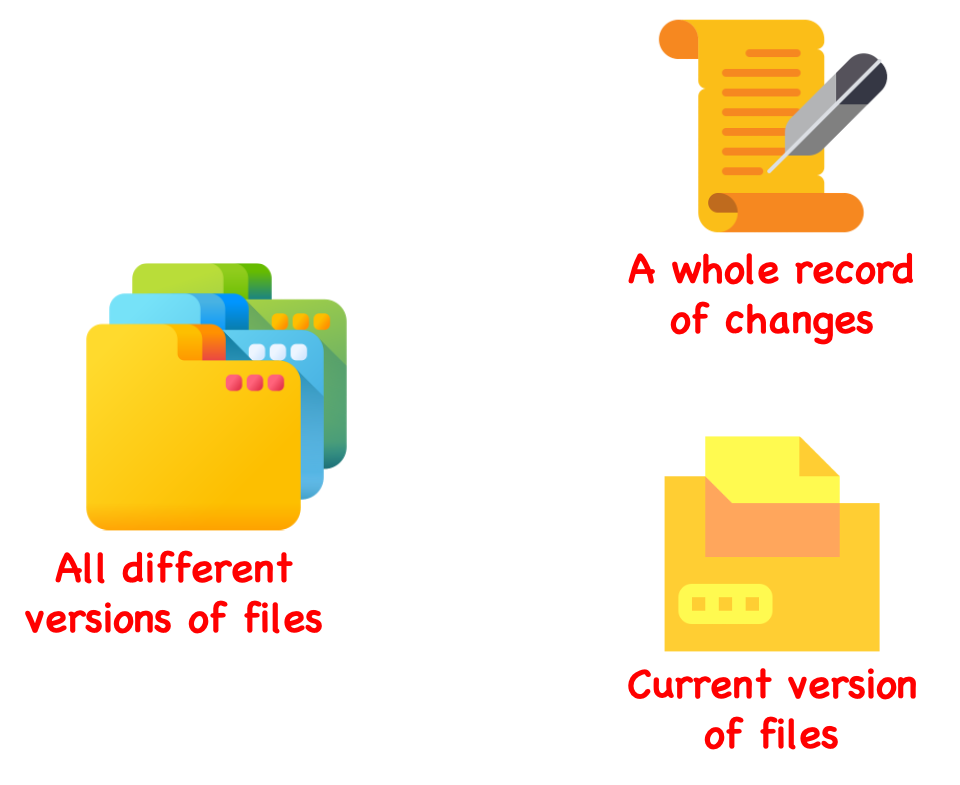

```{r setup, include=FALSE}
# knitr::opts_chunk$set(echo = FALSE)
```

```{r, eval = FALSE}
library(raster)
library(ggplot2)
library(rasterVis)
library(gstat)

# dummy grids, with spatial autocorrelation, normalized
xy <- expand.grid(1:50, 1:50)
names(xy) <- c('x', 'y')

set.seed(2)  # 2
gdummy <- gstat(formula = z ~ 1, locations = ~x + y, dummy = TRUE, beta = 1,
                model = vgm(psill = 0.35, range = 30, model = 'Sph'), 
                nmax = 20)

yy <- predict(gdummy, newdata = xy, nsim = 4)
gridded(yy) <- ~x + y
yy <- raster(yy)
yy <- focal(yy, w = matrix(1, 3, 3), mean, na.rm = TRUE, pad = TRUE)

png("inst/slides/figures/random-raster.png", height = 5, width = 5, res = 300,
    units = "in", bg = "transparent")
lattice.options(layout.heights = list(bottom.padding = list(x = 0), 
                                      top.padding = list(x = 0)),
                layout.widths = list(left.padding = list(x = 0), 
                                     right.padding = list(x = 0)))
levelplot(yy, scales = list(draw = FALSE), axes = FALSE,  
          colorkey = list(axis.line = list(col = "white"), 
                          axis.text = list(col = "white")))
dev.off()

```

---

## We have learned

- Overview of R
- R markdown
- Data types and objects

Any questions?

---

## Today

- Continue on objects and operations
- Basic control structure.
- Functions and scoping.
- Reproducibility (Package, Version control, GitHub)

---

## Fundamentals of R
### Vectors

```{r, echo=FALSE, fig.align='center'}
knitr::include_graphics("figures/class2_vector.png")
```

---

## Fundamentals of R
### Creation

  * Function `vector(mode, length)` can be used to initialize a vector of specific data type with defined length.
  * More commonly, function `c` (short for concatenate) can be used to create vectors.
  * `cbind` and `rbind` are functions can bind `vector`s to a `matrix`. Function `matrix(data_vector, nrow, ncol)` also can be used to create a matrix, and `array(data_vector, dim)` for array.
  * Anything can feed in function `list` to create a list, the same as `data.frame`.
  * `is.xxx(x)` and `as.xxx(x)` also works for vector, matrix, array, list, and data.frame.
  
---

## Fundamentals of R
### Atrributes

Any objects have attributes. If nothing is set, the attributes of an object is `NULL`. Some common attributes include:

- `names`/`dimnames`/`rownames`/`colnames`
- Overall `length`, and more specifically `dim` for matrix and array. Resetting `dim` attribute can convert a vector to matrix/array or reconstruct a matrix/array. 
- `class`: it is a bit different from function `class`.
- function `attr(object, attr_name)` can be used to query or set an attribute of an object. 
- function `attributes(x)` can be used to get all attributes of an object.
- function `str(object)` will print out a nice overview of an object.

---

## Control structure

Commonly used control structure:

- `if` and `else`, which test a condition and do things correspondingly.
- `switch`, which branches 
- `for`, which execute a loop for a specific number of times.
- `while`, which execute a loop when a condition is true.
- `repeat`, which execute a repeat work until break out the loop.
- `break`, which can control to exit a loop.
-  `next`, which can skip an iteration of a loop.

**Note**: we will learn later and then mainly use native R loop functions `*apply` for loops.
---

## Control structure
### `if` - `else`

```{r, eval = FALSE}
# one line
if (4 > 5) print('4 is larger than 5.') else print("4 is smaller than 5.")

# paragraph
if (4 > 5) {
  print('4 is larger than 5.')
} else print("4 is smaller than 5.")

# or could get longer
if (4 > 5) {
  print('4 is larger than 5.')
} else if (4 == 5){
  print("4 is equal to 5.")
} else {
  print("4 is smaller than 5.")
}

# ifelse
ifelse(4 > 5, print('4 is larger than 5.'), print("4 is smaller than 5."))
x <- 4
y <- 10
z <- ifelse(x > y, x, y)
```

---

### `switch`

```{r, eval = FALSE}
x <- 'b'

# If - else structure
if (x == "a") {
    "option 1"
  } else if (x == "b") {
    "option 2" 
  } else if (x == "c") {
    "option 3"
  } else {
    stop("Invalid `x` value")
  }

# switch
switch(x,
    a = "option 1",
    b = "option 2",
    c = "option 3",
    stop("Invalid `x` value")
)
```

The last component of a `switch()` should always throw an error, otherwise unmatched inputs will invisibly return `NULL`.

---

## Control structure
### `for`

```{r, eval=F}
# One line
for (i in 1:10) print(i)

# code paragraph
for (i in 1:10){
  print(i)
  print(i + 1)
}

# nested for
for (i in 1:10){
  for (j in 2:11){
    print(x + y)
  }
}
```

---

## Control structure
### `while` and `repeat`

```{r, eval=F}
# while
x <- 0
while(x < 10){
  print(x)
  x <- x + 1 # Change the checking condition
}

# repeat
x <- 0
repeat{
  print(x)
  x <- x + 1
  if (x == 10){
    print('Finish repeat!')
    break
  }
}
```

---

## Control structure
### `break` and `next`

```{r, eval=F}
x <- 0
repeat{
  x <- x + 1 # what if we move this line after the first if?
  if (x < 5){
    print('Skip this interation!')
    next
  }
  if (x == 10){
    print('Finish repeat!')
    break
  }
  print(x)
}
```

---

## Functions

Invoking a function is straightforward, just type the function name and give it the necessary parameters.
```{r, eval=F}
sum(1, 3)

# Assign the result to an object
x <- sum(c(1:10))

is.vector(x)

# open the help document using ?+function_name
?sum
```

**What is generic function?**

---

## Functions
### Components

```{r, eval=F}
function_name <- function(arg1, 
                          arg2 = 1:10, 
                          arg3 = ifelse(arg2 == 2, TRUE, FALSE)){
  body
}
```

Three essential components of a function:
- `formals()`, which is a list of arguments. Could be NULL.
- `body()`, the code in the function. R function will return the last thing generated by the function body automatically. If you want to return something else, use `return(x)`.
- `environment()`, where the function finds the values. It might change based on where the function is defined.

Except primitive functions, which are written in C in base package. E.g. `sum`.

Without name, the function is called anonymous function. 
---

## Practice

 - Define a function to convert Fahrenheit to Celsius.

$$Celsius = (Fahrenheit - 32) / 1.8$$

- Exam a sequence of temperature in Fahrenheit `c(70, 34, 25, 10, 89, 92, 15)`, when the temperature in Celsius is lower than -10, give a warning "Stay inside." and print out this temperature in Celsius.

```{r, eval=F, echo=T}
# Define the function
c_to_f <- function(fah = 0){
  
}

# Initialize the temperature vector
fahs <- c(70, 34, 25, 10, 89, 92, 15)

# Loop over the temperature to check
for (fah in fahs){
  
}
```

The result should be:

```{r, eval=T, echo=F}
# Define the function
c_to_f <- function(fah = 0){
  # This is a function to convert Fahrenheit to Celsius.
  # The argument is fah with a default value 0.
  (fah - 32) / 1.8
}

# Initialize the temperature vector
fahs <- c(70, 34, 25, 10, 89, 92, 15)

# Loop over the temperature to check
for (fah in fahs){
  cel <- c_to_f(fah)
  if (cel < -10){
    print('Stay inside.')
    print(cel)
  }
}
```

---

## Practice

```{r}
c_to_f <- function(fah = 0){
  # returns the the temperature in Celsius 
  # when get a value in Fahrenheit
  # Example: c_to_f(25)
  (fah - 32) / 1.8
}
fahs <- c(70, 34, 25, 10, 89, 92, 15)
for (fah in fahs){
  cel <- c_to_f(fah)
  if (cel < -10){
    print('Stay inside.')
    print(cel)
  }
}
```

**Note:** it is always a good manner to add description block within the function.

---

## Lexical scoping

Let's guess some results:
```{r, eval=F}
# Name masking
x <- 10
f1 <- function() {
  x <- 1
  x <- x + 1
  print(x)
}
f1()

# Fresh start
f1()
```

---

```{r, eval=F}
# Search level up
x <- 10
f1 <- function() {
  y <- 12
  f2 <- function(){
    z <- 14
    print(x + y + z)
  }
  f2()
}
f1()

# What about this?
x <- 10
f1 <- function(x) {
  print(x)
}
f1()
```

---

## Reproducibility
### Build your own package and R project

Let's run a demo.

---

## Version control

```{r, out.width = "60%", echo=FALSE, fig.align='center'}

```

---

## `git`/GitHub

```{r, out.width = "70%", echo=FALSE, fig.align='center', fig.cap= "kevintshoemaker.github.io/StatsChats/GIT_tutorial"}
knitr::include_graphics("https://kevintshoemaker.github.io/StatsChats/GIT1.png")
```

---

```{r, out.width = "70%", echo=FALSE, fig.align='center', fig.cap= "kevintshoemaker.github.io/StatsChats/GIT_tutorial"}
knitr::include_graphics("https://kevintshoemaker.github.io/StatsChats/GIT2.png")
```

---

```{r, out.width = "70%", echo=FALSE, fig.align='center', fig.cap= "stackoverflow.com/questions/7212740/why-git-is-called-a-distributed-source-control-system"}
knitr::include_graphics("https://i.stack.imgur.com/yof9f.png")
```

---

## Git/GitHub

Let's go back to our demo to do some git stuff.

---

## Next class

- Packages and environments.
- Object-oriented programming in R.
- Simulation in terms of reproducibility
- Debugging and getting help
- More on package and Git/GitHub

---

## Homework

- Practice Git/GitHub.
- Read Git/Github page on Course web.
- Find out what you feel confused on what we have learned.

