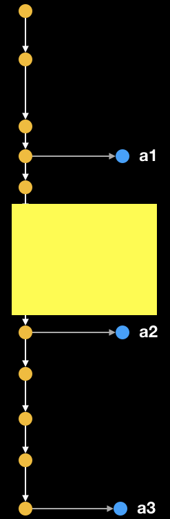

```{r}
#| echo: TRUE
#| eval: FALSE
  
library(raster)
library(ggplot2)
library(rasterVis)
library(gstat)

# dummy grids, with spatial autocorrelation, normalized
xy <- expand.grid(1:50, 1:50)
names(xy) <- c('x', 'y')

set.seed(2)  # 2
gdummy <- gstat(formula = z ~ 1, locations = ~x + y, dummy = TRUE, beta = 1,
                model = vgm(psill = 0.35, range = 30, model = 'Sph'), 
                nmax = 20)

yy <- predict(gdummy, newdata = xy, nsim = 4)
gridded(yy) <- ~x + y
yy <- raster(yy)
yy <- focal(yy, w = matrix(1, 3, 3), mean, na.rm = TRUE, pad = TRUE)

png("inst/slides/figures/random-raster.png", height = 5, width = 5, res = 300,
    units = "in", bg = "transparent")
lattice.options(layout.heights = list(bottom.padding = list(x = 0), 
                                      top.padding = list(x = 0)),
                layout.widths = list(left.padding = list(x = 0), 
                                     right.padding = list(x = 0)))
levelplot(yy, scales = list(draw = FALSE), axes = FALSE,  
          colorkey = list(axis.line = list(col = "white"), 
                          axis.text = list(col = "white")))
dev.off()
```

## Today's Topics

- Trouble-shooting
- `git` / GitHub
- `R` packages

---

## `git` / GitHub

- What is version control and what is the advantage of using it? 
- What is `git` and what is GitHub? 
- What is a commits? A push? A pull?
- Which is a branch, how do we create them, and how will we use them in this class?
- What is a merge?

---

## R packages

- What is an R package and why do we use them? 
- What is the file/folder structure of an R package and what are the key package files?
- What is an `R` function, and what is the advantage of using them? What is a package function, and how and why do we export package functions? 
- Who do we load packages?
- Where does an installed package live?
- What is the difference between a library and a package? 

---

## `git`/GitHub extras

```{r}
#| echo: false
#| fig-cap: "kevintshoemaker.github.io/StatsChats/GIT_tutorial"
#| fig-align: center
#| out-width: 70%

knitr::include_graphics("https://kevintshoemaker.github.io/StatsChats/GIT1.png")
```
---

```{r}
#| echo: false
#| fig-cap: "kevintshoemaker.github.io/StatsChats/GIT_tutorial"
#| fig-align: center
#| out-width: 70%

knitr::include_graphics("https://kevintshoemaker.github.io/StatsChats/GIT2.png")
```

---

## Our Branching Model

```{r}
#| echo: false
#| fig-align: center
#| out-width: 70%


```

---

## Keeping the repo current

- Using `git` and GitHub
- Following [4.3.4.](https://agroimpacts.github.io/geospaar/unit1-module1.html#cloning-the-remote-repo) of Unit 1 - Module 1

---

## Types of `R` packages

```{r}
#| out.width: "55%"
#| fig.align: 'center'
#| echo: FALSE
#| fig.cap: "http://r-pkgs.had.co.nz/package.html"

knitr::include_graphics("http://r-pkgs.had.co.nz/diagrams/package-files.png") 
```

## Installing packages

```{r}
#| echo: false
#| fig-cap: "http://r-pkgs.had.co.nz/package.html"
#| fig-align: center
#| out-width: 90%

knitr::include_graphics("https://r-pkgs.org/diagrams/install-load.png") 
```
---


## [Assignment 1]("https://agroimpacts.github.io/geospaar/unit1-module1.html#unit-assignment")

- Due Friday midnight (9/4)

---

## Tips and Tricks

- Tab completion and shortcuts
- Reusing code
- Code syntax

