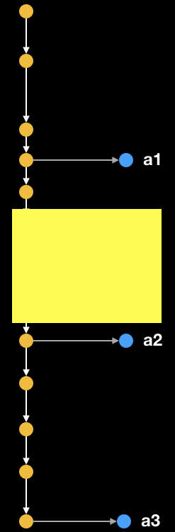
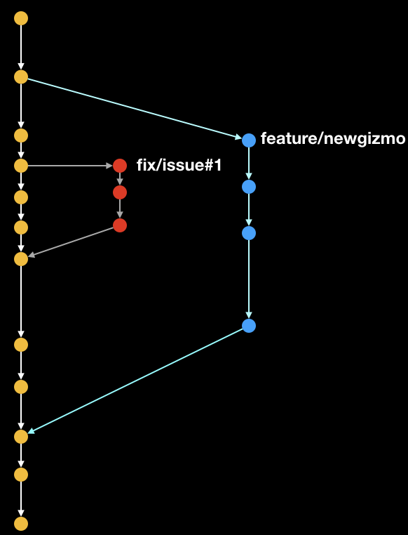
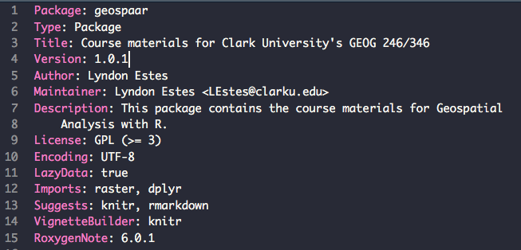
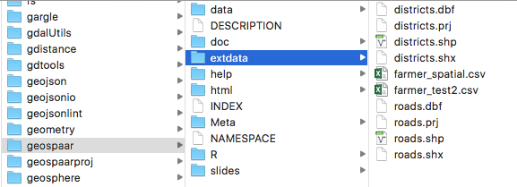

```{r, out.width = "80%", echo=FALSE, fig.align='center'}
knitr::include_graphics("figures/weekly-rf.png")
```

---

```{r, eval = FALSE}
data("chirps")
library(rasterVis)
library(lubridate)
library(RColorBrewer)
library(raster)
zam <- getData("GADM", country = "ZMB", level = 1)

dates <- seq(as_date("2016-10-25"), as_date("2016-11-21"), by = "day")
dates <- data.frame(dates, w = unlist(lapply(1:4, function(x) rep(x, 7))))
rfweek <- stack(lapply(unique(dates$w), function(x) {
  w <- which(dates$w == x)
  calc(chirps[[x]], sum)
}))
wk <- as_date(sapply(unique(dates$w), function(x) dates[dates$w == x, 1][1]))
names(rfweek) <- wk

mapTheme <- rasterTheme(region = brewer.pal(9, "Blues"))
pstrip <- list(cex = 1, col = "white")
png("figures/weekly-rf.png", height = 5, width = 5, res = 300,
    units = "in", bg = "transparent")
p <- levelplot(rfweek, scales=list(draw = FALSE), par.settings = mapTheme,
               names.attr = paste("Week of", wk), axes = FALSE, xlab = "",
               ylab = "", par.strip.text = pstrip, 
               main = list("Weekly Rainfall (mm)", col = "White"), 
               colorkey = list(axis.line = list(col = "white"), 
                               axis.text = list(col = "white")))
p2 <- p + latticeExtra::layer(sp.polygons(zam, col = "grey80", lwd = 0.7))
p2
dev.off()
```

---
# Today

- A review of where we are so far
- Rmarkdown demo
- Picking up from last class
  - Projects and package set-up
  - `git` / GitHub
      - syncing, commit, push, pull, branching, merging

---
# So far...

- We should know:
  - Key concepts/tools of reproducibility and why we use them
  - How to set up R package project with `git` VCS
      - More on package structures: see [here](https://r-pkgs.org/package-structure-state.html)
  - Where your library lives
  - *What the key ingredients in a package are*
  - *How to keep project synced between local and remote repos*
  - *How to document functions*

--

- What we might not know (about packages):
  - data folder and lazy loads
  - inst folder and how to get at it

---

## Git/GitHub 

```{r, out.width = "70%", echo=FALSE, fig.align='center', fig.cap= "kevintshoemaker.github.io/StatsChats/GIT_tutorial"}
knitr::include_graphics("https://kevintshoemaker.github.io/StatsChats/GIT1.png")
```
---
```{r, out.width = "70%", echo=FALSE, fig.align='center', fig.cap= "kevintshoemaker.github.io/StatsChats/GIT_tutorial"}
knitr::include_graphics("https://kevintshoemaker.github.io/StatsChats/GIT2.png")
```
---
```{r, out.width = "70%", echo=FALSE, fig.align='center', fig.cap= "stackoverflow.com/questions/7212740/why-git-is-called-a-distributed-source-control-system"}
knitr::include_graphics("https://i.stack.imgur.com/yof9f.png")
```
---
## Our Branching Model

```{r, out.width = "70%", echo=FALSE, fig.align='center'}

```

---
## Merging

```{r, out.width = "50%", echo=FALSE, fig.align='center'}

```

---
## Git exercises (1)
- Open your personal R repo (e.g. `mjc346` in RStudio)
- Copy and paste the text in your Description file to a separate file. 
- Create a new branch, `test_merge`. You can create this branch in the Git tab, or in Terminal, using `git checkout -b test_merge`
- With the new branch active, create a new file `test_function` within the R folder. Create a simple function that takes a number `x` as an input, and prints "`x` is my favorite number!". Save and commit this file in the new branch.
- Switch back to the `main` branch. You should see a pop-up message. What happens to the `test_function.R` file? Can you see it in your file explorer?
- merge the new file to the main branch using the command `git merge test_merge` in Terminal. What happens?
- The `merge` command automatically merges and commits changes to the main branch

---
## Git exercises (2)
- In the `test_merge` branch, open the Description file. Update the version to 0.0.2. Save and commit.
- Switch to the `main` branch. Add a second author in the Author line. Save and commit.
- Now test merging the change from `test_merge` to `main` using `git merge test_merge`. Does this work?

---
## Git exercises (3)
- In the `test_merge` branch, add a third fictional author. Save and commit.
- Switch to the `main` branch. Again add a third author, but use a different author than in the `test_merge` branch.
- Now test merging the change from `test_merge` to `main` using `git merge test_merge`. Does this work?
- Open the Description file. What does it look like?
- After you are done, delete the branch using `git branch -D test_merge`
- Update the Description file in the `main` branch by pasting the text you saved. Save and commit. 
---

# Tips and Tricks

- Tab completion and shortcuts
- Reusing code
- Code syntax
- [Posting guide](https://www.r-project.org/posting-guide.html)

---

## Knowing how to get help as a skillset

- Slack posting guide
- Getting help via the search engine
- (Eventually) posting to listserves

---
## Search Engine Science

 - Sometimes you just need the error message
```{r, out.width = "90%", echo=FALSE, fig.align='center'}
knitr::include_graphics("figures/class3_4.jpeg")
```

---
## Search Engine Science

- Sometimes you need to search
  ```
  fatal: unable to access 'https://github.com/agroimpacts/xyz346.git/': 
  error setting certificate verify locations:
   CAfile: C:/Users/xyz/Desktop/ADP/RStudio/xyz346/Git/mingw64/ssl/
   certs/ca-bundle.crt
   CApath: none
  ```
- How you search matters

---

```{r, out.width = "90%", echo=FALSE, fig.align='center'}
knitr::include_graphics("figures/class3_5.png")
```

---
## Listserves
```{r, out.width = "90%", echo=FALSE, fig.align='center'}
knitr::include_graphics("figures/class3_3.png")
```
---

## Package functions
- `install.packages` : installs binary packages from CRAN
- `devtools::install_github`: installs from Github
-  `devtools::install("C:/Users/micha/Documents/geospaar/")` to install locally 

---

## Data in packages

```{r, out.width = "80%", echo=FALSE, fig.align='center'}

```

- packages often include example data
- Lazy loading data only loads when used
- Lazy loaded data in data/ folder
  - formats: .R, .rda, .RData, .tab, .txt, .csv
- Non lazy loads (raw data) in inst/extdata

---

```{r}
ls()
data("farmers_env", package = "geospaar")
ls()
farmers_env
rm(list = ls())
ls()
```

---
```{r, message=FALSE}
library(geospaar)
ls()
farmers_env
ls()
```

---
## Raw data in inst/extdata

```{r, out.width = "80%", echo=FALSE, fig.align='center'}

```

---

```{r}
system.file("extdata", package = "geospaar")
dir(system.file("extdata", package = "geospaar"))
f <- system.file("extdata", "farmer_spatial.csv", package = "geospaar")
head(read.csv(f))
```

---
## Other package folders
- See [Chap 9 of "R Packages"](https://r-pkgs.org/misc.html) for more examples of R packages folders.

---
# A look at RMarkdown

Chunk options

```{r, out.width = "80%", echo=FALSE, fig.align='center'}
knitr::include_graphics("figures/class4_3.png")
```

[Rmarkdown demo](rmarkdown_demo.html) by Lei Song

---
## RMarkdown exercises
- In your personal R project, Create new RMarkdown file using `usethis::use_vignette(name = "example_vignette")`
- Create chunks for the following:
  - Load the `geospaar` package
  - Load the `chirps` data and print its structure using `str(chirps)`
  - Plot `chirps` data using `raster::plot(chirps)`. Above this chunk, include a text description for the CHIRPS data using different text formatting (bold, italics, etc). You can see information on the `CHIRPS` data in the `man` folder.
  - Include a chunk with an obvious error, like `5 + "string"`
  - Try knitting this RMD using different [chunk options](https://rmarkdown.rstudio.com/lesson-3.html)

