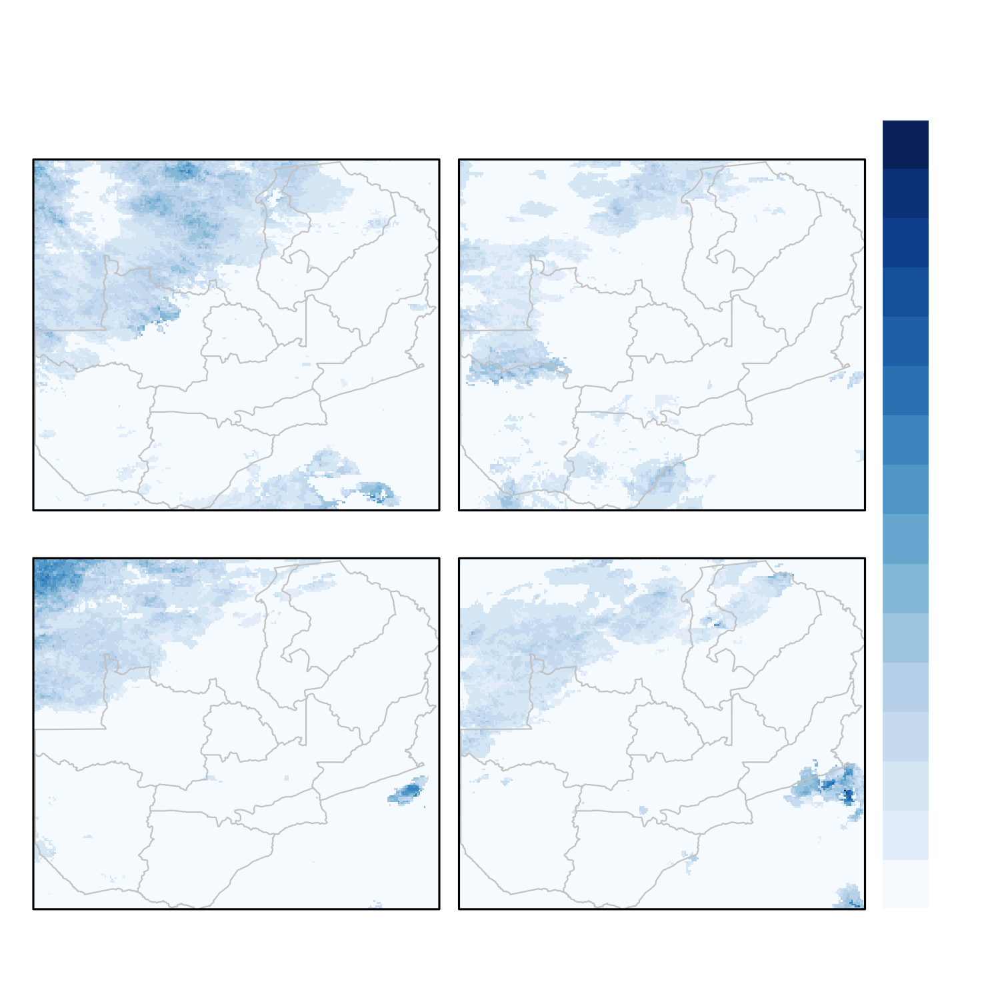
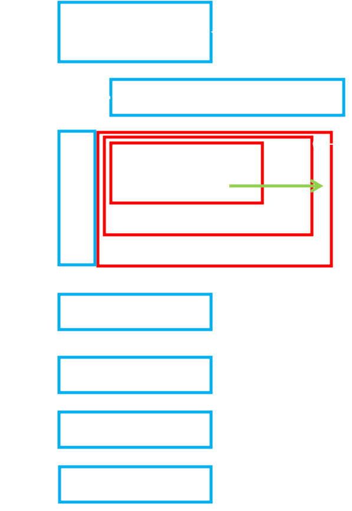
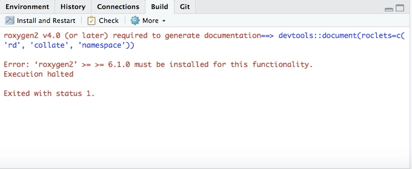
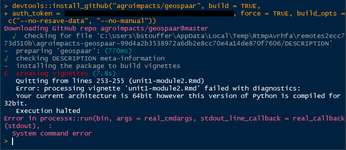
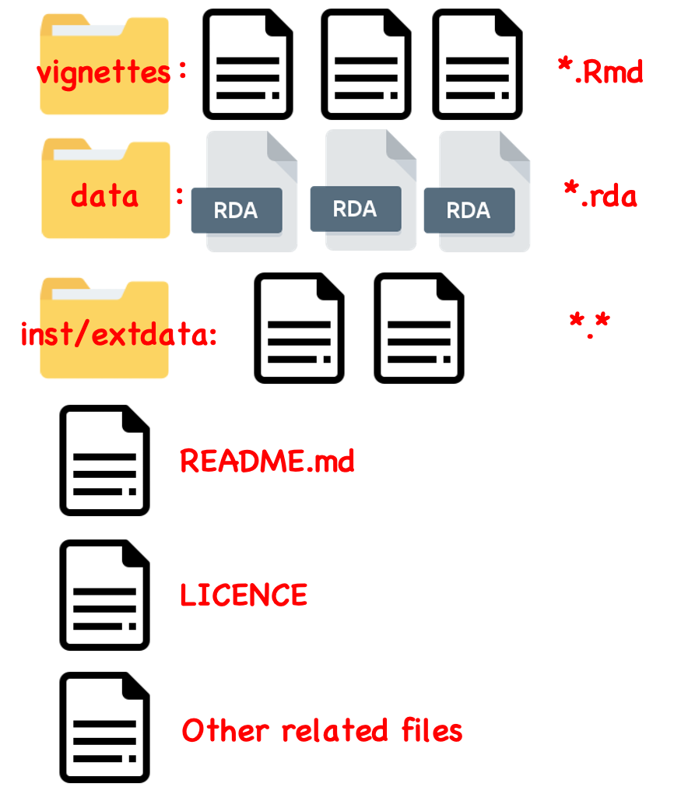

```{r, out.width = "80%", echo=FALSE, fig.align='center'}

```

---

```{r, eval = FALSE}
data("chirps")
library(rasterVis)
library(lubridate)
zam <- getData("GADM", country = "ZMB", level = 1)

dates <- seq(as_date("2016-10-25"), as_date("2016-11-21"), by = "day")
dates <- data.frame(dates, w = unlist(lapply(1:4, function(x) rep(x, 7))))
rfweek <- stack(lapply(unique(dates$w), function(x) {
  w <- which(dates$w == x)
  calc(chirps[[x]], sum)
}))
wk <- as_date(sapply(unique(dates$w), function(x) dates[dates$w == x, 1][1]))
names(rfweek) <- wk

mapTheme <- rasterTheme(region = brewer.pal(9, "Blues"))
pstrip <- list(cex = 1, col = "white")
png("inst/slides/figures/weekly-rf.png", height = 5, width = 5, res = 300,
    units = "in", bg = "transparent")
p <- levelplot(rfweek, scales=list(draw = FALSE), par.settings = mapTheme,
               names.attr = paste("Week of", wk), axes = FALSE, xlab = "",
               ylab = "", par.strip.text = pstrip, 
               main = list("Weekly Rainfall (mm)", col = "White"), 
               colorkey = list(axis.line = list(col = "white"), 
                               axis.text = list(col = "white")))
p2 <- p + layer(sp.polygons(zam, col = "grey80", lwd = 0.7))
p2
dev.off()
```

---

## We have learned

- Overview of R.
- Fundamentals of R.
- Functions and scoping
- Reproducibility.

Any questions?

---

## Today

- Scoping and environments.
- Object-oriented programming in R.
- Simulation in terms of reproducibility.
- Debugging and getting help.
- Write Package.
- More on Git/GitHub.

---

## Lexical scoping

Let's guess some results:
```{r, eval=F}
# Name masking
x <- 10
f1 <- function() {
  x <- 1
  x <- x + 1
  print(x)
}
f1()

# Fresh start
f1()
```

---

```{r, eval=F}
# Search level up
x <- 10
f1 <- function() {
  y <- 12
  f2 <- function(){
    z <- 14
    print(x + y + z)
  }
  f2()
}
f1()

# What about this?
x <- 10
f1 <- function(x) {
  print(x)
}
f1()
```

---

## Environment and namespace

```{r, out.width = "45%", echo=FALSE, fig.align='center'}

```

---

## Strategies to deal with conflicts

- Based on the above figure, the most efficient way is to load the package with the function you want to use later.

- We also could specify the package by using `package_name::function_name()`.

- Other recent packages to deal with conflicts if you are interested in, e.g. `import`, and `conflicted`.

---

## Simulation and sampling

- `runif`, generate random number from a uniform distribution.
- `rnorm`, generate random number from a normal distribution.
- `sample`, get samples from a vector.

---

## Set seed

In terms of reproducibility, it is a MUST to set seed (function `set.seed()`) every time before using any simulation and sampling functions. 

```{r}
# run one time
runif(5, 0, 1)

# run another time, get the different numbers
runif(5, 0, 1)

# set seed
set.seed(10)
runif(5, 0, 1)

# run again, get the same numbers
set.seed(10)
runif(5, 0, 1)
```

---

## Set seed

Different seed will control to generate different numbers.

```{r}
# use seed 10
set.seed(10)
sample(1:100, 5)

# use seed 11
set.seed(11)
sample(1:100, 5)

# use seed 567
set.seed(567)
sample(1:100, 5)
```

---

## Set seed

`set.seed()` and any random function need to be used in pair. In other word, once `set.seed()` is used by a random function, it expires. So we have to set again.

```{r}
set.seed(11)
sample(1:100, 10)

sample(1:100, 10)

sample(1:100, 10)

set.seed(11)
sample(1:100, 10)
```

---

## Knowing how to get help as a skillset

- Slack posting guide
- Getting help via the search engine
- (Eventually) posting to listserves

---
## Search Engine Science

 - Sometimes you just need the error message
```{r, out.width = "90%", echo=FALSE, fig.align='center'}

```

---

## Search Engine Science

- Sometimes you need to search
  ```
  fatal: unable to access 'https://github.com/agroimpacts/xyz346.git/': 
  error setting certificate verify locations:
   CAfile: C:/Users/xyz/Desktop/ADP/RStudio/xyz346/Git/mingw64/ssl/
   certs/ca-bundle.crt
   CApath: none
  ```
- How you search matters

---

```{r, out.width = "90%", echo=FALSE, fig.align='center'}

```

---

## Listserves

```{r, out.width = "90%", echo=FALSE, fig.align='center'}
knitr::include_graphics("figures/class3_3.png")
```

---

## Package

General common parts of a package.

```{r, out.width = "70%", echo=FALSE, fig.align='center'}
knitr::include_graphics("figures/class4_pkg_structure.png")
```

---

## Package

```{r, out.width = "55%", echo=FALSE, fig.align='center'}

```

---

## Package
### Function

As an author, we should write the help document of all functions as clear as possible.

```
#' An example of function documentation
#'
#' @description This function shows an example function.
#' @param arg1 numeric, the first argument.
#' @param arg2 logical, the secoond argument.
#' @return describe about the return.
#' @export
#' @examples
#' func_exp(32, TRUE)

func_exp <- function(arg1, arg2) {
  do something here
  return(rts)
}
```

---

## Package
### Vignette

Vignette is a special R markdown. It has extra parameters setting in YAML header:

```
---
title: "Vignette Title"
author: "Vignette Author"
date: "`r Sys.Date()`"
output:
  prettydoc::html_pretty:
    theme: cayman
    highlight: github
vignette: >
  %\VignetteIndexEntry{Vignette Title}
  %\VignetteEngine{knitr::rmarkdown}
  %\VignetteEncoding{UTF-8}
---
```

---

## Package
### Vignette

- Write the YAML header manually based on the **right format**.
- Create an Rmarkdown from package vignette templates.
- Or use `usethis::use_vignette()` to create one.

---

## Git/GitHub
### Commands

[Basic commands](git-github.html)

---

## Next class

- Indexing and subsetting
- Advanced calculation

---

## Homework

- Finish assignment 1 (due this Friday).
- Read Unit1-Module3.
