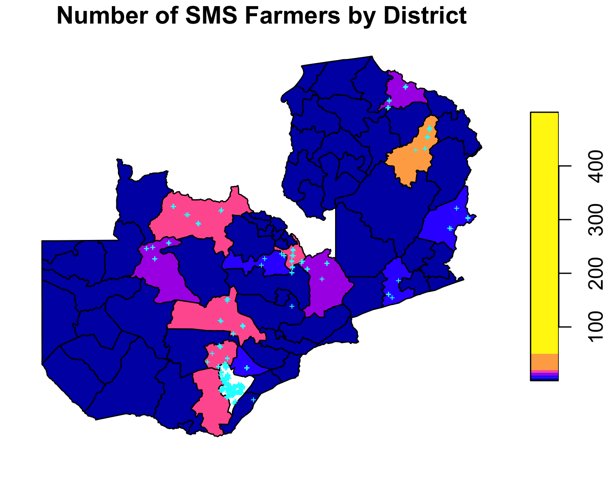
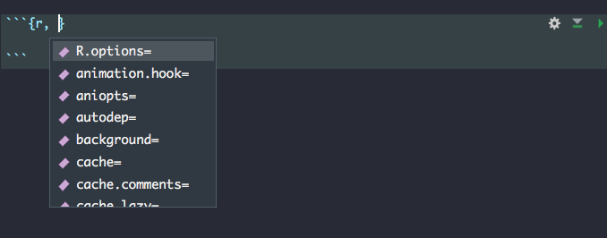
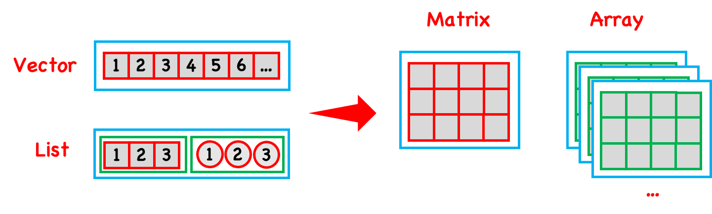

```{r, out.width = "80%", echo=FALSE, fig.align='center'}

```

---

```{r, eval = FALSE}
library(sf)
library(dplyr)
f <- system.file("extdata", "farmer_spatial.csv", package = "geospaar")
farmers <- readr::read_csv(f)
farmers <- farmers %>% select(uuid, x, y) %>% distinct() %>% 
  st_as_sf(., coords = c("x", "y"))
f <- system.file("extdata", "districts.shp", package = "geospaar")
dists <- read_sf(f)
st_crs(farmers) <- st_crs(dists)

# join farmers with districts (h/t https://mattherman.info/blog/point-in-poly/)
farmers_in_dists <- st_join(farmers, dists, join = st_within) %>%
  tidyr::drop_na()
farmer_count <- count(as_tibble(farmers_in_dists), distName)
dists_w_farmers <- left_join(dists, farmer_count) %>% 
  mutate(n = ifelse(is.na(n), 0, n))

png("figures/sms-farmers.png", height = 4, width = 5, res = 300,
    units = "in")
plot(dists_w_farmers["n"], breaks = c(0, 5, 10, 15, 20, 50, 500), 
     reset = FALSE, main = "Number of SMS Farmers by District")
plot(farmers %>% filter(uuid %in% unique(farmers_in_dists$uuid)) %>%
       st_geometry(), add = TRUE, pch = "+", col = "cyan", cex = 0.5)
dev.off()
```

---
# Today

- RMarkdown
- The `R` ecosystem
- Building blocks of R: data types, functions, etc

---
# A look at RMarkdown

Chunk options

```{r, out.width = "80%", echo=FALSE, fig.align='center'}

```

[Rmarkdown demo](rmarkdown_demo.html) by Lei Song
[RMarkdown gallery](https://rmarkdown.rstudio.com/lesson-1.html)

---

## RMarkdown exercises
- In your personal R project, Create new RMarkdown file using `usethis::use_vignette(name = "example_vignette")`
- Create chunks for the following:
  - Load the `geospaar` package
  - Load the `chirps` data and print its structure using `str(chirps)`
  - Plot `chirps` data using `raster::plot(chirps)`. Above this chunk, include a text description for the CHIRPS data using different text formatting (bold, italics, etc). You can see information on the `CHIRPS` data in the `man` folder.
  - Include a chunk with an obvious error, like `5 + "string"`
  - Try knitting this RMD using different [chunk options](https://rmarkdown.rstudio.com/lesson-3.html)
---

# The R Ecosystem

```{r, out.width = "60%", echo=FALSE, fig.align='center'}
knitr::include_graphics("figures/class5_u1m2.png")
```

---
## The R Ecosystem
### Common objects

```{r, echo=FALSE, fig.align='center', out.width = "80%", fig.cap='Credit: L. Song'}
knitr::include_graphics("figures/class2_objects.png")
```

---
## The R Ecosystem
### Data types
There are 6 atomic data types:
- character
  e.g. `'hello world'`, `'abc'`
- double (real or decimal)
  e.g. `10`, `3.14`, `1e10`
- integer
  e.g. `1L`
- logical
  e.g. `TRUE`, `FALSE`, `T`, `F`
- complex
  e.g. `1 + 3i` (not commonly used by us)
- *raw* (rarely used by us)

---
## The R Ecosystem
### Special data types

- `NULL`: Does not exist
- Missing data: `NA`. A special logical type that converts into the type it is associated with.
- Infinity: `Inf` (e.g. `1 / 0`) and `-Inf` (e.g. `-1 / 0`. A special double type.
- Undefined value: `NaN`. Also a special double type. (e.g. `0 / 0`)

---
## The R Ecosystem
### Special data types

- Date: `as.Date('1970-1-5')`
- Time: `as.POSIXct('1970-1-5')`
- Factor: factors are integers with associated labels. 

---
## The R Ecosystem
### Checking data type

- `typeof(x)`
- `is.xxx(x)`: 

  * e.g. `is.double(x)`, `is.integer(x)`, `is.logical(x)`, `is.character(x)`, `is.complex(x)`, `is.raw(x)`, `is.factor`
  
  * `is.numeric(x)` 
  
  * e.g. `is.na(y)`, `is.nan(y)`, `is.null(y)`, `is.infinite(y)`, `is.finite(y)`.

---
## The R Ecosystem
### Converting data type

- `as.xxx(x)`:

  * e.g. `as.numeric(x)`, `as.double(x)`, `as.character(x)`, `as.integer(x)`, `as.logical(x)`, `as.complex(x)`, `as.raw(x)`, `as.factor(x)`, `as.Date(x)`, `as.POSIXct(x)`.
  
- logical < integer < double < character

---
## The R Ecosystem
### Data structures
- Atomic vectors (most commonly thought of kind):

  * A sequence of objects of the **same class**.
  * Arrays and matrices are vectors with more than one dimension.
  
      - Matrices have 2 dimensions.
      - Arrays could have higher dimensions.

- Lists

  * Lists can contain objects of **different classes**.
  * Lists can be converted list-matrix or list-array by defining dimensions.
  * `data.frame` and `tibble` are S3 objects that are lists in tabular form

---

## The R Ecosystem
### Vectors

```{r, echo=FALSE, fig.align='center', fig.cap='Credit: L. Song'}

```

---
## Let's create some data

- `vector`
- `matrix`
- `data.frame`
- `list`
---
## Creating a vector
```{r}
v1 <- c(1,2,3,4,5)
v2 <- 6:10
print(v1)
print(v2)
```

---
## Combining vectors

```{r}
v1 <- c(1,2,3,4,5)
v2 <- 6:10
v3 <- c(v1, v2)
print(v3)
print(class(v3))
```
---
## Combining vectors
What happens when you combine data types in a vector?

```{r}
v4 <- c(v1, "test")
print(v4)
print(class(v4))
```
---
## Vectorized operations
```{r}
v1 <- 1:9
print(v1)
print(v1 + 5) ## addition applied to each element in vector
print(v1 * 3) ## multiplication applied to each element in vector
```

---
## Accessing elements in vector
```{r}
v1 <- (1:9)*3 
print(v1)
print(v1[4])
```

```{r}
v1 <- letters[1:7]
print(paste0("This letter is ", v1)) # paste0 concatenates strings
```

Question: How would you say "Letter 1 is a", "Letter 2 is b", etc. 
---
## Creating a matrix
```{r}
v1 <- 1:9
m1 <- matrix(v1, nrow = 3, byrow = T)
m2 <- cbind(v1 = 1:3, v2 = 1:3, v3 = 0:0)
print(m1)
print(m2)
```
---
## Accessing elements in a matrix
```{r}
m2 <- cbind(v1 = 1:3, v2 = 1:3, v3 = 0:0)
print(m2)
print("first row:")
print(m2[1, ])
print("second column")
print(m2[, 2])
print("access by column name")
print(m2[, "v2"])
```

Question: Create a 3 row, 4 column matrix, where the first column is (1, 2, 3), second column is (4, 5, 6 ) etc. 

---
## Lists
Lists can mix object of different types. 

```{r}
l <- list("a", 1, 0.5, TRUE)
print(l)
print(str(l)) # structure of l
```

---
## Lists
Lists can also be nested.
```{r}
l1 <- list("a", 1, 0.5, TRUE)
l2 <- list(l1, "test", matrix(1:9, nrow = 3)) ## first element of l2 is a list.
print(l2)
```
Question: what is the length of l1? what is the length of each element of l1? (use `length` function)
---
## Accessing elements in lists
Use double brackets `[[  ]]` to access elements in lists. 
```{r}
l1 <- list("a", 1, 0.5, TRUE)
l2 <- list(l1, "test", matrix(1:9, nrow = 3)) ## first element of l2 is a list.
print(l2[[1]])
print(l2[[2]])
print(l2[[3]])
```

Question: The first element of l2 is a list. Access this first element from l2, then the 4th element from l1. 

---
## Data frames
We will use data frames A LOT. Data frames are really tables, but they are stored in R as lists, with the following conditions.
- Each element in the list represents a column.
- Each element in the list is an atomic vector.
- The length of each vector is the same (the number of rows)

```{r}
m1 <- cbind(1:3, letters[1:3])
print(m1) # a matrix cannot hold multiple data types. 
print(class(m1))
```
```{r}
df <- data.frame(numbers = 1:3, abc = letters[1:3])
print(df) # a data frame CAN hold multiple data types. 
print(class(df))
```

---
## Useful functions
- `print`
- You can print just about anything, but as a generic function, `print` works differently for different types of objects.
```{r}
a <- "test"
df <- data.frame(numbers = 1:3, abc = letters[1:3])
print(a) # a data frame CAN hold multiple data types. 
print(df)
```
```{r}
methods(print) ## all the different ways to print...
```
---
## Examining objects
- `ls`, `class`, `str
```{r}
a <- "test"
df <- data.frame(numbers = 1:3, abc = letters[1:3])
ls() ## list objects in global environemtn
```
```{r}
class(df) ## class
```

```{r}
str(df) ## structure
```

---
## Sampling

```{r}
set.seed(1234) ## set a random seed
v <- 1:100
s <- sample(v, 50)
print(s)
print(sort(s))
```

Sample with replacement
```{r}
s2 <- sample(v, 50, replace = T)
print(sort(s2))
```
---
## Sampling

## Does S2 have duplicates?
```{r}
s2_unique <- unique(s2)
print(length(s2))
print(length(s2_unique))

print(length(s2) == length(s2_unique))
```
---
## BIRTHDAY PROBLEM

We want to use R to answer the birthday problem. If you have n people in a room with random birthdays, do any two people share the same birthday?

Some assumptions.
- No Feb 29 birthdays
- All birthdays are equally likely.

Questions
- How can we represent all birthdays as a numeric vector?
- How can we use sampling to represent birthdays of different people?

---
## BIRTHDAY PROBLEM

- Build a function that randomly generates birthdays for n people. The function should return `TRUE` if two people share a birthday, and `FALSE` otherwise.
```{r}
birthday_function <- function(no_people){
  ......
  if(....){
    return(TRUE) ## TRUE means that at least two people have the same birthday
  } else {
    return(FALSE) ## FALSE means that no people have the same birthday
  }
}
```
---
## BIRTHDAY PROBLEM

- Use the `birthday_function` to create a logical vector v of length 100. 

Each value of v should represent 1 run of the `birthday_function`. So v[10] is a test of the birthday_function on 10 people, v[25] represents a test of `birthday_function` on 25 people, etc.

Create a plot of number of people (x-axis) vs v (y-axis). It might look something like below.
```{r}
number_people <- 1:10
v <- c(FALSE, FALSE, FALSE, FALSE, TRUE, FALSE, FALSE, TRUE, FALSE, FALSE)
plot(number_people, v)
```

---
## BIRTHDAY PROBLEM (CHALLENGE)

- Build a function that runs many simulations of the birthday function. The function should return the percent of time that two people have the same birthday.

For example, you want to run the function for 25 people, and 10,000 simulations. The function should return the percent of simulations in which 2 of the 25 people share a birthday.

You can use `mean` on a logical vector.

```{r}
mean(c(TRUE, TRUE, FALSE, TRUE))
```
```{r}
birthday_sims <- function(no_people, no_simulations){
  ......
  return(mean(....))
}
```

---


## Homework

- Read Unit1-Module 3, Parts 1-3 (all)
- Work on Exercises. Post questions if you have them!

