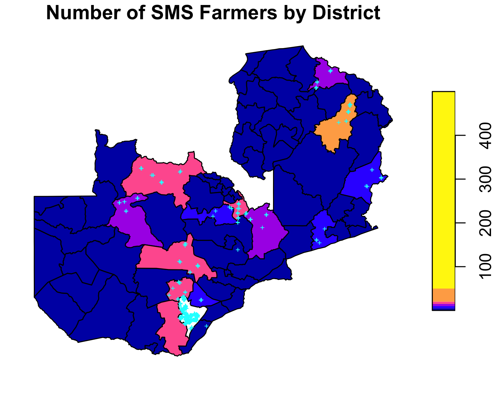
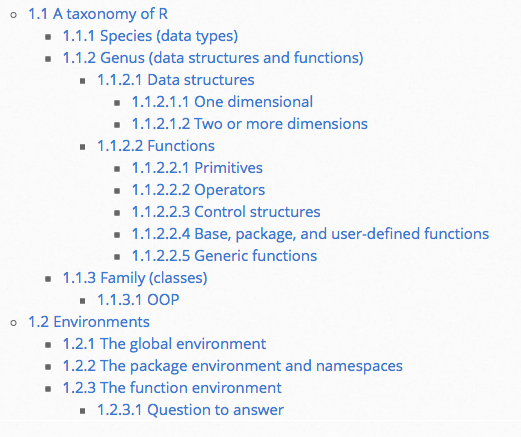
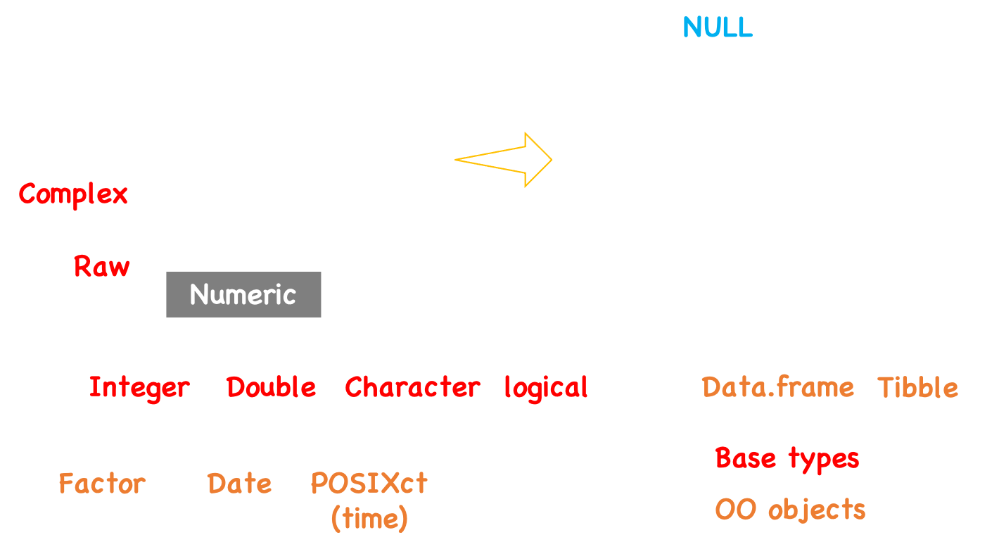
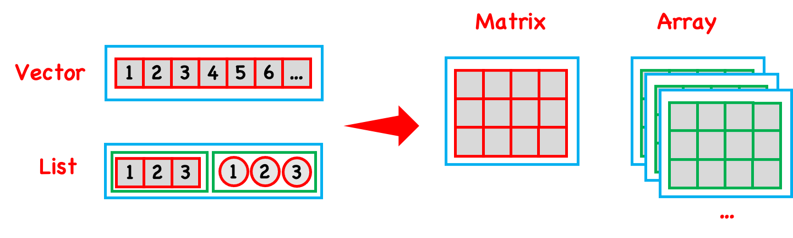
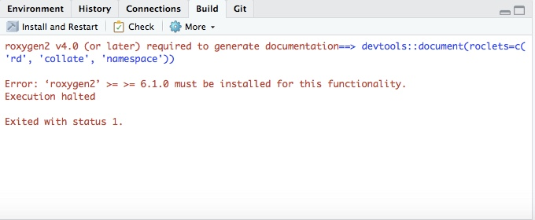
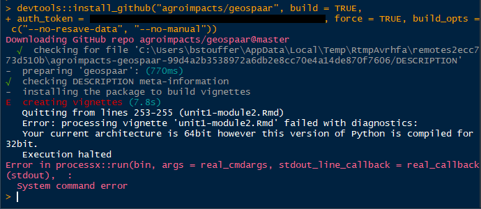

```{r}
#| out-width: "80%"
#| echo: false
#| fig-align: 'center'


```

---

```{r}
#| echo: true
#| eval: false

library(sf)
library(dplyr)
f <- system.file("extdata", "farmer_spatial.csv", package = "geospaar")
farmers <- readr::read_csv(f)
farmers <- farmers %>% select(uuid, x, y) %>% distinct() %>% 
  st_as_sf(., coords = c("x", "y"))
f <- system.file("extdata", "districts.shp", package = "geospaar")
dists <- read_sf(f)
st_crs(farmers) <- st_crs(dists)

# join farmers with districts (h/t https://mattherman.info/blog/point-in-poly/)
farmers_in_dists <- st_join(farmers, dists, join = st_within) %>%
  tidyr::drop_na()
farmer_count <- count(as_tibble(farmers_in_dists), distName)
dists_w_farmers <- left_join(dists, farmer_count) %>% 
  mutate(n = ifelse(is.na(n), 0, n))

png("figures/sms-farmers.png", height = 4, width = 5, res = 300,
    units = "in")
plot(dists_w_farmers["n"], breaks = c(0, 5, 10, 15, 20, 50, 500), 
     reset = FALSE, main = "Number of SMS Farmers by District")
plot(farmers %>% filter(uuid %in% unique(farmers_in_dists$uuid)) %>%
       st_geometry(), add = TRUE, pch = "+", col = "cyan", cex = 0.5)
dev.off()
```

---

## Today

- Assignment 1 questions
- The `R` ecosystem
- Building blocks of R: data types, functions, etc

---

## The R Ecosystem

- What data types are used in R, and how do they differ? 
- What data structures are there in R, how do they vary by dimension, and which data structures can hold more than 1 data type?
- What are the similarities and differences between a primitive, an operator, a control structure, and a package function?
- What is the relationship between a generic function and an R class? 
- What is object-oriented program, and how is it (idiosyncratically used in R? 

---

## The R Ecosystem

```{r, out.width = "60%", echo=FALSE, fig.align='center'}

```

---

## The R Ecosystem
### Common objects

```{r, echo=FALSE, fig.align='center', out.width = "80%", fig.cap='Credit: L. Song'}

```

---

## The R Ecosystem
### Data types

There are 6 atomic data types:

- character
  e.g. `'hello world'`, `'abc'`
- double (real or decimal)
  e.g. `10`, `3.14`, `1e10`
- integer
  e.g. `1L`
- logical
  e.g. `TRUE`, `FALSE`, `T`, `F`
- complex
  e.g. `1 + 3i` (not commonly used by us)
- *raw* (rarely used by us)

---

## The R Ecosystem
### Special data types

- `NULL`: Does not exist
- Missing data: `NA`. A special logical type that converts into the type it is associated with.
- Infinity: `Inf` (e.g. `1 / 0`) and `-Inf` (e.g. `-1 / 0`. A special double type.
- Undefined value: `NaN`. Also a special double type. (e.g. `0 / 0`)

---

## The R Ecosystem
### Special data types

- Date: `as.Date('1970-1-5')`
- Time: `as.POSIXct('1970-1-5')`
- Factor: factors are integers with associated labels. 

---

## The R Ecosystem
### Checking data type

- `typeof(x)`
- `is.xxx(x)`: 

  * e.g. `is.double(x)`, `is.integer(x)`, `is.logical(x)`, `is.character(x)`, `is.complex(x)`, `is.raw(x)`, `is.factor`
  
  * `is.numeric(x)` 
  
  * e.g. `is.na(y)`, `is.nan(y)`, `is.null(y)`, `is.infinite(y)`, `is.finite(y)`.

---

## The R Ecosystem
### Converting data type

- `as.xxx(x)`:

  * e.g. `as.numeric(x)`, `as.double(x)`, `as.character(x)`, `as.integer(x)`, `as.logical(x)`, `as.complex(x)`, `as.raw(x)`, `as.factor(x)`, `as.Date(x)`, `as.POSIXct(x)`.
  
- logical < integer < double < character

---

## The R Ecosystem
### Data structures
- Atomic vectors (most commonly thought of kind):

  * A sequence of objects of the **same class**.
  * Arrays and matrices are vectors with more than one dimension.
  
      - Matrices have 2 dimensions.
      - Arrays could have higher dimensions.

- Lists

  * Lists can contain objects of **different classes**.
  * Lists can be converted list-matrix or list-array by defining dimensions.
  * `data.frame` and `tibble` are S3 objects that are lists in tabular form

---

## The R Ecosystem
### Vectors

```{r, echo=FALSE, fig.align='center', fig.cap='Credit: L. Song'}

```

---

## Extras 

Below here

---

## Tips and Tricks

- Tab completion and shortcuts
- Reusing code
- Code syntax
- [Posting guide](https://www.r-project.org/posting-guide.html)

---

## Knowing how to get help as a skillset

- Slack posting guide
- Getting help via the search engine
- (Eventually) posting to listserves

---

## Search Engine Science

 - Sometimes you just need the error message
```{r, out.width = "90%", echo=FALSE, fig.align='center'}

```

---

## Search Engine Science

- Sometimes you need to search
  ```
  fatal: unable to access 'https://github.com/agroimpacts/xyz346.git/': 
  error setting certificate verify locations:
   CAfile: C:/Users/xyz/Desktop/ADP/RStudio/xyz346/Git/mingw64/ssl/
   certs/ca-bundle.crt
   CApath: none
  ```
- How you search matters

---

```{r, out.width = "90%", echo=FALSE, fig.align='center'}

```

---

## Listserves

```{r, out.width = "90%", echo=FALSE, fig.align='center'}

```

