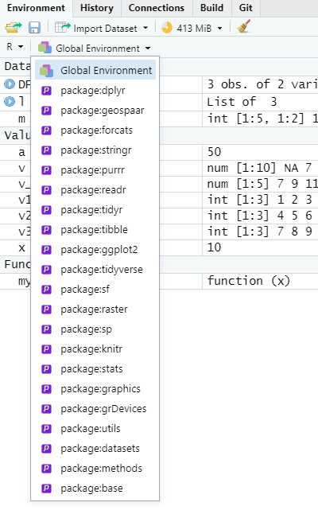

```{r, eval=FALSE}
s3url <- glue::glue("/vsis3/activemapper/",
                    "planet/composite_sr_buf_fix/GS/",
                    "tile486317_736815_736967.tif")  # not accessible
b <- raster::brick(s3url)[[4:2]]
png(here::here("external/slides/figures/ghana_planet.png"), height = 4, 
    width = 4, units  = "in", res = 300, bg = "transparent")
raster::plotRGB(b, stretch = "lin")
dev.off()
```


---

# Today

- Review of birthday problem
- Object oriented (OO) programming
- Environments in R
- Indexing
- Coding practice

---
# The R Ecosystem

```{r, out.width = "70%", echo=FALSE, fig.align='center'}
knitr::include_graphics("figures/class5_u1m2.png")
```


---
## BIRTHDAY PROBLEM

We want to use R to answer the birthday problem. If you have n people in a room with random birthdays, do any two people share the same birthday?

Some assumptions.
- No Feb 29 birthdays
- All birthdays are equally likely.

Questions
- How can we represent all birthdays as a numeric vector?
- How can we use sampling to represent birthdays of different people?

---
## BIRTHDAY PROBLEM

- Build a function that randomly generates birthdays for n people. The function should return `TRUE` if two people share a birthday, and `FALSE` otherwise.
```{r}
birthday_function <- function(no_people){
  ......
  if(....){
    return(TRUE) ## TRUE means that at least two people have the same birthday
  } else {
    return(FALSE) ## FALSE means that no people have the same birthday
  }
}
```
---
## BIRTHDAY PROBLEM

- Use the `birthday_function` to create a logical vector v of length 100. 

Each value of v should represent 1 run of the `birthday_function`. So v[10] is a test of the birthday_function on 10 people, v[25] represents a test of `birthday_function` on 25 people, etc.

Create a plot of number of people (x-axis) vs v (y-axis). It might look something like what's on the next slide.

---
## BIRTHDAY PROBLEM
```{r}
number_people <- 1:10
v <- c(FALSE, FALSE, FALSE, FALSE, TRUE, FALSE, FALSE, TRUE, FALSE, FALSE)
plot(number_people, v)
```

---
## BIRTHDAY PROBLEM (CHALLENGE)

- Build a function that runs many simulations of the birthday function. The function should return the percent of time that two people have the same birthday.

For example, you want to run the function for 25 people, and 10,000 simulations. The function should return the percent of simulations in which 2 of the 25 people share a birthday.

You can use `mean` on a logical vector.

```{r}
mean(c(TRUE, TRUE, FALSE, TRUE))
```
```{r}
birthday_sims <- function(no_people, no_simulations){
  ......
  return(mean(....))
}
```

---


## OO (Object oriented programming)

- Procedural versus object-oriented (OO) programming
- OO bundles together data and functions into an object
- Class defines type/structure of object and what methods (functions) are used with it
- 3+ types of OO in R

---

## OO - Base system? 

A vector is a base object.
```{r}
x <- 1:10
!is.object(x)  # if TRUE, base object. 
str(x)
```

A data frame is not a base object.
```{r}
DF <- data.frame(v1  = c(1,2,3), v2 = c(4,5,6))
!is.object(DF)  # if TRUE, base object. 
str(DF)
```

---
## 00 - S3 system?
A data frame is S3 object.
```{r}
DF <- data.frame(v1  = c(1,2,3), v2 = c(4,5,6))
!is.object(DF)  # if TRUE, base object. 
!isS4(DF)  # it’s S3
str(DF)
```

---
## 00 - S3 system?
A lm (linear model) is S3 object.
```{r}
a <- 1:10
x <- lm(a ~ rev(a))
!is.object(x)  # if TRUE, base object. 
!isS4(x)  # it’s S3
str(x)
```

---
## Accessing data in S3 objects.

- Access by name using $
```{r}
a <- 1:10
x <- lm(a ~ rev(a))
print(names(x))
print(x$coefficients)
(x$residuals)
```

---
## Accessing data in S3 objects.

- Access by name or index using `[[ ]]`
```{r}
DF <- data.frame(v1  = c(1,2,3), v2 = c(4,5,6))
print(DF$v2) # prints column named "v2"
print(DF[[2]]) # prints second column
```

---
## OO - S4 system? 
```{r}
x <- raster::raster(nrow = 10, ncol = 10)
!is.object(x)  # if TRUE, base object. 
!isS4(x)  # it’s S3
!is(x, "refClass") # if TRUE it’s S4; otherwise it’s RC.
str(x)
```

---

## Accessing data in S4 objects.

- Print slots using `slotNames()`
- Access slots using `@`
```{r}
library(raster)
x <- raster::raster(nrow = 10, ncol = 10, vals = 3)
print(slotNames(x))
print(x@ncols)
```

---

## Accessing data in S4 objects.
- Generally you want to use designed methods to set new values in slots. 

```{r}
print("old values")
print( x@data@values)
x <- setValues(x, sample(1:100, size = 100, replace = T))## set values of raster
print("new values")
print( x@data@values)
```

---
## Functions
- Primitives (e.g. `c`)
- Operators (e.g. +, -)
- Control structures (e.g. `for`, `if`, `apply`)
- Package functions (e.g. `dplyr::select`)
- Generic functions

---

## Functions
### Components

```{r, eval=F}
function_name <- function(arg1, 
                          arg2 = 1:10, 
                          arg3 = ifelse(arg2 == 2, TRUE, FALSE)) {
  body
}
```

Three components of a function:
- `formals()`: arguments
- `body()`, the code, which returns the last object generated, unless specified with `return(x)`.
- `environment()`, function finds the values

Unnamed functions are **anonymous** functions. 


---
## Primitive functions
List primitive functions
```{r}
names(methods:::.BasicFunsList)
```

---
## Package functions

List all objects in package (data + functions)
```{r, message = FALSE  }
library(geospaar)
print(ls("package:geospaar"))
```


List functions in package
```{r}
lsf.str("package:geospaar")
```
---

## Environments
```{r, out.width = "70%", echo=FALSE, fig.align='center', fig.cap="http://adv-r.had.co.nz/Environments.html"}
knitr::include_graphics("figures/class5_envs.png")
```
---

## Environments
- Global environment
- Package environment
    - external interface to package - how we find functions 
- Namespace environment
    - internal interface to package - how functions find variables
- Function environment (see http://adv-r.had.co.nz/Environments.html#function-envs)
  - Enclosing environment
  - Binding environment
  - Execution environment

---

```{r, out.width = "50%", echo=FALSE, fig.align='center', fig.cap="Credit: Lei Song"}
knitr::include_graphics("figures/class3_env_nsp.png")
```

---

`search()` shows the current environments in order. So if a function `select` is called, it first looks in the GlobalEnv, then each package environent.
```{r}
library(dplyr)
detach(package:dplyr)
library(raster)
library(dplyr)
search()
```
---

You can also see the environments (and their objects) in Rstudio
```{r, out.width = "80%", echo=FALSE, fig.align='center'}

```

---
Using `x` in a function does not change its global value.
```{r}
x <- 1:10
myfun <- function() {
  x * 10
}
myfun()

myfun <- function(x) {
  x <- x * 10
  return(x)
}
x <- 10
myfun(x = 20)
x
```

---
Each time you run `myfun`, a new function environment is created.
```{r}
myfun <- function(x) {
  x <- x * 10
  print(environment())
  return(x)
}
myfun(x)
myfun(x)
```

---
## Global assignment.
Use `<<-` to change value of global variable within a function.


```{r, message=FALSE}
a <- 10
myfun <- function(x) {
  a <<- x * 10   ## note <<- instead of <- 
  return(a)
}
myfun(5)
print(a)
```


---
## The R Ecosystem
### Data structures
- Atomic vectors (most commonly thought of kind):

  * A sequence of objects of the **same class**.
  * Arrays and matrices are vectors with more than one dimension.
  
      - Matrices have 2 dimensions.
      - Arrays could have higher dimensions.

- Lists

  * Lists can contain objects of **different classes**.
  * Lists can be converted list-matrix or list-array by defining dimensions.
  * `data.frame` and `tibble` are S3 objects that are lists in tabular form

---
## The R Ecosystem
### Data structures
- 1d
- 2d
- 3d


---
## Indexing vectors

Accessing elements in a vector
```{r}
v <- 1:10 + 5
print(v)
print(v[1:3])
print(v[c(4,5,8)])
```
---

Only odd elements

```{r}
v <- 1:10 + 5
print(v %% 2 == 1) ## check if each element is odd
```

Subset to only odd elements
```{r}
v_odd <- v[v %% 2 ==1] # use brackets to subset based on condition
v_odd
```

Set even elements to NA

```{r}
v[v %% 2 == 0] <- NA 
v
```

---
## Indexing lists

```{r}
v1 <- 1:3
v2 <- 4:6
v3 <- 7:9
l <- list(a = v1, b = v2, c = v3)
print(l)
print(names(l))
```

---
Access lists using `$` or `[[ ]]`
```{r}
print(l$a)
print(l$a[3]) # 3rd element of object a
print(l[[2]])
print(l[[2]][3]) # 3rd element of 2nd object
```

---
## Indexing Matrices
```{r}
m <- cbind(a = 1:5, b = 6:10)
print(class(m))
print(m)
```

Access 2nd row
```{r}
m[2,]
```
Access 2nd column
```{r}
m[ , 2]
```

Access column named 'a'
```{r}
m[ , 'a']
```

---
Access 3rd row, 2nd column
```{r}
m[3 , 2]
```

Set row names
```{r}
rownames(m) <- LETTERS[10:14]
print(m)
```


---


## Create your own data

- Create the following:
  - `a`: a random vector of integers with 10 elements drawn from 1-20:
    - Use the `sample` function with `set.seed(10)`
    - Name the elements of `a` with a vector of names starting with "V1" and ending with "V10". 
      - Use the `paste0` function to create those names.
      - Create the identical vector of names using the `paste` function.
  - `b`: Using `a` as an index to select from `letters`
  - `d`: Use `rnorm` with a mean = 100 and an sd of 20
    - Use `?rnorm` to see the help guide.
  - Why did I skip `c`? 
  - Create a list `l` from `a`, `b`, `d`. 
    - Assign the names of the vectors in `l` to the `l`'s elements

---
## 2-d structures

- Create the following:
  - `m`: a matrix with three integer columns named "V1", "V2", "V3"
    - Create each column first as its own vector, then combine
    - `V1` = 1:10
    - `V2` is a random sample between 1:100
    - `V3` is drawn from a random uniform distribution between 0 and 50     - Use the same `set.seed(50)` as before
    - Inspect the `str` and `class` of `m`
  - `dat`, a data.frame built from `V1`, `V2`, `V3`, and `V4`
    - `V4` is a random selection of the letters A-E

---
## Homework
- Work on exercises
- Finish reading 1.3
- Read on [tidyr, (12.1 - 12.2)](https://r4ds.had.co.nz/tidy-data.html)

