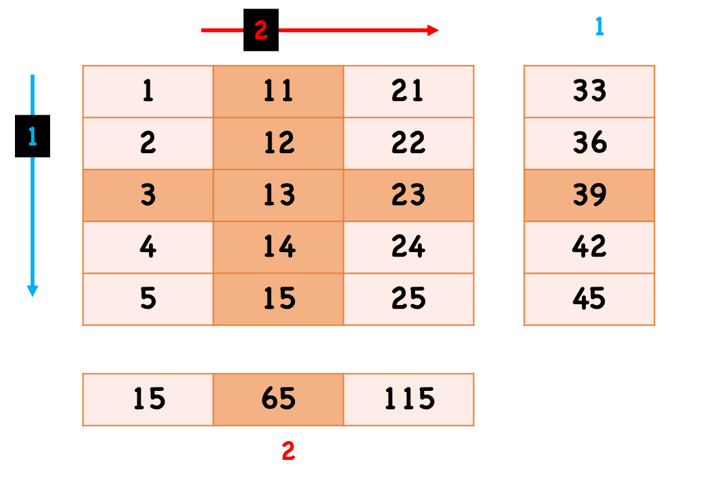
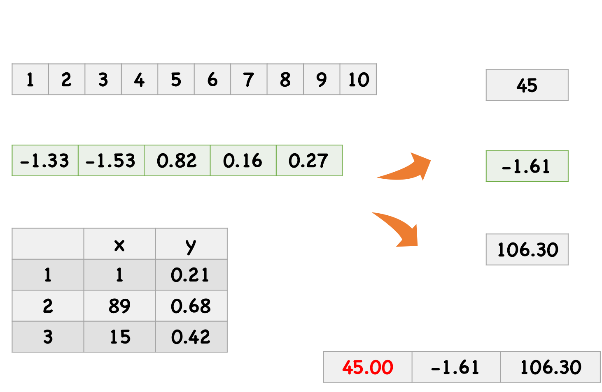

```{r, eval=FALSE}
s3url <- glue::glue("/vsis3/activemapper/",
                    "planet/composite_sr_buf_fix/GS/",
                    "tile486317_736815_736967.tif")  # not accessible
b <- raster::brick(s3url)[[4:2]]
png(here::here("external/slides/figures/ghana_planet.png"), height = 4, 
    width = 4, units  = "in", res = 300, bg = "transparent")
raster::plotRGB(b, stretch = "lin")
dev.off()
```

---

## We have learned

- Overview and fundamentals of R.
- Functions, packages, environment, and namespace.
- Reproducibility.
- Getting help.
- Git/GitHub
- Indexing, subsetting, and replacing
- A bit `dplyr`

Any questions?

---

## Today

- Loop functions `*apply`
- Introduction to `tidyverse`

---

## `*apply` family

- `apply()`
- `lapply()`
- `sapply()`
- `tapply()`
- `mapply()`

These functions allow you process the data in batches looply. The primary difference among these functions is the object type of the input and output.

---

## `apply()`

`apply(x, MARGIN, FUN, …)`

- `x`: an array. other types (e.g. data.frame) will convert to matrix.
- `MARGIN`: we could take it as the dimension to take batches, 1 indicates rows, 2 indicates columns, etc. etc. It can take more than one values, e.g. `c(1, 2)` means across both rows and columns.
- `FUN`: the function applied to the batch.
- returns a vector or *array*, sometimes a list.

---

## `apply()`

```{r}
m <- matrix(c(1:5, 11:15, 21:25), nrow = 5, ncol = 3)
apply(m, 1, sum)
```

```{r, out.width = "70%", echo=FALSE, fig.align='center'}

```

---

## `apply()`

```{r}
m <- matrix(c(1:5, 11:15, 21:25), nrow = 5, ncol = 3)
m
apply(m, 2, function(x) x + 2)

apply(m, 1, function(x) x + 2) ## what will happen?
```

---

## `lapply()`

`lapply(x, FUN, …)`

- `x`: a vector (atomic and list).
- `FUN`: the function applied to each element of `x`.
- returns a a list of the same length as `x`.

`lapply()` is arguably the most widely used function in `apply` family, because it is super well organized. We can always convert the returned list to other types later (e.g. `unlist()`).

---

## `lapply()`

```{r}
set.seed(123)
l <- list(A = c(1:9), B = rnorm(5), 
          C = data.frame(x = sample(1:100, 3), y = runif(3)))
l; lapply(l, sum)
```

---

## `sapply()`

Almost the same as `lapply()`, but tries to simplify the output to the possible simplest data structure by default. By setting `simplify = FALSE`, it will return a list as well.

```{r}
set.seed(123)
l <- list(A = c(1:9), B = rnorm(5), 
          C = data.frame(x = sample(1:100, 3), y = runif(3)))
sapply(l, sum)
```

---

## `lapply()` vs  `sapply()`

```{r, out.width = "70%", echo=FALSE, fig.align='center'}

```

---

## Others

`tapply(X, INDEX, FUN)`

```{r}
df <- data.frame(price = sample(18:65, 4), product = c('mouse', 'keyboard'))
summary_df <- tapply(df$price, df$product, mean)
df; summary_df
```

`mapply(FUN, …, MoreArgs = NULL, SIMPLIFY = TRUE, USE.NAMES = TRUE)`

```{r}
mapply(function(x, y){
  switch(y,
         mouse = x + 10,
         keyboard = x / 100
         )
}, df$price, df$product)
```

---

## Why `*apply` instead of `for` in R?

Let's see [a test](https://chart-studio.plotly.com/~dkisler/1/?share_key=SkMmss3R0Ogjf3D17vf489#/).

---

## Looping practice

Create a matrix `m` and do evaluation:
  - `m <- cbind(a = 16:11, b = sample(1:100, 6))` with seed 10.
  - Use `apply()` to find the row means of `m`.
  - Use `apply()` to sort the columns of `m` (`sort()` for sort).
  - Apply function `deri <- function(x) log10(x) - 5` on the rows of `m` and observe the result.

Create a list `l` and do evaluation:
  - `l <- list(a = matrix(sample(2:50, 6), nrow = 2), b = data.frame(m = runif(10, 0, 10), n = rnorm(10, mean = 3, sd = 1)))` with seed 12.
  - Use `lapply()` to find the sums of each element in `l`.
  - Do the same with function `sapply()`.
  - Use `sapply()` to find the find which elements of `l` is `matrix`.
  - Use `lapply()` to calculate the `colMeans` of each elements in `l`.  

---

## Introduction to `tidyverse`

Visit [tidyverse web](https://www.tidyverse.org/packages/) together.

---

## Next class

- Read and write files
- Data manipulation

---

## Homework

- Finish the practices if you didn't yet.
- There is a `apply` challenge in class 6 of Week 3 homework.
- Read Unit1-Module4.
