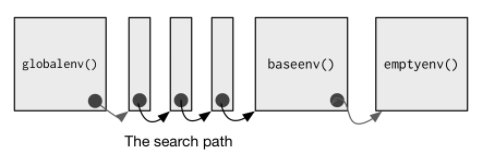

```{r, eval=FALSE}
library(stars)
s3url <- glue::glue("/vsis3/activemapper/",
                    "planet/composite_sr_buf_fix/GS/",
                    "tile486317_736815_736967.tif")  # not accessible
p <- read_stars(s3url, proxy = TRUE)
png(here::here("external/slides/figures/ghana_planet_stars.png"), height = 2.9, 
    width = 8, units  = "in", res = 300, bg = "white")
plot(p)
dev.off()
```

---

# Today

- R ecosystem continued: OO and environments
- Indexing and subsetting

---

## Functions
### Components

```{r, eval=FALSE}
function_name <- function(arg1, arg2 = 1:10, 
                          arg3 = ifelse(arg2 == 2, TRUE, FALSE)) {
  body
}
```

Three components of a function:
- `formals()`: arguments
- `body()`, the code, which returns the last object generated, unless specified with `return(x)`.
- `environment()`, function finds the values

Unnamed functions are **anonymous** functions. 

---

## OO

- Procedural versus object-oriented (OO) programming
- OO bundles together data and functions into an object
- Class defines type/structure of object and what methods (functions) are used with it
- 3+ types of OO in R

---

## OO - Base system? 
```{r}
x <- 1:10
!is.object(x)  # if TRUE, base object. 
str(x)
```
---
## 00 - S3 system?
```{r}
x <- lm(x ~ rev(x))
!is.object(x)  # if TRUE, base object. 
!isS4(x)  # it’s S3
str(x)
```

---
## OO - S4 system? 
```{r}
x <- raster::raster(nrow = 10, ncol = 10)
!is.object(x)  # if TRUE, base object. 
!isS4(x)  # it’s S3
!is(x, "refClass") # it’s S4; otherwise it’s RC.
str(x)
```

---

## Environments
```{r, out.width = "70%", echo=FALSE, fig.align='center', fig.cap="http://adv-r.had.co.nz/Environments.html"}

```

---
## Environments
- Global environment
- Package environment
    - external interface to package - how we find functions 
- Namespace environment
    - internal interface to package - how functions find variables
- Function environment (see http://adv-r.had.co.nz/Environments.html#function-envs)
  - Enclosing environment
  - Binding environment
  - Execution environment

---
###  Execution environments

```{r}
x <- 1:10
myfun <- function() {
  x * 10
}
myfun()

myfun <- function() {
  x <- x * 10
  # return(x)
  # print(x)
}
x1 <- myfun()
x

myfun <- function(x) {
  x <- x * 10
  return(x)
}
x <- 10
myfun(x = 20)
x


```

---

```{r}
myfun <- function(x) {
  x <- x * 10
  print(environment())
  return(x)
}
myfun(x)
myfun(x)
```

---
```{r}
i <- 0
lapply(1:10, function(x) {
  print(environment())
  return(x)
})

i <- 0
for(i in 1:10) {
  print(environment())
}
```

---
```{r}
i <- 0
sapply(1:10, function(x) {
  i <- i + x
  return(i)
})

i <- 0
for(x in 1:10) {
  i <- i + x 
  print(i)
}
```

---
```{r}
# restart r
search()
library(raster)
library(dplyr)

tibble(a = 1:10, b = 1:10) %>% 
  select(a)

# restart R
library(dplyr)
library(raster)
tibble(a = 1:10, b = 1:10) %>% 
  select(a)
tibble(a = 1:10, b = 1:10) %>% 
  dplyr::select(a)
```

---
## Create your own data

- Create the following:
  - `a`: a random vector of integers with 10 elements drawn from 1-20:
    - Use the `sample` function with `set.seed(10)`
    - Name the elements of `a` with a vector of names starting with "V1" and ending with "V10". 
      - Use the `paste0` function to create those names.
      - Create the identical vector of names using the `paste` function.
  - `b`: Using `a` as an index to select from `letters`
  - `d`: Use `rnorm` with a mean = 100 and an sd of 20
  - Why did I skip `c`? 
  - Create a list `l` from `a`, `b`, `d`. 
    - Assign the names of the vectors in `l` to the `l`'s elements

---
## 2-d structures

- Create the following:
  - `m`: a matrix with three integer columns named "V1", "V2", "V3"
    - Create each column first as its own vector, then combine
    - `V1` = 1:10
    - `V2` is a random sample between 1:100
    - `V3` is drawn from a random uniform distribution between 0 and 50     - Use the same `set.seed(50)` as before
    - Inspect the `str` and `class` of `m`
  - `dat`, a data.frame built from `V1`, `V2`, `V3`, and `V4`
    - `V4` is a random selection of the letters A-E

---
## 1-d Indexing/subsetting/replacing 
- Select the 1st, 2nd, and 10th elements from `a`
- Select the elements of `a` named V1, V2, V3 (use the names)
- Replace the second to last value of `a` with the word "sasquatch"
  - Use code to find the index value, not the actual integer value of the index
- Select from `b` the values "c", "d", "e"
- Identify the index position in `b` of values "c", "d", "e"
- Select the first 5 values of `d` and the last 5 values of `c` into two separate vectors and multiply them. 
- Select from `d` all values > 100:
  - How many values are there?
- Select from `d` all values between 95 and 105, and replace them with 100
- Repeat steps 1, 3, 4, and 8 above, but do it by accessing `a`, `b`, and `d` from `l` 

---
## 2-d Indexing/subsetting/replacing
- Select the first 10 values from `m`, using a single vector and no row or column information
- Use a single vector to select the last row, column value from `m`
- Replace the value selected in 2 above with -99
- Now select row 3, columns 1:2 from `m`, and replace them with their values multiplied by 10 
- Do the same, but select the columns by their name, and reset the new values by dividing by 10
- Select from `dat` the values of V3, and square them. Do it using index notation, column name in `[]`, and `$`
- Subset the first two rows and columns of `dat` into a new data.frame `datss`. 
- Replace `dat` rows 1:2, column 1:2 with the values -1:-4
- Reset the part of `dat` you just changed with the values in `datss`
---

## Summarizing datasets
- Calculate the row and column sums of both `m` and `dat`. 
- Calculate the overall means and sums of all values in each dataset
- From `dat`, use both the base `aggregate` function and `dplyr` function to calculate the group mean, using `V4` as the grouping variable. 


