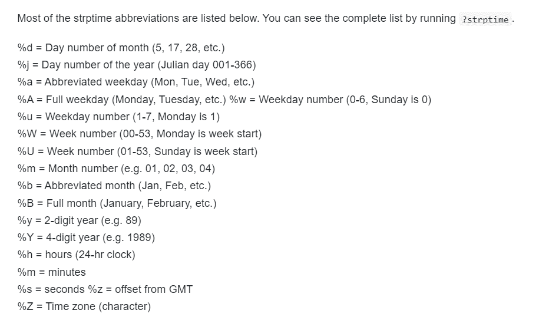

```{r, out.width = "70%", echo=FALSE, fig.align='center'}
# knitr::include_graphics("figures/cnh_figure.png")
```

```{r, eval = FALSE}
# code adapted from example from 
# https://www.r-graph-gallery.com/330-bubble-map-with-ggplot2
library(tidyverse)
library(sf)
library(geospaar)
districts <- read_sf(
  system.file("extdata", "districts.shp", package = "geospaar")
)
farmers <- read_csv(
  system.file("extdata", "farmer_spatial.csv", package = "geospaar")
) %>% group_by(uuid) %>% 
  summarize(x = mean(x), y = mean(y), n = n()) %>%
  filter(y > -18) #%>% st_as_sf(coords = c("x", "y"), crs = 4326)
p <- ggplot() + 
  geom_sf(data = districts, lwd = 0.1) + 
  geom_point(data = farmers, 
             aes(x = x, y = y, size = n, color = n), alpha = 0.9) +
  scale_color_viridis_c(guide = FALSE) + theme_void() + 
  theme(legend.position = c(0.85, 0.2)) +
  scale_size(range = c(0.1, 5), name = "N reports/week")
ggsave(here::here("external/slides/figures/zambia_farmer_repsperweek.png"), 
       width = 6, height = 4, dpi = 300, bg = "grey")
```

---

# Today

- Dates in R
- File Paths in R
- Reading/Writing data
- More Split/Apply/Combine (SAC)

---

## Review of exercises from last class


---
## Practice (1)

Create a short script that does the following.
- Loads `dplyr` library
- Uses `readr::read_csv` to read in sensor data into a tibble `data_tib`
- Uses `mutate` to create new column for GCVI index.
  - Sensor bands are [here](https://www.arable.com/wp-content/uploads/2021/10/Arable-Mark-2-w_-Solar-Product-Specifications-20_10.pdf). Use band 6 as the NIR band.
  - Google formula for GCVI (Green Chlorophyll Veg Index). 
  
---
## Practice (2)
- Install the `lubridate` package, and load it.
- Apply the `as_date` function to the column `local`. Use this to create a new column `date`, that stores the date as a `Date` object.
- [Lubridate cheat sheet](https://github.com/rstudio/cheatsheets/blob/main/lubridate.pdf)


---
## Practice (3)

- As in the example above, create a new tibble, `site_data`, using `group_by` and `summarize`.
- Use `site` as the grouping variable, and include columns for the following:
  - Median lat and median long (why is `median` better than `mean`)
  - Max NDVI and max GCVI
  - Date of max NDVI and date of max GCVI
- `Lubridate` allows us to subtract dates and find their difference in days. Use this to create a new column `date_diff` in `site_data`. This column should show how many days later (or earlier) the NDVI peak occurred compared to the GCVI peak. 

- CHALLENGE: include the `PlantingDate` column in `site_data`. Use `as_date` with the argument `format = format = "%m/%d/%Y"` to convert the planting date to a `date` data type. Determine how many days after the planting the peak NDVI occurred. 


---
## Dates with `lubridate`

- The main function you want to use is `as_date`, which can convert a character to date format. 

```{r, message = F}
library(lubridate)
date1 <- as_date("2022-03-01") ## date in standard YYYY-MM-DD format
print(date1)
```
---
## Dates with `lubridate`

- More challenging with unclear date formats.

```{r}
date2 <- as_date("3/1/22") ## is month or date first?
```
Include format as shown below. See [formats in this link](https://epirhandbook.com/en/working-with-dates.html)
```{r}
date2 <- as_date("3/1/22", format = "%m/%d/%y" )
date2
```

We can also write dates in desired format
```{r}
date2_char <- as.character(date2, format = "%A %B %d, %Y")
date2_char
```
---
## Date formats

```{r, out.width = "40%", out.height= "40%", echo=FALSE, fig.align='center'}

```
How can we read in this date?
```{r}
date3 = as_date("Apr 3, 1999", format = "...")
date3
```

---

## File paths

Let's read in a csv a few different ways.

Full path - clear for you, bad for code sharing.

```{r}
data_tib <- readr::read_csv("C:/Users/micha/Documents/geospaar/inst/extdata/cdf_corn.csv")
data_tib
```

---
## Working directory `"."`

- Working directory. Use `getwd()` (from console)  
- Usually set to project folder.  

```{r}
getwd() ## if in an RMD, this will show the folder of the RMD
```

Use `.` to start a file path from the working directory

```{r, eval = F}
list.files(".") ## 
```

```{r, eval = F}
data_tib <- readr::read_csv("./inst/extdata/cdf_corn.csv")
```

- Use ".." to go up one folder level
```{r, eval = F}
list.files(".") ## files in working directory
list.files("..") ## files in folder one level up
```
---
## User directory `"~"`

- Set by environment variable
- Use command below to see value

```{r}
path.expand("~")
```


```{r, eval = F}
data_tib <- readr::read_csv("~/geospaar/inst/extdata/cdf_corn.csv")
```

---
## Writing files

- Use `write.csv` or `readr::write_csv` to write

```{r, eval = F}
readr::write_csv(data_tib, file = "temp.csv") ## by default writes to wd()
```

---
## Saving/loading files
- If you want to save an R object, like a `data.frame`, `tibble` etc.
- Use save, and `.rda` extension

```{r, eval = F}
save(data_tib, file = "temp.rda") ## by default writes to wd()
```

```{r, eval = F}
data_tib <- NULL
load( file = "temp.rda") ## loads file back to environment
```
---
## SAC (split-apply-combine)

- Split data into groups
- Apply a function on each group of data
- Combine results into a (reduced) `tibble`

---
## Base R SAC
- There are three "site_groups": Stockton, Lincoln, North Platte.

```{r}
data_obs <- readr::read_csv("../inst/extdata/cdf_corn.csv")
site_groups <- unique(data_obs$site_group)
site_groups
```
- Find mean NDVI by site group.

```{r, eval = F, message = F}
group_NDVI <- lapply(  ??, function(x){
  ????
})
```

---
## Base R SAC

- Find mean NDVI by site group.

```{r}
group_NDVI <- lapply(site_groups, function(x){
  group_obs <- data_obs[data_obs$site_group == x, ] ## SPLIT 
  mean_ndvi <- mean(group_obs$NDVI, na.rm = T) ## APPLY
  o <- data.frame(group = x, mean_ndvi = mean_ndvi)  ##CREATE ONE ROW DATA FRAME
  print(o)# here the apply
})
```

Combine single row data frames
```{r}
group_NDVI_combined <- do.call("rbind", group_NDVI)
group_NDVI_combined
```

---

## `dplyr` SAC
```{r, eval = F}
group_NDVI_dplyr <- data_obs %>% group_by(??) %>% summarize(??)
```

---

## `dplyr` SAC
```{r}
library(dplyr)
group_NDVI_dplyr <- data_obs %>% 
  group_by(site_group) %>% 
  summarize(mean_NDVI = mean(NDVI, na.rm = T))
group_NDVI_dplyr
```


---
## Splitting on more than one variable

Dplyr - one line code
```{r, eval = F}
crop_ylds %>% group_by(crop, country) %>% summarize(mean_yield = mean(yield))
```

Base R - two lapply's! Much more confusing


---

## Exercises (1). Write csv for each site's observations.

- Read in the `cdf_corn.csv` file using the working directory path (e.g. "./inst/extdata/cdf_corn.csv". Store in a variable `data_obs`
- Using `unique()` find a list of unique site_id.  Save the unique site IDs in a variable `sites`.
- Use a `for` loop that:
  - Iterates over each `site` in `sites`
  - Filters `data_obs` to only those observations in `site`. 
  - Stores the filtered observations in an object `site_obs`.
  - Writes a csv (to your working directory) of the filtered observations for each site. The csv name should be `site_name.csv`, for the name of each site. 
  
---
## Exercises (2). Create list to store each sites observations.

- Similar to above, but instead of writing csv's, we want to save the filtered observations for each site in a list `l`.
- So `l[[1]]` has the observations for the first site, `l[[2]]` for the second site, etc.
- Use `lapply` for this, iterating over `sites`.
- e.g. `lapply(sites, function(x){...})`
- the final result should be a list `l` .
- The names of `l` should be the site names. So l[['site_name_1']] gives the observations for site 1. 
- Use `save` to save list to a .rda file.

---
## Exercises (3). Find mean SAVI for each site.

- Create a column "SAVI" in `data_obs`. It should contain the SAVI as calculated from the NIR band (b6r) and red band (b4r).
- Using `group_by`, 'summarize' (dplyr), create a table listing the sites and mean SAVI per site.
- Using `lapply` and base R, create a table listing the sites and mean SAVI per site.
- Arrange sites from highest average SAVI to lowest. 

---
## CHALLENGE Find mean SAVI for each site, separated by month.
- Using `lubridate::as_date` create a column `date` that converts the column `local` to a date object.
- Then find the `lubridate` function that can extract the month from a date.
- Use this function to create a new column `month` that stores the month for each observation. 
- Use `group_by` and `summarize` to group by both `site_ID` and `month`, and calculate the mean SAVI. 

---
## Homework
- Finish reading Unit 1, Module 4
- Practice exercises above (at least 2 hours)
- QUIZ MONDAY


