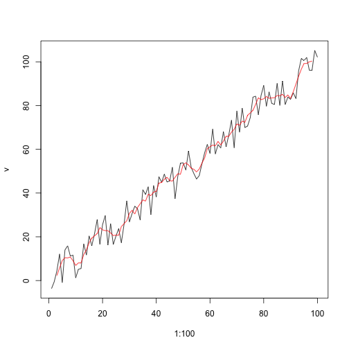

```{r, eval=FALSE}
library(sf)
library(dplyr)
library(ggplot2)
library(rnaturalearth)
library(rnaturalearthdata)
data(world.cities, package = "maps")

world <- ne_countries(scale = "medium", returnclass = "sf")
afr_capitals <- world.cities %>% filter(capital == 1) %>% 
  st_as_sf(coords = c("long", "lat"), crs = 4326) %>% 
  st_intersection(., world %>% filter(continent == "Africa"))
p <- world %>% filter(continent == "Africa") %>% 
  ggplot() + geom_sf(aes(fill = name), lwd = 0.2) + 
  geom_sf(data = afr_capitals, col = "blue", size = 0.5) + 
  scale_fill_grey(guide = FALSE) + theme_minimal()
ggsave(here::here("external/slides/figures/africa_capitals.png"), 
       width = 5, height = 4, dpi = 300, bg = "transparent")
```

---

## Functions
### Components

```{r, eval=FALSE}
function_name <- function(arg1, arg2 = 1:10, 
                          arg3 = ifelse(arg2 == 2, TRUE, FALSE)) {
  body
}
```

Three components of a function:
- `formals()`: arguments
- `body()`, the code, which returns the last object generated, unless specified with `return(x)`.
- `environment()`, function finds the values

Unnamed functions are **anonymous** functions. (Used in `*apply`)

---

Using `x` in a function does not change its global value.
```{r}
x <- 1:10
myfun <- function() {
  x * 10
}
myfun()

myfun <- function(x) {
  x <- x * 10
  return(x)
}
x <- 10
myfun(x = 20)
x
```

---
Each time you run `myfun`, a new function environment is created.
```{r}
myfun <- function(x) {
  x <- x * 10
  print(environment())
  return(x)
}
myfun(x)
myfun(x)
```

---
## Global assignment.
Use `<<-` to change value of global variable within a function.


```{r, message=FALSE}
a <- 10
myfun <- function(x) {
  a <<- x * 10   ## note <<- instead of <- 
  return(a)
}
myfun(5)
print(a)
```

---

```{r, error=TRUE}
library(dplyr)
search()
set.seed(1)
v <- 1:100 + runif(100, -10, 10)
f <- filter(v, rep(1 / 5, 5))
```

---
```{r, error=TRUE, fig.align='center', out.width="50%"}
detach("package:dplyr", unload = TRUE)
search()
f <- filter(v, rep(1 / 5, 5))
```
```{r, eval=FALSE}
plot(1:100, v, type = "l")
lines(1:100, f, col = "red")
```
```{r, echo=FALSE, out.width="45%", fig.align='center'}


```


---
## Useful functions

- `which` finds indices where a condition is true.

```{r, message=FALSE}
v <- 10:15
print(v)
a <- which(v %% 3 == 0) ## subset to elements divisible by 3
print(a) ## shows indices where condition is true.
```

---
## Useful functions
- `which.min` finds index of min value

```{r, message=FALSE}
v <- sample(1:20, 10)
print(v)
print(which.min(v)) # index of min value
print(which.max(v)) # index of max value
```

---
## data.frame vs data.table vs. tibble
- all 2D structures.
- data.frame = Base R
- tibble = `tidyverse`
- data.table = fast.

For now, we'll stick to data.frame
---

## data.frame indexing

- `data.frame` uses the following to subset: `[*row conditions, *column conditions]`

```{r, message=FALSE}
df <- data.frame(v1 = 1:5, v2 = 6:10)
rownames(df) <- LETTERS[1:5]
print(df)
```

---

## data.frame indexing

- Index using names. 
- Empty index `[  ,  'v2]` means "keep all rows"
```{r, message=FALSE}
df[,'v2'] ## column indexing
df[c("A", "B", "D"), ] ## row indexing
```
---
## data.frame subset

- Logical subset 
```{r, message=FALSE}
df[df$v1 > 3, ] ## get observations (rows) where first column is larger than 3
```

---
## Control structures
### Branching

- Pay attention to `{ }` placement
```{r}
a <- 5
if(a > 10) {
  print("Greater than 10!")
} else {
  print("Less than or equal to 10")
}
```

---
### Looping
```{r}
b <- 1:3
for(i in b) print(i)
```

```{r}
b <- 1:5
a <- 2
for(i in b){
  a <- 2 * a
  print(a)
}
```
---

### *apply
- A special form of looping
- Intended for *applying* a function to data. Uses *anonymous* function.
- 3 main kinds: `sapply`, `lapply`, `apply`


---
### `sapply`
- `sapply` iterates over input and returns a vector.
```{r}
v <- 1:10
sapply(v, function(x) x + 10) ## adds 10 to each element in v.
```
Use `{ }` for more complicated functions. BUT be careful with order of `{ }`, `( )`
```{r}
v1 <- 1:10
v2 <- sapply(v1, function(x){
  y <- x^2 
  return(y)
}) #
print(v2)
```
---
### `sapply`
If you don't specify `return`, the last object created will be returned.
```{r}
v1 <- 1:10
v2 <- sapply(v1, function(x){
  y <- x^2  ## y will be returned
}) #
print(v2)
```
---

### `lapply`
- Similar to `sapply`, except final object is returned as `list`.
- Useful if you need to store more complex objects (data.frame, plot, raster etc.)

```{r}
v1 <- 1:10
v2 <- lapply(v1, function(x){
  y <- x^2  ## y will be returned
}) #
print(v2)
```
---

### `apply`
- `apply` works well for 2D data, when you want to apply function over a row or column. 

```{r}
v1 <- sample(1:100, 10)
v2 <- sample(1:100, 10)
DF <- data.frame(v1, v2) ## data frame columns will take names of vectors
DF
```
---

Use `apply` to get column max value. The index 2 means "apply function to columns".

```{r}
colMax <- apply(DF, 2, FUN = max)
colMax
```

---

Use `apply` to get row max value. The index 1 means "apply function to rows".

```{r}
rowMax <- apply(DF, 1, FUN = max)
rowMax
```

We can use `apply` or `sapply` to create a new column in a data frame. 
```{r}
DF$rowMax <- apply(DF, 1, FUN = max)
DF
```

## Data generation

Create the following:
- `dat`, a data.frame built from `V1`, `V2`, `V3`, and `V4`, where:
  - `V1` = 1:20
  - `V2` is a random sample between 1:100
  - `V3` is drawn from a random uniform distribution between 0 and 50     
  - `V4` is a random selection of the letters A-E
  - Use `set.seed(50)`
- Do this all at once (i.e. wrap the creation of V1-V4 in the `data.frame` call, precede it with `set.seed()`)

---

## Exercises

- Use a `for` to iterate over each row of `dat` and calculate it's `sum`
- Do the same with `lapply` and `sapply`
- Do the same using `rowSums`
- Select rows from `dat` containing the letter "E" in `V4`, and take the mean of values from the result in column `V3`


