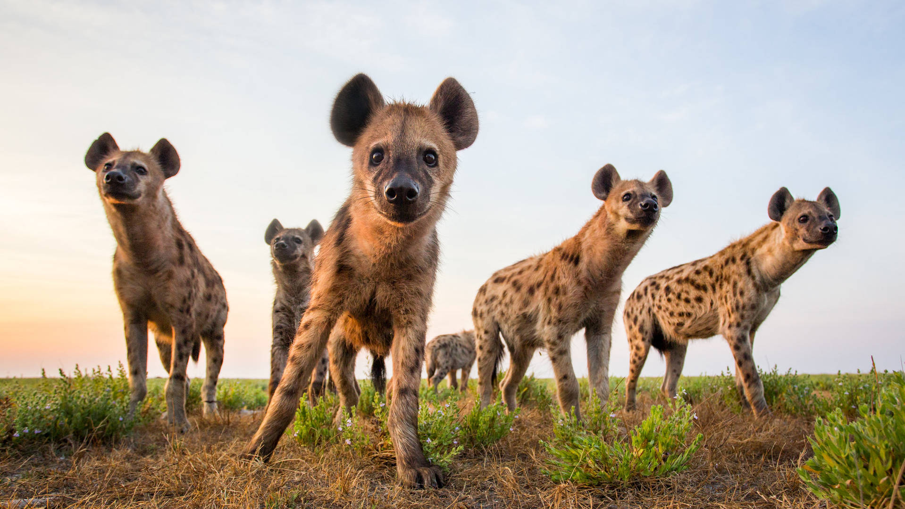

<style>
.html-widget {
    margin: auto;
}
</style>

```{r setup, include=FALSE}
knitr::opts_chunk$set(echo = TRUE)
```

## Introduction

```{r, echo=FALSE, fig.align='center'}

```
Source: https://www.expertafrica.com/wildlife/spotted-hyena/africa

Today, we will look at the distribution and environmental suitability of Spotted Hyenas. The occurrence is downloaded from [GBIF](https://www.gbif.org). The environmental variables are [bioclimatic variables](https://www.worldclim.org/data/bioclim.html):

```{r, echo=F}
library(kableExtra)
bios <- data.frame(code = paste0('BIO', 1:19),
                   name = c('Annual Mean Temperature', 
                            'Mean Diurnal Range (Mean of monthly (max temp - min temp))',
                            'Isothermality (BIO2/BIO7) (×100)',
                            'Temperature Seasonality (standard deviation ×100)',
                            'Max Temperature of Warmest Month',
                            'Min Temperature of Coldest Month',
                            'Temperature Annual Range (BIO5-BIO6)',
                            'Mean Temperature of Wettest Quarter',
                            'Mean Temperature of Driest Quarter',
                            'Mean Temperature of Warmest Quarter',
                            'Mean Temperature of Coldest Quarter',
                            'Annual Precipitation',
                            'Precipitation of Wettest Month',
                            'Precipitation of Driest Month',
                            'Precipitation Seasonality (Coefficient of Variation)',
                            'Precipitation of Wettest Quarter',
                            'Precipitation of Driest Quarter',
                            'Precipitation of Warmest Quarter',
                            'Precipitation of Coldest Quarter'))
bios %>% 
  kbl(row.names = F, caption = 'Bioclimatic variables') %>% 
  kable_paper("striped", 
              html_font = 'helvetica',
              font_size = 12,
              full_width = F)
```

The habitat of Spotted Hyenas is mainly sub-Saharan Africa.

```{r, echo=F, warning=F, message=F, fig.align='center'}
library(here)
library(sf)
library(dplyr)
library(leaflet)
occurrence <- read.csv('/Users/leisong/Downloads/0224898-200613084148143.csv', 
                        sep = '\t', stringsAsFactors = F) %>% 
  dplyr::select(gbifID, species, countryCode, 
         decimalLatitude, decimalLongitude, 
         day, month, year) %>% 
  distinct() %>% 
  st_as_sf(coords = c('decimalLongitude', 'decimalLatitude'),
           crs = 4326)

hyenaIcons <- makeIcon(iconUrl = here("docs/figures/hyena.png"), 
                       iconWidth = 15, iconHeight = 15)

leaflet(occurrence) %>% 
  addProviderTiles(providers$Esri.WorldImagery) %>%
  setView(lng = 25, lat = -3.8, zoom = 03) %>% 
  addMarkers(icon = hyenaIcons)
```


Because we didn't learn spatial analysis yet, we will focus on non-spatial analysis today:

- Clean the dataset a bit for the analysis.
- Analyze the bias of observations.
- Analyze the distribution of observations.
- Analyze the ecological niche.

```{r prep, eval=F, echo=F}
library(sf)
library(raster)
library(dplyr)
library(passport)
library(eifsdm)
library(readr)
options(timeout = 500)
occurrence <- read.csv('/Users/leisong/Downloads/0224898-200613084148143.csv', 
                        sep = '\t', stringsAsFactors = F) %>% 
  dplyr::select(gbifID, species, countryCode, 
         decimalLatitude, decimalLongitude, 
         day, month, year) %>% 
  distinct() %>% 
  st_as_sf(coords = c('decimalLongitude', 'decimalLatitude'),
           crs = 4326)
bry <- st_bbox(occurrence) %>% 
  st_as_sfc() %>% 
  st_sf(crs = 4326)

bios <- worldclim2(var = 'bio', res = 2.5, bry = bry, path = tempdir())
bios <- raster::extract(bios, occurrence, sp = T) %>%
  st_as_sf() %>%
  cbind(st_coordinates(.)) 

variables <- bios %>%
  dplyr::select(gbifID,
    contains('bio')) %>% 
  st_drop_geometry() %>% 
  dplyr::select(c('gbifID', 
                  paste0('wc2.1_2.5m_bio_', 1:19)))
write_csv(variables, 'docs/hyenas_variables.csv')

occurrence <- read.csv('/Users/leisong/Downloads/0224898-200613084148143.csv', 
                        sep = '\t', stringsAsFactors = F)
write_csv(occurrence, 'docs/hyenas_occurrence.csv')
```

## Data manipulation

**Tasks:**

- Use `read.csv` to read occurrence table and assign to object `occurrence`. 
- Select out columns gbifID, species, countryCode, decimalLatitude, decimalLongitude, month, and year.
- Add an extra column `country`, use function `as_country_name` in package `passport` to get country names based on countryCode.
- Use `read_csv` to read variables table and assign to object `variables`.
- Select out columns gbifID, wc2.1_2.5m_bio_1, wc2.1_2.5m_bio_4, wc2.1_2.5m_bio_5, wc2.1_2.5m_bio_6, wc2.1_2.5m_bio_12, wc2.1_2.5m_bio_13, wc2.1_2.5m_bio_14, wc2.1_2.5m_bio_15, and rename bio columns to format `bio**`.
- Inner join two tables occurrence and variables into one table `occ_var`.

Hint: we could directly use URL as the path to read tables.

```{r, eval=F}
library(readr)
library(dplyr)
library(passport)

# Read occurrence

# Read variables

# Join two tables, remove NAs and duplicates

head(occ_var)
```

## Exploratory analysis
### Bias of observations

First, let's have a look at the potential bias of observations. One hypothesis:

- People have higher chance to observe Hyenas with more out-door activities.

#### Month

**Tasks:**

- Make a histogram of occurrence count for each `month` by filling the `___`.

```{r, eval=F}
library(ggplot2)
ggplot(___) + 
  geom_histogram(aes(x = as.factor(___)), 
           stat = 'count', 
           color = '___',
           fill = '___') +
  labs(x = '___', y = '___') +
  theme_bw()
```

#### Year

**Tasks:**

- Make a histogram of occurrence count for each `year` from scratch.

```{r, eval=F}
library(ggplot2)
ggplot(___) + 
  ___ # Fill the rest layers of the figure
```

### Spatial distribution

**Distribution by countries**

**Tasks:**

- Make a barplot for each country, and fill the bar of each country by month.
- Fill the `___` to make the code work.

```{r, eval=F}
occ_var %>%
  ggplot(aes(forcats::fct_infreq(___))) + 
  geom_bar(aes(fill = as.factor(___)), 
           color = '___') +
  labs(x = '___', y = '___') +
  scale_fill_brewer(palette = "Paired", name = '___') +
  theme_bw() +
  theme(___ = element_text(angle = ___, hjust = ___))
```

**Randomly select 5 years to plot**

Since we don't learn spatial analysis yet. So now we just plot coordinates in Cartesian coordinate system like a regular plot.

**Task:**

- Subset the `occ_var` with `year >= 2000`.
- Randomly select 6 years out with seed 10. Hint: use `sample` function and `%in%` operator.
- Make a scatterplot with decimalLongitude as x and decimalLatitude as y. And let the scatterplot has different colors for each year.
- Customize the color of years. Hint: `scale_color_brewer`
- Reset x and y axis text.
- Set a theme for your figure.

```{r, eval=F}

```

### Environmental suitability

**Tasks:**

- Just select out `bio` columns.
- Calculate the mean of these variables.
- Do whatever necessary to put the results into a table with one column `Variable` of variable names and another column `Mean` of mean values.
- Use `kableExtra` to show the table.

```{r, eval=F}
library(kableExtra)
var_mean <- ___ # Fill the manipulation here
  
var_mean %>% 
  kbl(row.names = F, caption = 'Variable mean') %>% 
  kable_paper(___) # Set the table based on your preference.
```

**Tasks:**

- Just select out `bio` columns.
- Expand the table using `pivot_longer` to put the names of variables to column `var`, and values of variables to column `value`.
- Then add a column `group`: if bio1, bio4, bio5, has value "Temperature", if not, has value "Rainfall". Hint: use `ifelse`.
- Make boxplot of `var` and `value`, and make facets based on `group`.
- Set necessary axis text and theme.

```{r, eval=F}
library(tidyr)
occ_var %>% 
  dplyr::select(___) %>% 
  pivot_longer(cols = ___,
               names_to = ___, values_to = ___) %>% 
  mutate(group = ___) %>% 
  ggplot() +
  ___ # Fill the rest layers for the figure
```

**Ecological niche**

**Tasks:**

- Make a scatterplot of bio1 (x) and bio12 (y).
- Set x and y axis text based on Bioclimatic variables code table.
- Add two horizontal lines of linetype 2 and color red with intercept corresponding to the min and max value of bio12. Hint: use `geom_hline`.
- Add two vertical lines of linetype 2 and color with intercept corresponding to the min and max value of bio1. Hint: use `geom_vline`.
- Set a theme for your figure.

```{r, eval=F}
occ_var %>% 
  ggplot(aes(x = ___, y = ___)) +
  ___ # Fill the rest layers for the figure
```

