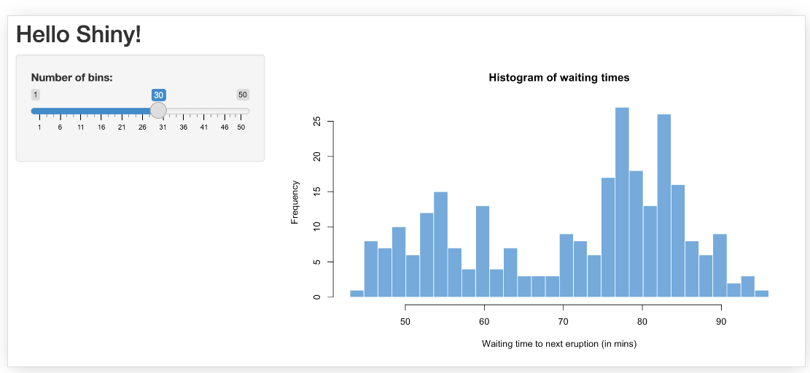

```{r setup, include=FALSE}
knitr::opts_chunk$set(echo = TRUE)
```

## Shiny
- The `Shiny` package allows for creation of interactive apps, that can be hosted on a website.
- The [Shiny website](https://shiny.rstudio.com/gallery/) is a great place to start, with a gallery and examples.


---
## Shiny app
The app code is divided into three parts
- `ui` defines the components of the interface (buttons, tabs, maps etc)
- `server` defines how user inputs and data are combined to change what is displayed. 
- `shinyApp` function launches the app
```{r, eval = F}
ui <- ## ui code
  
server <- ## server code
  
shinyApp(ui = ui, server = server) ## launches the interactive app
```

---
## UI
- There are several options for UI (e.g. layouts). 
- [Layout items](https://shiny.rstudio.com/articles/layout-guide.html)
- The sidebar element is a good place to start

```{r, out.width = "80%", echo=FALSE, fig.align='center'}

```


---
## Inputs, Outputs
- Inputs: user can enter information
  - text box, check box, mouse click on a map
- Outputs: display objects created by R code
  - plots, charts

---
## IDs
- Both inputs and output objects have IDs
  - slider Input has ID `bins`
  - plot output has ID `distPlot`

```{r, eval = F}
library(shiny)

ui <- fluidPage(
  titlePanel("Hello Shiny!"),
  sidebarLayout(
    sidebarPanel(
      sliderInput(
        "bins", label = "Number of bins:",
        min = 1, value = 30, max = 50
      )
    ),
    mainPanel(
      plotOutput("distPlot")
    )
  )
)
```

---
## Server
- Server object contains the R code
- Server code takes inputs and loaded data to create outputs
  - `output$distPlot` indicates that an output object with ID `distPlot` is created
  - `input$bins` takes input from the `bins` input object
  - `renderPlot` is a shiny function for creating a plot. The code inside uses the base `hist` function
```{r, eval = F}
# Define server logic required to draw a histogram ----
server <- function(input, output) {
  output$distPlot <- renderPlot({
    x    <- faithful$waiting
    bins <- seq(min(x), max(x), length.out = input$bins + 1)
    hist(x, breaks = bins, col = "#007bc2", border = "white",
         xlab = "Waiting time to next eruption (in mins)",
         main = "Histogram of waiting times")
    })
}
```

---
## Launch app

```{r, eval = F}
shinyApp(ui = ui, server = server)
```

---
## rgee example
- [Source code](https://www.r-bloggers.com/2022/05/how-to-connect-google-earth-engine-with-r-shiny/)
- First create a helper function `createTimeBand`
- Create an image collection of nightlights data, and calculate the linear trend of nightlights at each pixel. (stored in `col_reduce`)

```{r, eval = F}
library(rgee)
library(leaflet)
library(shiny)
ee_Initialize()

createTimeBand <- function(img) {
  year <- ee$Date(img$get("system:time_start"))$get("year")$subtract(1991L)
  ee$Image(year)$byte()$addBands(img)
}
collection <- ee$
  ImageCollection("NOAA/DMSP-OLS/NIGHTTIME_LIGHTS")$
  select("stable_lights")$
  map(createTimeBand)

col_reduce <- collection$reduce(ee$Reducer$linearFit())
col_reduce <- col_reduce$addBands(
  col_reduce$select("scale")
)
```


---
## rgee example - UI
- sidebar layout
- left side has three inputs
  - numeric box `in_latitude`
  - numeric box `in_longitude`
  - button `reposition`
- main panel has one output object
  - `map`, displays leaflet map
```{r, eval = F}
ui <- fluidPage(
  sidebarLayout(
    sidebarPanel(
      numericInput(inputId = "in_latitude", label = "Latitude", value = 9.08203, min = -90, max = 90, step = 0.1),
      numericInput(inputId = "in_longitude", label = "Longitude", value = 47.39835, min = -180, max = 180, step = 0.1),
      actionButton(inputId = "reposition", label = "Reposition Map")
    ),
    mainPanel(
      leafletOutput(outputId = "map")
    )
  )
)
```

---
## rgee server
- `eventReactive` means that the map object waits for an input (from `reposition` button) to update
- once `reposition` button is clicked, the map is recentered on new lat, long
```{r, eval = F}
server <- function(input, output) {
  map_reactive <- eventReactive(input$reposition,
    {
      Map$setCenter(input$in_latitude, input$in_longitude, 3)
      Map$addLayer(
        eeObject = col_reduce,
        visParams = list(
          bands = c("scale", "offset", "scale"),
          min = 0,
          max = c(0.18, 20, -0.18)
        ),
        name = "stable lights trend"
      )
    },
    ignoreNULL = FALSE
  )

  output$map <- renderLeaflet({
    map_reactive() ## creates the map
  })
}
```

---
## rgee launch
```{r, eval = F}
shinyApp(ui = ui, server = server)
```

---
## MA Environmental Justice Population
```{r, eval = F}
ej_pop <- read_sf("C:/Users/micha/Downloads/ej2020/EJ_POLY.shp") %>% st_transform(., crs = '+proj=longlat +datum=WGS84' )

towns <- unique(ej_pop$MUNICIPALI) %>% sort()
```

---
## UI
- `titlePanel`
- `leafletOutput` (map)
- `fluidRow` with `selectInput` for towns and `plotOutput` 
```{r, eval = F}
ui <- fluidPage(

  titlePanel("Env Justice Pop"),
  leafletOutput("map"),
  fluidRow(
    column(4,
      wellPanel(
        selectInput("Towns",
                "Select Town to Zoom", 
                choices = towns),
        textOutput("summary")
      )       
    ),

      column(8,
        plotOutput("EJ_plot")
      )
  )
)
```

---
## Server
```{r, eval = F}
server <- function(input, output, session) {

  
   ### code for when town select box is changed
  observeEvent( input$Towns,  {  
    town <- print(input$Towns)
    town_bg <- ej_pop %>% filter(MUNICIPALI == town) 
    cent <- town_bg %>% st_union() %>% st_centroid() %>% st_coordinates() 
    
    output$summary <- renderText({
      paste("current town:", town)
    })
    output$map <- renderLeaflet({
    leaflet(ej_pop) %>%
      addProviderTiles("CartoDB.Positron") %>% 
      addPolygons(data= ej_pop, color = "green") %>% 
      addPolygons( data = town_bg, color = 'red') %>% 
        setView(
          lng = cent[1],
          lat = cent[2],
          zoom = 10)

  })
    },  ## handlerExpr
      ignoreInit = TRUE
    )
  
  
  
  
   ### code for when a shape on map is clicked
  observeEvent(input$map_shape_click, {

      click <- input$map_shape_click
      click_lng <- click$lng
      click_lat <- click$lat
      
      current_obj_id <- which(!is.na(st_intersects(ej_pop, 
                                                st_point(c(click_lng, click_lat))) %>% as.numeric()))
      
      current_obj <- ej_pop[current_obj_id, ]
      current_bg <- current_obj$GEOGRAPHIC %>% first()
      current_town <- current_obj$MUNICIPALI %>% first()
      current_bg_crit <- current_obj$EJ_CRIT_DE %>% first()
      
      current_min_pop <- current_obj$PCT_MINORI
      current_lim_eng <- current_obj$LIMENGHHPC
      current_hhinc <- current_obj$BG_MHHI_PC
      print(current_min_pop)
      
     # current_bg_pop <- 
      
      
      #print(click$lat)
     # this_shape <- ej_pop[match(click$id, ej_pop$id),]
      
     leafletProxy("map") %>% 
        setView(
          lng = click_lng,
          lat = click_lat,
          zoom = 12)
      
      output$EJ_plot <- renderPlot({
        barplot(c(current_min_pop,
              current_lim_eng,
              current_hhinc),
              main = current_bg,
              sub = paste("EJ crit:", current_bg_crit),
            names.arg = c('% min', '% lim eng', '% inc'))
  })
    
  })
  

  
   ### code for displaying map initially
  output$map <- renderLeaflet({
    leaflet(ej_pop) %>%
      addProviderTiles("CartoDB.Positron") %>% 
    addPolygons(data= ej_pop, color = "green")
  })
  
}

```

---
## EJ population launch
```{r, eval = F}
shinyApp(ui = ui, server = server)
```

---
## Questions to ask
- What information do I want from users? (inputs)
- What plots/charts do I want to show (output)
- How to create plots/charts? (server logic)
- When to update plots/charts (`observeEvent`, `eventReactive`)

---
## Links
- [Shiny Tutorials - BEST](https://rstudio-education.github.io/shiny-course/)
- [Shiny Leaflet](https://rstudio.github.io/leaflet/shiny.html)
- [Shiny rgee](https://appsilon.com/interactive-google-maps-with-r-shiny/)
- [Layout items](https://shiny.rstudio.com/articles/layout-guide.html)
- [Gallery](https://shiny.rstudio.com/gallery/)

