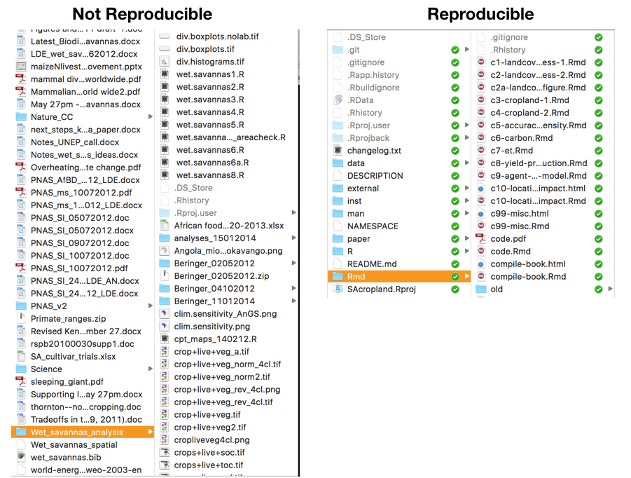

```{r setup, include=FALSE}
# knitr::opts_chunk$set(echo = FALSE)
```

```{r, eval = FALSE}
library(raster)
library(viridis)
ghana_dem <- getData(name = "alt", country = "GHA")
png("inst/slides/figures/ghana-dem.png", bg = "transparent", height = 4, 
    width = 3, res = 300, units = "in")
par(mar = c(3, 0, 0, 0))
plot(as(extent(ghana_dem), "SpatialPolygons"), lty = 0)
plot(ghana_dem, col = magma(100), add = TRUE, axes = FALSE, box = FALSE, 
     legend = FALSE)
plot(ghana_dem, col = magma(100), legend.only = TRUE, horizontal = TRUE, 
     axis.args = list(col.axis = "white", col = "white", las = 2), 
     legend.args = list(text = "", col = "white"))
dev.off()
```

---

## Class Overview

- By the end of this class, you should:
    - Be comfortable in working with R, including most common geospatial functions
    - Have a good sense of where R is headed as a language
    - Know where to look when don't know how to do something
    - Be using R as part of a ___reproducible___ workflow

- Course approach
    - (Largely) flipped model and emphasis on problem solving
        - Programming should be fun! (or at least intriguing)
    - Lab and office hours as help sessions

---

## Reproducibility 1

```{r, out.width = "70%", echo=FALSE, fig.align='center'}

```

---

## Reproducibility 2
```{r, out.width = "50%", echo=FALSE, fig.align='center'}
knitr::include_graphics("figures/class1_2.png")
```
---

## Course Requirements

- Let's have a look at the [Syllabus](`r here::here("vignettes/syllabus.html")`)

---

## Changes

- `sf` replaced `sp`
- `raster` about to be replaced by `stars` or `terra`
- R's syntax is evolving

---

## Getting Set Up

- Get yourself a GitHub account, if you haven't
- Send us your GitHub name
- Install `git` on your local computer(s)
- Set up your [personal access token](`r here::here("vignettes/help.html")`)
- Install the `geospaar` library
- Learn how to create your own github repo under the [\@agroimpacts\/geog246346 team](https://github.com/agroimpacts)


