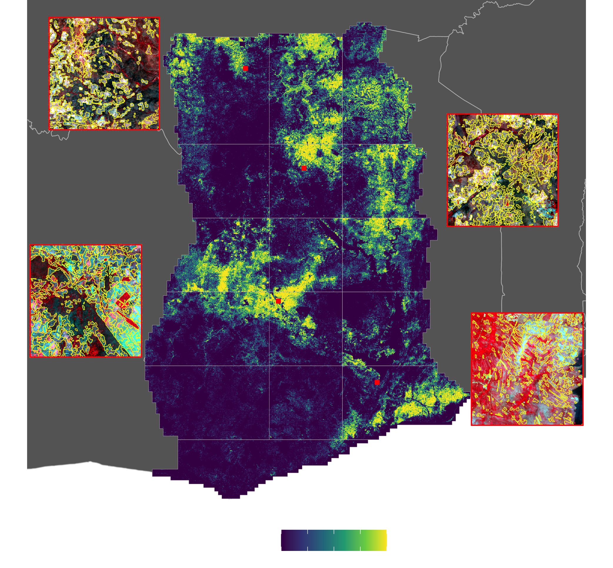

## Today

- Raster intro, continued
  - classes
  - dummy rasters
  - reading and writing
  - rasterize, raster to vector


---
```{r, echo=FALSE, out.width="92%", results='hold', fig.align='center'}

```
---

```{r, eval=FALSE}
library(stars)
library(ggplot2)
library(aws.s3)
library(RStoolbox)
library(cowplot)

segment_files <- dir(here("external/data/results/segments/merged"),
                     pattern = "boundarymerge", full.names = TRUE)
iid <- as.numeric(gsub("[[:alpha:]]|_|\\.", "", basename(segment_files)))
segment_files <- tibble(file = segment_files, order = iid) %>% arrange(iid)
segment_files <- segment_files %>% filter(!grepl("aoi3_*.*merge.geojson", file))

fdensity <- stars::read_stars(
  system.file("extdata", "field_density005.tif", package = "activemapper")
)

# OS images
osimgs <- get_bucket_df(
  bucket = "activemapper", prefix = "planet/composite_sr_buf_fix/OS/", max = Inf
) %>% as_tibble %>% select(Key)

# example tiles
flds_1 <- read_sf(segment_files$file[1])
flds_5 <- read_sf(segment_files$file[5])
flds_11 <- read_sf(segment_files$file[11])
flds_15 <- read_sf(segment_files$file[15])

tile_ss <- tiles %>% filter(tile %in% c(486794, 539730, 591243, 616490))
flds_tile1 <- flds_1 %>% filter(st_intersects(., tile_ss[1, ], sparse = FALSE))
flds_tile2 <- flds_5 %>% filter(st_intersects(., tile_ss[2, ], sparse = FALSE))
flds_tile3 <- flds_11 %>% filter(st_intersects(., tile_ss[3, ], sparse = FALSE))
flds_tile4 <- flds_15 %>% filter(st_intersects(., tile_ss[4, ], sparse = FALSE))

```
---

```{r, eval=FALSE}
impath <- osimgs %>% 
  filter(grepl(paste0(tile_ss$tile, collapse = "|"), Key)) %>% 
  mutate(pth = paste0("/vsis3/activemapper/", Key)) %>% pull(pth)

# inset maps
fld_tiles <- list(flds_tile1, flds_tile2, flds_tile3, flds_tile4)
isets <- lapply(1:4, function(x) {
  imgr <- brick(impath[x])[[2:4]]
  xylims <- st_bbox(imgr)
  iset <- ggplot() + 
    ggRGB(imgr, maxpixels = 50000, stretch = "lin", ggLayer = TRUE) +
    geom_sf(data = fld_tiles[[x]], fill = "transparent", color = "yellow", 
            size = 0.2) + 
    geom_sf(data = tile_ss[x, ], color = "red", fill = "transparent") + 
    scale_x_continuous(expand = c(0, 0)) + 
    scale_y_continuous(expand = c(0, 0)) + 
    coord_sf(xlim = xylims[c(1, 3)], ylim = xylims[c(2, 4)]) + 
    theme_void()
})
```

---
```{r, eval=FALSE}
# Main map
xylims <- st_coordinates(ghana)
# twk <- diff(range(xylims[, 1])) * 0.05
maprange <-  c(range(xylims[, 1]) + c(-1.25, 1.25), 
               range(xylims[, 2]))

inset_cols <- c("red", "orange", "pink", "brown")
p <- ggplot(africa) + 
  geom_sf(fill = "gray40", color = "grey", size = 0.25) +  
  geom_stars(data = fdensity * 100) +
  geom_sf(data = aois, size = 0.1, fill = "transparent", col = "grey") +
  geom_sf(data = tile_ss, fill = "red", col = "red") +
  scale_fill_viridis_c(name = "% cover", na.value = "transparent") +
  coord_sf(xlim = maprange[1:2], ylim = maprange[3:4]) + 
  theme_void() + 
  theme(legend.position = "bottom", 
        legend.text = element_text(colour = "white"), 
        legend.title = element_text(colour = "white"))

inset_map <- ggdraw() +
  draw_plot(p) +
  draw_plot(isets[[1]], x = 0.07, y = 0.77, width = 0.2, height = 0.2) + 
  draw_plot(isets[[2]], x = 0.72, y = 0.6, width = 0.2, height = 0.2) + 
  draw_plot(isets[[3]], x = 0.04, y = 0.37, width = 0.2, height = 0.2) + 
  draw_plot(isets[[4]], x = 0.76, y = 0.25, width = 0.2, height = 0.2)

ggsave(filename = here("presentations/figures/cropcover_with_insets.png"), 
       plot = inset_map, bg = "transparent", width = diff(maprange[1:2]), 
       height = diff(maprange[3:4]), units = "in", dpi = 300)

```

---

### Data
```{r, warning=FALSE, message=FALSE, results='hide'}
library(geospaar)
farmers <- system.file("extdata/farmer_spatial.csv", package = "geospaar") %>%
  read_csv %>% distinct(uuid, .keep_all = TRUE) %>% select(uuid, x, y) %>% 
  mutate(count = 1) %>% st_as_sf(coords = c("x", "y"))
roads <- system.file("extdata/roads.shp", package = "geospaar") %>% st_read
districts <- system.file("extdata/districts.shp", package = "geospaar") %>%
  st_read
```

---
## Reading/Writing/Manipulating rasters

- create
```{r, eval = FALSE}
r <- raster(extent(30, 31, -14, -13), res = 0.1, 
            crs = "+proj=longlat +datum=WGS84")
values(r) <- sample(1:10, size = ncell(r), replace = TRUE)

par(mar = c(0, 0, 0, 0))
plot(districts %>% st_geometry)
plot(r, add = TRUE)
plot(r)

s <- stack(r, log10(r))
names(s) <- c("dummy", "log10dummy")
plot(s)

b <- brick(s)
plot(b)

b2 <- lapply(1:10, function(x) {
  r <- raster(extent(30, 31, -14, -13), res = 0.1, 
              crs = "+proj=longlat +datum=WGS84")
  set.seed(x)
  values(r) <- sample(1:10, size = ncell(r), replace = TRUE)
  r
}) %>% stack %>% brick
plot(b2)
```

---
### A large brick
```{r, eval = FALSE}
b3 <- lapply(1:10, function(x) {
  r <- raster(extent(30, 31, -14, -13), res = 0.001, 
              crs = "+proj=longlat +datum=WGS84")
  set.seed(x)
  values(r) <- sample(1:10, size = ncell(r), replace = TRUE)
  r
}) %>% stack %>% brick
plot(b3)

```

---

- read and write

```{r, eval = FALSE}
writeRaster(r, filename = file.path(tempdir(), "mydummy.tif"), overwrite = TRUE)
# rm(r)
r <- raster(file.path(tempdir(), "mydummy.tif"))
plot(r)

brick(s, filename = file.path(tempdir(), "mydumbrick.tif"), overwrite = TRUE)
brick(s, filename = file.path(tempdir(), "mydumbrick.grd"), overwrite = TRUE)
brick(file.path(tempdir(), "mydumbrick.tif"))
brick(file.path(tempdir(), "mydumbrick.grd"))
```

---

- plot
```{r, eval = FALSE}
plot(b)
plot(b2)
plot_noaxes(b)
plot_noaxes(b2, main = paste("Random", 1:10))
plot(b2, main = paste("Random", 1:10))
plot_noaxes(b, legend = FALSE)
plot_noaxes(b[[1]], legend = FALSE)
legend("right", legend = 1:10, fill = terrain.colors(10), border = FALSE, 
       bty = "n")

# plotting with larger datasets
plot_noaxes(b3, main = paste("Random", 1:10))
rasterVis::levelplot(b3, names.attr = paste("Random", 1:10))

rasterVis::levelplot(b2, names.attr = paste("Random", 1:10))
rasterVis::levelplot(b[[1]])
rasterVis::gplot(b[[1]]) + geom_tile(aes(fill = value)) + 
  scale_fill_viridis_c()
ggplot2::ggplot(as.data.frame(b[[1]], xy = TRUE)) + 
  # geom_tile(aes(x = x, y = y, fill = dummy)) + scale_fill_viridis_c()  
  geom_raster(aes(x = x, y = y, fill = dummy)) + scale_fill_viridis_c()
st_as_stars(b) %>% plot(col = viridis::viridis(10))
st_as_stars(b) %>% plot()
```

---
## Raster to other types
```{r, eval=FALSE}
b[1:10]
b[1:ncell(b)]
as.matrix(b)
as.data.frame(b) %>% as_tibble()
```


---
## Pre-processing
- Aggregating/disaggregating
```{r, eval = FALSE}
aggregate(b, fact = 2) %>% plot
# aggregate(b, fun = min, fact = 2) %>% plot
# aggregate(b, fun = sd, fact = 2) %>% plot
disaggregate(b, fact = 2) %>% plot
disaggregate(b, fact = 2, bilinear = TRUE) %>% plot
```

- Masking
```{r, eval = FALSE}
data(chirps)
plot_noaxes(chirps[[1]])
chirpsz <- mask(chirps, districts)
plot_noaxes(chirpsz[[1]])
plot(st_geometry(districts), add = TRUE)
# rasterVis::levelplot(chirpsz[[1:5]])
plot_noaxes(chirpsz, nr = 3, nc = 4, maxnl = 12, mar = c(0, 0, 0, 0), 
            legend = FALSE, zlim = c(0, 50))
plot(chirpsz, nr = 3, nc = 4, maxnl = 12, mar = c(0, 0, 0, 0), 
     legend = FALSE, zlim = c(0, 50))
```

---

- Projecting
```{r, eval = FALSE}
chirpsz %>% projectRaster(., crs = crs(roads), res = 5000) -> chirpsz_alb
chirpsz_alb %>% print
```

- Rasterize/vectorize
```{r, eval = FALSE}
distsr <- districts %>% rasterize(., chirpsz)
distsr %>% plot_noaxes
# stack(distsr, chirpsz[[1:2]]) %>% plotRGB(stretch = "lin")
distsr_pol <- rasterToPolygons(distsr, dissolve = TRUE)
distsr_pol %>% st_as_sf %>% st_geometry %>% plot
distsr_pol %>% st_as_sf %>% slice(49) %>% plot(add = TRUE)
```

---
## Calculations

- raster algebra
- statistics
- z dimension stats

---
## Exercises

- Create a dummy raster (sampling from 1:100) using district 49 for extent and res of 0.1
- Reproject to Albers
- Disaggregate to 0.02 degrees (bilinear and NGB)
- Calculate the sum of rainfall from `chirps`
- Identify all areas of total rainfall > 10 mm
- Calculate the mean rainfall in Zambia for the 15th day in `chirps`


