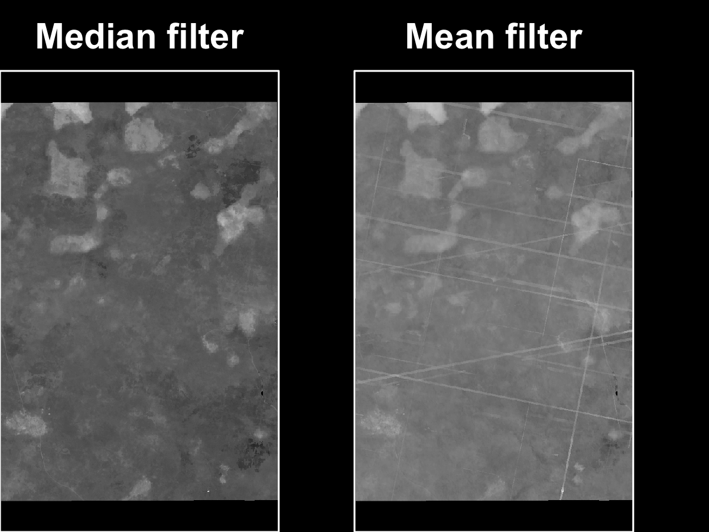

# Temporal mosaicking of images

```{r, out.width = "100%", echo=FALSE, fig.align='center'}
knitr::include_graphics("figures/planet-imgs.png")
```
```{r, out.width = "50%", echo=FALSE, fig.align='center'}

```

---

```{r, eval = FALSE}

library(raster)
library(stars)
p1 <- "~/Downloads/mosaic-tests/"
fs <- dir(p1, pattern = "masked.tif$", full.names = TRUE)
rs <- lapply(fs, raster)

exts <- t(sapply(rs, function(x) sf::st_bbox(x)))
fl <- list(min, min, max, max)
mext <- sapply(1:4, function(x) fl[[x]](exts[, x]))[c(1, 3, 2, 4)]
names(mext) <- c("xmin", "xmax", "ymin", "ymax")
mext <- st_bbox(mext, crs = st_crs(rs[[1]]))
stext <- st_as_stars(mext, nx = unname(diff(mext[c(1, 3)]) / 3), 
                     ny = unname(diff(mext[c(2, 4)]) / 3))

bm <- lapply(1:length(fs), function(x) {  # x <- 2
  print(x)
  b <- rs[[x]]
  m <- resample(b, stars:::st_as_raster(stext))
  m
})

b1 <- stack(bm)
plot(b1)
mymedian <- function(x) median(x, na.rm = TRUE)
mymean <- function(x) mean(x, na.rm = TRUE)
b1med <- calc(b1, mymedian)
b1mean <- calc(b1, mymean)
mxs <- sapply(1:nlayers(b1), function(x) cellStats(b1[[x]], max))
```

---
```{r, eval = FALSE}
cols <- gray.colors(100, start = 0.01, end = 0.99, gamma = 2.2, alpha = NULL)
png("inst/slides/figures/planet-imgs.png", height = 2, width = 7.5, res = 300, 
    units = "in", bg = "black")
par(mfrow = c(2, 10), mar = rep(0, 4))
for(i in 1:20) {
  plot(b1[[i]], axes = FALSE, legend = FALSE, main = NULL, col = cols, 
       zlim = c(0, 7000), box = FALSE)
  box(lty = 1, col = 'white')
}
dev.off()

png("inst/slides/figures/planet-mask.png", height = 3, width = 4, res = 300, 
    units = "in", bg = "black")
par(mfrow = c(1, 2), mar = c(0, 0, 2, 0))
plot(b1med, col = cols, axes = FALSE, legend = FALSE, box = FALSE, 
     main = "Median filter", zlim = c(500, 4800), col.main = "white")
box(lty = 1, col = 'white')
plot(b1mean, col = cols, axes = FALSE, legend = FALSE, box = FALSE, 
     main = "Mean filter", zlim = c(500, 4800), col.main = "white")
box(lty = 1, col = 'white')
dev.off()
```

---
# Today

- The `R` ecosystem, continued
- Coding!

---
# What we should know by now

- Key concepts/tools of reproducibility and why we use them
- How to set up a package project under `git` VCS
  - How to basic branching, simply merging
- How `R` packages are structured
- Understand basic building blocks of `R` ecosystem
  - Data types
  - Structures
  - Functions
  - Classes and OO systems
  - Environments and search path

---
# The R Ecosystem

```{r, out.width = "70%", echo=FALSE, fig.align='center'}
knitr::include_graphics("figures/class5_u1m2.png")
```

---

## OO

### Base system? 
```{r}
x <- 1:10
!is.object(x)  # if TRUE, base object. 
```

### S3 system?
```{r}
x <- lm(x ~ rev(x))
!is.object(x)  # if TRUE, base object. 
!isS4(x)  # it’s S3
```

---
## OO

### S4 system? 
```{r}
x <- raster::raster(nrow = 10, ncol = 10)
str(x)
!is.object(x)  # if TRUE, base object. 
!isS4(x)  # it’s S3
!is(x, "refClass") # it’s S4; otherwise it’s RC.
```

---

## Environments
```{r, out.width = "70%", echo=FALSE, fig.align='center', fig.cap="http://adv-r.had.co.nz/Environments.html"}
knitr::include_graphics("figures/class5_envs.png")
```

---
# Coding
- Creating data
  - 1-D
    - random number generation 
  - 2-D
- Manipulating data
  - Indexing/subsetting
  - Replacement

---
## Random numbers

```{r, eval = FALSE}
set.seed(1)
v <- sample(1:1000, size = 20, replace = TRUE)
hist(v, col = "blue")

set.seed(1)
v <- runif(n = 20, min = 0, max = 1000)
hist(v, col = "blue")

set.seed(1)
v <- rnorm(n = 20, mean = 500, sd = 100)
hist(v, col = "blue")

set.seed(1)
v <- rpois(n = 20, lambda = 5)
hist(v, col = "blue")

set.seed(1)
v <- rgamma(n = 20, shape = 0.7, scale = 10)
hist(v, col = "blue")

set.seed(1)
v <- rbinom(n = 20, size = 1, prob = 0.5)
hist(v, col = "blue")
```

---

## Create your own data
- Vectors
  - Integer
  - Numeric
  - Character
  - Combine into list

---
## 2-d structures

- Combine
  - Vectors into `matrix`
  - Vectors into `data.frame`

---
## Indexing/subsetting
- 1-d
- 2-d

---
## Replacement
- Vectors
- Lists
- `matrix`
- `data.frame`
- `data.frame`/`matrix` in lists


