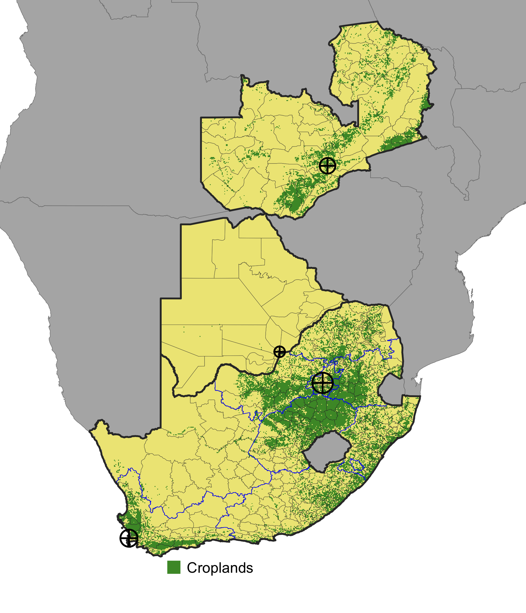

```{r, out.width = "70%", echo=FALSE, fig.align='center'}

```

---

# Today

- Summarizing
- Indexing lists
- Control structures

---
# Programming thought of the day

- Whenever possible, let the computer do your counting for you:
```{r}
a <- 1:1001
a[length(a)]
```
- Rather than 
```{r}
a[1001]
```
- Imagine this case:
```{r}
set.seed(1)
b <- 1:sample(1:10000, 1)
b[length(b)]
```

---

## Create your own data

- Create three matrices, `m1`, `m2`, `m3`
  - `m1`: 
      - Random number seed: `set.seed(100)`
      - `V1` = 1:20
      - `V2` 20 random numbers from 1:100
      - `V3` 20 numbers from `rnorm`, mean = 500, sd = 100)
  - `m2`: Same variables, but `set.seed(200)`
  - `m3`: Same variables, but `set.seed(300)`
- Create vector `v`: 20 random draws from `LETTERS[1:5]`; `set.seed(1)`
- Create 2 `data.frame`s: `dat1` (`m1` & `v`), `dat2` (`m2` & `v`)
  - Name the column holding `v` "GRP"
- Create list `l` combining `m1`, `m2`, `m3`, `dat1`, `dat2`, `v`
  - Name the list elements the same as the object name.
  
```{r, echo = FALSE}
set.seed(100)
m1 <- cbind(V1 = 1:20, V2 = sample(1:100, size = 20, replace = TRUE), 
            V3 = rnorm(n = 20, mean = 500, sd = 100))
set.seed(200)
m2 <- cbind(V1 = 1:20, V2 = sample(1:100, size = 20, replace = TRUE), 
            V3 = rnorm(n = 20, mean = 500, sd = 100))
set.seed(300)
m3 <- cbind(V1 = 1:20, V2 = sample(1:100, size = 20, replace = TRUE), 
            V3 = rnorm(n = 20, mean = 500, sd = 100))
set.seed(1)
v <- sample(LETTERS[1:5], size = 20, replace = TRUE)
dat1 <- data.frame(m1, "GRP" = v)
dat2 <- data.frame(m2, "GRP" = v)
l <- list(m1, m2, m3, dat1, dat2, v)
names(l) <- c("m1", "m2", "m3", "dat1", "dat2")
```

---
## Index into lists

- Select from `l`'s first element the 1st and 5th elements
- Do the same, using the element name and `[[]]` to get the first element of `l`
- Do the same, using `$` and the element name to get the first element
- Do the same, using `[]` and the element name to get the first element
- Select the last element of the last element of `l` (tricky without absolute indexing)

---

## Summarizing datasets
- Calculate the row and column sums of both `m1` and `dat1`. 
- Calculate the overall means and sums of all values `m2` and `dat2`
- From `dat1`, use both the base `aggregate` function and `dplyr` functions `group_by` and `summarise` to calculate the group mean, using `GRP` as the grouping variable. 
---

## Control structures
### Branching
```{r}
a <- 5
if(a > 10) {
  print("Greater than 10!")
} else {
  print("Less than or equal to 10")
}
```

### Looping
```{r}
b <- 1:3
for(i in b) print(i)
```

---

### *apply

- A special form of looping
- Intended for *applying* a function to data

```{r}
l2 <- l[c("m1", "m2", "m3")]
lapply(l2, mean)
```

---
### *apply

- Key uses: 
  - Return results of loop directly into object
  - Use with anonymous functions to pass an iterator, often into more complex procedures
  
```{r}
# Simple
o <- lapply(1:2, function(x) l2[[x]])
o
```

---
```{r}
# More complex
o2 <- lapply(1:5, function(x) {
  l2[[1]][x] - l2[[2]][x]
})
o2
```

---
### Looping practice

- Write a `for` loop that iterates through the vector 1:10 and prints the iterator `i` multiplied by 10
- Do the same, but instead of print `i * 10`, catch the result in a predefined empty list `o`
- Do the same as above, but use an `lapply` that assigns output to `o`
- Do the same as above, but use `sapply` instead of `lapply`
- Let's use `sapply` to find which elements of `l` are `matrix`
- Let's use `lapply` to calculate the `colMeans` of matrices and `data.frame`s in `l`

---
### Create data using `lapply`

- Let's recreate our matrix examples

---

### Create data using `lapply`

- Let's recreate our matrix examples

```{r, eval = FALSE}
seeds <- c(100, 200, 300)  # or 100 * 1:3
l3 <- lapply(seeds, function(x) {
  set.seed(x)
  m <- cbind(V1 = 1:20, 
             V2 = sample(1:100, size = 20, replace = TRUE), 
             V3 = rnorm(n = 20, mean = 500, sd = 100))
})
names(l3) <- paste0("m", 1:3)
```

---
## Check the values

- Let's check them now against original values

```{r, eval = FALSE}
m1 == l3$m1
m2 == l3$m2
all(m1 == l3$m1)
all(m2 == l3$m2)
```

- Etc, but we could do this check with a looping function!

---
## Check using `lapply`

- We know that `l[1:3]` contains `m1`, `m2`, `m3`, and so does `l3`, so
```{r, eval = FALSE}
lapply(1:3, function(x) all(l[[x]] == l3[[x]]))
```

- More compact
```{r, eval = FALSE}
sapply(1:3, function(x) all(l[[x]] == l3[[x]]))
```


