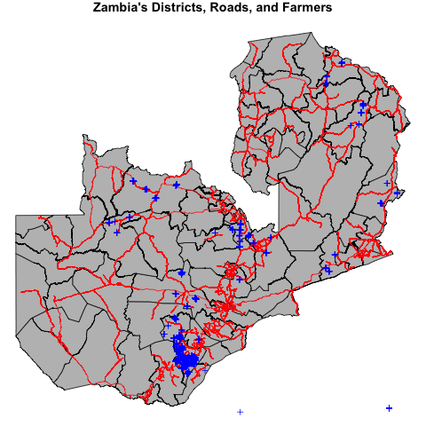
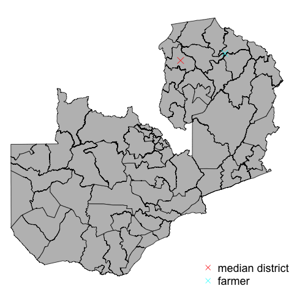
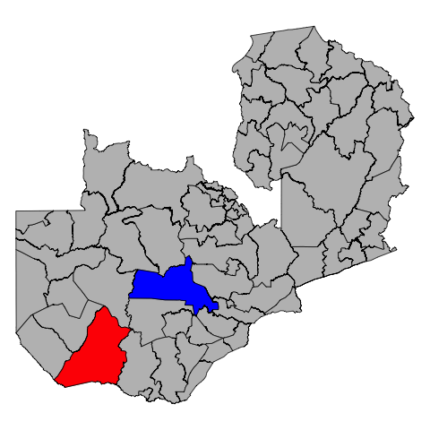
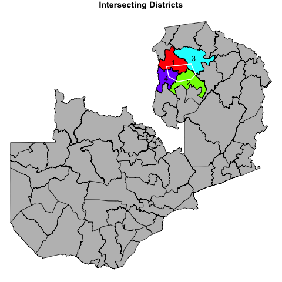
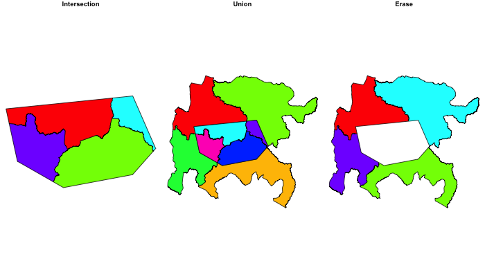

```{r setup, include=FALSE}
knitr::opts_chunk$set(echo = TRUE, fig.align = "center")

```

# Overview{#overview}

Assignment 4 focuses on working with spatial vector data. It is based on the material presented and data used in sections 1-3 of the [vector data](vector-data.html) readings.  

# Due date

There are actually two things due for this assignment: 

1. The tasks set out in this assignment are due __*Friday, October 27* at midnight__, via the normal GitHub submission route

2. If you have not already chosen one, your topic for a final project for this class is due on ___*Monday, October 30th*___, to be submitted to me and Zhiwen via a Slack message before class.  We will finalize the project topic and who you work with on it in the labs during that week, or during office hours. 

# Set-up
## Git/GitHub

1. Create a new branch "a3" in your local git repo, nestled within the same Rstudio project you have been working in since day 1 (do not create a new Rstudio project with accompanying git repo and corresponding remote GitHub repo)

2. Push the new a3 branch up to GitHub, so you have both a local and remote version of the branch, preserving your assignment 3

3. Checkout (switch back to) your master branch 

4. Make and commut your changes for assignment 4 within the master branch

## Assignment structure

Create a new vignette named "working-with-vectors.Rmd". The vignette index entry should read: 

```
  %\VignetteIndexEntry{Vector data assignment}
```

Delete the vignettes from previous assignments from the vignettes folder (do this once in the a4 branch). 

> **Vignette note**: Remember that your vignette contains text descriptions of what you are doing, inter-leaved with the corresponding R code (in R code chunks), and results of the operation(s) performed in those R code chunks. The results should be generated by the R code and presented in the html as part of the knitting/building operation, not by pasting the results from console output into the .Rmd file. 

[Back to top](#overview)

# Tasks
## Libraries and data

You will need the `geospaar` library loaded to complete this task, as well as `raster`, `sp`, `rgdal`, and `rgeos`.

## Task 1

Kindly read in the following data sets that ship with `geospaar`: "farmer_spatial.csv", "districts.shp", and "roads.shp". The R objects should be named `farmers`, `districts`, and `roads` 

You will then need to: 

1. Promote `farmers` to a `SpatialPointsDataFrame`
2. Reproject `farmers` and `districts` to the Albers Equal Area CRS that is used to define `roads` projection

The spatially transformed data should be named `farmers_alb` and `districts_alb`.

Remember that you cannot do a reprojection on a Spatial* object that does not have a defined CRS. Both `farmers` and `districts` have coordinates that are defined in geographic coordinates with the WGS84 datum. 

[Back to top](#overview)

## Task 2

Create a plot that shows all three datasets as below, with districts plotted in grey, with the roads in red over that, and the farmers having a blue cross that has a cex value of 0.8. Use the fig.align argument in the Rmarkdown chunk settings to center the figure in the markdown, and to have a height of 4 inches and a width of 6 inches (chunk arguments should look like this: `{r, fig.height=4, fig.width=5, fig.align='center'}`; except where noted, you should set up all your chunks to have these parameters). The figure should have 0 margins, but just enough top margin to allow the title to be displayed. 



> Your figure will be slightly different than this one, because I have first written to a png and then used a markdown link to read it in from a directory. Yours will be created from code and thus the fonts and margins may vary slightly. 

[Back to top](#overview)

## Task 3

Select from `districts_alb` the district representing the *50th percentile area*, i.e. the median area. Find the centroid of that district. Then find which farmer is closest to the centroid of that district. Plot the results as below.

> Hints: To find the median/50th percentile area, you will need to use the `quantile` function, with an additional argument passed to it: "type = 1" 



[Back to top](#overview)

## Task 4

We want to select out the districts whose names begin with "Se", and then those whose names begin with "Mu". After selecting each, find the largest in each group of selected districts. Plot the largest "Se" district in red, and the largest "Mu" district in blue. You get **1 bonus point** if you use a `for` loop to plot the selected districts onto the map of Zambia's districts.

> This is a split-apply-combine operation, in which the name search patterns are iteratively used with `grep` to do the split, and the apply part is selecting the smallest area.



[Back to top](#overview)

## Task 5

Create a new `SpatialPolygons` object called `spp`, using the following coordinates:
```{r}
x <- c(29, 29.1, 29.5, 30.1, 30.3, 30.1)
y <- c(-10, -10.4, -10.6, -10.5, -10.3, -9.9)
```

After assigning the correct geographic CRS, reproject it to Albers (name the result `spp_alb`) as you did for `districts_alb` and `farmers_alb`. Calculate the area in ha of the polygon as a separate vector, and then plot the results onto `districts_alb`, as shown below.

> Hint: Hectares are m$^2$ / 10000, and to get a nice whole number without a ton of decimals use the `round` function, as in `round(10.02356)` (run that to get a sense of how `round` works, which you will use on the result of `gArea` applied to `spp_alb`). You are going to paste the area in amongst the text of the title in the plot.   


[Back to top](#overview)

## Task 6

Select the districts that `spp_alb` **intersects** with, creating a new object from them called `spp_dist_int`. Create a new column called "ID" in `spp_dist_int`, in which you sequentially number the districts. Make the plot look like the one below, including the addition of the "ID" labels onto the plot. 
> Hint: use the "border" argument instead of "col" when plotting `spp_alb` 



[Back to top](#overview)

## Task 7

Calculate the intersection of `spp_alb` with `spp_dist_int` (call it `spp_dist_int2`, and don't dissolve the internal boundaries of the resulting intersection), the union of those two objects also (call it `spp_dist_uni`), and then erase `spp_alb` from `spp_dist_int` (`spp_dist_erase`).  Use the `raster` variant of each function. Combine the three resulting objects into a list `l`, and then plot them as follows, using figure height/widths of 4 and 7 in your Rmarkdown chunk arguments. This should be plotted using a `for` loop to get full credit.   



[Back to top](#overview)

## Task 8

Find the shortest and longest roads in Zambia, and place the selected roads into a new object (`roads_extreme`). Calculate a 20 km buffer around those two roads, using the `raster::buffer` function to do it (call the result `extreme_buff`), but don't dissolve the results (we want separate buffers for each). Re-set the figure width to 5 in the chunk parameters.


[Back to top](#overview)

## Task 9

Using the buffer for Zambia's longest road, select the districts intersection the buffer (call the result `distr_lroad`). Then subset `farmers_alb` to record just those who reported on 2016-10-31 (`farmers_1031`), and select the subset of `farmers_1031` falling within `distr_lroad`, using `raster::intersect` to do the job (call the result `farmers_road`). Count the number of farmers in `farmers_road`, which you will need to put into the title of the resulting plot.

> In the map below, the farmers are plotted with the color "cyan", the intersecting districts with "grey30", and longest road buffer with a semi-transparent red (alpha = 0.5).


[Back to top](#overview)

## Task 10

Your final task is to intersect `roads` with the buffer of the longest road (`int_roads`), and then calculate the total distance of intersected roads in km. Plot the results as below. 

> Hint: You have to use `gIntersection` for this task, since `raster::intersect` won't work with lines. Remember to round the final number. 


[Back to top](#overview)


