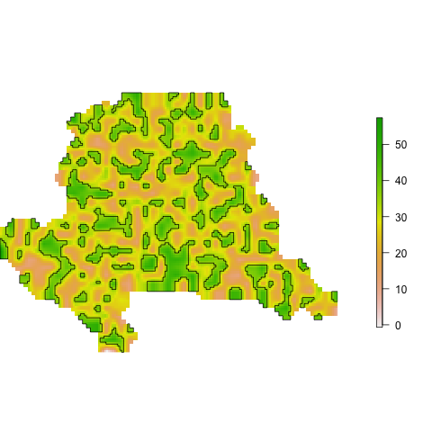
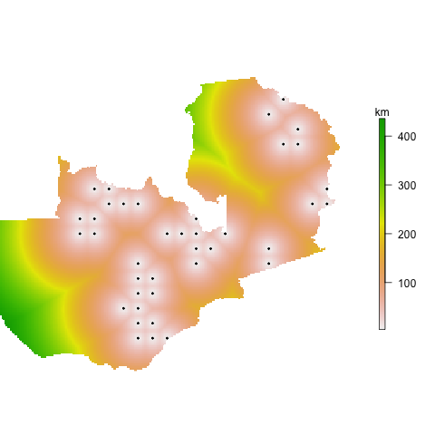
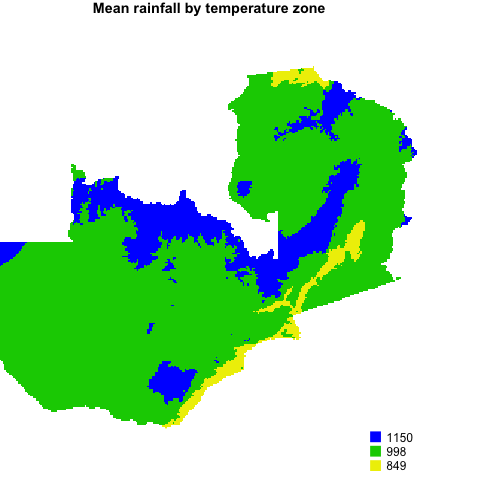
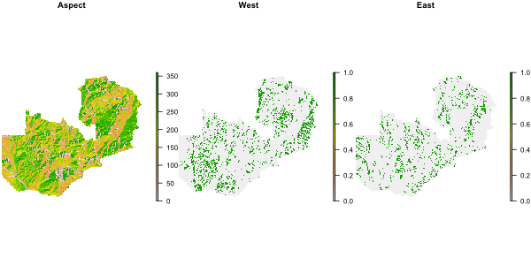
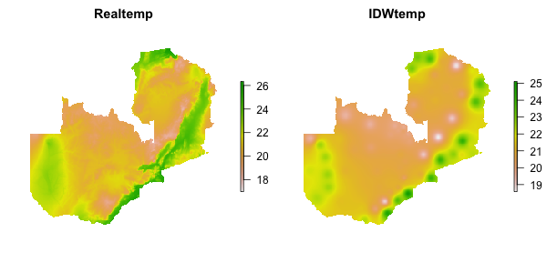
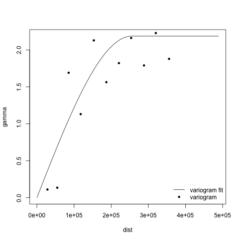
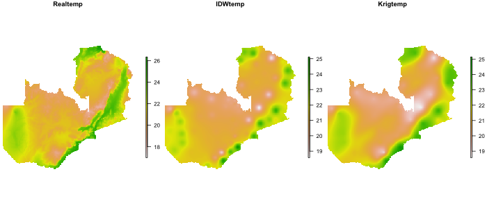

```{r setup, include=FALSE}
knitr::opts_chunk$set(echo = TRUE, fig.align = 'center', fig.height = 4, 
                      fig.width = 5)
```

# Overview{#overview}

Assignment 5 focuses mostly on rasters, drawing on material presented and data used in sections 1-4 of the [raster data](raster-data.html) readings.  It will also require you to use skills from the vector readings. 

# Due date

__*Friday, Nov 10* at midnight__, via the normal GitHub submission route

# Set-up
## Git/GitHub

The repo set-up in this assignment will be slightly different than it was in the previous two assignments, in that you will have you do all your work and commits in a new "a4" branch of your existing repos, which you will then merge back into your "master" branch after completing your final commit. Here are the steps, in detail: 

1. Create a new branch "a4" in your local git repo, nestled within the same Rstudio project you have been working in since day 1 (do not create a new Rstudio project with accompanying git repo and corresponding remote GitHub repo)

2. Push the new a4 branch up to GitHub, so you have both a local and remote version of the branch, preserving your assignment 4

3. Checkout (switch back to) your master branch 

4. Create a new branch "a5", and push that branch to GitHub. **Do not checkout your master branch again**, as you want to remain in a5 for this assignment  

5. Do the tasks for assignment 5 from within a5, making frequent commits as you progress through the assignment. For example, make a commit after completing each task. Push each commit to your remote GitHub repo  

6. When you have completed the assignment, make a final commit within the a5 branch. Push that commit to GitHub 

7. Then checkout (switch back to) your master branch 

8. You will then merge the work in your a5 branch into your master branch, using the following command, which can only be done from the shell 

    ```{bash, eval = FALSE}
    git merge a5
    ```

9. Your final step (i.e. assignment submission) will be to push your master branch to your GitHub remote, and then the assignment will be considered submitted. 

> **Git notes**: 
  >
  > - Steps 4-9 above are new to this assignment, but compared to previous assignments, they really only represent 3 differences: i) the creation of one more branch than before; ii) the requirement that you work in that additional branch, rather than in the master branch; iii) the merge step
>
  > - These steps are fairly straightforward and should cause no complications if followed. If for some reason you get back into your master branch along the way and make and commit changes from there, and these master commits occur between commits made in your a5 branch, your merging process might be more complicated (there might be conflicts between file versions you want to merge). It is possible to reconcile these conflicts, and Rstudio does a pretty good job of showing them to you, but it is best to avoid this for the sake of clarity in this assignment  
> 
  > - With the exception of the shell commands you need to i) create a new branch and ii) to merge branches, you may find it most convenient to work through RStudio's git interface  
> 
> - Remember that the [help](help.html) vignette provides a reasonable amount of reference information for dealing with Git/GitHub issues.  

## Libraries and data

You will need the `geospaar` library loaded to complete this task, as well as `raster`, `sp`, `rgdal`, and `rgeos`. `gstat` makes an appearance at the end. 

Please load the `chirps`, `districts`, and `roads` datasets, and read in the `farmers` dataset. 

```{r}
farmers <- read.csv(system.file("extdata/farmer_spatial.csv", 
                                package = "geospaar"), stringsAsFactors = FALSE)
```

[Back to top](#overview)

## Tasks
### Task 1
Create a subset of `districts` by extracting  districts 22, 26, 53, and 54. Call it `districts_ss`. Use the extent of `districts_ss` to define the extent of a new raster `r`, which should have a resolution of 0.1&deg;.  `r` will be your template for creating two new rasters, `rsamp` and `runi`. `rsamp` should be filled with randomly selected integers ranging between 10 and 50. `rrandn` should be filled with random numbers drawn from a normal distribution (`rnorm`) that has a mean of 30 and standard deviation of 5. Use a seed of 1 in `set.seed`. Stack `rsamp` and `runi` (name the stack `s`), mask that by `districts_ss`, and plot the layers of `s` as seen below, using `plot_noaxes`.


[Back to top](#overview)

### Task 2

Disaggregate `s[[1]]` to a resolution of 0.025&deg;, using bilinear interpolation, calling the result `s2_1d`. Select all areas of `s2_1d` that have values > 35, creating a new raster `s2_1gt35`. Set the values of `s2_1gt35` that equal 0 to NA. Then convert the resulting raster into `SpatialPolygons` (call the result `s2poly`). Plot the resulting polygons over `s2_1gt35`. 



[Back to top](#overview)

### Task 3

Create a new grid from the extent of `districts` that has a resolution of 0.5&deg; (call it `zamr`), populating all cells with the value 1. Then recreate the `farmers2` dataset from the raster vignette readings (i.e. the version that counts the number of unique farmers appearing in the `farmers` dataset. After doing that, rasterize `farmers2` to the resolution of the `zamr` target, using the sum function during rasterization to count how many farmers occur in each 0.5 &deg; grid cell. Mask the results (call it `farmersr`) using `districts`, and then plot the result onto a grey background of Zambia. 


[Back to top](#overview)

### Task 4
Convert the rasterized farmers counts (`farmersr`) back into a `SpatialPointsDataFrame` called `farmersrpts`. Create a new version of `zamr` at 0.05&deg;, and then calculate the distance between these points and every other location in Zambia, creating an output grid of distances, called `dist_to_farms`, which you mask by `districts`. Plot the results as you see below, with the distance grid in km and the farmer points plotted on top of the grid. 



[Back to top](#overview)

### Task 5

Use `raster`'s `getData` function to grab WorldClim's mean temperature ("tmean") dataset at a resolution of 2.5 (note this is not degrees, but minutes of a degree), and download it to somewhere on your local disk. That will give a global scale `RasterBrick` with 12 layers, with each layer representing the average monthly temperature for each grid cell on the planet. Crop that brick to the extent of `districts`, and then calculate the annual mean temperature for each cell. Mask the result using `districts`, and divide it by 10 to get temperature in &deg;C in your final raster, `zamtmean`. Plot the result. 


[Back to top](#overview)

### Task 6

Classify the temperature data into three categories, low, medium, and high, using <20&deg;, 20-24&deg;, and >24&deg; as the break points for determining the classes.  Use the `reclassify` function rather than the `cut` function. You might find it helpful to use `cellStats` with `range` to identify the maximum and minimum temperature to define the lower bound of the "low" class  and the upper bound of the "high" class. Call the reclassified temperature raster `zamtclass`. Make the map as shown below, with a categorical legend. The exact colors used are "blue", "yellow2", and "red".


[Back to top](#overview)

### Task 7

Load up the `zamprec` dataset that comes with `geospaar`, then calculate the mean precipitation within each temperature zone defined by `zamtclass`. Call the resulting matrix `z`. Map the mean zonal precipitation values in `z` onto each temperature zone (using the `subs` function with `zamtclass` as the target; remember that `zonal` returns a matrix, and that `subs` requires a `data.frame` for its y argument). Call the new raster `zamprecz`, and then plot the result as below. 

> To make this map, you need to turn off the default legend in `plot_noaxes`, and add a custom legend (as we in Task 6), using the zonal mean values (rounded) as the legend labels. The colors here are "yellow2", "green3", and "blue"



[Back to top](#overview)

### Task 8

Use `getData` again to download the elevation raster for Zambia (call it `dem`). Aggregate it to the same resolution as `zamtmean`, using the default mean aggregation (the factor you need is 5). Call that `dem5`. Use `terrain` to calculate aspect from `dem5` (call it `aspect`), selecting degrees as the output value. Then find all west-facing aspects (aspects >247.5 and <292.5), and all east facing aspects (>67.5 and <112.5), making new rasters respectively named `west` and `east`. Stack these together with `aspect` and make a three-panel plot that looks like the one below.  



[Back to top](#overview)

### Task 9
Create two random samples of 100 each. The first one should be collected from within the west-facing cells (i.e. only be drawn from cells in `west` that have a cell of one), and the second from east-facing cells. Use a seed of 1. Once you have collected those, which should give you two separate `SpatialPointsDataFrames`, use those two sets of points to extract temperature values from `zamtmean`. Use side-by-side boxplots to compare the distributions of west and east facing temperatures. Don't forget to put a point onto the boxplots that shows the mean value from each set of data. 

> To confine the random selection of points to just the west and east facing aspects, you need to first convert the 0 values in `west` and `east` to NA values. 


[Back to top](#overview)

### Task 10
Our final task involves inverse distance weighted interpolation (IDW). Extract the centroids from each district in `districts` (call it `dcent`), and reproject the points to Albers, using the `crs` of `roads`. Reproject `zamtmean` to Albers also, making the new resolution (5 km, i.e. 5000 m), using bilinear interpolation (call it `zamtmeanalb`). Then use `dcent` to extract the temperature values from `zamtmeanalb` (add the values to `dcent` as a new variable "temp")  

Use `gstat` to create an IDW model (call it `idw`), and then `interpolate` to map the interpolated temperatures using `zamtmeanalb` as a target object (it won't be overwritten) and `idw` as the model. Make sure you mask the result to the boundaries of Zambia, using `zamtmeanalb` as the mask. Call the new interpolated, masked grid `zamtidw`. 

Plot the result side by side with `zamtmeanalb` for comparison. 



[Back to top](#overview)

### Extra credit (5 points)

Use kriging instead of IDW to create the interpolated temperature map. Plot the results of the variogram and model you fit to it, as well as the three maps side by side (`zamtmeanalb`, `zamtidw`, `zamtkrigr`) for comparison.






[Back to top](#overview)


