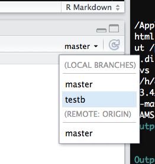

```{r setup, include = FALSE}
knitr::opts_chunk$set(
  collapse = TRUE,
  comment = "#>"
)
library(knitr)
```

***
<center>
[Back to **vignette index**](toc.html)
</center>
***

# Overview{#overview}
Help and how-to for certain things we will be using in this class.

# Github-related{#github-related}
## Set up a github access token{#set-up-a-github-access-token}

This is necessary for using `devtools::install_github()` to install private packages, such as your class assignments.

1. Go into your github account, click settings, and then developer settings:

```{r, out.width = "70%", fig.align='center', echo=FALSE}
knitr::include_graphics("fig/pat1.png")
```

2. Select personal access tokens:

```{r, out.width = "20%", fig.align='center', echo=FALSE}
knitr::include_graphics("fig/pat2.png")
```

3. Choose to generate a new token:

```{r, out.width = "50%", fig.align='center', echo=FALSE}
knitr::include_graphics("fig/pat3.png")
```

4. Generate a new token after naming the token something meaningful and checking the "repo" box:

```{r, out.width = "50%", fig.align='center', echo=FALSE}
knitr::include_graphics("fig/pat4.png")
```

5. The result will look something like this. Choose copy link and then paste it somewhere safe. 
```{r, out.width = "50%", fig.align='center', echo=FALSE}
knitr::include_graphics("fig/pat5.png")
```

6. For example, to install the class R package, you will need the token as follows: 
    ```{r, eval = FALSE}
    library(devtools)
    install_github("agroimpacts/geospaar", build_vignettes = TRUE, 
                   auth_token = "the-token-you-just-generated-pasted-here"))

    ```

***
<center>
[Back to top](#overview) || [Back to **vignette index**](toc.html)
</center>
***

## Branching and merging{#branching-and-merging}

A very useful reference for basic branching and merging can be found [here](https://git-scm.com/book/en/v2/Git-Branching-Basic-Branching-and-Merging)

1. Create a new branch, from within the shell

    (replace <branchname> with a meaningful branch name, e.g. a1)
    
    ```bash
    git checkout -b <branchname>
    ```

2. Switch branch

    - from shell
    
    ```{bash, eval = FALSE}
    git checkout <branchname>
    ```

    - from within Rstudio
    
```{r out.width = "30%", fig.align='center', echo=FALSE}
 
```


3. Delete a local branch (if you created one by accident, from shell). Don't do this to your master branch. 

    ```bash
    git branch -d <branchname>
    ```


4. Push a branch to your remote GitHub repo

    ```bash
    git push origin <branchname>
    ```

5. Delete a remote branch

    ```bash
    git push origin --delete <branchname>
    ```

6. Merge two branches

    ```bash
    git checkout <branch-you-want-to-merge-onto>
    git merge <branch-to-merge-onto-the-branch-you-are-in>
    ```

7. Restore a previous commit


    There are multiple ways to do this, some more destructive than others. Perhaps the best way to do this is as follows: 

    ```bash
    git checkout -b <branch-name-for-older-project-state> <commithash>
    ```


    The commit hash is the identifier that git assigns to a particular commit. You can find the hashes under RStudio's git history dialog in the SHA column. If you want to reset your master branch to the state it was in under this older commit, then one way you could do it that would best preserve your work up that point would be to: 
    
    - create a new branch for the current master branch
    - delete the files in master branch and commit that change
    - merge the older branch back onto master, effectively restoring your master branch to the state it was in at the time of that older commit.

8. Push all commits to remote


    Useful if you have multiple branches with commits that you have not yet pushed to GitHub. This does it all at once: 

    ```bash
    git push --all -u 
    ```

***
<center>
[Back to top](#overview) || [Back to **vignette index**](toc.html)
</center>
***

## RStudio and GitHub

1. I can push and pull to my repo from the command line, but Rstudio's git push and pull buttons are greyed out. How do I fix that? The answer can be found [here](https://landeco2point0.wordpress.com/2014/07/22/things-i-forget-pushpull-greyed-out-in-rstudio/). You can fix this and bring the buttons back to life if you do this, from the shell:

    ```bash
    git push -u origin <branch-to-push>
    ```
    
    Note the -u flag. That should fix it. 

***
<center>
[Back to top](#overview) || [Back to **vignette index**](toc.html)
</center>
***

## Fixing a pandoc error
The current version of `geospaar` 0.2.4 was built against `R 3.6.2` and RStudio 1.2.5033. Older versions of RStudio may cause a pandoc failure when building vignettes.  Here is a fix (courtesy of Lei Song). If you get this error:

Run the following lines of code (fix suggested here) from an `R` script:


```{r, eval=FALSE}
# Download pandoc 2.7.1 built with ghc-8.6.4, and instruct
# RStudio + rmarkdown to use it.
local({
  # The directory where Pandoc will be extracted. Feel free
  # to adjust this path as appropriate.
  dir <- "~/rstudio-pandoc"
  # The version of Pandoc to be installed.
  version <- "2.7.1"
  # Create and move to the requested directory.
  dir.create(dir, showWarnings = FALSE, recursive = TRUE)
  owd <- setwd(dir)
  on.exit(setwd(owd), add = TRUE)
  # Construct path to pandoc.
  root <- "https://s3.amazonaws.com/rstudio-buildtools"
  suffix <- sprintf("pandoc-%s-windows-x86_64.zip", version)
  url <- file.path(root, "pandoc-rstudio", version, suffix)
  # Download and extract pandoc.
  file <- basename(url)
  utils::download.file(url, destfile = file)
  utils::unzip(file)
  unlink(file)
  # Write .Renviron to update the version of Pandoc used.
  entry <- paste("RSTUDIO_PANDOC", shQuote(path.expand(dir)), sep = " = ")
  contents <- if (file.exists("~/.Renviron")) readLines("~/.Renviron")
  filtered <- grep("^RSTUDIO_PANDOC", contents, value = TRUE, invert = TRUE)
  amended <- union(filtered, entry)
  writeLines(amended, "~/.Renviron")
  # Report change to the user.
  writeLines("Updated .Renviron:\n")
  writeLines(amended)
  writeLines("\nPlease restart RStudio for these changes to take effect.")
}) 
```

Then restart Rstudio and proceed again with `devtools::install*` steps. This step can be avoided if you update to the latest Rstudio, however. 


