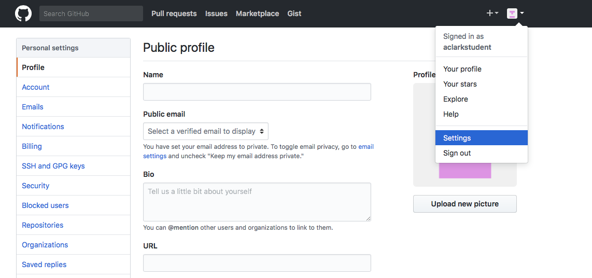
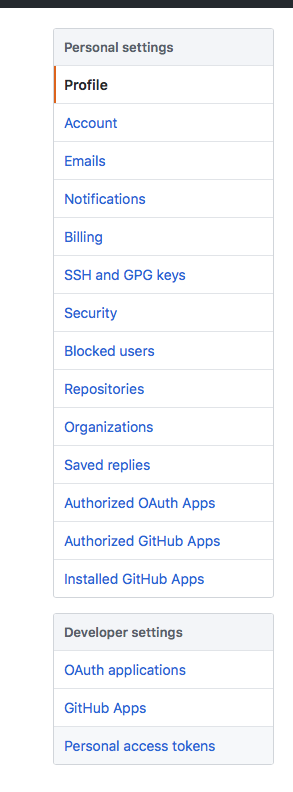

```{r setup, echo=FALSE, include=FALSE}
knitr::opts_chunk$set(echo = TRUE)
```

```{r, echo = FALSE}
library(knitr)
# opts_chunk$set(fig.path="fig/")
```

# Overview
Help and how-to for certain things we will be using in this class.


# Github-related
## Set up a github access token

This is necessary for using `devtools::install_github()` to install private packages, such as the class R package

1. Go into your github account, click settings:

```{r, out.width = "70%", echo=FALSE}

```

2. Select personal access tokens:

```{r, out.width = "20%", echo=FALSE}

```

3. Choose to generate a new token:

```{r, out.width = "50%", echo=FALSE}
knitr::include_graphics("fig/pat3.png")
```

4. Generate a new token after naming the token something meaningful and checking the "repo" box:

```{r, out.width = "50%", echo=FALSE}
knitr::include_graphics("fig/pat4.png")
```

5. The result will look something like this. Choose copy link and then paste it somewhere safe. 
```{r, out.width = "50%", echo=FALSE}
knitr::include_graphics("fig/pat5.png")
```

6. For example, to install the class R package, you will need the token as follows: 
```{r, eval = FALSE}
library(devtools)
install_github("agroimpacts/geospaR", build_vignettes = TRUE, 
               auth_token = "the-token-you-just-generated-pasted-here"))

```


