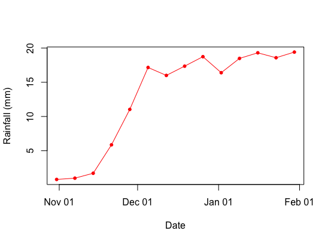

```{r setup, include=FALSE}
knitr::opts_chunk$set(echo = TRUE, fig.align = "center")
```

# Overview

Assignment 3 will integrate (most) of the skills learned in Unit 1 of this class. We are going to be working with an updated version of the `farmers` data.frame that is now installed with the `geospaar` package (the update is because it has a few more unique dates, and edits to the "pl" and "mm" variables). The main focus of this exercise is on split-apply-combine operations, and then plotting, with a bit of regression. Plotting and regression will be reviewed in classes on Monday and Wednesday (2 and 4 October). __Assignment due date is *Friday, October 6* at midnight__. 

Additional note: here we are showing the results of what your code should produce, as a guide to what we expect to see (to assist with figuring out the necessary code). 

# Tasks

## Set-up
Create a new branch `a2` in your local git repo (working within the same package development directory that contains your `xyza1` package). Push the branch to your GitHub repo, and then checkout back to your master branch. 

Create a new vignette named "assignment3", which you will use to document the tasks you undertake for this assignment. Delete the calculations vignette from assignment 2. 

Remember that your vignette contains text descriptions of what you are doing, inter-leaved with the corresponding R code (in R code chunks), and results of the operation(s) performed in those R code chunks. The results should be generated by the R code and presented in the html as part of the knitting/building operation, not by pasting the results from console output into the .Rmd file. 

## Task 1
Read in the farmer dataset we have been using. Instead of the one you have been working with in class, we are going to work with the updated version that comes installed with the latest release of the `geospaar` package (version 0.2.11 and higher), called "farmer_text2.csv". This can be installed by reading it in as follows: 

```{r, eval = FALSE}
fnm <- system.file("extdata/farmer_test2.csv", package = "geospaar")
farmers <- read.csv(file = fnm, stringsAsFactors = FALSE)
```


Note that you can bundle data files into your own package in the same way (so that they "ship" with the package), by creating an "inst" folder in your package directory (at the same level as folders "R" and "vignettes") and saving the file in there. Anything in there will be added to your package _where it lives in your library_ when the package is built. In this case, I placed "farmer_test2.csv" in "geospaar/inst/extdata", as the "extdata" sub-folder is the conventional place for storing data files that install with the package in this way. 
    
Of interest here is the `system.file` function.  What does it do?  
    
A few questions to answer (based on stuff I went over in class 9 on Sep 27): 

- What is the other folder in the R package building skeleton that is more typically used when bundling data into an R package?
- What function do you use to access those data? 
- What file format are data accessed using that function stored in?  

## Task 2

Coerce the "date" column of `farmers` to a date data type (using `as.Date`).  

## Task 3
Let's start off with a simple evalution of statistics in the `farmers` dataset. Use the `apply` function to calculate the `mean` of the "pl", "ra", and "mm" columns in `farmers`. Do the same, but this time find the `range` of values in those three columns. Rather than having the results print after the operation, direct the outputs into objects, named `farm_mu` (for the first operation) and `farm_rng` for the second one. 

## Task 3 
Having done that now, let's combine these two output objects into a single data.frame. 

- Use `rbind` to join the two output objects by row (put `farm_mu` first), creating a new object called `farm_stat`. 
- Next, create a new *character* vector called `stats`, which will contain the names of the statistics described in each row of `farm_stat`, which are the "mean", "min", and "max". 
- Use `cbind.data.frame` to join `stats` to `farm_stat` as a new column, with `stats` being the first column. Reuse the name `farm_stat` for the output object. Now, some questions: 
    - I could have just used the shorter `cbind` (the column equivalent of `rbind`) to join `stats` and `farm_stat`. Why didn't I do that?  
    - Also, there was a warning message that resulted from the `cbind.data.frame` step. What do you think was the cause of it?
- Lastly, show the results of `farm_stat` in your html.

The output of this operation should look like this: 
```
##   stats        pl        ra       mm
## 1  mean 0.3039058 0.6198502 12.46495
## 2   min 0.0000000 0.0000000  0.00000
## 3   max 1.0000000 1.0000000 39.00000
```
    
## Task 4
Having done that now, I want you to recreate the exact same results, but using a single operation of `sapply` to get the `mean` and `range` of those three columns of `farmers`. That means you have to calculate `mean` and `range` within the body of the `sapply`, and join their results (think `c`) in the last step in the sequence of commands that are in the `sapply` body. Name the output of this `farm_stat2`. Finish by doing the same `cbind.data.frame` step with `stats` as above, and show the results in your html.    

The output of this operation should look the same as for Task 3. 

## Task 5
Now we will move on to a split-apply-combine operation, in which we will calculate a) mean rainfall per date in the `farmers` data (rainfall values are in the "mm" column), and b) the sum of rainfall. This requires you to use `lapply`/`sapply` and a vector of `unique` dates to perform the operation. As output, we want the following: 

- a data.frame named `rain_mean` that has:
- the unique dates as the first column with "date" as the column header
- where `rain_mean$date` is of type date
- the mean rainfall as column "rfmu"
- the summed rainfall as "rftot" 

Do this operation with both `lapply` and `sapply`, producing the identical results from each. Hint: `lapply` will require you to perform 3 operations: the `lapply` itself, a `do.call` with `rbind` operation, and a `cbind.data.frame` thereafter to join `dates` (the unique date vector) to it.
    
The `sapply` approach also has three steps, with one of those steps being a transpose (`t`). 
    
For results, show in the html the output of `rain_mean` produced by `lapply`, as well as `str(rain_mean)`, and the same (`rain_mean` and `str(rain_mean)`) produced by `sapply`. 
    
The outputs of both versions should look like this:
```
##         dates       rfmu rftot
## 1  2016-10-31  0.8039216   205
## 2  2016-11-07  0.9912791   341
## 3  2016-11-14  1.7079646   579
## 4  2016-11-21  5.8616352  1864
## 5  2016-11-28 11.0321101  2405
## 6  2016-12-05 17.1604096  5028
## 7  2016-12-12 16.0000000   480
## 8  2016-12-19 17.3535032  5449
## 9  2016-12-26 18.7368421  5340
## 10 2017-01-02 16.3972603  3591
## 11 2017-01-09 18.4827586  4288
## 12 2017-01-16 19.3017241  4478
## 13 2017-01-23 18.5830508  5482
## 14 2017-01-30 19.4065934  7064

## 'data.frame':    14 obs. of  3 variables:
##  $ dates: Date, format: "2016-10-31" "2016-11-07" ...
##  $ rfmu : num  0.804 0.991 1.708 5.862 11.032 ...
##  $ rftot: num  205 341 579 1864 2405 ...
```


## Task 6
Calculate how many farmers report on each date. In other words, what is the total number of unique farmers (farmer ids are in the "uuid" column) reporting per date? We want just a single vector of integer output, stored in object `nfarm`. Hint: you need to use both the 1) `unique` and 2) `length` functions in this operation (applied in that order). Present the results of `nfarm` in the html. 

The output of this task should look like this: 
```
##  [1] 255 344 339 318 218 293  30 314 285 219 232 232 295 364
```

## Task 7 
Okay, now that you know how to create `nfarm`, redo `rain_mean`, this time adding the operation to calculate the number of unique farmers into the same `sapply` operation used to originally create `rain_mean`, so that your output `data.frame` has columns "rfmu", "rftot", and "nfarm". Display these updated `rain_mean` results in the html. 

Results you should be getting:
```
##         dates       rfmu rftot nfarm
## 1  2016-10-31  0.8039216   205   255
## 2  2016-11-07  0.9912791   341   344
## 3  2016-11-14  1.7079646   579   339
## 4  2016-11-21  5.8616352  1864   318
## 5  2016-11-28 11.0321101  2405   218
## 6  2016-12-05 17.1604096  5028   293
## 7  2016-12-12 16.0000000   480    30
## 8  2016-12-19 17.3535032  5449   314
## 9  2016-12-26 18.7368421  5340   285
## 10 2017-01-02 16.3972603  3591   219
## 11 2017-01-09 18.4827586  4288   232
## 12 2017-01-16 19.3017241  4478   232
## 13 2017-01-23 18.5830508  5482   295
## 14 2017-01-30 19.4065934  7064   364
```


## Task 8 
Find, for each date, the mean rainfall for individual farmers (whose ids are given in "uuid"), whose ids match "fa4c6", "ba5973", or "e340de". The output should be a single vector named `frfmu`. Bind this to `rain_mean` as a new column (use the `$` operator to add it as a new column of `rain_mean`. Hint: For this exercise, you will probably want to first select out of `farmers` the subset of observations matching those farmer uuids (meaning you make a new `data.frame`, called it `farmers_ss`), and then perform the split-apply-combine. Present the results of the updated `rain_mean` in the html. 

```
##         dates       rfmu rftot nfarm     frfmu
## 1  2016-10-31  0.8039216   205   255  0.000000
## 2  2016-11-07  0.9912791   341   344  0.000000
## 3  2016-11-14  1.7079646   579   339  0.000000
## 4  2016-11-21  5.8616352  1864   318  7.333333
## 5  2016-11-28 11.0321101  2405   218  0.000000
## 6  2016-12-05 17.1604096  5028   293  9.666667
## 7  2016-12-12 16.0000000   480    30  0.000000
## 8  2016-12-19 17.3535032  5449   314 24.000000
## 9  2016-12-26 18.7368421  5340   285 14.000000
## 10 2017-01-02 16.3972603  3591   219 21.000000
## 11 2017-01-09 18.4827586  4288   232 21.000000
## 12 2017-01-16 19.3017241  4478   232  9.000000
## 13 2017-01-23 18.5830508  5482   295 24.000000
## 14 2017-01-30 19.4065934  7064   364 19.000000
```

## Task 9 
Now we are going to start getting into some plotting, using the values of `rain_mean`.  Let's start of with a 2-D scatter plot, in which "rfmu" is the y variable and "dates" is the x variable. Make the label for the x axis "Date", and for the y axis "Rainfall (mm)". Make the points on the graph red and solid. After that, add the line version of these data to the same plot (use the `lines` function with the same variables), making the line red also.

The plot will look like this (the dimensions will be somewhat different though, because here I am presenting a version of this plot that was saved to a png, and read back in as a linked file). Note that in the your html output, you can alter the figure dimensions by adjusting the arguments in the chunk block ({r, fig.width = X, fig.height = Y}).





## Task 10
Next, we are going to make a multipanel plot, where we show each of columns "rfmu", "rftot", "nfarm", and "frfmu" plot as the y variable against date, the x variable. Change the color of each plot's points, using "red", "orange", "purple", and "blue" for each plot. Update the y axis label using the selected column name.  Plot the four panels using a `for` loop. Hint, to get this plot to display correctly in the html vignette, pass in an extra set of parameters to the `par` function, "mar = c(4, 4, 1, 1)", which changes the margins of your plot (leaving enough space for the axis labels to be seen).  

The plot will look like this (same caveat related to dimensions).


## Task 11
Okay, now the final task. The line plot we created in Task 9 is just a simple joining of points by line segments. We want to now see the predicted fit (i.e. the trend line) from a regression to those points. So: 

- Run a regression (`lm`) in which the x variable is "dates" and the y variable "rfmu". Capture the regression results in object `rflm`
- Recreate the point plot from the preceding task (don't add the line), and use `abline` to plot the regression fit. Leave it as the default color ("black")
- Maybe a non-linear fit is more appropriate. Let's use the `loess` function to plot a non-parametric regression line through the data also
    - Call the output of the loess function `rflo` 
    - Create the smooth line from `rflo` by using the `predict` function, which should be directed into an object named `loline`
    - Plot `loline` onto the same plot as the one with the linear regression fit (i.e. the results of the `abline` plot). The `loess` line should be red. No need to use the span term in `loess` when doing this--we will just do with the defaults, meaning you don't have to specify this argument (unlike the example given in your reading for the `loess` function) 
    - Some additional points to know regarding `loess` and plotting the smooth line:
        - Unlike `lm`, `loess` fails if you pass a date value as the x term
        - This means that to fit `loess`, you have to create a new column "index" on `rain_mean`, which is simply `1:nrow(rain_mean)`. Use "index" as the x term in `loess`'s formula 
        - However, when you are plotting the smoothed line on to the plot (using the `lines` function), you again use "date" as the x term in the line plot, so that the `loess` predicted line shows on the same plot the abline is on (if the x values weren't the same units, or were out of the range of values on the x axis, then the smoothed line wouldn't be visible on the graph) 
      
The plot will look like this (same caveat related to dimensions).


## Extra credit (5 points)
Write a function `myplot` that takes arguments "x", "y", "dat", and "col". "x" is the column name of a variable for the x axis, "y" the column name for the y axis, dat is a `data.frame` (here we are going to use `rain_mean` dataset), and "col" is the color you want to points in the plot to be. 

The goal is to create a function that takes these arguments and creates an output xy scatter plot like the one in Task 9 (just the `plot` part, not the `lines` part), with the same point symbol, but using the column names as axis labels. Basically, if you pass it "dates" for the "x" argument and "rfmu" for the "y" from `rain_mean`, it should produce an identical plot (minus the line and the different axis labels). This function should you choose to do it, should be part of your package. Demonstrate the plot in the html version of the vignette for full credit (3 points), by creating two plots. The first plots "date" against "rfmu", as in Task 9. The second plots "frfmu" against "rfmu". 
