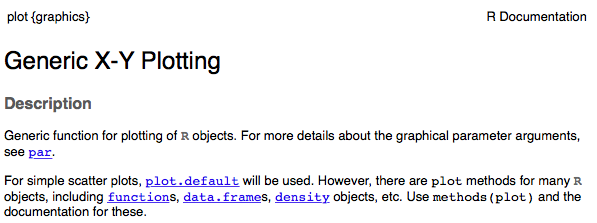

```{r setup, include=FALSE}
knitr::opts_chunk$set(echo = TRUE)
# options(repos = c(CRAN = "http://ftp.ussg.iu.edu/CRAN/"))
```

## Today

- Review of Unit 1 learning goals:
- End of unit survey
- Plotting and regressions


## Today's data
```{r}
fnm <- system.file("extdata/farmer_test2.csv", package = "geospaar")
farmers <- read.csv(fnm, stringsAsFactors = FALSE)
```

Create the same dataset
```{r}
dates <- unique(farmers$date)  # forgot to make this explicit before class

# the fast way
farmers2 <- t(sapply(dates, function(x) {
  dat <- farmers[farmers$date == x, c("pl", "ra", "mm")]
  colSums(dat)
}))

# bind dates, and change row names of farmers2 from dates to integers
# farmers2 <- cbind.data.frame("date" = as.Date(dates), farmers2)
farmers2 <- data.frame("date" = as.Date(dates), farmers2)
rownames(farmers2) <- 1:nrow(farmers2)  # rownames were dates, want just as #
```


## Unit 1 Learning Goals

- ___Understand___: R's origins and its strengths and weaknesses; the concept of reproducibility and R's role within that; how R, Rstudio, GitHub, and Rmarkdown play together; R's data type and structures, objects, classes, and environments; the evolutionary trajectories emerging in the R language. 

- Be able to comfortably* ___do the following___: create a Git repo and manage it through RStudio (and its shell environment); perform and document analyses in Rmarkdown; create and document a basic R package; read and write data in R; use control structures (including *apply* functions, particularly for split-apply-combine operations); write a simple function; reshape, analyze (with basic statistical functions), and visualize non-spatial data; write clean code following our [selected R style guide](http://adv-r.had.co.nz/Style.html)

*Comfortable does not mean fluent

## Base plotting, continued

First, a look at the plot function



From `?plot` (Generic X-Y plotting)
```
## Default S3 method:
plot(x, y = NULL, type = "p",  xlim = NULL, ylim = NULL,
     log = "", main = NULL, sub = NULL, xlab = NULL, ylab = NULL,
     ann = par("ann"), axes = TRUE, frame.plot = axes,
     panel.first = NULL, panel.last = NULL, asp = NA, ...)
```

## Base plotting 2

Plotting in a `for` loop

```{r, fig.width=7, fig.height=3, fig.align="center"}
inms <- c("pl", "ra", "mm")
cols <- c("orange", "red", "blue")
ynms <- c("Plant", "Rain", "Tot rain")
par(mfrow = c(1, 3))
for(i in 1:length(inms)) {  # i = 2
  x <- farmers2$date
  y <- farmers2[, inms[i]]
  plot(x, y, pch = 20, col = cols[i], xlab = "Date", 
       ylab = ynms[i])
}
```

## Base plotting 3

An exercise: 

Do the previous, but instead of xy plot, make a three-panel histogram, in which the first panel has this histogram of `farmers2$pl`, the second `farmers2$ra`, the third `farmers2$mm`, with the the bar colors respectively orange, red, blue, and the ___x___ labels respectively "N", "N", "mm", and the histogram titles should be "N farmers who planted", "N farmers reporting rain", "Total Rainfall"

Note that we are unconcerned with the date value in a histogram.

Here's a single histogram to get started
```{r}
?hist
hist(farmers2$pl, col = "orange")
```

## The hist function 

From `?hist`

```
## Default S3 method:
hist(x, breaks = "Sturges",
     freq = NULL, probability = !freq,
     include.lowest = TRUE, right = TRUE,
     density = NULL, angle = 45, col = NULL, border = NULL,
     main = paste("Histogram of" , xname),
     xlim = range(breaks), ylim = NULL,
     xlab = xname, ylab,
     axes = TRUE, plot = TRUE, labels = FALSE,
     nclass = NULL, warn.unused = TRUE, ...)
```

## Regressions, including fitted predicted results

A look at `lm` (follow along by looking at `?lm`)
```
lm(formula, data, subset, weights, na.action,
   method = "qr", model = TRUE, x = FALSE, y = FALSE, qr = TRUE,
   singular.ok = TRUE, contrasts = NULL, offset, ...)
```

Let's fit a regression between N farmers planting per date, and the total rainfall. 
```{r}
pl_lm <- lm(pl ~ mm, data = farmers2)
# summary(pl_lm)
coef(pl_lm)
```

## Plot `lm` predictions, three ways
```{r}
plot(farmers2$mm, farmers2$pl)  # base plot

# method 1 - the abline function
abline(pl_lm, lwd = 10)  

# method 2 - the predict function
dummy <- seq(0, 7100, 100)  # first, dummy x value data 
method1_predict <- predict(pl_lm, newdata = data.frame("mm" = dummy))
lines(dummy, method1_predict, lwd = 5, col = "red")

# method 3 - manually, using coefficients from linear model
cfs <- coef(pl_lm)  # coefficients
manual_predict <- cfs[1] + cfs[2] * dummy  # predict by hand using coeff.
lines(dummy, manual_predict, col = "blue1", lwd = 1)

```

## The `predict` function

From `?predict`

_predict is a generic function for predictions from the results of various model fitting functions. The function invokes particular methods which depend on the class of the first argument_


## Non-linear (non-parametric) regressions

`?loess`

```
Local polynomial regression fitting

Fit a polynomial surface determined by one or more numerical predictors, using local fitting.

Usage 

loess(formula, data, weights, subset, na.action, model = FALSE,
      span = 0.75, enp.target, degree = 2,
      parametric = FALSE, drop.square = FALSE, normalize = TRUE,
      family = c("gaussian", "symmetric"),
      method = c("loess", "model.frame"),
      control = loess.control(...), ...)
```

Exercise: 

1. Make a `loess` model, in which you fit "mm" to "pl" (i.e. the same as with `lm`).

2. Apply the `predict` method to the output `loess` object (call it `pl_lo`)

3. Add it to the plot created by 
```{r, eval = FALSE}
plot(farmers2$mm, farmers2$pl)  # base plot
abline(pl_lm, lwd = 10)  
```

```{r, echo = FALSE, eval = FALSE}
# answers
# histogram
inms <- c("pl", "ra", "mm")
cols <- c("orange", "red", "blue")
xnms <- c("N", "N", "mm")
titles <-c("N farmers who planted", "N farmers reporting rain", 
           "Total Rainfall")
par(mfrow = c(1, 3))
for(i in 1:length(inms)) {  # i = 2
  x <- farmers2[, inms[i]]
  # x <- farmers2[, i + 1]
  hist(x, col = cols[i], xlab = xnms[i], main = titles[i])
}

# loess
farmers2$n <- 1:nrow(farmers2)

pl_lo <- loess(pl ~ mm, data = farmers2)
# pl_lm <- lm(pl ~ mm, data = farmers2)

plot(pl ~ mm, data = farmers2)
lines(dummy, predict(pl_lo, newdata = data.frame("mm" = dummy)), 
      col = "red")
abline(pl_lm)
```

```
