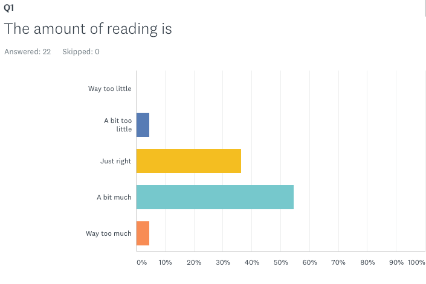
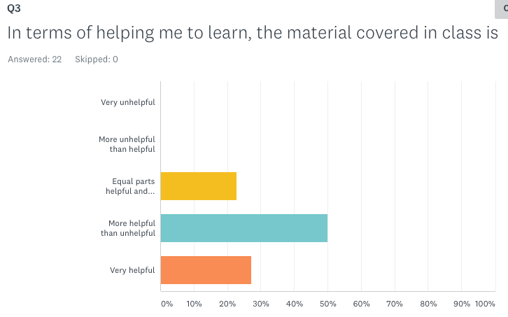
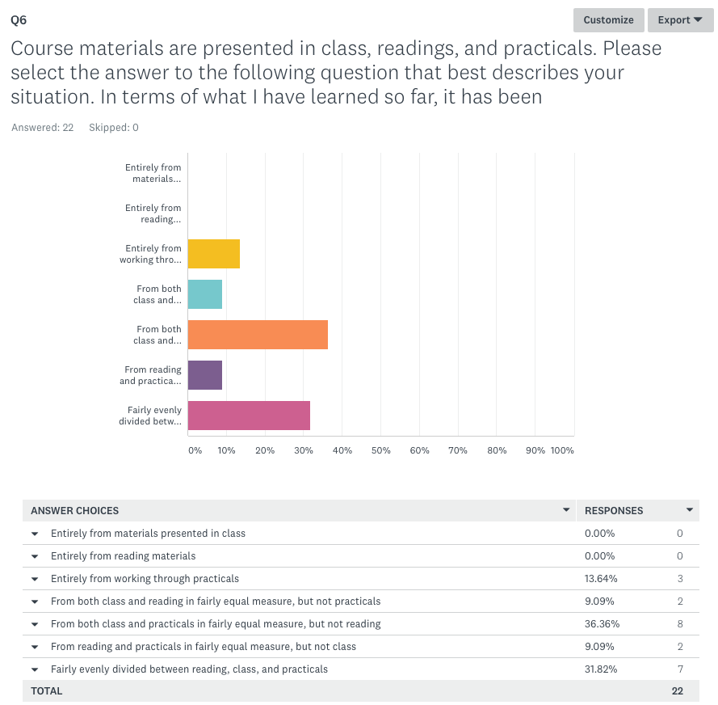
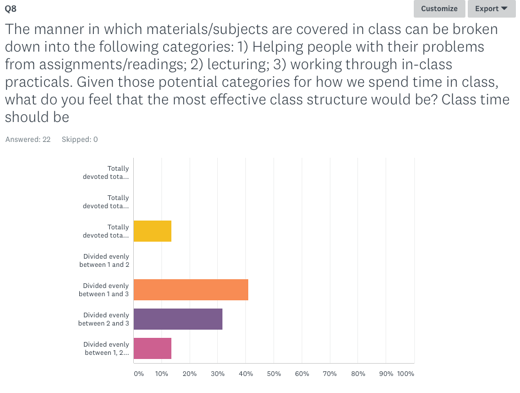
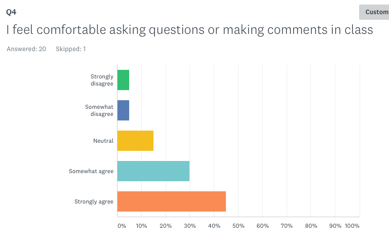

```{r setup, include=FALSE}
knitr::opts_chunk$set(echo = TRUE)
# options(repos = c(CRAN = "http://ftp.ussg.iu.edu/CRAN/"))
```

## Today

- Late assignments
- Survey results and corrections
- Intro to spatial

## Survey 1 Q1

Results analyzed via survey monkey




## Survey 1 Q2


## Survey 1 Q3



## Survey 1 Q4


## Survey 1 Q5


## Survey 1 Q5 "Other"

"The plotting was clear because it is intuitive. The apply family was difficult because many of us needed some more practice and better understanding, so thank you for realizing that and adjusting to the class."

"what is a practical?"

"They can sometimes go very fast."

"Sometimes the instructions are not rightly stated and makes it confusing and difficult"

"Great practice and helpful but go a little slower in them so we can truly understand what is going on."

"I think the practicals work best when the homework/readings provide a few examples (ranging from very elementary to basic) that we can work through before class; and then in class we work though a (slightly) more complicated question; and then HW involves a marginally more difficult application of the concept."

## Survey 1 Q6



## Survey 1 Q7


## Survey 1 Q8



## Survey 1 Q9


## Survey 1 Q10


## Survey 2 Q1


## Survey 2 Q2


## Survey 2 Q3


## Survey 2 Q4



## Survey 2 Q5, 1

"Guided tutorials and examples of how to format new topics introduced. We usually have to read to learn them, some, like I, are visual learners and could benefit from demonstrations to learn the material and r logic."

"I like how the readings have gotten more manageable and that Lyndon is making his own personalized content for reading and explanations."

"I would do a quick review of the concepts learned with examples before applying a practical for the students to do. Spend more time with questions during that review time. Also, make sure that the instructions and functions noted in the assignments were covered in class."

"Teach Github as a separate concept"

"What we learn seems very disconnected. It would be nice to have a comprehensive guide or review to use as a reference because as of now looking up something while doing homework can cause even more confusion."

"I would spend a bit more time on some of the basics in the first couple weeks of class, and spend probably the whole first week really walking through git / github, while taking into consideration the fact that students will be unfamiliar with the RStudio environment, and how to perform the commands necessary in R and Shell in order to properly link RStudio/Git/GitHub"

## Survey 2 Q5, 2

"Have at least 1 time each week when class period (or Lyndon's office hours) is devoted entirely to exercises / practicals"

"I would increase the pace of class and getting through introductory materials. Full disclosure, I have had previous experience using R on my own and am comfortable with basic data types, functions, and plotting."

"I wish this class was first devoted to learning the software and functions, then using github. I don't feel comfortable proposing a final project because I don't know the software well enough to create something at this point. Also, add a lab section!"

"I would like to see less readings, or have the same amount that have more focus. Right now, I get very overwhelmed by opening up all of the readings, plus having to do assignments and finish any tutorials that we don't finish in class. If we had better focus and were told explicitly what to focus on in class, I think it would be better."

"The reading task should be less than before"

"Begin with basic R functions (perhaps based off the structure of Swirl and perhaps incorporating that into homework), and then move to Git once we have a better handle of R functions and file structure."

## Survey 2 Q5, 3

"Spend more time on the bare bones basics of R"

"More Practicals"

"I would add an add a lab section to the course while keeping the two classes"

"Having extra labs that takes care of common areas of concern"

"I would suggest that at the start of the course to start with a bit more intro of basic R use prior to going into Git, GitHub, and deep theory. I definitively think all those features are extremely important, but it was difficult to follow without any R experience."

"To be honest, I really feel that this class needs a weekly designated lab so that class can focus on lecturing concepts to learn and going through practicals while the lab section can be focused on questions regarding homework, and working through hw in class so can easily ask questions to TA and Professor. I think we are trying to get to much accomplished in class and it just feels a bit rushed, which hinders the learning process."

## Survey 2 Q5, 4

"I think the first few classes should just focus on very basic elements of code, and the most fundamental data/function terms that come up regularly; maybe how to read in a csv. - Keep the S3 and S4 stuff, and other how-R-works stuff, for later in the semester until we have some mastery of basic coding concepts and a better idea of how functions work. They aren’t very helpful to know/don’t make much sense if you don’t have some experience with R. I think they may be useful to know at the very end of unit 1, but definitely not in the first few weeks. - I also think that the very first assignment should just use R/Rstudio; GitHub can be added in after the first or second week. Introducing R/Rstudio AND Git/GitHub (and Slack) all in the same week is a bit much. - Skip readings/lecture about things that are alternative ways to do things that we’re doing. For example, I’m not sure that talking about ggplot as one other method of plotting was particularly useful since we won’t be using it, and it just adds some confusion. (Or, anytime you’re introducing alternative ways to do something, mention there that these are other ways of doing this (very, very briefly) and make any material about them optional readings)"

"In-class exercises are most helpful for me, so I would like to spend more time practicing and going over different types of exercises (both instructor-led walkthrough and working on our own)."

## Survey 2, Q6, 1

"Begin the course with basics like for loops, packages, apply , plotting then introduce github and vignettes. Conceptualizing the interaction with local and git repositories was difficult without any foundation but knowing git is critical so it should be kept in the course."

"I like how the class is open to student participation and ongoing discussion and problem solution sharing."

"Assignments were helpful in terms of applying concepts."

"Doing practicals in class and going through them together line by line."

"I would keep Git/GitHub version controlling. This is a very useful skill, and better that students are introduced / proficient in it in an academic setting rather than on the job (resume building skill)"

"Keep doing practicals! And keep using slack. Eventually we'll get github, please don't remove it, it just takes some time to learn it"

"I would keep the use of Git and GitHub. I am finding it extremely useful to learn both of these and I think the skills will make me more competitive in the job market."

## Survey 2, Q6, 2

"I think that Professor Estes is an understanding and committed professor. I think he should continue to teach the course."

"I still liked the flipped classroom structure. I think it would be good to have us do readings related to a specific topic due the first day of the week, then you could lecture that first day on what those readings meant, answer any conceptual questions, etc., then for the second day of class in the week, we would have due some tutorial related to those concepts, and then work through the practical part of things in class similar to how classes seem to go now. I just think it would help direct and focus what we are needing to know, while also keeping this flipped classroom approach of us mostly learning from readings on our own."

"Communicating through Slack"

"Slack integration is super useful"

"The in class practicals are an excellent tool"

"Slack and combination of practicals, readings and discussion/help sessions"

"I would try to keep the balance of lecture, demos, and assisting students."

"Mode of communication"

## Survey 2, Q6, 2

"I think everything about the class ahs been important and applicable so far, I just think the approach could be changed. Maybe more hands-on work, even though we do a lot already, it is definitely the most effective way for me to learn how R works."

"I find the practicals gone through in class to be really helpful in really learning concepts and getting them down. Also it is helpful that they can be referenced at later times."

"Definitely keep GitHub (but see comments above re: introducing a bit later in the semester)"

"I would definitely keep the version control aspect -- GitHub and Git are pretty ubiquitous for people interested in software development and/or writing scripting tools for automation. This class has been an awesome means of learning Git/GitHub in addition to R. I would also like to spend more time practicing with R programming (i.e. spend more time on in-class exercises/demos). Since this class also does not have a lab component to it, I think it might be helpful to trim down readings to capture the most essential elements of the course, do a combination of lecture/short demos/and answering questions about reading on Mondays, then devoting Wednesday to in-class exercises to further practice key concepts learned in Monday's lecture/class demos, and troubleshooting coding-related problems students may encounter."


## Key takeaways

- Readings:
    - Have been least clear component of course 
    - Dial-back reading a __little__ bit
    - Make more focused
    - Hopefully generated content for Unit 2 will achieve this
        - ___Please fill out related anonymous slack poll___
- Class: 
    - More in-class practicals/demonstrations
        - Integrated more with readings
    - Pace is close to right, maybe slow up a little
    - Possible structure: 
        - more lecture/overview on Monday, more practicals Wednesday
- Assignments: 
    - Not enough data because I messed up wording on Q5 
        - ___Please fill out related anonymous slack poll___
    - But will be closer to the readings/class in this Unit
    
## Key takeaways 2

- Structure/content
    - Reasonable demand for new lab
        - Suggest alternating office hours -> weekly alternation of slot
    - Git/GitHub very useful, but either later in semester, or simply better explained early on and with more time devoted to it
    - More focus on R basics early on, theoretical stuff later on
- Communication
    - Office hours plus Slack
    - Please always feel free to contact me for appointment
    
## Spatial intro

Key concepts: 

- `sp` and Spatial Classes and Methods
- Classes:
    - Large number of Spatial* classes
        - Vector-based - we are interested in these
        - Grid-based - we are less interested in these, because `raster`
- Methods for working with spatial data
    - Particularly summarizing, printing, and visualizing
    
## Key packages

- `rgdal`
    - access to many formats of spatial data, integrating:
          - GDAL, the Geospatial Data Abstraction Library [link](http://www.gdal.org):
      
              > As a library, it presents a single raster abstract data model and single vector abstract data model to the calling application for all supported formats
          
        - PROJ.4 [link](http://proj4.org)
        
              > proj.4 is a standard UNIX filter function which converts geographic longitude and latitude coordinates into cartesian coordinates (and vice versa), and it is a C API for software developers to include coordinate transformation in their own software. proj.4 is maintained on GitHub.
    
        - OGR (old)
            - OGR merged into GDAL now
            - but reason you see "OGR" in function names

## Key packages 2

- `rgeos`
    - Wrapper to GEOS [link](https://trac.osgeo.org/geos/)
    
        > GEOS (Geometry Engine - Open Source) is a C++ port of the Java Topology Suite (JTS). As such, it aims to contain the complete functionality of JTS in C++. This includes all the OpenGIS Simple Features for SQL spatial predicate functions and spatial operators, as well as specific JTS enhanced topology functions.
    
    - Access to many vector operations: unions, intersects, differences, etc.     
- `raster`
    - Preferred format for working with and analyzing gridded data
    - Gives many convenient vector functions, in some cases better and more user friendly than `rgeos`

## Exercises

### Exercise 1

Create `SpatialPoints` from farmers, call it `farmerpts`

```{r}
farmers <- read.csv(system.file("extdata/farmer_spatial.csv", 
                                package = "geospaar"), stringsAsFactors = FALSE)
```

Also create `SpatialPointsDataFrame` from farmers, call it `farmers`

## Exercise 2

Convert `farmers` back to a `data.frame`

## Exercise 3

Read in "roads.shp" and "districts.shp" into spatial objects `roads` and `districts`

Compare their classes. 

## Exercise 4

Convert `roads` to just `SpatialLines`, and `districts` to just `SpatialPolygons`

## Answers

```{r, eval = FALSE}
# Exercise 1
# spatialpoints
farmerpts <- farmers[, c("lat", "lon")]
coordinates(farmerpts) <- ~lon + lat

# or 
farmerpts <- as.data.frame(farmerpts)
farmerpts <- SpatialPoints(farmerpts)  # but doesn't work for data.frames

# SpatialPointsDataFrame
farmers <- SpatialPointsDataFrame(farmers)  # fail
coordinates(farmers) <- ~lon + lat  # correct, promotes to SpDF

class(farmerpts)
class(farmers)

# various in-class meanderings 
# explore slots
slotNames(farmerpts)
slotNames(farmers)

slotNames(farmers)
slot(farmers, "data")[1:2, ]
slot(farmers, "coords")[1:2, ]
slot(farmers, "coords.nrs")

```

## Answers cont

```{r, eval=FALSE}
# Exercise 2
farmers <- as.data.frame(farmers)  # coerce/demote back to data.frame

# coercion
farmerpts <- as.data.frame(farmerpts)
as(farmerpts, "SpatialPoints")  # fail

# Exercise 3
fnm <- system.file("extdata/roads.shp", package = "geospaar")
roads <- readOGR(dsn = fnm, layer = "roads")
fnm <- system.file("extdata/districts.shp", package = "geospaar")
districts <- readOGR(dsn = fnm, layer = "districts")

# Exercise
roads_spl <- as(roads, "SpatialLines")
dists_spl <- as(districts, "SpatialPolygons")
c(class(roads_spl)[1], class(roads)[1])
c(class(dists_spl)[1], class(districts)[1])
```


