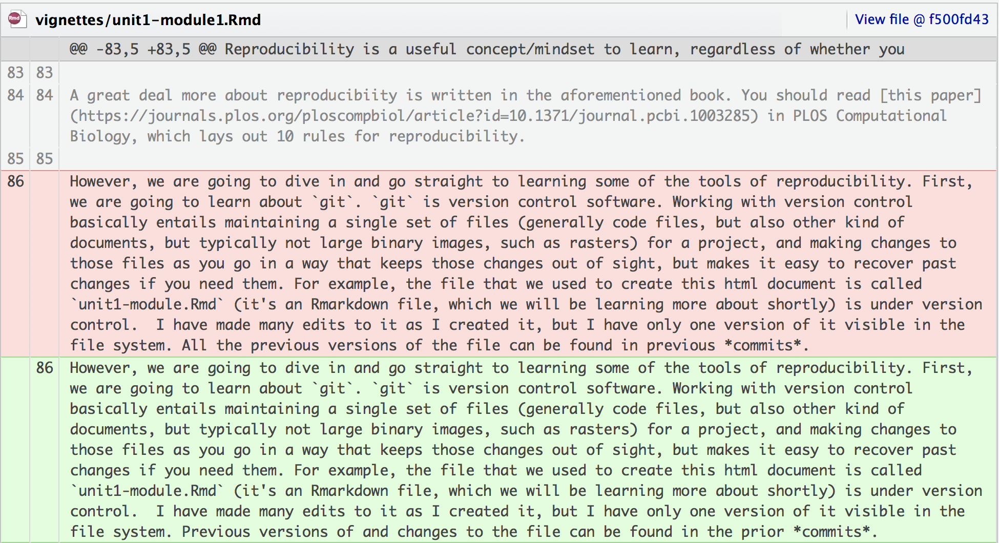
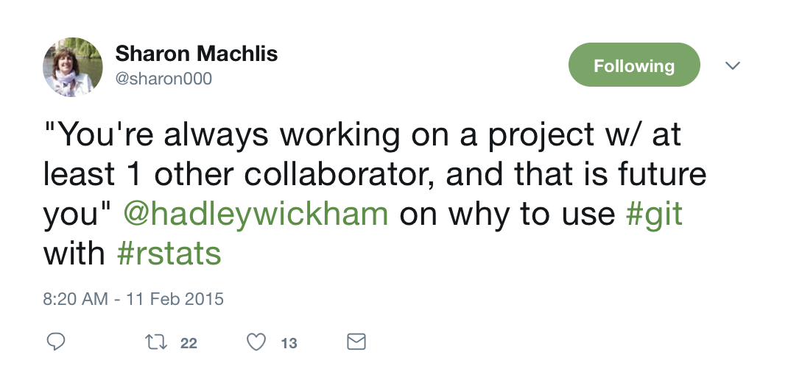
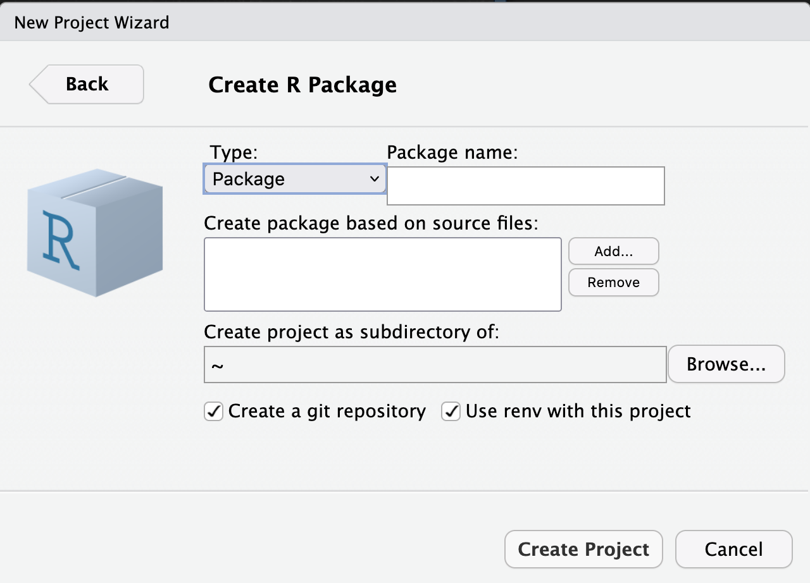
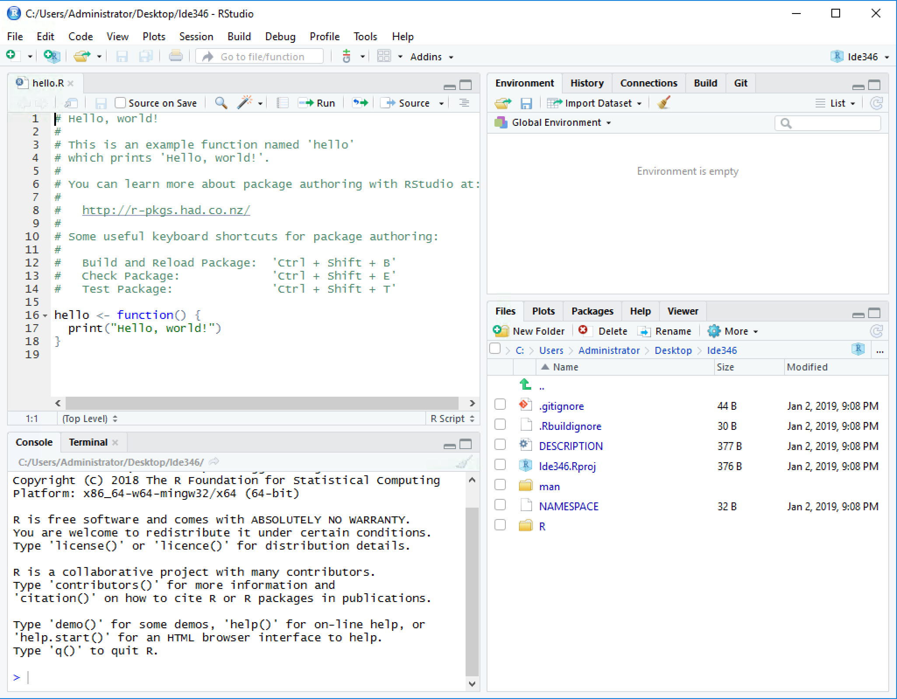
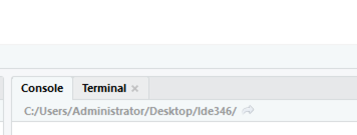
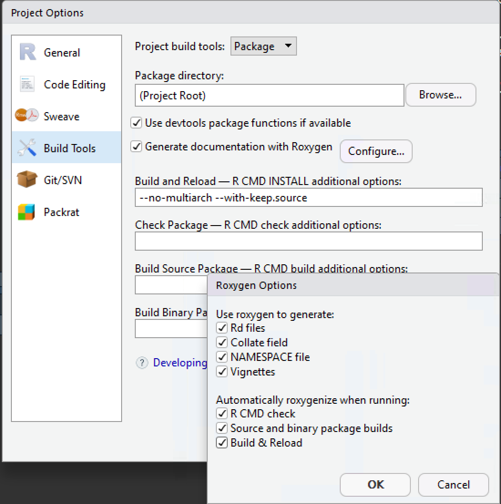
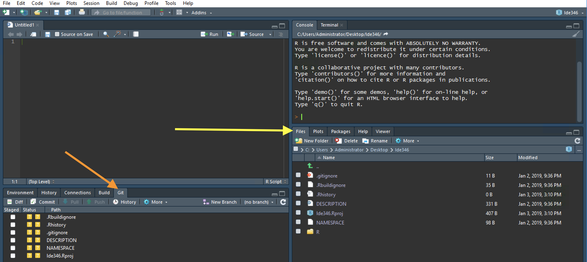
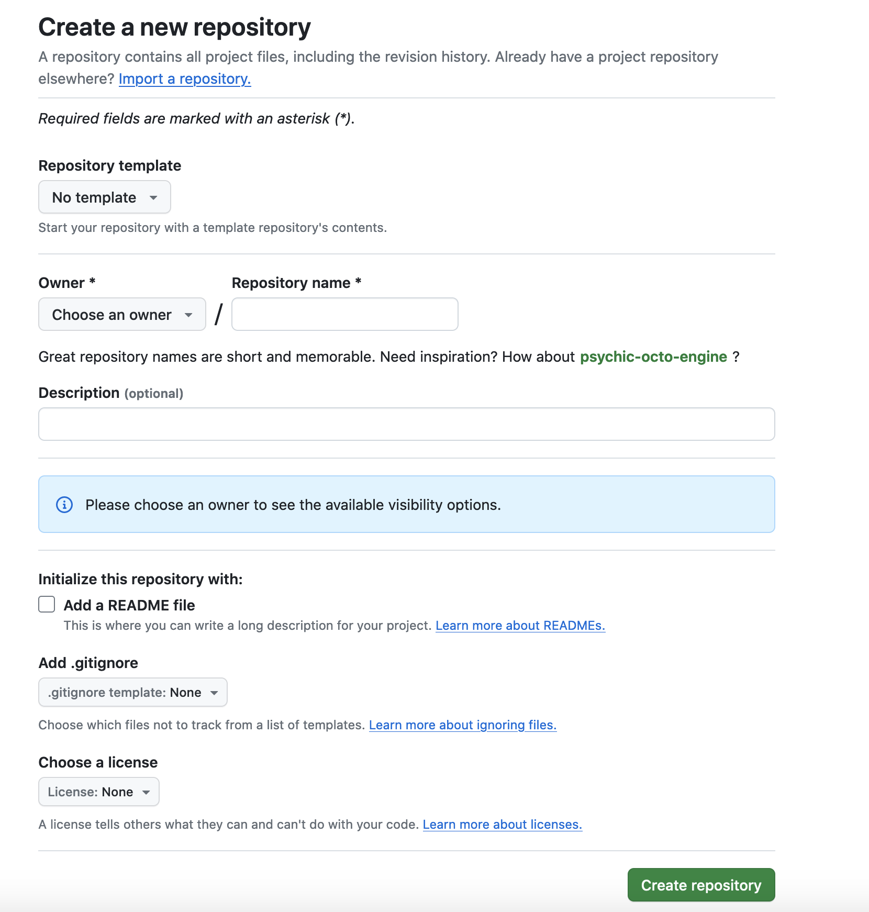
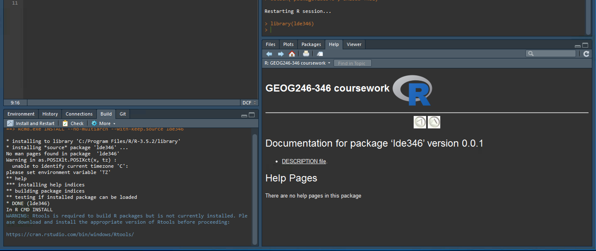
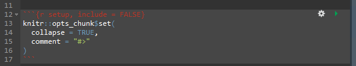

```{r setup, include = FALSE}
knitr::opts_chunk$set(
  collapse = TRUE,
  fig.align = "center",
  comment = "#>"
)
library(knitr)
```

***
<center>
[Back to **vignette index**](toc.html)
</center>
***

# Introduction{#unit1mod1intro}

This unit has two general focus areas: 

1. A overview of the R language, its history, use, strengths, weaknesses, and evolutionary trajectory. 

2. An introduction to the concepts and skills of reproducibility

The first focus area primarily entails reading and watching online resources. The second requires the same plus hands-on work with Rstudio, `R`'s industry-standard [IDE](https://en.wikipedia.org/wiki/Integrated_development_environment), and [git](https://git-scm.com) and [GitHub](https://github.com), which are two tools that are critical to the mission of reproducibility. 

# R overview

There is a vast amount of material online about `R`. We have selected a few resources from among these for you to read and/or watch, so that you get a sense about the language and what it does. _You should complete these assignments by the first class_. 

Roger Peng (Johns Hopkins University) provides a nice history and overview of `R` in this 16 minute [youtube video](https://www.youtube.com/watch?v=STihTnVSZnI) that introduces his own `R` course. This provides some insight into R system the advantages and disadvantages (e.g. memory-dependence) of R, the freedoms associated with using `R`, as well as the basic system design and package ecosystem. 

Hadley Wickham's [introduction section](http://adv-r.had.co.nz/Introduction.html) to his book [*Advanced R*](http://adv-r.had.co.nz) provides a nice bullet-point summary of `R`'s advantages and disadvantages.  

Please also visit `R`'s [homepage](https://www.r-project.org), the center of the `R` universe, and particularly [CRAN](http://lib.stat.cmu.edu/R/CRAN/), where official `R` packages live (actually the link provided is the closest CRAN mirror site, which lives at Carnegie Mellon University).

Finally, you might have heard of the `python` programming language, and wonder why you are learning `R`. Good question. You can't throw a rock without hitting a `python` versus `R` comparison, and here's [one of the more recent examples of this genre](https://medium.com/@data_driven/python-vs-r-for-data-science-and-the-winner-is-3ebb1a968197). Please have a look, but basically each language has a lot of similarities, and one would do very well to learn both. To this I would add something I have yet to find, which is a comparison of `R` and `python` for their ability to handle spatial data (there are comparisons out there, but none really comprehensive, e.g. [this](https://www.quora.com/Which-is-better-for-spatial-analysis-Python-or-R)). Both languages can do it, but my own personal (and admittedly biased and unscientific) sense is that `R`'s capabilities to do standalone spatial analysis are more developed than python's. I think this advantage could continue to grow now that development of the `sf` package (vector data) is well underway, and the new `stars` package (rasters) is starting to move. 

On the other hand, `python` seems to be preferred for machine learning applications on remote sensing data, and gives the ability to programmatically work with geospatial platforms like [Google's Earth Engine](https://developers.google.com/earth-engine/python_install), QGIS, ArcGIS, and the new [Radiant Earth platform](https://pypi.org/project/radiantearth/). It is also preferred, it seems, for setting up production workflows. So, really, there is a case for learning both languages, and developments such as the new [`reticulate` package](https://rstudio.github.io/reticulate/) from Rstudio make it increasingly possible to use both languages in more integrated fashion, as the need arises. That's a subject for another time (and not this class), but just one more reason why we should think about `R` and `python` rather than `R` or `python`. 

***
<center>
[Back to top](#unit1mod1intro) || [Back to **vignette index**](toc.html)
</center>
***

# The tools and concepts of reproducibility

## Reproducibility
The first set of skills we are going to learn in this course are not related to R, but more generally to programs and concepts that foster *reproducibility*. What is that? A good working definition of the term, as it relates to scientific computing, is: 

> the ability of a researcher to duplicate the results of a prior study using the same materials as were used by the original investigator. That is, a second researcher might use the same raw data to build the same analysis files and implement the same statistical analysis in an attempt to yield the same results.

That is actually a quote by Goodman, Fanelli, & Ioannidis (2016) in an [e-book on reproducibility](https://www.practicereproducibleresearch.org/core-chapters/2-assessment.html), but it works here. 

Reproducibility is a useful concept/mindset to learn, regardless of whether you are going into academia or industry, as it ultimately makes your life easier, particularly when you have to revisit and revise work. The practice of making your work reproducible also makes it easier to share your work with others. 

A great deal more about reproducibiity is written in the aforementioned book. You should read [this paper](https://journals.plos.org/ploscompbiol/article?id=10.1371/journal.pcbi.1003285) in PLOS Computational Biology, which lays out 10 rules for reproducibility.  

## The tools of reproducibility
### Version control and git
However, we are going to dive in and go straight to learning some of the tools of reproducibility. First, we are going to learn about `git`. `git` is version control software. Working with version control basically entails maintaining a single set of files (generally code files, but also other kind of documents, but typically not large binary images, such as rasters) for a project, and making changes to those files as you go in a way that keeps those changes out of sight, but makes it easy to recover them if you need them. For example, the file that we used to create this html document is called `unit1-module1.Rmd` (it's an Rmarkdown file, which we will be learning more about shortly) is under version control.  I have made many edits to it as I created it, but I have only one version of it visible in the file system. Previous versions of and changes to the file can be found in the prior *commits*.  

The image below illustrates version control--this shows Rstudio's interface to `git`, comparing the text in the paragraph above to the text in the previous committed version of this file: the pink shows the older paragraph, the green the newer one (I changed just a few lines in there)  

```{r out.width = "60%", fig.align='center', echo=FALSE}
 
```
<!--  -->

So, that is a small taste of version control. If you have ever worked with Google Docs, it does its own form of version control--you can look back at previous edits and changes. Using `git` is a bit more explicit and deliberate than that--you have to make commits manually, changes aren't saved automatically, but that's okay, and it helps us choose how much we want to change before committing the file version. 

So why are we using it here? We want to avoid this common practice used when updating project documents: make a file, name it something, make a bunch of changes, decide you want to keep the previous version -> make a new copy of the file -> append the date to the filename to track the changes.  Before long you end up with a cluttered directory that might look something like this: 

```bash
├── my_folder
    ├── somefile.txt
    ├── Somefile_jan 20 2018.txt
    ├── somefile_2 Feb2018.txt
    ├── somefile_jan12018.txt
```

You can't remember what's in each file or when you made a particular change, and you start to hunt. Version control helps us keep folders neat and pruned, and makes edits fairly recoverable, so that we can just use a single file (in the example above) called `somefile.txt` and keep track of all the changes made to that file. That's why we are going to use `git` in this class. 

### git and GitHub
`git` is a program that lives on your local machine. You can make commits locally, and just keep things under version control on your local machine. If you want to collaborate, or even work with your project across multiple machines, you can create a remotely stored version of your `git` project (repository) on [GitHub](https://github.com).  GitHub is one of several web services that provides hosting for git repositories. It also provides useful collaboration functionality. We'll come back to this. 

#### Still not convinced?
Okay, so maybe you finished reading this section and are still wondering why you have to learn `git` and GitHub in an `R` course. Here's a pithier expression of the reasoning:

```{r out.width = "50%", fig.align='center', echo=FALSE}
 
```


### Packages{#packages}

Packages are another tool of reproducibility that we will learn to use in this class. Packages are bundles of code and documentation that provide a specific functionality for a particular language. Both `python` and `R` make extensive use of packages, as the utility of both languages depends heavily on user-contributed code. Code contributions are made through packages, which standardize and formalize the user-developed functions so that they work properly within the language, and can be easily used by the broader community. 
Packages are also useful even if you don't intend to contribute code to the community, as they have a particular structure that can be useful for helping to organize and formalize your thinking, data analysis, and reporting. They can also save you time as they make it much easier to access functions that you have developed for one project and apply them to another. I learned these ideas from reading Hillary Parker's [blog post on personal R packages](https://hilaryparker.com/2013/04/03/personal-r-packages/), as well as Karl Broman's [R package primer](http://kbroman.org/pkg_primer/pages/why.html), and of course Hadley Wickham's [introduction](http://r-pkgs.had.co.nz/intro.html) to his *R packages* book (please read all aforementioned links).

I have adopted the package structure for organizing the analyses and writing of each of my papers. For example, two of my most recent papers are structured as `R` packages that can be installed from their GitHub repositories (which can be found [here](https://github.com/agroimpacts/ecoscales) and [here](https://github.com/agroimpacts/croplandbias)). These contain all the code used to do the analyses, create the figures, and full (non-journal formatted) versions of the manuscripts. And (as you may have noticed by now), this class is also structured as an `R` package.

***
<center>
[Back to top](#unit1mod1intro) || [Back to **vignette index**](toc.html)
</center>
***

## Setting up your setup

### Installations
The first thing you need to do is to install `R`, Rstudio, and `git` on the machine that you will be using outside of the classroom (you cannot count on the class computers for this). Ideally, you will set up your projects in a cloud-based folder that you can access from the computers in JC103, for sharing large data files (note: `git` and GitHub are not intended for sharing large data files).

- Install `git` by following [links here](https://git-scm.com/book/en/v2/Getting-Started-Installing-Git) to get the version for your OS. If you are installing `git` for Windows, install using the default options. 
- Then install `R` for your OS from Rstudio's link to [CRAN's R downloads](https://cran.rstudio.com) (use default options)
- And then [download] (https://www.rstudio.com/products/rstudio/download/#download) and install Rstudio (use default options).

### Your first Rstudio project{#your-first-rstudio-project}

We are going to get our start with Rstudio and our reproducibility tools by using some of Rstudio's handy built-in capabilities.  We are going to do that by creating a new Rstudio project that has the minimal set of files and folders needed for an R package, as well as its own git repository.  

To do this: 

1. Open up Rstudio
2. Find the Packages tab, click install, type "devtools" into the "Packages" dialog, and click install.  You will notice a bunch of stuff installing in the console. 
3. When that is finished, select File > New Project
4. In the new project dialog that pops up, choose "New Directory", and then in the next page, select the "R package using devtools" option at the very bottom. You will see a screen that looks like this:

```{r out.width = "60%", fig.align='center', echo=FALSE}
 
```

5. Here we'll make a couple of decisions:
    - Name the package using your initials (in lowercase) followed by the three digits of the course (246 or 346, depending on which you are enrolled in), e.g. in my case it would be lde346.  
    - Under the "Create project as sub-directory of" enter the folder where you want this project to live. Since this choice impacts your file organization, it touches on the broader theme of reproducibility, and should therefore be a carefully considered choice. For example, you might want to choose the folder in which you keep all course-related work, with this folder being a sub-folder of geog246346. I do not suggest your Desktop as a good location, as shown here. 
    - It is optional whether you want to "Open in a new session" or not.
    - Choose "Create Project"
    
6. You will now have an opened Rstudio project, with the name you selected. You are going to be working in this project for the first two units of the class.  Let's configure Rstudio a bit first. Your first view (assuming this is your first use of Rstudio) will look something like this:
```{r out.width = "40%", fig.align='center', echo=FALSE}
 
```

    Let's modify the pane layout first, by going to Tools > Global Options > Pane Layout, and make it match this: 
```{r out.width = "40%", fig.align='center', echo=FALSE}
include_graphics("fig/u1m1-4.png") 
```

    You can also change the Rstudio theme by going to Tools > Global Options > Appearance (I personally prefer light text on dark backgrounds). Also check the Tools > Terminal tab, and make sure that either "Bash" (Mac/Linux) or "Git Bash" (Windows) are enabled in the "New terminals open with" dialog.

    You should also see a terminal tab next to the console tab:
```{r out.width = "40%", fig.align='center', echo=FALSE}
 
```

    Last thing under Global Options to modify: > Code > Display > Check Show Margin tab, which should have 80 in the margin column value box. 
    
7. Now let's set up some project options that will make our lives easier when build packages. Go to Tools > Project Options, and make it look like this (i.e. check "Generate documentation with Roxygen" and check all boxes in the dialog after click the Configure button): 

```{r out.width = "50%", fig.align='center', echo=FALSE}
 
```

Okay, we are basically set-up with the full set of tools you need. We are now going to learn to work with `git`. 

***
<center>
[Back to top](#unit1mod1intro) || [Back to **vignette index**](toc.html)
</center>
***

# Using git and GitHub

Before we get started with some hands on work with `git`, it is important to understand a bit more about version control than the very brief overview we provided in above. Read the good [explanation of version control systems](https://git-scm.com/book/en/v2/Getting-Started-About-Version-Control) in the [Pro Git book](https://git-scm.com/book/en/v2), which tells us that `git` is a distributed version control system. [Getting Started - Git Basics](https://git-scm.com/book/en/v2/Getting-Started-Git-Basics) explains to us exactly how `git` works and how it is different from other version control softwares. Another important concept to learn is _branching_, which is explained in [this chapter](https://git-scm.com/book/en/v2/Git-Branching-Branches-in-a-Nutshell), and which, in essence, is a way of isolating specific changes you want to make to your code from the main body of your code (which might need to be preserved as is so others can keep using it without it breaking), or, as the book says: 

> Branching means you diverge from the main line of development and continue to do work without messing with that main line

Another post on [git branching](https://nvie.com/posts/a-successful-git-branching-model/) (and merging, which we will come back to) has a more effective schematic for showing the concept and why it is used. 

```{r out.width = "50%", fig.align='center', echo=FALSE}
include_graphics("fig/u1m1-branching.png") 
```

This schematic is oriented towards software development projects. For the purposes of this class, however, you will use a simplified version of this structure to separate your assignments from one another. 

## git configuration

If you have just installed `git` on your computer, before we can use it, we need to do a little bit of configuration.  You can either use your terminal (mac/linux), `git bash` terminal (Windows), or the terminal RStudio provides to do this. So, choose the best one of those for you, and then, at the prompt enter:

```bash
git config --global user.name "YOUR GITHUB USER NAME"
git config --global user.email "EMAIL ADDRESS LINKED TO YOUR GITHUB ACCOUNT"
```

Replace the prompt text in the above commands with your GitHub user name and email address associated with your GitHub account, respectively. 

## Your first commit
Let's start to use `git` now. We are going to do this using Rstudio's `git` interface, and the project you just created in the previous section. So open that project (mine is lde346.Rproj, which is found in the lde346 folder on my computer--I can open it and Rstudio up by double-clicking the .Rproj file).

Once in there, click on the "Files" tab, and you will see your directory structure, which should look like what you see in the image below.

```{r out.width = "70%", fig.align='center', echo=FALSE, fig.cap="New Rstudio package project file structure (yellow arrow) and git tab (orange arrow). Rstudio's Editor theme is 'Idle Fingers'."}
 
```

You will also notice the `git` tab in lower left of the image, which has a listing of the same files with yellow boxes with question marks in them under the status section.  This is Rstudio's GUI interface to `git`. You can get the same information by going to Rstudio's terminal tab (upper right), and typing at the prompt in there: `git status`, which gives this output:

```bash
$ git status
On branch master

No commits yet

Untracked files:
  (use "git add <file>..." to include in what will be committed)

        .Rbuildignore
        .Rhistory
        .gitignore
        DESCRIPTION
        NAMESPACE
        lde346.Rproj

nothing added to commit but untracked files present (use "git add" to track)
```

The yellow boxes in the `git` GUI are telling us that those files are currently untracked by `git`, i.e. they are not committed to the `git` repo, so if we make any changes to those files, `git` won't know anything about those changes.  So where is the `git` repo, and how do we let it know it should start tracking a file?

The repo itself is a hidden file (it begins with a ".") that lives in the top level of your project directory.  Most file systems by default do not show hidden directories, so if you want to see it, you either have to tell your file explorer to show hidden items, or you can see what's there using a handy command in terminal: `ls -a`, which roughly means list all files in this directory.  

```bash
$ ls -a
.   .Rbuildignore  .Rproj.user  .gitignore   NAMESPACE  lde346.Rproj
..  .Rhistory      .git         DESCRIPTION  R
```

Note the .git. That's the folder that contains all the inner workings of a `git` project, which we won't go into but if you are interested you can explore with `ls .git`, which show you the contents.  

To get `git` to track your files, the easiest is to simply check the boxes in the GUI.  For example, check the boxes next to the files ".gitignore", "DESCRIPTION", "NAMESPACE", and the .Rproj file.  You will see the yellow checkmarks changed to green boxes with "A" in them, meaning the files have been staged for a commit.  This is equivalent to going back to terminal, and running the command (note I am using the .Rproj filename for my example):

```bash
git add .gitignore DESCRIPTION NAMESPACE lde346.Rproj
```

I don't really want `git` to track the .Rbuildignore and .Rhistory files, so I want to add these to the .gitignore file, which essentially means `git` will not track those files and they will no longer appear in the `git` GUI with yellow boxes with question marks next to them. To add that, shift-click on the file names (not the check boxes) in the GUI, and then right-click, and choose "ignore" in the dialog that pops up.  That will bring up another box that lists those two files below .Rproj.user.  Click save on the dialog. Immediately you will notice in the GUI that those two files have disappeared, and .gitignore has a blue box with "M" appear next the green A box. That means that the file has been staged to be committed, and has been modified since it was staged.  The check in the box next to it has been replaced by solid blue, meaning the modification has not been staged--to stage it, click the box again, and the blue M will disappear.

We are now ready to make our first commit. So, press the "Commit" button in the GUI, and up will pop a big box, showing the files you added, and giving you a dialog to leave a commit message. The message you put in there should be concise but informative as to what changes you are committing to the repo.

```{r out.width = "70%", fig.align='center', echo=FALSE, fig.cap="RStudio `git` commit window with message"}
include_graphics("fig/u1m1-8.png") 
```

The bottom pane shows the changes being made within the particular file that is selected in the upper left pane (the .gitignore file in this example). The highlighting is green, which means that the lines in questions are being added. If this was a previously committed file that had been changed, you would see a light red line above it that shows the text/code that was in the prior version that is being replaced. You can refer back to the first figure for an example of that, but we can also do the same here with some modifications and a second commit. First though, let's make the commit by simply pressing the "Commit" button in the dialog. Once that is done, you will see a smaller dialog pop-up and tell you the commits that were made, assuming nothing went wrong. Close it when done. Note, that this whole GUI-based commit process (not including the staging) is analagous to running the fulling command in terminal:

```bash
git commit -m "First commit of lde346 project."
```

Now, let's make a change. Go to the file dialog, and double-click the DESCRIPTION file to open it. This is a key part of an R package.  Mine has the following text

```
Package: lde346
Title: What the Package Does (one line, title case)
Version: 0.0.0.9000
Authors@R: person("First", "Last", email = "first.last@example.com", role = c("aut", "cre"))
Description: What the package does (one paragraph).
Depends: R (>= 3.5.2)
License: What license is it under?
Encoding: UTF-8
LazyData: true
```

Change the Title line to something informative, e.g. "GEOG246-346 coursework", and replace the entire Authors@R line with two new lines:

```
Author: Your Name
Maintainer: Your Name <your.email@domain.com>
```

Just for ease. Replace the "Description" with something longer, such as "Package for GEOG246-346 class assignments". 

Once those are done, save the changes, and then go back to the `git` GUI, where you will see a blue M next to the DESCRIPTION file.  Commit the changes with a meaningful message (e.g. "Editing name and purpose in DESCRIPTION"). You will see in the commit dialog how the changes are recorded (old text in red, new in green), and once committed that 4 deletions and 5 insertions were recorded. 

So, that's how changes are tracked and committed in a local `git` repo. You can use the "History" button in the `git` GUI to see the history of your commits and all the changes that they entailed, which you should explore on your own. 

***
<center>
[Back to top](#unit1mod1intro) || [Back to **vignette index**](toc.html)
</center>
***

## Syncing your repo using GitHub
Now that you know the basics of `git` commits on your local machine, you'll want to push your project repo to a remote repo hosted on GitHub, and then keep it synchronized with GitHub. There are a few steps we will have to go through to do that. 

### SSH keys
First, you will need to create an SSH private-public key pair on your computer, if you don't have one already, and then add that key to GitHub (you will need to do this for each computer you want to connect to GitHub).  The most direct set of instructions, which revolve around RStudio, are found [here](http://r-pkgs.had.co.nz/git.html#git) (and this is generally a greeat resource covering how to work with `git`, GitHub, and `R`/Rstudio) here. To wit, use the following command in the R console:

```{r, eval = FALSE}
file.exists("~/.ssh/id_rsa.pub")
```

If the answer is "False", then you will need to create a new SSH key.  The easiest way to do that is to go into RStudio Tools > Global Options > Git/SVN and click "Create RSA key". Leave the passphrase empty, and click through. Press the View public key button above the SSH RSA Key dialog, and copy the text of the key.  Then follow steps 2-8 [in this GitHub document](https://help.github.com/articles/adding-a-new-ssh-key-to-your-github-account/#platform-mac) to add the SSH key to your GitHub account. 

If you already have an existing SSH key, then I suggest [following these instructions](https://help.github.com/articles/generating-a-new-ssh-key-and-adding-it-to-the-ssh-agent/) here to get it. 

Once you have that set up, test your SSH connection following [steps 1-4 here](https://help.github.com/articles/testing-your-ssh-connection/), but in place of Step 1 simply go into RStudio's terminal. 

***
<center>
[Back to top](#unit1mod1intro) || [Back to **vignette index**](toc.html)
</center>
***

### Create new private repo on GitHub

For class assignments, we want to take use private GitHub repositories for assignments, to make them viewable only by select people (you and the course instructore). That means we will have to work through a GitHub organization account. You should already have received an invitation to the agroimpacts organization--if you haven't, ask me for an invite. 

Once you have received your invite, log into GitHub. Find the dropdown box on the left that shows your user name, click on it, and then select the agroimpacts organization. Once in the organization, click on "Create Repository". You will see a dialog that looks like this (except the "Repository name" field will at first be empty):

```{r out.width = "60%", fig.align='center', echo=FALSE}
 
```

Add the repository that matches the name of your local one (i.e. the name of your RStudio project folder), and then leave the rest of the fields as they look in this image, then click "Create Repository". That will bring up another page where you will see your new repository name at the top, followed by "Give access to the people you work with", and then three packages of commands. You want the middle one below the text "…or push an existing repository from the command line". Copy those two commands and paste them into RStudio's terminal (make sure RStudio is opened in your project though).

```bash
git remote add origin https://github.com/agroimpacts/lde346.git
git push -u origin master
```

Note that if you have just set up your SSH keys in RStudio, you might be prompted to enter your GitHub user name and password after the second command.

Now, go back to the GitHub repository, and refresh the page, and you will see your committed files in there. 

We are nearly done with setup. The last thing we will do is add this repository to a secret team that only you and course instructors have access to. To that end, within your new repo, click the "Settings" tab at the top, followed by the "Collaborators and Teams" link at the left, then "Create New Team", name it with your name, add a description ("GEOG246346 assignments"), and set it to secret. That will take you into the page for the new team. Add members besides yourself (course instructors), send them the invites, and then click on the Repositories tab at the top right, click the green "Add repository button", search for it by name, and add it to the team. Change the team permissions to "Write". 

That now makes your repo (and any others you might add to it) secret to just you and the course instructors.

***
<center>
[Back to top](#unit1mod1intro) || [Back to **vignette index**](toc.html)
</center>
***

### Synchronizing with your remote repo

Now that you have a remote repository, you will want to keep it synchronized. The meets that every time you make a commit in your local repo, you should follow it with a push, to make sure the change is committed onto GitHub.  

You will notice now, if you look back in RStudio's `git` GUI, that the push and pull buttons, which were previously greyed out, are now live. So, that means we can interact with the GitHub repo. Let's first do a push. Reopen your DESCRIPTION file, and change this line:

```
Version: 0.0.0.9000
```

To 
```
Version: 0.0.1
```

Commit the change with a meaningful message ("Updated package version number"), and then once you have done that, press the "Push" button (which you can access either from the big commit dialog, or in the main `git` GUI of RStudio). If you go to your repo on GitHub, you will see your new commit message next to your use icon, above the list of files.  Have a look at the file itself on GitHub to see that the change is in fact now shown on GitHub. 

So that was a "push". What about a "pull"? A pull is done when a change is made on your GitHub repo that is not on your local repo (i.e. your remote repo is ahead of your local repo). How might that happen? In cases where the remote repo is synced to another local repo on another computer, either because you have connected it to a different computer (e.g. your lab computer), or because another person who has permission to write changes to it has. The act of creating a new local copy of a remote repo is called [cloning](https://git-scm.com/book/en/v1/Git-Basics-Getting-a-Git-Repository#Cloning-an-Existing-Repository). 

In cases where your local repo is behind your remote repo, you can use the Pull button to bring your remote up to date.  That should usually be enough, although conflicts might arise between your local and remote repo, particularly in cases where the remote is much further ahead.  We won't deal with that right now, however.  

***
<center>
[Back to top](#unit1mod1intro) || [Back to **vignette index**](toc.html)
</center>
***

### Cloning the remote repo

Instead, let's look at how we can use RStudio to create a new project from your remote repo, which you can use to have the project on both your home and lab computer, so you can make changes from either location.  This is quite simple.  

- On the new machine, which I am assuming already has RStudio set up, complete with `git` and ssh keys connected to your GitHub account, you would simply go to File > New Project > Version Control > Git, 
- Copy into the "Repository name" dialog at the top the full repo path, which you get by going to the repo's main page on GitHub and pressing the big green "Clone or Download" dialog, and copying the resulting URL string. Note you choose to clone using either HTTPs or SSH, which each give slightly different links. You might have to trial and error to get the one that works, but try SSH to start. 
- In the second box (directory name), use the same name as the repo (e.g. lde346), and then choose the directory where you want it live. 
- Check open project in new session, and then voila, you have a local version of the repo fully set up.   

You now have two local copies of the repo, so when you make a change on one, push it to the remote (on GitHub), and then pull the new changes down to the other.  

<span style="color:red">Another note: you can spoof the process described above by simply cloning the GitHub repo on the computer you used to set it up into a different target directory. If you do that, I recommend that, once you have completed the task and closed out of the relevant RStudio session, that you delete the resulting project folder (to avoid confusion).</span> 

***
<center>
[Back to top](#unit1mod1intro) || [Back to **vignette index**](toc.html)
</center>
***

### Branching

The last thing we are going to do is to set up a new branch in our repo. There is a whole set of instructions how to do that via terminal commands in the [branching and merging section](help.html#branching-and-merging) of the package help vignette. However, setting up a new branch and syncing it with the remote repo is fairly trivial in newer versions of Rstudio.

- Enter the `git` GUI
- Press New Branch, add a new branch name, e.g. "test"
- Make sure the "Sync branch with remote" box is checked
- Click "Create"

The new branch will be added locally and to the remote, and you will be changed into the new branch on your local machine. 

Similarly, if the new branch was created from one local machine, and there is another local machine that doesn't yet have it, you can use the same New Branch dialog, but use the Add Remote button to enter the name of remote branch you want and create it locally.  

Now you can switch back and forth between branches using the dropdown dialog to the right of the New Branch button (or in terminal, `git checkout <branchname>). However, if you make a change to tracked files in the branch you are in and try to switch to another before committing them, you won't be able to. You have to commit changes first. 

To delete the branch, you have to use the terminal (use the RStudio terminal): 
```bash
git branch -d test
git push origin --delete test
```
The first command deletes the local branch (named test), the second that branch on the remote repo. 

***
<center>
[Back to top](#unit1mod1intro) || [Back to **vignette index**](toc.html)
</center>
***

#### Branching and class assignments
We are going to use branching in this class to keep track of assignments. For the current assignment, you will work in your master branch, making commits as you go.  When you are ready to submit the assignment, you will create a new branch called "ax", where "x" is replaced by the assigmnent number (e.g. "a1" for assignment 1). You will park that branch, and then switch back to master so you can start working on the next assignment. 

### Merging
We will leave the topic of merging for now, but basically merging is quite useful when a small change on one branch (generally a side branch created for the purpose of developing a new feature or fixing a bug) needs to be incorporated into another.  An example might be like this: 

- Create a new branch off of master branch called "fix/description", which in our example is to fix several typos in our DESCRIPTION file
- Make the typo fixes to the version of DESCRIPTION in the new fix/description branch, and commit them.  
- Switch back to master branch (or `git checkout master`)
- Merge the changes

    ```bash
    git merge fix/description
    ```

- Push the changes to remote, and then pull to other local repos
- If that is the only time you will use the branch, then delete it (locally and to remote)

In reality, that might be too small of a change to make a whole branch for, but it is useful for illustrating the concept. 

## Best practices

There is a lot written on this, but for now please read the ones provided [here](http://r-pkgs.had.co.nz/git.html#commit-best-practices) in Hadley Wickham's [R packages book](http://r-pkgs.had.co.nz/). The main idea is that commits should be frequent and cover a particular problem, rather than sprawling and involving many files. 

***
<center>
[Back to top](#unit1mod1intro) || [Back to **vignette index**](toc.html)
</center>
***

# Building an R package

We have already created the basics for setting up a package, using RStudio's built-in tools, in section [3.2.1 above](#your-first-rstudio-project). We are now going to actually start the process of converting your project into a very simple R package. 

We'll start by learning a bit more about `R` packages.  First, I will direct you to [a section](http://r-pkgs.had.co.nz/package.html#package) in the `R` packages book to read. When you are done with that, please direct your attention to the structure of the project you created (in my case, lde346). It contains several folder and files (already discussed a bit above): 

```{r out.width = "20%", fig.align='center', echo=FALSE}
include_graphics("fig/u1m1-10.png") 
```

The one folder (R) and two of the files (DESCRIPTION and NAMESPACE) are critical to building an `R` package. The DESCRIPTION file provides the package's metadata, which is described in detail [here](http://r-pkgs.had.co.nz/description.html#description) (read this section). The NAMESPACE is described in detail [here](http://r-pkgs.had.co.nz/description.html#description), but as that section said, it is a complicated topic, so we won't touch on it now. The approach we are using to building packages updates NAMESPACE automatically (you shouldn't mess with it), so we will leave for now and come back to it later on. The R folder is the place where your core package functions live, along with their documentation. There are a few other folders that are important for `R` packages (to the extent that we use them in this class), which are "data", "inst", "man", "vignettes". Those have not yet been made, so we will revisit them to discuss what they do as they appear in our package-making workflow.  

You can create your first `R` package quite easily, as the folder is currently structured. If you look right next to the `git` tab in your RStudio interface, you will see a "Build" tab. Click on that, and then click on the "Install and restart" button. That will build the package. You can confirm the package was built and installed if you browse in the "Packages" tab (in the lower right pane in our current setup), and browse down and find your package named listed alphabetically. Click on that. You will see the contents of the help pages for your package. Since you have no functions in your R folder, and no documentation for those functions, you have no help pages. Let's remedy that. 

```{r out.width = "90%", fig.align='center', echo=FALSE}
 
```

If you are using R in Windows, and have a new install, you will probably see the warning as shown above about installing RTools. Go to the link it shows and install the latest recommended version of the Rtools executable (.exe).  

## Your first package function{#your-first-package-function}
We'll learn more about exactly what a function is in the next module, but for now it is sufficient to know that a function provides a convenient way for repeating an operation without having to keep re-writing a longer set of commands, or as it is put [here](https://r4ds.had.co.nz/functions.html) (in Hadley Wickham's R for Data Science book):

> You should consider writing a function whenever you’ve copied and pasted a block of code more than twice.

For example, let's say you want to analyze a number and, then, depending on the value of the number, print out a specific message. That's what the code below does. 

```{r}
x <- 7
if(x < 5) {
  print("Too low!") 
} else if(x > 5 & x < 10) {
  print("Just right!!! :)")
} else {
  print("Too high!")
}
```

If you had to repeat this analysis multiple times throughout the course of the larger analysis, you would have to copy and paste the 7 lines of code as many times as you needed it.  That's tedious, and possibly error prone. Better to write one function that condenses this operation.  
```{r}
my_number_checker <- function(x) {
  if(x < 5) {
    print("Too low!") 
  } else if(x > 5 & x < 10) {
    print("Just right!!! :)")
  } else {
    print("Too high!")
  }
}  
```

That wraps everything up into a single function, which you then execute (after compiling the function, i.e. executing the lines of the code in the session you are in) as follows:
```{r}
my_number_checker(1)
my_number_checker(7)
my_number_checker(11)
```

The lines above show how the code can be re-run three times to check three different values, needing just 12 lines (the function itself plus the three separate executions of it) versus 24 as originally written (3 copies of the `if`-`else` statements and `x` with three different values). 

A function can be written in any script, and then live only in that script. But what if you want to reuse that function some day? You'll have to find that script and copy it to your new script. If there is any possibility of that, then you should follow Hillary Parker's [advice](https://hilaryparker.com/2014/04/29/writing-an-r-package-from-scratch/) to make an R package: 

>  so that you don’t have to keep thinking to yourself, “I really should just make an R package with these functions so I don’t have to keep copy/pasting them like a ... luddite.” Seriously, it doesn’t have to be about sharing your code (although that is an added benefit!). It is about saving yourself time. (n.b. this is my attitude about all reproducibility.)

She goes on to provide a handy tutorial for using `devtools` commands to create a package, which I followed in creating my first package. In our case, we have started out with an RStudio project, so we will proceed a bit differently, but basically follow her tutorial from step 2 onwards, using the example function we created above. So, in RStudio, go to File > New File > R script (or CTRL(CMD, if Mac)-Shift-N), and copy the full body (all 9 lines) of `my_number_checker` function above into the file, and then save it into the R folder of your project as `my_number_checker.R` 

Straightforward, but now, as Hillary points out, you will need to add documentation so that you can understand what your function does. First, you will have to install the `roxygen2` package, if you don't already have it. Next, copy and paste the lines below *above* the body of the function in `my_number_checker.R`:

```
#' A number-checking function
#'
#' @description This function allows you to test whether a number falls into the
#' Goldilocks range (5-9) or not
#' @param x A number
#' @export
#' @examples
#' my_number_checker(1)
#' my_number_checker(7)
#' my_number_checker(11)
```

The first line provides a basic short description of the function, the second a longer description, the one beginning with `@param` describes a function argument and what value it takes as input. `@export` means that the function will be exported from the package namespace (we'll get into this later), so that it can be called directly without having to refer to the package name, i.e. when you load the package you can run it as:

```{r, eval = FALSE}
my_number_checker(1)
```

As opposed to
```{r, eval = FALSE}
lde346::my_number_checker(1)
```

If you don't specify `@export`. The `@examples` show examples of how to use the function. Also, note the `#'` at the beginning of the line--this is a comment marker that is unique to `R` function documentation compiled by `roxygen2`, and is different from the normal `#` that `R` (as well as `python` and some other languages) use for commenting code--that is, for adding text into scripts that are ignored by the program when executing. In this case, the `roxygen2` package reads these lines and converts them into .Rd files, which contain the text of the package help pages. Let's create those now, but going to Build > Install and Restart.  That is all you need to do to build the package.  You could also execute these commands in the R console: 

```{r, eval = FALSE}
devtools::document()
devtools::install()
```

Which do the same thing. Your package will have built, and you will then see under the package manual that you have a help page for `my_number_checker`.  Click on it, and it will look like this: 

```{r out.width = "90%", fig.align='center', echo=FALSE}
include_graphics("fig/u1m1-12.png") 
```

Now look at the Files tab--you will see that there is now a "man" (manual) folder, which contains the file `my_number_checker.Rd`, which has the following text in it:

```
% Generated by roxygen2: do not edit by hand
% Please edit documentation in R/my_number_checker.R
\name{my_number_checker}
\alias{my_number_checker}
\title{A number-checking function}
\usage{
my_number_checker(x)
}
\arguments{
\item{x}{A number}
}
\description{
This function allows you to test whether a number falls into the Goldilocks
range (5-9) or not
}
\examples{
my_number_checker(1)
my_number_checker(7)
my_number_checker(11)
}
```

That is the help page text in the format that is required by R. That is much more complex, but `roxygen2` converted it for you using the much simpler syntax you pasted above the function body.

So, that is a very basic package.  Let's commit that to `git` and GitHub.  You will note the modification of NAMESPACE, as well as yellow ?s next to the R and man folders in the `git` dialog. Check all of those, commit, and push. Note that the R folder made its first appearance in the `git` interface now--it never appeared before `git` ignore empty folders. 

***
<center>
[Back to top](#unit1mod1intro) || [Back to **vignette index**](toc.html)
</center>
***

## Your first vignette
We are going to do one more thing before wrapping up this section, which is to create a package vignette. What is a vignette? A vignette provides long-form documentation of your `R` package, describing the functions in a more detail, providing worked examples, etc. You can find the vignette(s) for a package using the `browseVignettes` command, if they are provided (they don't have to be), or often by browsing the help directory for the package. For example, we can look at `roxygen2`'s vignettes:

```{r, eval = FALSE}
browseVignettes("roxygen2")
```

Vignettes are also useful for connecting R packages to the broader pursuit of reproducibility. For example, you can use them to document the entire analytical workflow for a peer-reviewed paper (as shown in the two examples [above](#packages) I provided above). Or they can be used to deliver the materials for an `R` course, as we are doing here. 

In this class, you will learn to use vignettes to document your assignments, including any code that you write that does not need to be reused (and therefore converted into an assignment). 

### RMarkdown
We write vignettes using RMarkdown files, which provide a way of mixing text,  code, and the output of that code into a variety of document formats, including html, pdf, Word, and various presentation formats. The vignette you are reading now is written in RMarkdown, and you can learn a great deal about how it works by reading the corresponding .Rmd file. But first, have a read of [Rstudio's Overview of Rmarkdown](http://rmarkdown.rstudio.com/)--click "Get Started" and then go through all the linked sections (Introduction through Cheatsheets). This will give a pretty thorough overview of RMarkdown and what it can do. Make sure you pay extra attention to the section on [Code Chunks](https://rmarkdown.rstudio.com/lesson-3.html), particularly "Chunk Options", which control the display and output of the code in your Rmd file. 

You can pull up a template for an RMarkdown file by going to File > New File > RMarkdown (a new RStudio install might tell you to update some packages first, which you should do). Name it "Test" in the dialog it brings up, and then save it to your project directory, and then press the "Knit" button at the top of the RStudio window.  That will create the html output in a special new window.  Delete test.Rmd and test.html when you are finished (we don't want to track these). 

Vignettes require more `yaml` front matter (that's the part between the two sets of `---` at the top of the RMarkdown file) than the two lines in the template Rmd you just made. These extra lines are used in compiling the Rmd file as a package vignette, and you will also need to run a fairly specific command to build the vignettes along with your package, so that you will find them when you run `browseVignettes()`. The front matter looks like this:

```
---
title: "Vignette Title"
author: "Vignette Author"
date: "`r Sys.Date()`"
output: rmarkdown::html_vignette
vignette: >
  %\VignetteIndexEntry{Vignette Title}
  %\VignetteEngine{knitr::rmarkdown}
  %\VignetteEncoding{UTF-8}
---
```

Vignettes also have to be placed within the "vignettes" folder, which you don't yet have for your project. You could manually make that folder (Files > New Folder), but there is an `R` package `usethis` that provides a convenient function (`use_vignette`, which used to be part of `devtools`, but has since been moved) for making a vignette folder, template vignette, and some additional modifications needed for vignettes within a single command. 

Okay, so let's run this command
```{r, eval=FALSE}
usethis::use_vignette(name = "my_first_vignette")
```

That should run, but if for some reason the `usethis` package is not already installed already (it should have been), it won't work, so  Packages > Install > "usethis" (or, in console, `install.packages("usthis")`) will get it. 

The command above will produce the following output:
```
> usethis::use_vignette(".")
✔ Adding 'knitr' to Suggests field in DESCRIPTION
✔ Setting VignetteBuilder field in DESCRIPTION to 'knitr'
✔ Adding 'rmarkdown' to Suggests field in DESCRIPTION
✔ Creating 'vignettes/'
✔ Adding '*.html', '*.R' to 'vignettes/.gitignore'
✔ Adding 'inst/doc' to '.gitignore'
✔ Creating 'vignettes/my_first_vignette.Rmd'
● Modify 'vignettes/my_first_vignette.Rmd'
```

That tells us it made three modifications to the DESCRIPTION file (have a look at the file, better yet use the `git` commit interface to see how DESCRIPTION has changed), created the vignettes folder, added some files to .gitignore, and then created the actual vignette document itself (`my_first_vignette.Rmd`), which it says we should modify. Open that up and look at it, and you will see it has a bunch of text and code in it. Go ahead and knit it to see what it looks like.  

Now modify it. Start by changing the yaml front matter:

```
---
title: "Overview of the lde346 Package"
author: "Lyndon Estes"
date: "`r Sys.Date()`"
output: rmarkdown::html_vignette
vignette: >
  %\VignetteIndexEntry{Overview}
  %\VignetteEngine{knitr::rmarkdown}
  %\VignetteEncoding{UTF-8}
---
```

Note the places where I have changed the information to make it say something relevant to my package (`lde346`). Please do the same for your package using its name.  

Let's move down to the text. You will see this code chunk after the yaml:
```{r out.width = "50%", fig.align='center', echo=FALSE}
 
```

Keep that, but then replace everything after it to read something like this (make sure to change the package name where needed to match yours, including in the `R` code chunk call to `library()`:

```{r out.width = "70%", fig.align='center', echo=FALSE}
include_graphics("fig/u1m1-14.png") 
```

Go ahead and knit that, and see the result. The chunk should execute and produce the relevant output. 

Commit and push the additions/changes, including the new vignette, which was previously untracked. Note that the html file for the vignette does not show up in the `git` interface, because `use_vignette()` added any html file in the vignettes folder to the .gitignore file. Vignettes as supposed to build with the package, so no need to track changes to the html since the Rmd is the source file, and more clearly shows the changes (since it is basically a text file, which is most human-readable).

### Build your package with the vignette

To get the vignette to knit and install with your package, go into the `R` console, and run:

```{r, eval = FALSE}
devtools::document()
devtools::install(build_vignettes = TRUE)
```

You should see output that looks very similar to the following in your console:
```{r, eval = FALSE}
√  checking for file 'C:\Users\Administrator\Desktop\lde346/DESCRIPTION' ...
-  preparing 'lde346': (438ms)
√  checking DESCRIPTION meta-information ...
-  installing the package to build vignettes
√  creating vignettes (1.9s)
   Warning in as.POSIXlt.POSIXct(x, tz) :
     unable to identify current timezone 'C':
   please set environment variable 'TZ'
-  checking for LF line-endings in source and make files and shell scripts
-  checking for empty or unneeded directories
-  building 'lde346_0.0.1.tar.gz'
   
Running "C:/PROGRA~1/R/R-35~1.2/bin/x64/Rcmd.exe" INSTALL \
  "C:\Users\ADMINI~1\AppData\Local\Temp\2\RtmpYrAZzD/lde346_0.0.1.tar.gz" --install-tests 
|arning in strptime(xx, f, tz = tz) :
 unable to identify current timezone 'C':
please set environment variable 'TZ'
* installing to library 'C:/Program Files/R/R-3.5.2/library'
* installing *source* package 'lde346' ...
** R
** inst
** byte-compile and prepare package for lazy loading
** help
*** installing help indices
'lde346'ting help for package     finding HTML links ...
 done
-y_number_checker                       html  
** building package indices
** installing vignettes
** testing if installed package can be loaded
*** arch - i386
*** arch - x64
* DONE (lde346)
In R CMD INSTALL
Reloading attached lde346
```

And then if you run in console:
```{r, eval = FALSE}
browseVignettes("lde346")  # replace with your package name
```

An html index with your vignette listed in it will pop-up, and you can click through to read your vignette rendered as a local webpage. Pretty cool, no? 

One more way we are going to try this. Checking whether your package can be installed locally. We are going to use another `devtools` function:

```{r, eval = FALSE}
devtools::install_github("agroimpacts/lde346", build_vignettes = TRUE, 
                         auth_token = "paste_your_github_token_here")
# note that this is being replaced by the following:
# devtools::install_github("agroimpacts/lde346", build_vignettes = TRUE)

```

One other tweak: in your DESCRIPTION you will see this line:
```
Depends: R (>= 3.5.2)
```

The number might be lower than this, reflecting the version of `R` you were using when creating the package. I recommend it be set to (>= 3.0.0), to allow older versions of `R` to build the package. 

Okay, that's a wrap for this unit. You just have to do the assignment now.   

***
<center>
[Back to top](#unit1mod1intro) || [Back to **vignette index**](toc.html)
</center>
***

# Unit Assignment

For the first assignment of this class, you are going to do the following:

- Add a new function to your package. We will use Hillary Parker's cat_function as the template, which we find in her package writing [tutorial/post](https://hilaryparker.com/2014/04/29/writing-an-r-package-from-scratch/). 
- Paste that into a new `R` script (source) file. Make it first conform to the `R` style guide, so that it looks like this:

    ```{r, eval = FALSE}
    #' A Cat Function
    #' @description This function allows you to express your love of cats.
    #' @param love Do you love cats? Defaults to TRUE.
    #' @export
    #' @examples
    #' cat_function()
    cat_function <- function(love = TRUE) {
      if(love == TRUE){
        print("I love cats!")
      } else {
        print("I am not a cool person.")
      }
    }
    ```
    
- Change the function so that it is now the `squirrel_function`. Change the main argument (the param) to "admire", update the documentation to reflect changes from cats to squirrels, in all places that it seems relevant, and edit the first `print` statement to read "I strongly admire squirrels!", and the second to read "I do not belong to the squirrel fan club." 
- Save the file in the R/ folder so that it has the same name as the function (with .R extenstion).
- Update your vignette so that it demonstrates how the `squirrel_function` is used. 
- Commit and push your changes. Test installing your packages so that it builds with a browsable vignette. Use `devtools::install`, and also `devtools::install_github` to make sure that it does. 
- Once complete, create a new branch called "a1" in your local repo. Push that branch to GitHub as well.  Then switch back into (i.e. checkout) your master branch. 
- You are done. 

***
<center>
[Back to top](#unit1mod1intro) || [Back to **vignette index**](toc.html)
</center>
***
