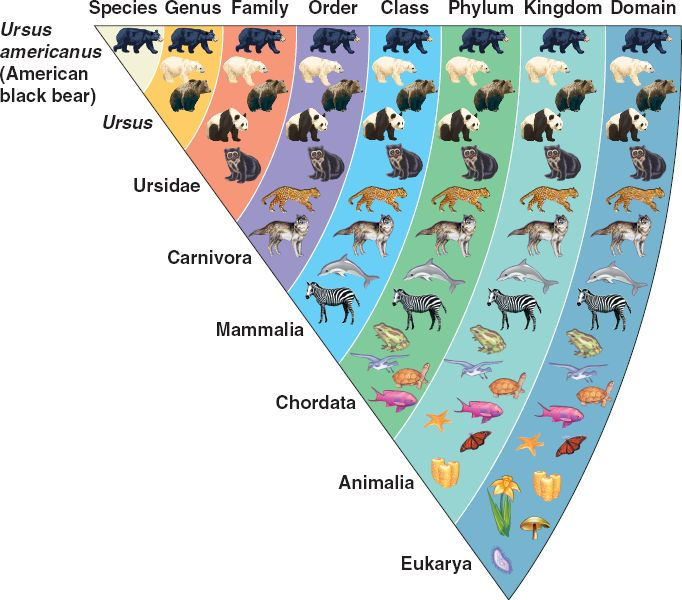

```{r setup, include = FALSE}
knitr::opts_chunk$set(
  collapse = TRUE,
  fig.align = "center",
  comment = "#>"
)
library(knitr)
```

***
<center>
[Back to **vignette index**](toc.html)
</center>
***

# Introduction{#unit1mod2intro}

In this module, we will begin to learn about the `R` language, starting with the different types of `R` objects, and how and where (in environments) they interact with one another. As I was trained as an ecologist, I find it helpful to think of how the language functions in ecological terms. First, we can think of `R` *objects* (data and functions that are held in memory) as being like species (plant or animal) with their own classification system, or taxonomy, and these objects are found in and interact within different environments (note: this conceptual framework is not the same as the "R ecosystem" terminology you might see online (e.g. [this](https://fg2re.sellorm.com)), which refers to the array of user-contributed packages and `R`-related tools, e.g. RStudio).   

So let's first look at `R`'s species. 

## A taxonomy of R
The Linnean system of biological classification groups species hierarchically, from Kingdom all the way down to species (and even sub-species), according to the figure below ([source](https://bioelevenncuevas.files.wordpress.com/2012/10/01_14classifyinglife_l.jpg)). 

```{r out.width = "30%", fig.align='center', echo=FALSE}
 
```

We can adapt the lower end of the hierarchy to classify `R`'s objects (and probably most any other programming language), borrowing the organization from family, genus, and species. In fact, we could use the higher level organization if we wanted to classify `R` itself within the context of other analytical tools and programming methods: 

-------- ----------------------------------------------
Domain   Analog; digital
Kingdom  Calculator; Mainframe; Desktop; Laptop; Phone 
Phylum   Windows; Mac; Linux
Class    Interpreted; Compiled
Order    Python; Ruby; Perl; R
Family   S3; S4; RC
Genus    vector; matrix; data.frame; array; list; function
Species  logical; integer; character; boolean; closure
-------- ----------------------------------------------

Admittedly the classifications I give above this might not be that sound, but our focus here is on Family, Genus, Species, which are internal to `R`. Here we liken taxonomic family to the set of *classes* that define the different types of objects in R. "But wait", you say, "that's confusing! Why don't you map taxonomic class to `R` classes?" I know, I know, but I wanted to use the whole hierarchy, and it felt better to use class to distinguish programming languages (into interpreted versus compiled). Plus I didn't want to have to jump over Order, which I would have struggled to fill with this analogy. 

Moving on, Family maps onto `R` structures, and Species onto types, primarily to data types. My organization of these topics is pieced together from several sources of information that are online (classes [1](http://adv-r.had.co.nz/OO-essentials.html), [2](https://cran.r-project.org/doc/manuals/r-release/R-lang.html#Object_002doriented-programming); structures [3](http://adv-r.had.co.nz/Data-structures.html), [4](https://www.rspatial.org/intr/3-basic-data-structures.html); types: [5](https://www.rspatial.org/intr/2-basic-data-types.html)), and it is based on the level of complexity inherent in the object.

### Species (data types)
Let's start with the simplest level first, the species in our taxonomic analogy. Here we refer to the types of data that we work with (in `R` or any language). Types are actually assigned to any `R` object, even ones that we are more complex, as the `typeof` function (run `?typeof` to see) will show you, but here we are thinking only of the types of data, which are logical, integer, double, character, NULL, and the less used (at least for this class) complex and raw.

```{r}
typeof(FALSE)
typeof(1L)
typeof(1)
typeof("a")
typeof(NULL)
as.raw(1)
typeof(as.raw(1))
```

What is `raw`? According to `?raw`:

> The raw type is intended to hold raw bytes


***
<center>
[Back to top](#unit1mod2intro) || [Back to **vignette index**](toc.html)
</center>
***

### Genus (data structures and functions)
One level up from data types are structures and functions. I liken these to the genus level because there both are designed to do something with data--either hold the data or do something to, with, or on the data, and they each of these can have many forms. For example, a vector is a type of data structure, which can be either an atomic vector or a list, and any of these can hold multiple data types. So let's look at structures first. 

#### Data structures
##### One dimensional
I have already mentioned the most basic structure, which is a *vector*. An atomic vector is a one-dimensional object that contains a single data type:
```{r}
a <- c("a", "b", "c", "d")
a
b <- 1:10
b
d <- TRUE
d
```

The object `a` is a character vector with four elements, `b` is an integer vector with 10 elements, and d is logical vector with one element.  To strain the taxonomic example here, you can think of each of these vectors as a genus that contains just one species. A *list*, on the other hand, can be thought of a genus containing multiple species, as it can contain many different data types within a single object. 

```{r}
l <- list("a", 1, 0.5, TRUE)
l
str(l)
```

##### Two or more dimensions
Notice that each of the data types is maintained in the list (which we put together using the `list` function), and we can verify the type of data in the list using the `str` function. If we try to put together these same mix of types into an atomic vector using the `c` (concatenate) function, we don't get the same results.

```{r}
l <- c("a", 1, 0.5, TRUE)
l
str(l)
```

It coerces everything to a character data type.  

There are several structures that have two or more dimensions. There are the  `matrix`, the `data.frame`, and the `array`. The first two are two-dimensional, in that they consist of rows and columns, and the third can have an arbitrary number of dimensions. 

```{r}
m <- cbind(v1 = 1:4, v2 = 1:4)
m
str(m)
m2 <- cbind(v1 = c("a", "b"), c("c", "d"))
m2
str(m2)
DF <- data.frame(v1 = 1:4, v2 = as.numeric(1:4), v3 = c("a", "b", "c", "d"))
DF
str(DF)
arr <- array(c(1:4, 1:4), dim = c(2, 2, 2))
arr
str(arr)
```

A `matrix` can only hold a single data type (like an atomic vector, if you try to mix types it will coerce them all to one kind--so a matrix is a genus that can only hold one species). A `data.frame`, which is actually a special kind of `list` that binds vectors containing the same number of elements into columns (so that they can have the same number of rows), can mix data types (a genus with multiple species). An `array`, on the other hand, can only have one data type despite being able to have more than one dimensions.

Let's turn back to the `list` now, since we just mentioned it into the context of the `data.frame`. A list is very versatile, and can contain any kind of `R`object. 
```{r}
l2 <- list(m, m2, DF, arr, c, list)
l2
str(l2)
```

We can put all the matrices, data.frames, and array we just made into a list, as well as some of the functions we were using to make those objects (`c`, `list`). 


***
<center>
[Back to top](#unit1mod2intro) || [Back to **vignette index**](toc.html)
</center>
***

#### Functions
That brings us now to functions. I know it is perhaps strained to think of a function as a genus, but functions are a kind of structure and functions can be organized into different groups, so it is not entirely crazy to think of functions as being analogous(ish) to Genus. So what are the functional genera?

##### Primitives
 The first genus consists of *primitive* functions, of which `c` and `list` are two examples, but also ones like `sum`. Primitive functions are actually `C` functions that are called directly by `R` that contain no `R` code:

```{r}
c
sum
list
```

By running the function without parentheses, you can see what type of function they are. You can also get a complete list of `R`'s primitive functions by running `names(methods:::.BasicFunsList)`. 

##### Operators
*Operators* are another kind of functional genus, such as the usual mathematical symbols `+`, `-`, `/`, `*`, and logical ones such as `>`, `<`, and `|`, plus a number of others, some of which are listed [here](https://cran.r-project.org/doc/manuals/r-release/R-lang.html#Operators). This list overlaps heavily, with the list of *primitives*, so might even be considered more properly a sub-genus of it, although there are non-primitive operators in existence, such as `?`. 

```{r}
5 * 5
(10 + 2) / 5
(10 > 5) & (5 < 6)
```

##### Control structures{#control-structures}
There are a number of functions that `R` shares with other languages, which are (to paraphrase from [here](https://cran.r-project.org/doc/manuals/r-release/R-lang.html#Control-structures)) used to control the sequence in which statements (e.g. `a <- 1 + 10`) are evaluated. There are functions such as `for`, `while`, `if`, `else`, `break`, etc. 
```{r}
a <- c(1, 11)
for(i in a) {
  if(i < 10) {
    print(paste(i, "is less than 10"))
  } else {
    print(paste(i, "is bigger than 10"))
  }
}

i <- 0
while(i < 5) {
  print(i^10)
  i <- i + 1
}
```

The code above uses several common control structures. `if` and `else` are conditional operators, determining whether a statement gets evaluated or not depending on a defined condition. `for` and `while` are different kinds of loops. Of particular interest are another set of looping statements that are native to `R`, which are known as `*apply` functions. We will get into all these in later sections, but for now here is a taste of one of them (`lapply`). 

```{r}
lapply(c(1, 11), function(x) {
  if(x < 10) {
    paste(x, "is less than 10")
  } else {
    paste(x, "is bigger than 10")
  }
})
```

##### Base, package, and user-defined functions
Beyond the primitives, `R` ships with a number of already built functions,  including various commonly used statistical functions. 

```{r}
mean
sample
sd
```

Three are provided above, two of which (`mean` and `sample`) are part of base `R`, i.e. they are built into the language itself, and one of which comes from the `stats` package, which is one of R's core packages (basically it loads when you open `R`). You will note above that the packages are referred to next to the term "namespace". We will hear more about that in the next sections. 

In addition to these core packages, there are many, many (>10,000) user contributed packages, most of which can be installed from [CRAN](https://cran.r-project.org) using the `install.packages` command, or RStudio's Packages interface. One example we have already used a fair bit (because you are reading this) is the `install_github` function from the `devtools` package. 

And then, of course, there are user-defined functions, a much, much larger universe, like the grains of sand on a beach (or the largest genus of them all). These are all the functions users make for themselves in their various scripts and never put into packages. For example:
```{r}
my_random_function <- function(x) (x * 10) - 2 + 10^2
my_random_function(c(2, 4, 100))
```

##### Generic functions{#generic-functions}
This is the last genus of functions we will describe, as it sets us up to think next about classes (the Family).  Generics are functions that have a common name and generally do the same thing, but produce different outputs depending on what *class* (Family) of object they are applied to. Three widely used generics are `print`, `plot`, and `summary`. Let's look at two examples of `summary`

```{r}
a <- 1:10
b <- sample(1:100, 10)
summary(a)
summary(lm(a ~ b))
```

Here we see that `summary` applied to a vector of integers provides mean and quantile values, while it provides a summary of regression fit when applied to a the output of a linear model (`lm`) fit to vector `a` and 10 randomly selected numbers between 1 and 100. 

We can see which classes use the `summary` generic by running the `method` function:
```{r}
methods(summary)
```
Quite a list (and much longer for `print`)! The notation above is `<generic_function>.<class>`. Generics can also be understood within the context of *object-oriented programming*, which is an important aspect of `R` and `python`. We get into this more below. 


***
<center>
[Back to top](#unit1mod2intro) || [Back to **vignette index**](toc.html)
</center>
***

### Family (classes)
Finally we arrive at classes, which in our (hopefully still useful) analogy is akin to a taxonomic family. To better understand classes (and why they are likened to a taxonomic family, a higher level of organization than genus and species), we need to learn about object-oriented programming (OOP), in which classes are a central concept. 

#### OOP
The best short explanation I have seen for what OOP is comes from a `python` [guide](https://python.swaroopch.com/oop.html): 

> In all the programs we wrote till now, we have designed our program around functions i.e. blocks of statements which manipulate data. This is called the procedure-oriented way of programming. There is another way of organizing your program which is to combine data and functionality and wrap it inside something called an object. This is called the object oriented programming paradigm. Most of the time you can use procedural programming, but when writing large programs or have a problem that is better suited to this method, you can use object oriented programming techniques.

> Classes and objects are the two main aspects of object oriented programming. A class creates a new type where objects are instances of the class. An analogy is that you can have variables of type int which translates to saying that variables that store integers are variables which are instances (objects) of the int class.

This explanation nicely explains how OOP differs from the alternative programming paradigm (procedural programming). Another useful bit of explanation on OOP is from [Advanced R](http://adv-r.had.co.nz/OO-essentials.html#oo-answers):

> Central to any object-oriented system are the concepts of class and method. A class defines the behaviour of objects by describing their attributes and their relationship to other classes. The class is also used when selecting methods, functions that behave differently depending on the class of their input. Classes are usually organised in a hierarchy: if a method does not exist for a child, then the parent’s method is used instead; the child inherits behaviour from the parent.

The main takeaway here is that a class defines different types of objects and what methods are associated them (so to me this feels like a higher level of organization, which makes it like a taxonomic family). Here is where `R` gets confusing, because it actually has three types of OO systems, S3, S4, and RC, and (not quite OO) the "base types", which are the primitives from `C` we described above.  I'll let you read the description of each of those and how they differ in the *Advanced R* link I just gave you ([here it is again](http://adv-r.had.co.nz/OO-essentials.html#oo-answers)), and it is good to understand them.  Here I will highlight a few things about them that I think are important to know, particularly with respect to understanding `R`'s geospatial capabilities.  

- **R methods are idosyncratic relative to other OO languages**. If you have ever worked with `python`, you likely have done something like this:

    ```python
    >>> import numpy as np
    >>> v = np.array([0, 1, 2, 3])
    >>> v.mean()
    1.5
    ```

    Where the method (the function `mean`) appears after the object (`v`, a 1-dimensional numpy array, equivalent to an `R` integer vector), because it belongs to the class. In `R`, methods are applied *to* the object, and the appropriate version of the generic function is then applied for the particular class of object: 

    ```{r}
    v <- 0:3
    mean(v)
    ```
  If a class-specific variant of the generic hasn't been defined, `R` applies the default version of the function. That's the case here, where `mean.default` is used because this is just a simple integer vector.
  
    ```{r}
    class(v)
    ```
  
    This is important to know because sometimes you might find that the generic function you need and expect isn't there for you: 
  
    ```{r, error = TRUE}
    rst <- raster::raster(nrow = 10, ncol = 10, vals = 1:100)
    plot(rst)
    ```
  
    The example above jumps a bit ahead of where we are currently, but it shows what happens when a generic function is not available for a particular class. Here we created an object of class `raster` (we will be seeing much more of these in Unit 2), and tried to `plot` it (i.e. map the raster). The method for plotting a raster is `plot.raster`, so when you call the generic function `plot` and apply it to `rst` (`plot(rst)`), it will map the raster `rst`.  However, in this example the `plot` method for rasters is not available because the `raster` package was not loaded. `R` was instead trying to apply `plot.default` to  object `rst`, which has a very different structure than a class that `plot.default` is able to handle, e.g:

  
    ```{r, fig.width = 5}
    mat <- cbind(x = 1:10, y = 11:20)
    plot(mat)
    ```
    
    So let's look at the two structures of each object. Here's the class and structure of the object `mat`:
  
    ```{r}
    class(mat)
    str(mat)
    ```
    
    Pretty simple. Here is the same for object `rst`:
  
    ```{r}
    class(rst)
    str(rst)
    ```
    
    Much more complicated! This is an object of class `raster`, which uses the S4 OO system. It has a number of "slots", which holds information about the raster object, in this case 12 upper-level slots, most of which contain several sub-slots. You can access the information in an S4 object's slots in two ways, using either the `@` operator or the `slot` function: 
  
    ```{r}
    rst@extent
    slot(rst, "extent")
    ```
  
    Here we are pulling out the information on `rst`'s extent, which is itself an object with a class definition. 
  
- **S3 and S4 classes are accessed in different ways**. Although both make use of generics functions in the same way, their slots are accessed differently. In the previous example using `lm` in the [Generic functions](#generic-functions) section, `lm(a ~ b)` is an S3 object:
  
    ```{r}
    lm_ab <- lm(a ~ b)  
    str(lm_ab)
    ```
  
    An S3 object is really just a list, and you access information in the list using the `$` operator.
  
    ```{r}
    lm_ab$coefficients
    ```
  
    That gives us the linear model's coefficients. 
  
- **S3 and S4 are both used in defining `R` spatial objects**. As we have seen in the example above, rasters are based on the S4 system, while the two main packages providing vector operations, `sp` and `sf`, respectively use the S4 and S3 system.  Even though `sf` is newer and intended to replace `sp`, it makes use of `R`'s older S3 system. So, from our perspective, we want to have some understanding of both of these systems because we will eventually want to extract information from (and put it into) spatial objects, and the way in which we do that will differ according to the OO system the defines the class.   

Okay, that's enough on OO for now.

## Environments

This brings us to the final chapter in our extended ecological metaphor. We have just heard about `R`'s species and their taxonomy, so now we will talk about how they interact. In ecology, we talk about species' environments. In `R`, objects have different environments. To learn about `R` environments in detail, there is a [whole chapter on them in Advanced R](https://adv-r.hadley.nz/environments.html). However, for now, to avoid too much confusion, and since (according to the chapter) "Understanding environments is not necessary for day-to-day use of R", we will focus on just a few aspects of what environments are and how they effect objects in ways that you will almost certainly encounter. 

First, to provide a very simplistic definition of what an environment is, it is the means by which `R` maps the name you assign to an object to where the object's values live in memory: 

> The job of an environment is to associate, or bind, a set of names to a set of values ([source](https://adv-r.hadley.nz/environments.html#basics))

Environments in `R` are actually lists, which are nested in ways such that objects found in one environment are isolated from other environments. There are three major environments you should know about: 

1. The global environment
2. The package environment
3. The execution environment

### The global environment

This is the top level environment in `R`, and is the place where any object that you create in the console or a script that you are using for interactive analysis lives. 

```{r}
a <- 1:4
f <- function(x) {
  x * 10
}
ls()
environment()
```

Here we define two objects, the vector `a` and the function `f`, and we use the function `ls` to list the objects in the global environment (you can use the environ argument of `ls` (see `?ls` to view the objects in other environments--more on that in a bit)), and `environment()` tells us what environment we are in. We can also use `environment` to tell us what environment any function belongs to:

```{r}
environment(f)
environment(mean)
environment(lm)
```

We see that `f` is a function defined in the global environment, whereas `mean` and `lm` belong to "namespaces" called `base` and `stats`, respectively. 

### The package environment and namespaces
This last point on namespaces brings us to packages. Packages have their own environments, as well as namespace environment. Let's let Hadley Wickham [explain this](https://adv-r.hadley.nz/environments.html#basics):

> Every function in a package is associated with a pair of environments: the package environment, which you learned about earlier, and the namespace environment.

> - The package environment is the external interface to the package. It’s how you, the R user, find a function in an attached package or with ::. Its parent is determined by search path, i.e. the order in which packages have been attached.

> - The namespace environment is the internal interface to the package. The package environment controls how we find the function; the namespace controls how the function finds its variables.

Okay, there are a few things to dive into in that explanation. First, you will note the mention of ::. That has appeared already time in examples in these first two modules. When you create an `R` package, it makes a package environment that contains its functions. You access the functions in the package environment in one of two ways:


```{r, fig.width=5, fig.height=3.5}
rst <- raster::raster(nrow = 10, ncol = 10, vals = 1:100)
raster::plot(rst)
```

This is the first way we tried to do it, with the exception that we now use the :: to get access to `raster`'s `plot` method (we didn't do that before), so that `rst` can actually be plotted. 

The second way uses the function `library` to load and attach an installed package, here `raster`, which makes the `raster` function available in the *search* path, so it can be called without using the `packagename::function_name` format. 
```{r, fig.width=5, fig.height=3.5}
library(raster)
rst <- raster(nrow = 10, ncol = 10, vals = 1:100)
plot(rst)
```

So what is the search path?  That is answered by `search`, which tells you all the package environments that are attached.
```{r}
search()
```

These are ordered hierarchically, such that the immediate environment is the ".GlobalEnv", which contains any globally defined functions, followed immediately by the last package you attached (using either `library` or `require`), the second-to-last you attached, etc, all the way to the base package. 

```{r}
library(geospaar)
search()
```

Notice how the previous call to `search` showed "package:raster" being right after ".GlobalEnv". In this last call, we attach the `geospaar` package, which is then interposed between ".GlobalEnv" and "package:raster". Another way of expressing this is in terms of parentage, where each package is the parent of the last package you attached, and all packages are parents of the ".GlobalEnv". This is laid-out nicely in [section 7.4.1](https://adv-r.hadley.nz/environments.html#special-environments) of Advanced R. 

This ordering or parentage matters to us for at least one important reason, and this relates to whether functions are exported from packages or not. If a function is exported (recall how we [exported our first function](unit1-module1.html#your-first-package-function) in Module 1) it then becomes publicly usable in the package environment. The thing is, however, that the same function name might be used by more than one package (and not as generic functions). If you try to attach both packages, the function in the most recently attached of the two packages will mask the function from the other one. This is demonstrated by the following examples in which we attach `dplyr` (a package we will use more in the next modules) and `raster` in alternating sequence.

```{r, echo=FALSE, message=FALSE}
detach("package:raster", unload=TRUE)
```

```{r}
library(dplyr)
library(raster)
detach("package:raster", unload = TRUE)
detach("package:dplyr", unload = TRUE)
library(raster)
library(dplyr)
```

`dplyr` masks functions from a bunch of packages, including `base` and `stats`, but when it is attached before `raster`, `dplyr`'s `select` function is masked by `raster`'s function of the same name. Something different happens when we detach both packages, and then attach `raster` followed by `dplyr`, which masks three functions from `raster`: `intersect`, `select`, and `union`. 

This matters because when because when such package conflicts arise, you have to call the function you want using the `packagename::function_name` format, e.g. `raster::intersect` in the last example, otherwise a call to just `intersect` will give you `dplyr::intersect`, which won't be able to operate on a raster. 

That is why package developers are [encouraged](http://r-pkgs.had.co.nz/namespace.html) to export functions sparingly:

> Generally, you want to export a minimal set of functions; the fewer you export, the smaller the chance of a conflict. While conflicts aren’t the end of the world because you can always use :: to disambiguate, they’re best avoided where possible because it makes the lives of your users easier.

Package functions can always be left as functions internal to the package, that is, they exist in the package's namespace environment. Such internal functions might be used by one of the exported functions. You can actually access such functions from outside the package by using the ::: operator, although this is not recommended.  

### The function environment
The last environment we will discuss is the *function environment*, which actually has three more environmental terms associated with it: the *enclosing environment*, the *binding environment*, and the **execution environment**, according to [this section](http://adv-r.had.co.nz/Environments.html#function-envs) in one version of Advanced R. We won't worry about the first two, except to note that the enclosing environment is the one in which the function was created--so if you define a function in a script but don't add it to a package, it will be enclosed by the global environment.     

The **execution environment** is important to know for everyday programming purposes (in my opinion, at any rate). It is a temporary environment that is created within functions when they are executed. Here's a short demonstration of how the function environment differs from the global environment. 

```{r}
x <- 10
f <- function() {
  x <- 20
  return(x)
}

x
f()
```

Here `x` is an integer vector (value 10) and `f` is a function that specifies an integer vector `x` (value 20) inside the function body. It returns the value of this internal variable `x` out of the function body on execution, not the value of the globally defined `x` (10). This is because the execution environment is separate from the enclosing environment, and a new, clean environment is created each time the function is executed (called) and then discarded on completion.

You can modify what's going on inside the execution environment using a global variable, although this is probably not a great idea. 

```{r, error = TRUE}
x <- 10
f <- function() {
  x <- 20 * x
  return(x)
}
f()

x <- 10
f <- function(x) {
  x <- 20 * x
  return(x)
}
f()
f(x)
f(10)
f(x = x)
```

The first example shows that if you specify `x` in the global environment and then assign the value 20 * `x` in the function body to create `x`, the answer returned is 200 (20 * 10). In the second example, we define the function `f` as having an argument `x`, and then try execute `f()` as we did before. That fails, because you have to assign a value `x` to the argument, so we have to specify a value in the function `()` to run, so `f()` fails to run. How about `f(x)`. That works, because now you are telling the `f` that you want to input the value stored in the global variable `x`, which is the same as running `f(10)`. `f(x)` is shorthand for the more correct `f(x = x)` (passing the value of global variable `x` to argument x). 

The upshot of this all is that `f` on each execution is returning the same value, which is the result of a single execution where a new environment is created on each execution.  

You can see that it is a different environment on each execution with the following modification:
```{r}
x <- 10
f <- function(x) {
  x <- 20 * x
  environment()
}
f(x)
f(10)
f(x = x)
```

The function is modified to return the value from `environment`, which returns the name of the execution environment, which is simply a complicated hex-string. Note, however, that the string changes on each execution, indicating that the environment is not the same. 

**This is important to know because you cannot modify the value of a global object from within a function's execution environment.** 

The only way to do that is using a control structure such as a for loop. 
```{r}
x <- 10
for(i in 1:3) {
  x <- 20 * x
  print(x)
  print(environment())
}
x
```

Note that the value of `x` gets updated it each iteration, and the environment inside the `{}` is still part of the global environment (and thus not the execution environment of a function).

Okay, so that's it for environments, and actually for this whole module. There is no formal assignment for this module, just some questions to answer. 

#### Question to answer
1. What are the data types in `R`?
2. What is the difference between a `matrix` and `data.frame`? 
3. What do a `data.frame` and a `list` have in common?
4. What is a generic function, and how does it relate to object-oriented programming? 
5. What is one difference between S3 and S4 object-oriented systems? 
6. If you create the object `a <- 1:10` in the R console, what environment would you find the object in? 
7. How many times does the execution environment in a function get reused? 

***
<center>
[Back to top](#unit1mod2intro) || [Back to **vignette index**](toc.html)
</center>
***


