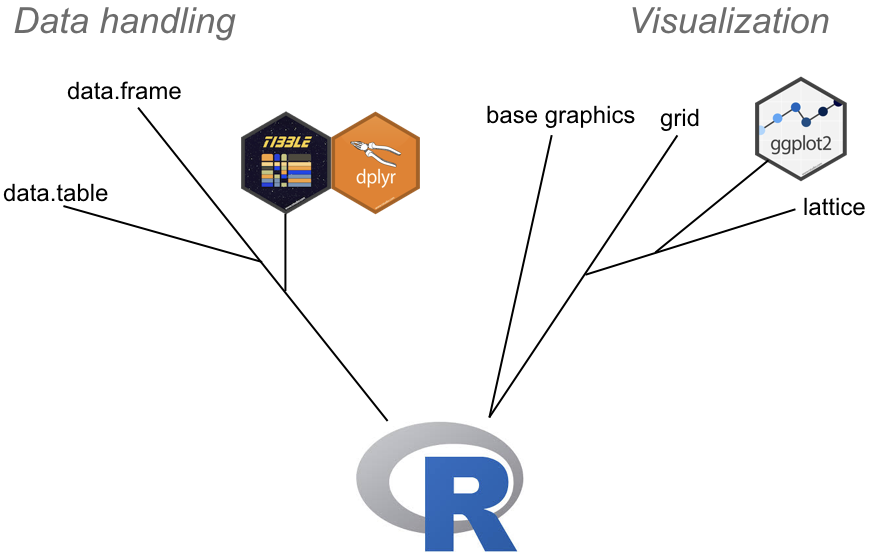

```{r setup, include = FALSE}
knitr::opts_chunk$set(
  collapse = TRUE,
  fig.align = "center",
  comment = "#>"
)
library(knitr)
```

# Introduction to R programming{#introduction-to-r-programming}

Up until now we learned mostly about setting up and maintaining an `R` project package. We have walked through a somewhat high level overview of `R`'s structure. Now we are going down to the business of learning how to use it.

## How R is evolving and how it affects us
Before starting, we need to turn back to natural history for another metaphor, specifically evolution. `R` is a language that has been undergoing fairly substantial changes recently, with clear development trajectories within the language, much like the evolution of species.

```{r out.width = "40%", fig.align='center', echo=FALSE, fig.cap="An (approximate) lineage of R packages/objects involved in data handling and graphics."}
 
```

The graphic above is crude and almost certainly not correct in some respects, but it serves to illustrate what I think are key changes that are leading to changes in how we program in `R`.  Many of these changes are being driven by the ["tidyverse"](https://www.tidyverse.org), which is:

> ...an opinionated collection of R packages designed for data science. All packages share an underlying design philosophy, grammar, and data structures. 

These include most prominently the packages `dplyr` and `ggplot2`, which respectively provide methods for manipulating data sets and producing graphics.  These packages are designed around a fairly different syntax than that of  original (base) `R`, and are becoming increasingly dominant within the `R` commmunity. They are becoming so dominant in fact that a number of leadings lights in the R field argue that `R` beginners should be taught first using the tidyverse packages, and avoid base `R` and much of the programmatic concepts that are needed to go with it. The argument is summarized [here](http://varianceexplained.org/r/teach-tidyverse/). 

The argument is appealing, but since this is a course on `Geospatial Analysis with R`, we unfortunately have no choice but to learn base `R`, because many spatial packages are built with base `R` functions and don't yet work with the tidyverse. 

Also unfortunately, we also need to learn some tidyverse, at least `dplyr`, because the rapidly maturing `sf` package, the replacements for `sp`, which provides spatial vector functionality in `R`, is designed to work with the tidyverse. 

So we are going to learn aspects of both.  

Before diving in, I want to illustrate how different syntaxes can look along some of `R`'s evolutionary trajectories. We'll focus on data manipulation.

```{r, eval=FALSE}
library(tibble)
library(data.table)

# a data.frame with 1000 rows and randomly assigned groups and values...
set.seed(1)
d <- data.frame(a = sample(letters[1:7], size = 1000, replace = TRUE), 
                b = runif(n = 1000, min = 0, max = 20))
head(d)
#>   a          b
#> 1 b 10.6161759
#> 2 c 13.6972181
#> 3 e  7.6656679
#> 4 g 19.0997600
#> 5 b  2.3671316
#> 6 g  0.7820011

# ...converted to a tibble
d_tb <- as_tibble(d)
d_tb
#> # A tibble: 1,000 x 2
#>    a          b
#>    <fct>  <dbl>
#>  1 b     10.6  
#>  2 c     13.7  
#>  3 e      7.67 
#>  4 g     19.1  
#>  5 b      2.37 
#>  6 g      0.782
#>  7 g     10.1  
#>  8 e     11.6  
#>  9 e     16.8  
#> 10 a     13.1  
#> # … with 990 more rows

# ...converted to a data.table
d_dt <- data.table(d)
d_dt
#>       a         b
#>    1: b 10.616176
#>    2: c 13.697218
#>    3: e  7.665668
#>    4: g 19.099760
#>    5: b  2.367132
#>   ---            
#>  996: f 15.500565
#>  997: e  1.381404
#>  998: b  4.818985
#>  999: b  4.856037
#> 1000: b  7.742260
```
```{r, echo = FALSE}
library(tibble)
set.seed(1)
d <- data.frame(a = sample(letters[1:7], size = 1000, replace = TRUE), 
                b = runif(n = 1000, min = 0, max = 20))
d_tb <- as_tibble(d)
```

The example above creates a data.frame `d` and randomly assigns some values to it, and then converts it to a `tibble` (`d_tb`) and then a `data.table` (`d_dt`). A `tibble` and `data.table` are both enhanced data.frames that have vastly improved performance in terms of processing times and memory handling, compared to the good old `data.frame`, as well as a whole suite of functions designed to manipulate them that differ markedly from the ways in which data.frames are manipulated. The first thing to note is that the generic `print` functions (note you are implictly calling `print` when you simply type out the name of an object and then execute the code) for each summarize the objects in fairly different ways. In fact, we swapped (implicit) `print` for `head` when it came to our `data.frame`, because it would have printed all 1000 lines.  Both the `tibble` and `data.table` produce more compact outputs. Note that printing a `tibble` shows information on the data type in each column, and just the first 10 rows. Printing a `data.table` shows no information on data type, and shows the first and last 5 rows, and separates row numbers from data with ":".   

The real differences come with the syntax for manipulating these datasets. Let's take a brief look at how we might operate on the three objects, by calculating the mean of variable "b" according to the categorical groups defined in "a". 

Here's how we would do it most efficiently with the `data.frame`:
```{r}
aggregate(d$b, list(d$a), mean)
```

And with the `tibble`. For this we load up `dplyr`, which provides the functions designed to work with this. 
```{r}
library(dplyr)
d_tb %>% group_by(a) %>% summarize(mean(b))
```

And finally the `data.table`:
```{r, eval = FALSE}
d_dt[, mean(b), by = a][order(a)]
#>    a        V1
#> 1: a 10.204565
#> 2: b  9.349255
#> 3: c  9.838504
#> 4: d 10.043368
#> 5: e  9.998252
#> 6: f 10.203975
#> 7: g  9.061001
```

Three fairly different syntaxes for doing the same thing. These are ordered in descending order of processing speed. Generally an operation performed on a large `data.frame` will be much slower than one performed on `tibble` and that will be slower than a `data.table`. Also note that the functions `aggregate` (from the core `R` package `stats`) and `group_by` and `summarize` (from `dplyr`) can be applied to all three objects interchangeably, since all three objects are just data.frames or souped-up data.frames. `data.table` is the exception, as much of the functionality of `data.table` is provided within the `[]`, so you can't apply the syntax we show for `d_dt` to `d_tb` and `d`. 

```{r, error=TRUE}
d[, mean(b), by = a][order(a)]
d_tb[, mean(b), by = a][order(a)]
```

`data.table` is extremely powerful, and is the tool of choice for working with extremely large tabular datasets (it seems to have heavy uptake in quantitative finance, for example), and by some [measures](https://github.com/Rdatatable/data.table/wiki/Benchmarks-%3A-Grouping) beats out `pandas` in `python` However, the syntax is much more arcane, and, more importantly, not really part of `R`'s spatial packages, so we won't learn it further (but it is well worth learning). 

`dplyr`, however, is quite important to know, as the functionality it provides is being incorporated into `sf` and `stars` (the package that is replacing `raster`). It is also really great for accessing databases such as postgres. So we will learn base `R` and just enough dplyr and a few other tidyverse functions so that we can get ready for these changes. 


## Setting up for practice
In this module, you will be asked to answer questions and practice coding along the way. To aid this process: 

- Create a new folder called "notebooks" in your class Rstudio project, as a top level folder. 
- Open a new Rmarkdown file. Save it into the notebooks folder, calling it `geog246346_unit1module3_practice.Rmd`. Adjust the title as needed, and delete the text and chunks below. Keep one chunk, but delete the code in it, as a starting point for code
- Type answers to questions, take notes, etc, outside the code chunks. Put practice code inside the `R` code chunks. Remember, you can execute code line by line within chunks to test it out, execute a single chunk, or knit the code all at once (note: when you knit, the code is executed in a new environment environment than the one you use when executing line by line)

***
<center>
[Back to top](#introduction-to-r-programming) || [Back to **vignette index**](toc.html)
</center>
***


# Indexing

You are already acquainted with R objects, data types, classes, functions, etc. Now let's start to work with them. We'll start by figuring out how to create and index into different types of data structures, which is useful if we want to extract or edit values within them. Indexing is also referred to as subsetting, because when we extract values we are selecting a subset of an object. 

### One-dimensional data structures

#### Vectors
Recall that a vector is a 1-dimensional object. An atomic vector can contain only one data type.   
```{r}
a <- 1:10
b <- a
names(b) <- letters[1:10]
```

Here we define the vector a, which has values 1:10, and make a copy of `a` called `b`. We then assign names to each of the values in the vector `b`. The names are the first 10 letters of the alphabet, which `R` provides in a built-in vector called `letters` (there is also `LETTERS`--type that into the console and execute it to check it out). Note the operation here: we apply the `names` function (run `?names` to see what this function does) to `b`, and then *assign* to it the vector of letter from `letters` using `<-`, R's assignment operator (you could also use `=`, but we don't because we follow the `R` style guide [here](http://adv-r.had.co.nz/Style.html), and for reasons detailed [here](https://colinfay.me/r-assignment/) it is better to stick with `<-` for assignment). 

Note that this code also gives out first instruction in indexing. Note that we use `[]` with `letters`, `()`. That's because `letters` is a vector from which we are extracting a subset of values, as opposed to an object to which we are applying a function, in which case we would enclose the object with `()`--as we did with `names(a)`.  

So now that `a` is an object, we also extract values from it, using the same `[]` notation and values that specify particular index positions. 

```{r}
# #1
a[1]
#
# #2
a[4:5]
#
# #3
a[c(1, 5, 10)]
#
# #4
a[length(a)]
#
# #5
a[-1]
#
# #6
a[-c(1, 3)]
```

In the code above, we extract from `a`:

1. The 1st element
2. The 4th and 5th elements. Since 
3. The 1st, 5th, and 10th elements
4. The last element
5. The 2nd through 10th elements
6. The 2nd and fourth through 10th elements

We use integers within the `[]` to indicate the *position* of the element(s) we want to pull out of `a`. If we want more than 1 element, we can specify a range of indices using `:` if the positions are contiguous/adjacent, i.e. `4:5`. If they are discontiguous, then we have to concatenate the indices using `c()`, separating the integers specifying the index positions by commas, i.e. `c(1, 5, 10)`. Lastly, we can grab the last element and the last element only using the index the final index number (10), or, as os often the cases in large vectors, where we might not know the exact total number of elements (and thus the index number of the final element), we can use the `length` function to find out how long (how many elements are in) the vector is, i.e. `length(a)`, which returns the value 10 in this case into the `[]`. 

In examples 5 and 6 we use negative indicing to drop element the first element and 1st and third elements, yielding the remaining elements in the vector. 

You can also use the names of elements in the vector, if it has names assigned, as is the case with `b` (which you can also index into with integers)
```{r, error=TRUE}
b["a"]
b[c("d", "e")]
b[c("a", "e", "j")]
b["j"]
b[-"a"]
b[-c("a", "c")]
```

The above recreates exactly what we did with integer indices, but using the element names instead. However, we see that negative indexing is not possible with names.  

We can also index using logical operators to select elements of vectors based on their values. 

```{r}
# #1
a[a > 5]
#
# #2
a[a >= 2 & a < 7]
#
# #3
a[a == 7 | a == 2]
#
# #4
a[a %in% c(1, 10)]
#
# #5
b[b %in% 2:3]
```

In the above we use logical operators to select values from `a` and `b` based on their values. Let's translate what the above are doing exactly. 

1. Select from `a` all values of `a` that greater than 5
2. Select from `a` all values of `a` that are greater than or equal to 2 and less than 7
3. Select from `a` all values of `a` that 7 or equal 2
4. Select from `a` all values of `a` that occur within a vector containing 1 and 10 (this is the same as: select from `a` all values of `a` that equal 1 or equal 10)
5. Select from `b` all values of `b` that occur within a vector containing 2 and 3

Let's look at two aspects of this syntax, starting within the logical operations within the `[]`.  What are those doing? 

```{r}
a > 5
a >= 2 & a < 7
a == 7 | a == 2
a %in% c(1, 10)
b %in% 2:3
```

Those operations are testing whether each value in the vector meets the particular condition (`TRUE`) or not (`FALSE`), e.g. is thise value of `a` greater than 5 or not? When those tests are done inside the `[]`, the resulting values that are `TRUE` are the ones selected from the vector. The `FALSE`s are ignored. 

We can recover the index positions from the logicals using the `which` function: 
```{r}
which(a > 5)
which(b %in% 2:3)
```

You can check that by comparing the index values to the positions of the `TRUE` values in the corresponding logical results (the 1st and 5th examples) above that. 

#### Lists

A list is a vector that can contain multiple data types. It can be named or unnamed. 
```{r}
l <- list(1, 1:10, c("a", "b", "c", "d"))  # unnamed list
l2 <- l
names(l2) <- letters[1:3]  # named list
l 
l2
```

`l` is an unnamed list, `l2` has names assigned to each element. The results above give some insights into how to index into lists. Lists are indexed from within `[[]]` as well as `[]`:

```{r}
# Chunk 1
# #1
l[[1]]
#
# #2
l[1]
#
# #3
l[2:3]
#
# #4
l[[2:3]]
#
# #5
l[[length(l)]]
#
# #6
l[length(l)]
```

- #1 (**reference is to comment to right of the code**) pulls out the contents of the element of list `l`
- #2 pulls the first element of list `l` into a list of length 1
- #3 pulls the second and third elements of `l` into a two-element list
- #4 tries **but fails** to pull the second and third elements of `l` to see their contents--it only returns the contents of element 2
- #5 pulls out the contents of the last element of `l` 
- #6 pulls the last element of list `l` into a list of length 1

So list indexing by `[[]]` is different than by `[]`. 

We can also index by name:

```{r, error=TRUE}
# Chunk 2
# #1
l2[["a"]]
#
# #2
l2["a"]
#
# #3
l2[c("a", "b")]
#
# #4
l2[[c("a", "b")]]
#
# #5
l2[["c"]]
#
# #6
l2["c"]
#
# #7
l2$c
#
# #8
l2$a
```

Note that 1-6 just above (Chunk 2) recreate the previous 1-6 (Chunk 1) using integer indices, except Chunk 2 #4 shows the error resulting from trying to pull the contents of two list elements out of the list simultaneously. Chunk 2 #7 and #8 are new however, as they use the `$` operator to pull out the contents of the element by name. `l2$c` is the same as `l2[["c"]]`. 

One more thing with list indexing we will look at: indexing specific elements within list elements:

```{r}
# Block 3
names(l2$c) <- letters[1:4]
#
# #1
l[[2]][2:3]
#
# #2
l2$b[2:3]
#
# #3
l[2][[1]][2:3]
#
# #4
l2["b"][[1]][2:3]
#
# #5
l[[3]][c(1, 4)]
#
# #6
l2$c[c(1, 4)]
#
# #7
l2$c[c("a", "d")]
#
# #8
l2["c"][["c"]][c("a", "d")]
#
# #9
l[2:3][3]  # doesn't work
```

In Chunk 3 above, we are indexing into a specific list element, and then indexing into values within the selected vectors. First thing we do is assign names (a, b, c, d) to vector `c` in `l2` (the 3rd element). 

- In #1-#4 you see various ways how you can select elements 2 and 3 from the second list element (either `l` or `l2`)
- #5-#8 show how we get extract elements 1 and 4 from the list's 3 element 
- **Pay close attention to #3, #4, and #8, which each have three sets of brackets**
- Lastly we see #9, which produces a NULL because it is not possible to index into two separate list elements 

#### Indexing to change values
We have just seen how you can select values from vectors and lists. Now we look at using indices to change values within objects.  Fairly straightforward, and mostly entails doing the indexing on the left-hand side of the `<-`:

```{r}
# Chunk 1
set.seed(1)
a <- sample(0:100, size = 10, replace = TRUE)
names(a) <- letters[1:10]
b <- a  # copy we will modify
l <- list(e = 1, f = 1:10, g = a)
l2 <- l  # copy we will modify
l
```

In the first two lines of Chunk 1, we are using the `sample` function to select a 10 integers at random from a vector of integers (0-100). We preceed that call with `set.seed(1)`, which ensures that each time we run this code we get the same numbers drawn (**use `?set.seed` to learn more about random seeds, and `?sample` to learn about the arguments passed to the function**). Random number generation is an important aspect of learning how to code, particularly for setting up __self-contained, reproducible examples__ that you can use to ask others for help. 

```{r, error = TRUE}
# Chunk 2
# #1
b[1] <- -99 
a
# 
# #2
b["j"] <- "z" 
a
b
# 
# #3
b[c("b", "f")] <- 9999
a
b
# 
# #4
b[3:4] <- c(-1, -2)
a
b
# 
# #5
b[5:length(b)] <- 10000:10001 
a
b
# 
# #6
b[length(b) - 1] <- 0:10  
```

Looking at the above, we are indexing the same way we did in the previous section, but in this case we are assigning new values to overwrite the existing ones in those index positions. Note that the number of replacements can be less than or equal to, but not exceed, the number of elements you index:

- #1-#3 shows how you replace 1 or more elements with a single value. Notice how in #2 that replacing the named element "j" with a character ("z") coerced the entire vector to a character type 
- #4 how you replace two elements with two different values (the first element indexed gets the first value, the second element gets the second value)
- #5 shows how you replace 6 elements' values with two values--the effects in this latter case is that the replacement values are alternated (probably not something you would want to do in real life). Notice also that over-writing the "z" value at the tail of the vector (introduced in #2) do not result in the vector being coerced back to an integer type 
- Finally, #6 shows what you cannot do, and tells you why

Now let's replace list elements:

```{r}
# Chunk 3
# 
# #1
l2[[1]] <- c(1, 4)
l[[1]]
l2[[1]]
# 
# #2
l2$f[c(1, 10)] <- c(-1, 1000)
l$f
l2$f
# 
# #3
l2[[3]][letters[1:4]] <- 1:4
l[[3]]
l2[[3]]
# 
# #4
l2$myfun <- function(x) x * 10  
l
l2
```

In Chunk 3 above, we compare changes to elements of the copy list `l2` to the relevant elements of the original list `l`:

- #1 Replaces `l2`'s first element, a single element vector, with a two-element vector
- #2 Replaces the 1st and 10th element of the vector in the `l2` element named `f` with -1 and 1000, respectively
- #3 Replaces elements named a, b, c, and d in the vector held in `l2`'s third element. 
- #4 Assigns a fourth element to `l2` named `myfun`, which is a function we defined on the right of the operator. 

```{r}
# Chunk 4
l2$myfun(l2$f)
```

We'll leave you to figure out what is happening in Chunk 4 for the questions below. 


#### Practice

1. Answer the following questions:

- In 2.0.1.1, what class of object is `a`? Recreate `a` in your own script and apply a function to it to get the answer.  
- In 2.0.1.2, Chunk 3 #2, #3, and #8, why do we have to use three sets of brackets to get access to the vector elements? Hint: pay attention to the first set of brackets. 
- In 2.0.1.3, please describe (e.g. class, data structure, number of elements) `a` and `l` in Chunk #1. 
- In 2.0.1.4 Chunk #4, please describe the operation that we just performed, and what objects are used in it. 

2. Coding practice:

- Create a vector `a`, with values 20:30, a vector `b` holding all letters in the alphabet.
- Assign letters as the names for vector `a`, such that `a[1]` gets the name "a", `a[2]` gets named "b", etc.  
- Combine those vectors in to a list `l`, assigning names `a` and `b` to the two list elements 
- Select from `a` as follows:
  - All values `>=` 26
  - The 1st and 7th element
  - The last element and the second to last element (extra marks if you use `length` to find both index numbers)
- Select from `b` the values named "a", "c", and "g"
- Select from `l`:
  - The first element by integer index
  - The first element by integer index, so that it returns as a 1-element list
  - All values in the element named `a` that are `<` than 25
  - All values in the element named `a` that are equal to 25
  - All values in the second element that are contained in the vector of letters `c(d, e, f)`

***
<center>
[Back to top](#introduction-to-r-programming) || [Back to **vignette index**](toc.html)
</center>
***

## Two-dimensional structures
The two-dimensional structures of greatest interest to us are the `matrix` and `data.frame`. Indexing into these works in a similar fashion as with 1-d structures, in that you can index with integers, by name, and logically. However, in this case your setup is `[r, c]`, where indexing is done row (r) and column (c). 

### matrix
Let's start with a 5 row, 3-column integer matrix: 

```{r}
# Chunk 1
m <- cbind(1:5, 11:15, 21:25)
m
#
# #1
m[1, 1]  
#
# #2
m[2, 2]
#
# #3
m[1:2, 2:3]
#
# #4
m[c(1, 4), c(1, 3)]
#
# #5
m[-1, -3]
#
# #6
m[-c(1:4), -c(1:2)]

```

In #1, row 1, column 1 is selected, #2 is row 2, column 2, #3 is rows 1 and 2, columns 2 and 3, #4 is rows 1 and 4 and columns 2 and 3, while #5 and #6 are dropping different combinations of rows and columns, returning the remaining rows and columns. 

Now let's do it with names: 
```{r, error=TRUE}
# Chunk 2
colnames(m) <- letters[1:3]
rownames(m) <- letters[1:5]
m
#
# #1
m["a", "a"]
# 
# #2
m[c("a", "d"), c("a", "b")]
#
# #3
m[letters[c(1, 5)], letters[1:2]]
#
# #4
m["a", -c("5")]
#
# #5
m["a", -(colnames(m) == "a")]
#
# #6
m[-which(rownames(m) %in% c("a", "b", "c")), "a"]
```

In Chunk2 we assign names to the 5 rows and 3 columns of `m`, and use those names to extract different parts of the matrix. This should be fairly how this works by now, although in #3 you will notice how we use indexing into the `letters` vector to extract the actual row and column names, so that we don't see them. #4 shows that you can't use negative indexing on a column name (and also not on a row name). #5 and #6 shows how you could do negative indexing though: 

- Use `colnames(m)` to return the vector of `m`'s column names
- Use the `==` operator to find which column names match `a`
- Wrap in `()` and apply `-` to the result, which drops the column names meeting the `TRUE` condition

The same is done on row names in #6. 

A matrix value can also be accessed with a single vector:
```{r}
# Chunk 3
# #1
m[1:5]
#
# #2
m[6:10]
#
# #3
m[11:15]
#
# #4
m[1:15]
#
# #5
m[length(m)]
```

Looking at the examples above, you can see that the order of indexing is by row then column. 

How about by logical indexing? We already sort of got a start with that in Chunk 1 (#5 and #6), but let's have a look:

```{r}
# Chunk 4
# #1
m[m[, 1] == 3, 1:3]
#
# #2
m[m[, 2] > 11, 3]
#
# #3
m[(m[, 1] > 3) & (m[, 2] < 15), 3]
#
# #4
m[(m[, "a"] > 3) & (m[, "b"] < 15), 2:3]
#
# #5
m[!m[, "a"] %in% 3:5, 1:3]
```

In Chunk 4 #1 we search in `m`'s first column for the row that holds the value 3, and then use that to select the values on that row in columns 1-3, which is the equivalent of `m[3, ]` (because the values in `m[, 1]` correspond to the row numbers). #2 looks for all values >11 in column 2, but selects the values from column 3.  #3 searches for values >3 in column 1 and values <15 in column 2, pulling out values from column 3. #4 does the same search using column names rather than column index integers, but pulls out values from columns 2 and 3. Finally, #5 introduces the operator `!`, which, when combined with `%in%` is used to identify the rows in column a (1) that do not match the values 3, 4, or 5, and then subset the values in columns 1-3 (a, b, and c).

***
<center>
[Back to top](#introduction-to-r-programming) || [Back to **vignette index**](toc.html)
</center>
***


### data.frame

We now know that a `data.frame` is a matrix that contains more than one data type. It is also a column-bound list. When it comes to indexing, `data.frame` is very similar to `matrix`, but also has some differences. 

```{r}
set.seed(1)
d <- data.frame(a = letters[1:4], b = 1:4, c = runif(n = 4, min = 0, max = 20))
d
str(d)
set.seed(1)
d2 <- data.frame(a = letters[1:4], b = 1:4, 
                 c = runif(n = 4, min = 0, max = 20), 
                 stringsAsFactors = FALSE)
str(d2)
```

#### A word on factors
One thing to point out about `data.frame` is that it typically defaults to treating a character variable as a **factor**. Here is a [definition](https://www.stat.berkeley.edu/~s133/factors.html):

> Conceptually, factors are variables in R which take on a limited number of different values; such variables are often refered to as categorical variables. One of the most important uses of factors is in statistical modeling; since categorical variables enter into statistical models differently than continuous variables, storing data as factors insures that the modeling functions will treat such data correctly.
>
> Factors in R are stored as a vector of integer values with a corresponding set of character values to use when the factor is displayed. The factor function is used to create a factor. The only required argument to factor is a vector of values which will be returned as a vector of factor values. Both numeric and character variables can be made into factors, but a factor's levels will always be character values. You can see the possible levels for a factor through the levels command.

I usually don't use them, and prefer to have non-numeric represented as characters, so I often as the `stringsAsFactors = FALSE` argument when creating a data.frame that has character variables. You can also do this to change it from factor to character:

```{r}
d$a <- as.character(d$a)
str(d)
```

#### Indexing differences compared to matrix

Because `data.frame`s are lists: 
```{r}
is.list(d)
```

They are indexed differently. The first major difference is that `$` and `[[` can be used on a `data.frame`:

```{r, error = TRUE}
# Chunk 1
# #1
d$a
#
# #2
d[["a"]]
#
# #3
d[[1]]
#
# #4
m$a
#
# #5
m[["a"]]
#
# #6
m[[1]]
#
# #7
m[[1:3]]
```

See how both `$` and `[[` allow an entire column to be extract from `d` (#1, #2, #3). In comparison, `$` doesn't work with matrix `m` (#4), nor does `[[` (#5-#7), except it can be used with an integer index to extract a single element (#6), but not multiple elements (#7).

The second major difference is that single vector indexing is applied to columns only in `data.frame`s, not by row, column. 
```{r, error=TRUE}
# Chunk 1
# #1
d[1]
#
# #2
d[c("a", "c")]
#
# #3
d[1:3]
#
# #4
d[1:4]
```

This is consistent with what saw earlier with 1-d lists, in that `[` can be  used with one- to multi-element vectors to extract multiple list elements (#1, #2, "3"); for `data.frame`s, the list elements are the columns. So if you specify in your indexing vector a value that exceeds the number of columns in the `data.frame`, you get an error (#4), because you are asking for something that doesn't exist. 

Now let's look subsetting `data.frame`s with logical indexing, which is also typically done differently then with a `matrix`:
```{r}
# Chunk 3
# #1
d[d$a %in% c("a", "c"), "c"]
#
# #2
d[d$a %in% c("a", "c"), c("a", "c")]
#
# #3
d[d$b > 2 & d$c < 18, 1:3]
#
# #4
d[d["b"] > 2 & d["c"] < 18, 1:3]
#
# #5
d[d[, "b"] > 2 & d[, "c"] < 18, 1:3]
```

Notice how the `$` is used to specify the column name(s) used in logical indexing (#1, #2, #3), which is the more convenient and (I think) common way of logical indexing with `data.frame`s. You can also use the `[x]` (#4) or `[, x]` (#5, same as with `matrix`) syntax.   

***
<center>
[Back to top](#introduction-to-r-programming) || [Back to **vignette index**](toc.html)
</center>
***

### Changing values
We'll keep this short and sweet, because the concepts are pretty close to what we use for 1-D structures. Here it is for `matrix`:

```{r}
# Chunk 1
# #1
m[1:4, 1:2] <- -9
m
#
# #2
m[c("d", "e"), "c"] <- 0
m
# 
# #3
m[m[, "c"] == 0, 3] <- 24:25
m
#
# #4
m[m == -9] <- c(1:4, 11:14)
m
#
# #5
m[m < 5] <- "a"
m
```

Changes to values in different rows/columns are made with fairly straightforward indexing in #1 and #2. In #3, we reset the change made in #2 by searching in column "c" for the rows containing 0s, and then we specify the column number to make sure that just the 0 values in rows 4 and 5 in column 3 ("c") are replaced with 24 and 25 their original values. A more efficient way of doing that might have been the approach used in #4, where we don't index a column value, and leverage the fact that a `matrix` is simply a vector with two dimensions, searching for all -9 values within in `m`, and then replacing with their original values. We provide the replacement values in the order in which a `matrix` is indexed (by row then column).  Finally, note how replacement with a character (#5) changes the entire matrix to character.   

Here is replacement with a `data.frame`:
```{r}
# Chunk 2
# #1
d[d$b <= 2, "a"] <- "zzz"
d
# 
# #2
d[d["a"] == "zzz", "a"] <- letters[1:2]
#
# #3
ds <- d[d$b >= 2 & d$c < 18, 2:3]
d[d$b >= 2 & d$c < 18, 2:3] <- 11:14
d
#
# #4
d[d$b >= 11 & d$c <= 14, 2:3] <- ds
d
# 
# #5
d[[3]] <- 10^d$b
d
```

In Chunk 2 above, #1 and #2 should make sense. In #3, we start to get a bit more tricksy. We first create a new `data.frame`, `ds`, which is a logically selected subset of columns `b` and `c`. We then overwrite the same subset in `d` with the vector `11:14`. In #4, we use `ds` to reset `d`. Finally, in #5, we show how the 3rd column of `d` can be replaced using `[[` notation for indexing, and we use the 10 to the power of (`^`) of `d$b` to create the replacement values.  

***
<center>
[Back to top](#introduction-to-r-programming) || [Back to **vignette index**](toc.html)
</center>
***

### Subsetting and replacement with dplyr

Now that we have seen how to index/subset `data.frame`s, we'll look at how that is done with `dplyr`. In a word, it is quite different. First, read about the `dplyr` [grammar](https://dplyr.tidyverse.org), which provides a set of "verbs" that are designed to replace many of the base `R` approaches for manipulating `data.frame`s, including how you index them (you may also wish to read the chapter on [data transformation](https://r4ds.had.co.nz/transform.html) in *R For Data Science*). 

Here we will focus on just indexing and replacement, using a slighly larger version of `d`, noting the `dplyr` works on `data.frame`s as well as `tibble`:
```{r}
# Chunk 1
set.seed(1)
d <- data.frame(a = letters[1:7], b = 1:7, c = runif(n = 7, min = 0, max = 20))
d
#
# #1
d %>% filter(a %in% c("a", "e")) %>% select(a, b)
#
# #2
d %>% filter(c > 7 & c < 18) %>% select(-b)
#
# #3
d %>% filter(a == "c")
# 
# 4
d %>% slice(c(1:2, 7))
```

A bunch of new stuff up there, which is first noticeable in #1: 

- First, there's the `%>%`, which is the "pipe"
operator, which `dplyr` imports from `magrittr` (a tidyverse package). It passes (or pipes) whatever is on the lefthand side to the operation defined on the right-hand side, which allows one to chain together multiple operations in a single command sequence 
- We pipe `d` to `dplyr`'s `filter` function, which is used to find rows based on their values. We use the same sort of logical indexing syntax as in our previous subsetting examples, in this case looking for values "a" and "e" in column `a`. However, one difference is that we don't have to wrap `a` in quotes. This is a feature of `dplyr` functions, which makes coding more efficient 
- Having found the matching rows, we then narrow our selection to just columns `a` and `b` by using the `select` function to pull the columns we want. Note that we don't have to wrap `a` and `b` in quotes, or within a `c()`

In #2 we see how we find values in `c` that fall between 7 and 18, and then select columns `a` and `c` by negative reference on `b`. Note that `dplyr::select` allows the negative reference to be applied right to the column name, which you can't do in a `matrix` or `data.frame`

In #3 using `filter` without `select` simply returns the matching row across all columns. #4 introduces the `slice` function, which lets us select by row number.  

How about replacement? 

```{r}
# Chunk 2
# #1
d %>% mutate(a = ifelse(a %in% c("a", "e"), "zzz", a))
#
# #2 
d %>% mutate(a = ifelse(a %in% c("a", "e"), "zzz", a), 
             c = ifelse(c > 7 & c < 18, -9999, c))
#
# #3
d %>% mutate(a = ifelse(a %in% c("a", "e"), "zzz", a)) %>%  
  mutate(c = ifelse(c > 7 & c < 18, -9999, c)) %>% mutate(b = b + 10) %>% 
  mutate(d = b^2)
```

`dplyr::mutate` is used to change values in a `data.frame`. In cases where you just want to change a subset of values, and leave the rest of the `data.frame` as is, you combine `mutate` with `ifelse`. 

In #1, we use `mutate` to change the values "a" and "e" in `a` to "zzz". Let's translate into plain language what `ifelse` is doing: *if any of `a`'s values  are the same as those in this vector containing "a" and "e", then change them to "zzz", else just keep the values as they are*. 

In #2 we change values in both `a` and `c`, using two `ifelse` statements in a single call to `mutate`. 

In #3 we chain together four separate calls to update specific rows in `a`, `b`, and `c`, and to add a fourth column `d` (the square of `b`). 

So that's a brief look at subsetting and replacement with `dplyr`. We'll build on that moving forward. 


### Practice
1. Answer the following questions:

- What happens if you update an integer vector with a character? 
- What happens if you have an integer `matrix` `m` with 10 rows and columns "a" and "b", and you replace the fourth row of "b" with "zzz"? What would happen if `m` is a `data.frame`? 
- Name two ways that indexing a `data.frame` differs from a `matrix`.

2. Coding practice:
- Create a matrix `m` with 10 rows and 3 columns. Make the 1st column have values 1:10, the second column 11:20, and the third 21:30
- Select rows 4 and 5 and columns 2 and 3 from the matrix
- Name the matrix columns "a", "b", and "c" 
- Select the values from column "b" that are greater than 14 and less than or equal to 18
- Convert `m` to a `data.frame` `d` 
- Select from `d$a` the values >4 and replace them with the value -1
- Replace the values in column `c` with the first 10 letter of the alphabet
- Combine `m` and `d` into a list `l`. Select rows 2 and 3 from column `b` from the element containg `d` of list `l`
- Use `dplyr::filter` to select the values between 14 and 18 from column `b`

***
<center>
[Back to top](#introduction-to-r-programming) || [Back to **vignette index**](toc.html)
</center>
***

# Calculating

One of the most basic, but useful, ways we can use `R` data objects is to provide inputs for simple calculations, i.e. to use [`R` as a calculator](http://sphweb.bumc.bu.edu/otlt/MPH-Modules/BS/R/R1_GettingStarted/R1_GettingStarted3.html).  

This is reasonably simple. There are of course a ton of base operators and functions that allow this: 

```{r}
a <- 1:10
log(a)  # natural log
exp(log(a))  # inverse of natural log
10^a  # exponents
log10(10^a)  # log base 10
(a * 100) %% 3  # modulo (https://en.wikipedia.org/wiki/Modulo_operation)
sqrt(a)  # square root
pi * a^2  # areas with built in pi constant
```

Let's look at it though for calculations on different kinds of objects:
```{r, error=TRUE}
# Chunk 1
b <- 1:5
m <- cbind(v1 = 1:5, v2 = 11:15)
# 
m
m2 <- cbind(c(10, 20), c(5, 10))
#
m2
d <- data.frame(m, v3 = 101:105, v4 = letters[1:nrow(m)],
                stringsAsFactors = FALSE)
d
#
# #1
b * m 
#
# #2
b[length(b)] * m
#
# #3
b[c(1, 5)] * m
#
# #4
m * m
#
# #5
m * m2
#
# #6
m * m2[, 1]
#
# #7
#
d * m
#
# #8
d[, 1:3] * m
#
# #9
d[1, 1:3] * m[nrow(m), 1]
#
#10
d$v1 * m
#
# 11
d$v1 * m2
```

In Chunk 1 above we define a vector `b` (5 elements), matrices `m` (5 rows, 2 columns) and `m2` (2 rows, 2 columns), and `d`, a `data.frame` (5 rows, 3 integer variables, 1 character variable). 

In #1 we multiply `m` and `b`. Notice that each element of `b` is multiplied with the corresponding row number of each column in `m`, i.e. `b[1]` is multiplied with `m[1, 1]`, `b[2]` with `m[2, 1]`, all the way to `b[5]` with `m[5, 1]`. This matching is repeated for column 2: `b[1] * m[1, 2]`; `b[2] * m[2, 2]`; ...; `b[5] * m[5, 2]`. In #2 we pull out the last element of `b` and multiply `m` by that one number. In #3, we multiply the 1st and 5th element of `b` with `m`. Notice the order of calculations. 

In #4 we multiply `m` by itself. Multiplying a `m2` by `m` fails because the row numbers in both do not match. We can, however, multiply `m` by one column of `m2` (#6), which is dimensionally equivalent to the example in #3. 

Multiplying a `data.frame` that mixes numeric and character data with a numeric matrix (#7) fails, because characters are not calculable. If we drop the character column, however, we see that it works (#8). Note the order of operations here: `d[, 1]` is multiplied with `m[, 1]`, and `d[, 2]` with `m[, 2]`, but `d[, 3]` is multiplied with with `m[, 1]`. The number of columns are mismatched, so `m`'s columns are recycled. This means that dimensional mismatches in terms of column numbers do not prevent calculations between 2-d structures, but row mismatches do. 

In #9 we see we how we can subset values from `d` and `m` and multiply them. #10 shows how we extract a variable from `d` into a vector and multiply that by `m`. #11 shows what happens when a mismatch between the number of vector elements and rows occurs. 

We can also apply base operators/functions to 2-d structures:

```{r}
log(m)
d[, 1:3]^2
sqrt(m2)
```

There are also four useful function to know that provide row and column summaries of 2-d structures:

```{r}
# Chunk 2
rowSums(m)  # sum of each row
colSums(m)  # sum of each column
rowMeans(m)  # mean of each row
colMeans(m)  # mean of each column
```

The names should be self-explanatory, but the commments next to each line explain what is happening. 

That's just a brief introduction to calculations with `R`. We have shown only a small number of possible calculations that you can apply to a handful of example 1- and 2-d data structures. We will leave it to you to explore others (see questions below).

One thing that is important to point out, which is described well in rspatial.org's [introduction to `R`](https://www.rspatial.org/intr/5-algebra.html), is that we are able to do this calculations without writing control structures because `R` vectorizes these operations. In most other languages you would have to write loops to make sure the calculations were applied across elements in the structure. For example, in `python`, the base language requires this, and if you want to be able to do matrix algebra as we have done here with base `R`, you need to use the `numpy` package. 

This vectorization therefore is advantageous in terms of reducing the amount of code that has to be written. Vectorized operations are also faster, so when you are writing more complex, it is always helpful to try rely on `R` built in vectorization as much as possible. 

## Practice
1. Answer the following questions:

- In Chunk 1 #3 explain the order of calculations. 
- In Chunk 1 #8, what would the order of calculations be if m had 3 columns? - In Chunk 1 #9, describe the dimensions of the subsets extracted from `d` and `m`, and the order of calculations. 

2. Coding practice: 
- Repeat the code in chunk 1, but replace multiplication with division, addition, and subtraction
- Find the sine and cosine of matrix `m`
- For the `rowSums`, `colSums`, `rowMeans`, and `colMeans` of the numeric subset of `d`

***
<center>
[Back to top](#introduction-to-r-programming) || [Back to **vignette index**](toc.html)
</center>
***

# Control structures

Although we just heard about vectorized operations, and how they make it unnecessary for us to write control structures such as loops, we'll end up having to use them eventually. Certains operations just require control structures, or if they aren't essential, they make our code much efficient. 

One nice example: imagine you have 5 different spreadsheets containing data that you need to analyze. It is more efficient to write one block of code  that reads all 5 datasets into a single list object, then to write 5 lines of code that reads each object into it own object (resulting in 5 objects). 

Another example is a case where we need to select two different operations depending on a particular condition. If condition A is met, then we choose operation 1. Otherwise, if condition B is met, we choose operation 2.  

We have already [introduced some of these control structures](unit1-module2.html#control-structures) in Module 2. Now we'll learn how to use them. 

We divide control structures into branching and looping structures, [following rspatial.org](https://www.rspatial.org/intr/9-apply.html). Let's start with looping. 

## Looping

Looping is pretty straight-forward. You have a multi-element or multi-dimensional object, you need to perform a particular operation or set of operations on each dimension or element: 

```{r}
# Chunk 1
sscript <- c("st", "nd", "rd", "th")  # vector of superscripts  
for(i in 1:4) {  # for loop with iterator i over vector 1:4
  stmnt <- paste0(letters[i], " is the ", i, sscript[i],
                  " letter in the alphabet")
  print(stmnt)  # print statement
}
```

This is a somewhat silly example, but it shows how we iteratively construct a series of unique statements by grabbing values from two different objects. In this case, the two objects are `sscript`, a vector containing different ordinal superscripts, and `letters`. We combine them within a paste statement that sits within a `for` loop, which iterates over a vector `1:4`. The `for` statement has an iterator variable `i` that holds the single value extracted from each iteration over `1:4`, and passes it into the statements inside the `{}`. We use `i` as an index to extract the correct values from `sscript` and `letters`, and then combine them within a `paste0` function, which concatenates the extracted values with text statements. We then have to use `print` to see the resulting statement (if we didn't wrap `stmnt` in `print`, we wouldn't see the result). 

Note that we could actually have vectorized this operation: 
```{r}
paste0(letters[1:4], " is the ", 1:4, sscript, " letter in the alphabet")
```

But there might be cases in which you wouldn't to, say if you wanted to construct a unique title for each plot in a multi-panel plot:

```{r, fig.height=1, fig.width=9}
# Chunk 2
sscript <- c("st", "nd", "rd", "th")  # vector of superscripts  
par(mfrow = c(1, 4), mar = c(0, 0, 1, 1))
for(i in 1:4) {  
  stmnt <- paste0(letters[i], " is the ", i, sscript[i],
                  " letter in the alphabet")
  plot(1:4, rep(3, 4), ylim = c(1, 5), pch = letters[1:4], axes = FALSE,
       xlab = "", ylab = "", main = stmnt, cex = 2) 
  points(i, 3, pch = letters[i], col = "red", cex = 2)
}
```

That's a silly example of plotting, but I think illustrates a common use case for a `for` loop. In the example above, our statement is passed into the "main" argument of the `print` function, which is used to add a title to a plot. 

How about another example:
```{r}
# Chunk 3
dat_list <- list(data.frame(a = 1:10, b = 21:30), 
                 data.frame(a = 31:40, b = 41:50),
                 data.frame(a = 51:60, b = 61:70))
for(i in dat_list) print(rowSums(i))
```

Here we combined three `data.frame`s in a list and then iterate over the list elements, and calculate the `rowSums` for each `data.frame`. Note that in this case the iterator `i` contains the entire `data.frame`, not just an index integer, so we apply `rowSums` to `i`. Also see how we do not wrap the `print(rowSums(i))` in `{}` and keep it on the same line. We could also write it these ways:
```{r}
# Chunk 4
for(i in dat_list) {  ### Use this one 
  print(rowSums(i))
}
for(i in dat_list) {print(rowSums(i))}  # not this
for(i in dat_list)  # nor this  
  print(rowSums(i))
for(i in dat_list) # especially not this

  
  print(rowSums(i))
for(i in dat_list) # just no
print(rowSums(i))

```

The first one is the preferred way for writing `for` loops, and should be used for almost all cases. The 1-line variant in Chunk 3 can be used when a single line command that fits on one 80 character-width line is all that is needed. The other four variants in Chunk 4 should not be used, even if they work, particularly the last two. 

I almost never use `while` loops, and we won't have much call for them here, so if you want to see an example, please refer back to the control structures module in [Module 2](unit1-module2.html#control-structures). There are also `break` and `next` structures, which I don't use too much, but I suggest you read about [here](https://www.rspatial.org/intr/10-flow.html#break-and-next) here. `break` gets you out of a loop, and `next` let's you skip iterations.  

## Branching

Branching structures let you choose different paths for your code to follow, given specific conditions. We have already seen these in the first functions we have written, so we will look at some examples within loops, which is where they tend to be most useful:

```{r}
# Chunk 5
for(i in 1:20) {
  if(i %in% seq(5, 20, by = 5)) {
    print(paste(i, "is divisible by 5"))
  } 
  if(i == 10) {
    print(paste(i, "is halfway to 20"))
  } 
  if(i == 20) {
    print(paste(i, "is the last number. Finished!"))
  }
}
```

Above we iterate over `1:20`, and put in three different `if` statements that trigger different statements depending on the `i` value. Notice, however, that we have two statements printed when `i` is 10 and 20. 
```{r}
# Chunk 6
for(i in 1:10) {
  if(i < 5) {  # condition 1
    print(paste(i, "is less than", i + 1))
  } else if(i >= 5 & i <= 7) {  # condition 2
    print(paste(i, "is between", i - 1, "and", i + 1))
  } else {  # remaining conditions
    print(paste(i, "is greater than", i - 1))
  }
}
```

In this example, we use `else` to make sure that only one statement can be generated for a given number, depending on its value. The first `if` prints a statement for `i` < 5. It only requires an `if`. The second statement uses an `else if` to specify a second condition that triggers a print statement (`i` falling within the set 5-7). The third uses just a single `else`, which means that any values not meeting the first or second condition are printed. 
There is another way of using `if` and `else` together:
```{r}
# Chunk 7
a <- 1:10
#
# #1 
ifelse(a < 7, "<", ">=")
# 
# #2
b <- ifelse(a < 7, 0, a)
b
```

That is the `ifelse` statement, which applies a conditional statement to a vector, and returns the result as applied to each element.  In #1 we see that values of `a` less than 7 are returned with the "<" symbol, while values greater than or equal to 7 have the ">=" returned. #2 shows that you can capture this output in a new vector, which is quite handy when modifying results. Recall from 2.1.4 above that `ifelse` is used in `dplyr::mutate` to change values in an existing `data.frame` variable.  

***
<center>
[Back to top](#introduction-to-r-programming) || [Back to **vignette index**](toc.html)
</center>
***


## *apply

### When to use for versus apply

## Practice:
1. Questions to answer
2. Coding practice:

- Use the `paste` function to 
- Copy Chunk 1's code. Change the iterator vector to `1:5` and re-run the code chunk.  What happens? Do you need to make any changes to make a better result? 
- Copy Chunk 2's code. 
  - Comment out the lines beginning with `points` and run the code to see what that line does
  - Delete the "axes = FALSE" part of the call to `plot` and see what does. 
- Copy Chunk 6's code:
  - Change the `if` statement within condition 2 such that `i >= 3`. Run it and inspect the result 
  - Now change the second half of the statement so that `i <= 8`. What's the result? 
- Create a `for` loop that iterates over a vector 1:20. Insert a condition into it such that it only prints out a result when the iterator's value is 11

```{r}

```


***
<center>
[Back to top](#introduction-to-r-programming) || [Back to **vignette index**](toc.html)
</center>
***
