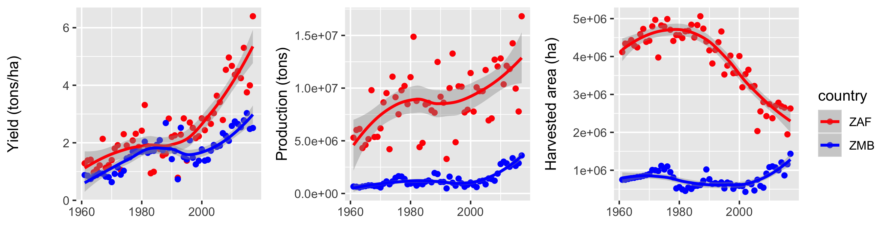

```{r setup, include = FALSE}
knitr::opts_chunk$set(
  collapse = TRUE,
  fig.align = "center",
  comment = "#>"
)
library(knitr)
options(width = 100)
```

# Data analysis and visualization{#data-analysis-and-visualization}

We are now moving onto the final module of this unit. We'll learn now about manipulating, analyzing, and visualizing data. We'll start working with `tidyverse` tools more now. 

For this module we will be using the following packages:

```{r, message=FALSE}
library(dplyr)
library(tidyr)
library(ggplot2)
```

For this module, we will start making extensive use of `%>%`. You will save yourself much time by using the keyboard shortcut for inserting that operator, which is `CMD + shift + m` on Mac, `ctrl + shift + m` on Windows.

# Data preparation
The first thing we need is some data to work with. R comes with many built-in  datasets, but when you are out in the wild and working on your own with `R`, you are generally going to get your datasets from somewhere else. That means that you will need to read them into `R`. Once you have read them in, you will often need to clean them up and rearrange them before they are ready to analyze. This section focuses on reading in and organizing your data in `R`. We are going to work with files in the commonly used csv data format. 

## Reading in and writing out data
We are going to work with three csv files that I downloaded from [FAOStat](http://www.fao.org/faostat/en/#home), one of the primary sources for agricultural census data. The data I downloaded represent the planted areas and harvest quantities of maize, wheat, and sorghum for the years 1961-2017 for Zambia and South Africa. They are bundled up here with `geospaar`, so you can access them by reading them in as `system.file`s. 

We can easily read in each file using base `R`'s `read.csv` function, which is widely used.  However, we are going to skip straight to a more powerful csv reader provided by the tidyverse's [`readr`](https://readr.tidyverse.org) package. Even more powerful is `data.table::fread`, which is excellent (and as far as I know, still the fastest on the market) for reading in very large csv files, but we are sticking with the tidyverse. First, for grins, here is how you would use `read.csv`

```{r}
library(geospaar)
f <- system.file("extdata/FAOSTAT_maize.csv", package = "geospaar")
maize <- read.csv(f)
head(maize)
```

Now the `readr` way
```{r}
maize <- readr::read_csv(f)
maize
```

That reads it in as a tibble, rather than a `data.frame`, but remember that a `tibble` is an enhanced `data.frame`.  

Right away we can see that the data look kind of messy. There isn't anything I see in that preview that tells us much about the data. `readr` at least gives a summary of data columns and their type on read in. So let's inspect what's there:
```{r, message=FALSE}
library(dplyr)
maize %>% slice(1)  # same as maize[1, ]  
```

That's the first row of data from `maize`, using `dplyr::slice` instead of `maize[1, ]` to get it. We don't need everything in there. We are interested in just a few columns actually. We'll get to how we select those data in the next section. 

Let's get all three datasets read in first:

```{r}
# Chunk 1
# #1
fs <- dir(system.file("extdata/", package = "geospaar"), pattern = "FAOSTAT", 
          full.names = TRUE)
fs
# #2
crops <- lapply(fs, readr::read_csv)
```

We used good old `lapply` to read all three files into a list (#2), after we used the `dir` function  with `system.file` to retrieve the paths to the three csvs (#1). Let's break that down:

```{r}
# Chunk 2
# #1
system.file("extdata/", package = "geospaar")
#
# #2
dir(system.file("extdata/", package = "geospaar"))
#
# #3
dir(system.file("extdata/", package = "geospaar"), pattern = "FAOSTAT")
#
# #4
dir(system.file("extdata/", package = "geospaar"), pattern = "FAOSTAT", 
    full.names = TRUE)
```

In #1, we get the file path to the extdata/ folder in the `geospaar` installed package. #2 gives shows us the names of all the files in there. #3 shows us narrows the listed files down to those whose names contains "FAOSTAT", and then #4 returns the full file paths for each. 

So that's a quick introduction to how one can construct a file path and read in table data stored in a csv. 

Let's say we want to write out some data:
```{r}
# Chunk 3
# #1
set.seed(1)
dat <- tibble(a = sample(1:10), b = rnorm(10))
# #2
td <- tempdir()
# #3
readr::write_csv(dat, path = file.path(td, "dummy.csv"))
# #4
readr::read_csv(file.path(td, "dummy.csv"))
```

In #1 we do the usual creation of dummy data, but we replace `data.frame` with `tibble`, the enhanced `data.frame`--note we could have used `data.frame`. #2 creates a temporary directory, which allows me to do something to code this demonstration in a way that will run on your computer (i.e. you won't have to create a directory with a name and path that matches one on my computer for this code to execute at install time). #3 uses `readr::write_csv` to write it onto disk, and we read it back in in #4. 

***
<center>
[Back to top](#data-analysis-and-visualization) || [Back to **vignette index**](toc.html)
</center>
***


## Getting your data clean and in shape
As we have already seen, our three crop datasets are messy. Columns we don't need and not sure if we want the row structure as it is. So we have to prepare our data. 

### Tidy data
This introduces the concept of *tidy* data, which is the foundational concept for the tidyverse.  There is a whole paper written on the tidy data concept by Hadley Wickham, which is [here](https://cran.r-project.org/web/packages/tidyr/vignettes/tidy-data.html). To quote the key principles:

> Tidy data is a standard way of mapping the meaning of a dataset to its structure. A dataset is messy or tidy depending on how rows, columns and tables are matched up with observations, variables and types. In tidy data:

> 1. Each variable forms a column.

> 2. Each observation forms a row.

> 3. Each type of observational unit forms a table.

> ...Messy data is any other arrangement of the data.

Please do read that site to get a full understanding of it, as we are going to be reorganizing our data according to these principles. 

### Selecting
Let's start by getting rid of some of the extraneous variables in our data. We'll start with just the `maize` dataset, which we read in on its own above. Having already looked at it, we know there are a bunch of columns we don't need, so we will pull out the essentials:

```{r}
# Chunk 4
# dplyr selection
maize <- maize %>% dplyr::select(Item, Area, Element, Year, Value)
# base R (not run)
# maize <- maize[, c("Item", "Area", "Element", "Year", "Value")]
```

Which reduces `maize` down to the columns *Item* (crop name), the *Area* (country), the *Element* (variable, the *Year*, and the *Value* of the variable. Note that we used `dplyr::select` (note the `::` specification here, due to a namespace conflict with `raster::select`) to grab the columns we wanted, instead of the base `R` way of selection (shown commented out).

*Year* and *Value* store numeric values, but *Item*, *Area*, and *Element* are categorical (character). So let's look at what values are stored in them:  

```{r}
# Chunk 5
maize %>% distinct(Item, Area, Element)
# unique(maize[c("Item", "Area", "Element")])
```

We use the `distinct` function to select out the unique values contained in each of those columns. You could do this in base `R` also, which is also shown in the commented out code. 

This exercise tells us something. We have one violation of the tidy principles. *Item* and *Area* seem correct, they are storing variables: crop name and country name. *Element*, on the other hand, contains:

> Multiple variables are stored in one column

Which is one of the [definitions](https://cran.r-project.org/web/packages/tidyr/vignettes/tidy-data.html) of messy data. 

***
<center>
[Back to top](#data-analysis-and-visualization) || [Back to **vignette index**](toc.html)
</center>
***

### Reshaping
So we need to reshape the dataset. How? Well, the values "Area harvested" and "Production" in *Element* are both stored in the neighboring *Value* column. We need to make two new columns out of values in *Value*, pulling out the ones corresponding to *Element* "Production" into one new column, and *Element* "Area harvested" into another. This is called **spreading**, or going from long (or tall) to wide:
```{r, message=FALSE}
# Chunk 6
maize <- maize %>% spread(key = Element, value = Value)
maize
```

We use `tidyr::spread` to do that, using *Element* as the key, and *Value* as the column holding the values. The inverse procedure is called **gathering**, where columns are re-organized into key-value pairs: 
```{r}
# Chunk 7
maize %>% gather(key = Element, value = Value, `Area harvested`, Production)
```

Here we use `tidyr::gather` to reshape `maize` back to its original form. We have two arguments, "key", which is the name for new variable that will hold the key, and "value", which will hold the data values corresponding to each key. We then give the column names that we want to gather into key-value pairs. Gathering, also known as going from wide to long (or tall), is probably more common than spreading, but for our datasets we have to spread, because the original form keeps two clearly distinct variables in one column. So we will keep the reshaped `maize`. 

***
<center>
[Back to top](#data-analysis-and-visualization) || [Back to **vignette index**](toc.html)
</center>
***

### Renaming
We still need to clean it some more though. Note in the `gather` operation above how *Area harvested* has backticks around it. That's because it has a space in the variable name, which is bad practice. We also should remove capitals. 
```{r}
# Chunk 8
maize %>% rename(crop = Item, country = Area, year = Year, 
                 harv_area = `Area harvested`, prod = Production)
```

So that's fairly straightforward. We use `dplyr::rename` to assign a new name for each column, and we then give them more informative column names.  That's the most direct way of renaming. There are more programmatic ways of doing it, but we will circle back to that later on. 

### Chaining/piping
Okay, so we have just seen a bunch of data tidying steps above. This is a good point to talk about combining operations. It is advantageous to combine operations when we have to do several things to get a desired outcome, but have no need to keep the results of intermediate steps, as in this case--we have to make several fixes to these data, but only care about their final tidied version. We can combine our tidying operations so that they are executed all at once using `dplyr`/`tidyr` pipes:

```{r}
# Chunk 9
crops[[1]] %>% dplyr::select(Item, Area, Element, Year, Value) %>% 
  spread(key = Element, value = Value) %>% 
  rename(crop = Item, country = Area, year = Year, 
                 harv_area = `Area harvested`, prod = Production)
```

We grab the first element of `crops`, the maize `tibble`, and apply all three operations sequentially by chaining them together with `%>%`, the pipe operator. This means we are piping the results of each operation to the next: the results from `select` are piped to `spread`, and then the results of those two to `rename`.  

**Important note:** chaining/piping is not something unique to data tidying, as it applies to operations throughout the tidyverse.

Now that we have our pipes set up, we can apply them to all three datasets in an `lapply`: 

```{r}
# Chunk 10
lapply(crops, function(x) {
  x %>% dplyr::select(Item, Area, Element, Year, Value) %>% 
    spread(key = Element, value = Value) %>% 
    rename(crop = Item, country = Area, year = Year, 
           harv_area = `Area harvested`, prod = Production)
})
```

The tidying is now done, although we haven't saved the results to a new object yet. We'll do that next. 

***
<center>
[Back to top](#data-analysis-and-visualization) || [Back to **vignette index**](toc.html)
</center>
***

### Combining datasets (and operations)
Oftentimes when one is working with data, there is a need to combine several datasets into one. These three datasets are one such example--we don't really need to keep our three `tibble`s as separate elements in a list, as it might be easier to perform any further manipulations of the data if we combine them all into one big `tibble`. We'll look at two ways of joining tables. 

#### Binding
Now we'll bind all three `tibble`s into a single large one:

```{r}
# Chunk 11
crops_df <- do.call(rbind, lapply(crops, function(x) {
  x %>% dplyr::select(Item, Area, Element, Year, Value) %>% 
    spread(key = Element, value = Value) %>% 
    rename(crop = Item, country = Area, year = Year, 
           harv_area = `Area harvested`, prod = Production)
}))
crops_df
```

Building on Chunk10, we apply the tidying procedure and then join the three tidied `tibble`s into one long one (`crops_df`) using `do.call` and `rbind` to do that last step. `do.call` basically says "do this function call", which is `rbind`, `rbind` is being done to the results of the `lapply`. Or, broken down:
```{r}
# Chunk 12
crops2 <- lapply(crops, function(x) {
  x %>% dplyr::select(Item, Area, Element, Year, Value) %>% 
    spread(key = Element, value = Value) %>% 
    rename(crop = Item, country = Area, year = Year, 
           harv_area = `Area harvested`, prod = Production)
})
crops_df <- do.call(rbind, crops2)
# crops_df <- rbind(crops2[[1]], crops2[[2]], crops2[[3]])
set.seed(1)
crops_df %>% sample_n(., size = 20)
```

The above shows the `lapply` and the `do.call(rbind` steps separately. Note the commented out line, which shows an alternate, less programmatic way of binding the three tables. The final line uses `dplyr::sample_n` to select 20 rows at random, which reveals that the new large `tibble` contains observations of all three crop types. 

Another note: there is actually a pure tidyverse way of doing the full set of steps, using `purrr`'s set of `map*` functions to replace the `lapply`, but we will leave that aside for now.  

***
<center>
[Back to top](#data-analysis-and-visualization) || [Back to **vignette index**](toc.html)
</center>
***


#### Merging/joining
So we just saw how to combine datasets by binding them by rows. Oftentimes you want to combine them by adding a variable or variables from one dataset into another, using one or common variables as the key(s) for joining. In base `R`, this is done with the `merge` function, but with `dplyr` we use the `*_join` functions. 

We'll start with some dummy datasets to illustrate, and then use our own crop data to show a more complicated join using two variables. 

```{r}
# Chunk 13a
set.seed(1)
t1 <- tibble(v1 = paste0("N", 1:5), v2 = rnorm(5))
t1
t2 <- tibble(v1 = paste0("N", 1:5), v3 = runif(5))
t2
t3 <- tibble(v1 = paste0("N", 1:7), v4 = sample(1:100, 7))
             # v5 = letters[sample(1:26, 7)])
t3
t4 <- tibble(v1 = paste0("N", c(1:2, 4:7, 11)), 
             v5 = letters[sample(1:26, 7)])
t4
```

We make four `tibble`s, each having a common variable *v1* but three unique variables (*v2*, *v3*, *v4*, *v5*). 

There are several different ways to do joins, and a matching function for each. Please read about those functions (`?dplyr::join`).

The simplest join case is between `t1` and `t2`, which can be done as:
```{r}
# Chunk 13b
# #1
left_join(x = t1, y = t2, by = "v1")
#
# #2 
inner_join(x = t1, y = t2, by = "v1")
#
# #3 
right_join(x = t1, y = t2, by = "v1")
# 
# #
full_join(x = t1, y = t2, by = "v1")

```

We use `inner_join`, `left_join`, `right_join`, or `full_join` to merge together `t1` and `t2`, getting identical results because the two joins have have the same number of rows and a unique key value per row on the join variable (*v1*). The results begin to diverge when we have differing numbers of rows:

```{r}
# Chunk 14
# #1
inner_join(x = t1, y = t3, by = "v1")
#
# #2
left_join(x = t1, y = t3, by = "v1")
#
# #3
right_join(x = t1, y = t3, by = "v1")
# 
# #4 
full_join(x = t1, y = t3, by = "v1")
```

In #1 and #2, `t1` and `t3` produce identical results using either `inner_join` or `left_join`, even though they do slightly different things:

- `?inner_join`: 

    > ...return all rows from x where there are matching values in y, and all columns from x and y.

- `?left_join`:

    > ...return all rows from x, and all columns from x and y. Rows in x with no match in y will have NA values in the new columns. 

Since `t1` is the *x* object, and `t3` is the `y`, both join functions drop the two extra rows in `t3` because they have no matches in `t1`. 

That contrasts with #3, where we use a `right_join`, which returns (from `?right_join`):

> all rows from y, and all columns from x and y. Rows in y with no match in x will have NA values in the new columns. 

So we the unmatched rows from `t3` (the last two) in the joined result are filled with NAs in the *v2* column that came in from `t1`. `full_join` produces the same result, because it returns (from `?full_join`):

> return all rows and all columns from both x and y. Where there are not matching values, returns NA for the one missing.

You get the same results in the last two because the values in `t1`'s *v1* column are a subset of `t3`'s *v1* values. Let's see what happens when both the values in both join columns each have values not shared by the other:  

```{r}
# Chunk 15a
# #1
inner_join(x = t3, y = t4, by = "v1")
#
# #2
left_join(x = t3, y = t4, by = "v1")
#
# #3
right_join(x = t3, y = t4, by = "v1")
# 
# #4 
full_join(x = t3, y = t4, by = "v1")
```

Each of the four results produces a different output (and it is left to you to describe why in the practice questions below). 

Right, so that is an introduction to some different types of joins, and their varying behavior. We can join all four together using pipes:

```{r}
# Chunk 15b
full_join(t1, t2) %>% full_join(., t3) %>% full_join(., t4)
```

That is the most inclusive join of all four `tibble`s. Notice that we dropped the argument names, and the join variable is automatically found.  

We are now going to end by doing a more complicated join based on three columns, using our crop data: 

```{r}
# Chunk 16
# #1
yields <- crops_df %>% mutate(yield = prod / harv_area) %>% 
  dplyr::select(crop, country, year, yield)
yields %>% slice(1:2)
# 
# #2
crop_ylds <- left_join(x = crops_df, y = yields, 
                       by = c("crop", "country", "year"))
#
# 3
crop_ylds <- left_join(crops_df, yields) 
crop_ylds
```

First, we make a new `tibble` that calculates crop yields from production and harvested area (yield = production / harvest area). We use the `mutate` function (more on that in section 2.2.8) to create the new variable, and select just *crop*, *country*, *year*, and *yield* to make a new `yields` `tibble`.  

We then use a `left_join` to merge `yields` onto `crops_df`. We specify three columns in this case, because there is no one variable that provides a unique key, nor is there two variables that do. However, the values in *crop*, *country*, and *year* do provide a unique combination for each row, so we join on those. #2 makes that explicit, but we see in #3 that `left_join` handles this for us automatically if we don't. 

***
<center>
[Back to top](#data-analysis-and-visualization) || [Back to **vignette index**](toc.html)
</center>
***


### Arranging
That last line on Chunk #12 (`crops_df %>% sample_n(., size = 20)`) gives an opportunity to introduce another aspect of data organizing, which is sorting. Note that the years are out of order in that final random draw. We can rearrange that so that they are sequential:
```{r}
# Chunk 17
set.seed(1)
# 
# #1
crops_df %>% sample_n(., size = 20) %>% arrange(year)
# 
# #2
crops_df %>% sample_n(., size = 20) %>% arrange(country, year)
# 
# #3
crops_df %>% sample_n(., size = 20) %>% arrange(crop, country, year)
# 
# #4
crops_df %>% sample_n(., size = 20) %>% arrange(crop, country, -year)
```

We are taking the same random sample in each example above, ordering the resulting outputs differently in each case: #1 orders ascending by year (oldest to most recent); #2 orders ascending first by country than by year; #3 ascending by crop, country, and year; #4 by ascending by crop and country, but descending by year (note the `-` sign).

We can also sort our crop dataset:
```{r, error = TRUE}
# Chunk 18
# #1
crops_df %>% arrange(desc(year), country, desc(crop))
#
# #2
crops_df %>% arrange(-year, country, -crop)
# crops_df %>% arrange(-year, country, desc(crop))
```

In #1 we sort first by *year*, in descending order (`desc()` does the same as `-`, meaning it arranges in descending order), then *country* alphabetically, and then by *crop* in reverse alphabetical order. Note that in #2 we can't use the `-` to do the reverse sort on *crop*, but the first `-` on year is valid. The commented out variant would work if run.    

***
<center>
[Back to top](#data-analysis-and-visualization) || [Back to **vignette index**](toc.html)
</center>
***

### Mutating
The last thing we will look at in this section is *mutation*, which uses the `mutate` function. That is, we use it to change the `data.frame` tibble by either altering existing variables or adding new ones. This brings us back to our `crops_df`. In Chunk 16 we created a new `yields` `tibble` so that we could demonstrate a merge with our `crops_df`.  That was an entirely unnecessary operation, because if I wanted to create a separate *yield* column for `crops_df`, I could have just done this:

```{r}
# Chunk 19
crop_ylds <- crops_df %>% mutate(yield = prod / harv_area)
crop_ylds
```

Thereby avoiding the joining process entirely and doing in one step what we did in two steps in Chunk 16. That is courtesy of the `mutate` function.  

We can also use `mutate` to help us modify existing rows. Let's do that. I don't like having the full country name in the `tibble`, particularly with spaces in the name.  Let's shorten those. 
```{r}
# Chunk 20
set.seed(1)
crop_ylds %>% 
  mutate(country = ifelse(country == "South Africa", "ZAF", country), 
         country = ifelse(country == "Zambia", "ZMB", country)) %>% 
  sample_n(5)
set.seed(1)
crop_ylds %>% 
  mutate(country = ifelse(country == "South Africa", "ZAF", country)) %>%  
  mutate(country = ifelse(country == "Zambia", "ZMB", country)) %>% 
  sample_n(5)
```

In #1 we use the `mutate` function with `ifelse` to change all values that match "South Africa" to "ZAF", otherwise let them be, and all values matching "Zambia" to "ZMB", otherwise leave them be. In this case, we wrap both arguments in a single `mutate` call, separated by a comma.  We could also use separate `mutate` calls for each change, as we do in #2. In both cases we sample 5 rows to show that the changes were made for both countries. 

We'll wrap it all up now: 
```{r}
# Chunk 21
crop_ylds <- crop_ylds %>% 
  mutate(country = ifelse(country == "South Africa", "ZAF", country)) %>%  
  mutate(country = ifelse(country == "Zambia", "ZMB", country)) %>% 
  mutate(crop = tolower(crop))
set.seed(1)
crop_ylds %>% sample_n(5)
```

We change all the values in *country*, as before, and then change the *crop* names to lowercase, all in a single statement. 

There are many other ways to `mutate` data, using more advanced pattern matching capabilities and other features.  We will start to see more of those in subsequent sections. 


## Practice
### Questions
1. What is the difference between a `tibble` and a `data.frame`? 

2. Given a `tibble` `tb_a`, with columns *a* and *b*, how would extract column *a* using base `R` methods? Using tidyverse methods? 

3. You are given a csv that is organized into 6 rows and 14 columns. The first two columns contain country names (two countries) and district names (three districts per country). The other 12 columns are named by the month of th year, and each month contains the average number of measles cases reported over a 5 year period in that month for each district in each country. Are these data tidy or messy? If messy, how would you rearrange them? 

4. Describe why each of the four outputs from Chunk 15a differs as a function of the `*_join` function used.  

### Code
1. Re-create the dummy `tibble` in Chunk 3, and write it out to a csv using `readr::write_csv`, to any directory convenient for you (e.g. into your notebooks/ folder), calling it "my_dummy_file.csv".

2. Use `dir` to list files in the directory you write it into matching the word "dummy", and then read it back in using `readr::read_csv`. 

3. Building on the example in Chunk 15a, join all 4 `tibble`s together, but replace `full_join` with `left_join`. Do the same again using `right_join`.

4. Rearrange the results of the two joins you just did, using *v5* as the sort. Do an ascending sort on the results of the chained `left_join`, and descending on the `right_join`. 

5. Recreate the `crop_ylds` `tibble`. Skip the part where we created *yield* via a merge, and instead use the approach where we just did a mutate. Don't forget to change the crop capitalization and change the country names also. After you reproduce what it looks like in Chunk 21, use `mutate` to add a new column *harv_km2* by doing *harv_area* / 100.

6. Now rename the new *harv_km2* variable to *harv_area_km2*, using the `rename` function. 

7. Do all of this in a single pipeline: 1) create a `tibble` with variables *v1* (values 1:10) and *v2* (values 11:20); 2) `rbind` that with another `tibble` with the same variables but with values 11:20 and 20:30 (hint: you will need to wrap the second `tibble` in an `rbind`, e.g. `rbind(., tibble())`); 3) add a new column *v3* to the result of that, which is the square of *v2*; 4) arrange it in descending order of *v3*; 5) capture the result of all that into `my_tb`

8. End by selecting rows 1, 10, and 17 and *v2* and *v3* from `my_tb`, using `slice` and `select`

***
<center>
[Back to top](#data-analysis-and-visualization) || [Back to **vignette index**](toc.html)
</center>
***

# Analyzing your data
Now that we have gotten an introduction to data preparation steps, we will learn about how to analyze it. We have already seen some very basic analyses, in the form of basic algebra and data summaries.  Now we will move onto more advanced data manipulation and analyses. 

## Split-apply-combine
> Many data analysis problems involve the application of a split-apply-combine strategy, where you break up a big problem into manageable pieces, operate on each piece independently and then put all the pieces back together.

So says Hadley Wickham in a [paper](https://www.jstatsoft.org/article/view/v040i01) that describes this common data analysis strategy and the `plyr` package, which is the forerunner of `dplyr`.  

Long or tall (i.e. tidy) data formats facilitate split-apply-combine (SAC) analyses. Let's come back to our `crop_ylds` dataset to look at this:  

```{r}
# Chunk 22
crop_ylds %>% group_by(crop) %>% summarize(mean_yield = mean(yields))
```

We just did an SAC on the `crop_ylds` data that entailed splitting the dataset by crop type, applying the `mean` function, and then combining the results of that into a summary `tibble`.  We can use an `lapply` and `rbind` to illustrate the inner workings of that SAC:

```{r}
# Chunk 23
# #1
splt_apply <- lapply(unique(crop_ylds$crop), function(x) {
  dat <- crop_ylds[crop_ylds$crop == x, ]  # here's the split
  cat("\n")  # add empty line
  print(paste("Split out", x))  # print statement to mark split  
  print(dat[1, ])  # print showing first line of split tibble
  o <- data.frame(crop = x, mean_yield = mean(dat$yields))  # here the apply
})
#
# #2
do.call(rbind, splt_apply)  # here's the combine
```

Chunk 23 #1 contains both the split (using base `R` syntax rather than `dplyr`, to avoid mixing syntaxes) and apply parts (see the comments in the code), with some extra print statements added so that we can see how the splits are happening within the `lapply` (by showing the first row of each split-out `tibble`. **Note how `unique` is used here--to get a vector of unique crop names that are passed to an anonymous function that iterates over each crop name, which is used with logical indexing to subset (split) out the rows from `crop_ylds` that correspond to that crop.** #2 does the combine, creating the same result produced using `dplyr` in Chunk 22. Given that, you will not `dplyr::group_by` does the splitting work, and `dplyr::summarize` does the applying (of `mean`), and the combine is implicit.

Now let's look at a more complex SAC:
```{r}
# Chunk 24
crop_ylds %>% group_by(crop, country) %>% summarize(mean_yield = mean(yields))
```

Here we do two splits: the first on crop, the second on country, so after applying and combining we get the mean yield for each crop for each country.  Let's do that with `lapply`:
```{r}
# Chunk 25a
# #1
splt_apply <- lapply(unique(crop_ylds$crop), function(x) {
  cat("\n")  # add empty line
  print(paste("Split out", x))  # print to mark outer split
  cntry_splt_apply <- lapply(unique(crop_ylds$country), function(y) {
    dat <- crop_ylds[crop_ylds$crop == x & crop_ylds$country == y, ]  # split
    cat("\n")  # add empty line
    print(paste("...then split out", y, x))  # print to mark inner split
    print(dat[1, ])  # print to show 1st line of split tibble
    o <- data.frame(crop = x, country = y, mean_yield = mean(dat$yields))
  })
  do.call(rbind, cntry_splt_apply)
})
#
# #2
do.call(rbind, splt_apply)
```

Making this SAC with `lapply` requires an `lapply` nested in an `lapply`. The outer `lapply` splits on crop, and the inner on each country within each crop (using `unique(crop_ylds$country)` to get the vector of country names). `mean` is applied to the split data within the inner `lapply`. 

Right, so that might look daunting, but not to worry--we are just using those `lapply`s to illustrate the splitting, and also to show how using `dplyr` pipelines can make things much simpler. So we'll forge ahead with those.

What happens if we want to do SAC on an even finer range of data within each split, say, calculate mean yields since the year 2000 by crop and by country: 

```{r}
# Chunk 25b
crop_ylds %>% filter(year >= 2000) %>% group_by(crop, country) %>% 
  summarize(mean_yield = mean(yields))
```

We can add `dplyr::filter` with the conditional statement (`year >= 2000`) in it, to select observations since the year 2000, and do the SAC on those. According to `?dplyr::filter`'s function description, we:

> Use filter() to choose rows/cases where conditions are true. Unlike base subsetting with [, rows where the condition evaluates to NA are dropped.

How about pre-2000 mean yields

```{r}
# Chunk 26
crop_ylds %>% filter(year < 2000) %>% group_by(crop, country) %>% 
  summarize(mean_yield = mean(yields))
```

Same procedure, just a different conditional operator inside `filter`. But maybe we want to compare pre- and post-2000 yields in the same dataset:
```{r}
# Chunk 27
crop_ylds %>% 
  mutate(y2k = ifelse(year < 2000, "1961_2000", "2000_2017")) %>% 
  group_by(crop, country, y2k) %>% 
  summarize(mean_yield = mean(yields))
```

That's a little more complex, and doesn't use `filter`. Instead, we first use `mutate` with `ifelse` to create a new variable (*y2k*), which indicates whether years are before 2000, or 2000 and onward. We then use *y2k* to apply a third split to the data after our crop and country splits, and finally end with the mean yields from our three-way splits. 

That comparison might be easier if we put the pre- and post-2000 yields next to one another. That would require just one more step to do:
```{r, warning=FALSE}
# Chunk 28
crop_ylds %>% 
  mutate(y2k = ifelse(year < 2000, "1961_2000", "2000_2017")) %>% 
  group_by(crop, country, y2k) %>% 
  summarize(mean_yield = mean(yields)) %>% 
  spread(key = y2k, value = mean_yield)
```

In this case we just use `spread` with *y2K* as the key, and the mean yields as the value. Much easier to compare, in my opinion, and it shows how much larger post 2000 yields are. Wait, we could calculate how much larger exactly:

```{r}
# Chunk 29
crop_ylds %>% 
  mutate(y2k = ifelse(year < 2000, "1961_2000", "2000_2017")) %>% 
  group_by(crop, country, y2k) %>% 
  summarize(mean_yield = mean(yields)) %>% 
  spread(key = y2k, value = mean_yield) %>% 
  mutate(yield_ratio = `2000_2017` / `1961_2000`)
```

We use another `mutate` to create another variable that is the ratio of post-2000 and pre-2000 yields. Maybe we are interested in a straight comparison of pre- and post-2000 maize yield differences across all countries:
```{r}
# Chunk 30
crop_ylds %>% filter(crop == "maize") %>% 
  mutate(y2k = ifelse(year < 2000, "1961_2000", "2000_2017")) %>%
  group_by(y2k) %>% summarize(mean_yield = mean(yields)) %>% 
  spread(key = y2k, value = mean_yield) %>% 
  mutate(yield_ratio = `2000_2017` / `1961_2000`)
```

We leave it to you in the practice questions below to answer how Chunk 30 differs from Chunk 29. 

***
<center>
[Back to top](#data-analysis-and-visualization) || [Back to **vignette index**](toc.html)
</center>
***

## Data summaries
Now that we have a sense of how to do split-apply-combine, let's dig a bit more into the analyses that we can do as part of that process. Since `R` was originally designed for statistics, there are many possible analyses we can do with `R`. We'll look at just a few common ones, starting with the calculation of summary statistics, outside of SAC. The easiest way to do that in `R` is to use the base `summary` function. 

```{r}
# Chunk 31
# #1
summary(crop_ylds$harv_area)
#
# #2
crop_ylds %>% select(harv_area) %>% summary()
#
# #3
crop_ylds %>% pull(harv_area) %>% summary()
```

In #1, we use the `summary` function on *harv_area*, pulled out of `crop_ylds` as a vector. #2 does the same thing using `dplyr` verbs. Note how `summary()` appears at the end of the pipeline, and we don't have to give it a variable name because it receives implicitly consumes everything coming out of the upstream pipe (in this case, just *harv_area*).  However, that returns summary output in a `table`, whereas the base method returns a named vector. #3 produces the equivalent of #1, using `dplyr::pull` instead of select. `pull` is the `dplyr` equivalent of `crop_ylds$harv_area`, i.e. it pulls a variable froma `data.frame` or `tibble` into a vector. 

`summary` is giving us a bunch of quantile values and the mean from the vector. We can also use it for more than 1 variable:
```{r}
# Chunk 32
# #1
summary(crop_ylds[, c("harv_area", "prod")])
#
# #2
crop_ylds %>% select(harv_area, prod) %>% summary()
```

With #1 showing the base approach, and #2 the `dplyr` method. Fairly straight-forward. How about if we want to do it in an SAC (these approaches are not) where we need to apply some grouping?  

```{r, out.width=8}
# Chunk 33
q1 <- function(x) quantile(x, 0.25) 
q3 <- function(x) quantile(x, 0.75)
crop_ylds %>% select(crop, country, harv_area, prod) %>% 
  group_by(crop, country) %>% rename(ha = harv_area, p = prod) %>% 
  summarise_all(funs(min, q1, med = median, mu = mean, q3, max))
```

The above is somewhat more complex. We want to calculate `summary` stats for *prod* and *harv_area* by *crop* and *country*, but `dplyr` can't easily produce the tabular output for each groups. Therefore, we separately calculate each statistic in `summary`, and use `summarise_all()` (which applies the summarizing functions to each selected variable), using `funs` to pass each function in to `summarise_all()`. In the first two lines, we specify two custom functions, the first calculates the first quartile (25th percentile), the next calculates the third quartile (75th percentile).  In the pipeline, we also do some renaming gymnastics, changing *harv_area* to *ha* and *prod* to *p*, and then we specify in `funs` some shorter names for the output from `median` and `mean`. These renamings are in service of narrowing the width of output columns.  

***
<center>
[Back to top](#data-analysis-and-visualization) || [Back to **vignette index**](toc.html)
</center>
***

## Associations
Evaluating associations between data variables (e.g. correlations) is one of the most frequent uses for `R`. Lets start with correlations:

```{r}
# Chunk 34
# #1
cor(crop_ylds[, c("prod", "harv_area")])
# 
# #2
crop_ylds %>% select(prod, harv_area) %>% cor()
# 
# #3
cor.test(x = crop_ylds$prod, y = crop_ylds$harv_area)
#
# # 4
crop_ylds %>% group_by(crop, country) %>% summarise(cor = cor(prod, harv_area))
```

We first apply `stats::cor` using base syntax to calculate the correlation matrix between *prod* and *harv_area* (#1), and then do the same thing with `dplyr`. In #3 we apply the `cor.test` to those two variables, using base syntax, which produces statistics regarding the confidence interval and significance of the correlation coefficient. This is harder to do in `dplyr`, because the output from `cor.test` is not tabular, so we are not doing that here (but there is a tidyverse oriented `corrr` package that should help with that). #4 shows how to use `cor` with `summarize` when grouping by *crop* and *country*. The output is the correlation coefficient for the two variables for each crop and country over the time series (this only works for a two variable correlation analysis--it fails when a third variable is added). Note the negative correlation between maize production and harvested area in South Africa, whereas all the others are generally strongly positive (as they should be--generally the more area you plant to a crop, the more tons of it you produce). We'll come back to that. 

The next step after a correlation is a regression, which quantifies how much a variable Y changes in response to changes in a variable X (or several different X variables). <span style="color:blue">Note: This is not a statistics course, so if you have never seen a regression before, then some of what comes next might be a little opaque. I recommend that you read up on the basics of least squares regression to help understand these examples better. [Here](http://onlinestatbook.com/2/regression/intro.html) is one of many online resources.</span>

Here's our first regression example:
```{r}
# Chunk 35
# #1
prodha_lm <- lm(prod ~ harv_area, data = crop_ylds)
prodha_lm
#
# #2
summary(prodha_lm)
```

In #1 above, we use `R`'s `lm` (linear model) function to fit a regression between *prod* (dependent variable) and *harv_area* (independent variable) across the entire `crop_ylds` dataset. Note the `~`, which is used to specify the left-hand and right-hand sides of the regression formula. The output of `lm` is captured in `prod_lm`, which just specifies the model formula and the regression coefficients. To see more of the model's results, you have to use `summary` on the `prodha_lm`, as we do in #2, which spits out quite a bit, including the model fit (significance of coefficients, R^2^, etc.). 

Given our dataset, this relationship is not that interesting. At the very least, we would want to see the relatinship by crop type, and also by crop and year. That requires some splitting:
```{r}
# Chunk 36
# #1
maize_lm <- lm(prod ~ harv_area, 
               data = crop_ylds %>% filter(crop == "maize"))
#
# #2
maize_zm_lm <- lm(prod ~ harv_area, 
                  data = crop_ylds %>% 
                    filter(crop == "maize" & country == "ZMB"))
summary(maize_zm_lm)
#
# #3
maize_za_lm <- lm(prod ~ harv_area, 
                  data = crop_ylds %>% 
                    filter(crop == "maize" & country == "ZAF"))
summary(maize_za_lm)
```

The first split is simply on crop type (#1), so the regression is maize planted area on production for across countries and years. Notice the use of `dplyr` pipes and verbs to split out the maize observations within the "data" argument of `lm`. The coefficients show us that production increases by roughly **`r  round(summary(maize_lm)$coefficients[2], 2)`** tons per 1 ha increase in planted area. That's interesting, because it sounds pretty close to what you would get if calculated average yield by dividing each production estimate by harvested area and then taking the average. We leave it to you to calculate mean yield in the practice below.   

In #2, we split out Zambian, and in this case we see that Zambian maize production increases by **`r  round(summary(maize_zm_lm)$coefficients[2], 2)`** tons per ha planted area, while #3 shows that South African maize production decreases by **`r round(summary(maize_za_lm)$coefficients[2], 2)`** tons per ha. Remember that negative correlation in Chunk 34 #4 above? In the next section we will take a graphical look at the reasons for this decline. 

We could also fit the `lm` and `summary` at the end of the `dplyr` pipeline:
```{r}
# Chunk 37
crop_ylds %>% filter(crop == "maize" & country == "ZAF") %>% 
  lm(prod ~ harv_area, data = .) %>% summary()
```

That is actually more elegant than what the code in Chunk 36. To make this work, we have to use the `.` in the "data" argument within `lm`, which represents the `data.frame`/`tibble` coming in from the upstream part of the pipeline. Note that we don't need the `.` in the `summary` function. **Try run the code above, removing the `.` from within `lm`, to see what happens.** 

I'll end this very brief introduction to analysis with a look at how we could do SAC with regression, so that we can run all country X crop `prod ~ harv_area` regressions. We'll start with a melange of base `R` and `dplyr`:
```{r}
# Chunk 38
crop_country_lms <- lapply(unique(crop_ylds$crop), function(x) {  
  lms <- lapply(unique(crop_ylds$country), function(y) {
    dat <- crop_ylds %>% filter(crop == x & country == y)
    summary(lm(prod ~ harv_area, dat))$coefficients
  })
  names(lms) <- unique(crop_ylds$country)
  return(lms)
})
names(crop_country_lms) <- unique(crop_ylds$crop)
crop_country_lms
```

This arrangement is similar to what we were doing in Chunk 25b, using nested `lapply` to split on crop and country (using `dplyr:filter` instead of base `R` syntax to do the split), but applying `lm` inside the bodies of the `lapply`. We extract only the coefficient table from `summary` of each `lm`, to condense the output.

There is a pure tidyverse way of doing this, which is the last thing to look at here.  It is more involved than previous examples, because the non-tabular (list) output from `lm` prevents use of `lm` within `dplyr::summarise`:
```{r, eval = FALSE}
# Chunk 39
crop_ylds %>% group_by(crop, country) %>% 
  do(prod_ha_lm = lm(prod ~ harv_area, data = .)) %>% 
  broom::tidy(., prod_ha_lm)
#> # A tibble: 12 x 7
#> # Groups:   crop, country [6]
#>    crop    country term             estimate    std.error statistic  p.value
#>    <chr>   <chr>   <chr>               <dbl>        <dbl>     <dbl>    <dbl>
#>  1 maize   ZAF     (Intercept)  13149213.    1767217.         7.44  7.16e-10
#>  2 maize   ZAF     harv_area          -1.09        0.440     -2.47  1.65e- 2
#>  3 maize   ZMB     (Intercept)   -468132.     268160.        -1.75  8.64e- 2
#>  4 maize   ZMB     harv_area           2.30        0.333      6.90  5.49e- 9
#>  5 sorghum ZAF     (Intercept)    175944.      35514.         4.95  7.29e- 6
#>  6 sorghum ZAF     harv_area           0.807       0.138      5.83  2.99e- 7
#>  7 sorghum ZMB     (Intercept)      2365.       1504.         1.57  1.22e- 1
#>  8 sorghum ZMB     harv_area           0.575       0.0302    19.0   7.08e-26
#>  9 wheat   ZAF     (Intercept)   1649090.     197891.         8.33  2.50e-11
#> 10 wheat   ZAF     harv_area           0.131       0.140      0.936 3.53e- 1
#> 11 wheat   ZMB     (Intercept)     -6034.       2193.        -2.75  8.02e- 3
#> 12 wheat   ZMB     harv_area           6.60        0.142     46.4   8.41e-46
```

This produces a nice output table that lists the coefficients (estimate), standard errors, t-statistic, and p-value for each crop-country model. Each model occupies two lines: one for the model intercept results, one for independent variable results. There are a couple of extra functions, including `do`, which is described by `?do` as:

> ...a general purpose complement to the specialised manipulation functions filter(), select(), mutate(), summarise() and arrange(). You can use do() to perform arbitrary computation, returning either a data frame or arbitrary objects which will be stored in a list. This is particularly useful when working with models: you can fit models per group with do() and then flexibly extract components with either another do() or summarise().

And then there is `broom::tidy`, which is a function from the `broom`, a non-core tidyverse package. The purpose of this function is to take an input and convert it to an output `data.frame`, which is what allows us to produce the messy `lm` output into a nice table at the end of the pipeline above. 

Okay, so that's where we will leave it. Now for some practice. 

## Practice
### Questions
1. What function can you use to select a range of values from a `tibble`? 

2. Looking at chunk 27, and thinking about split-apply-combine operations, identify which line is responsible for splitting the data, what split(s) is (are) being made, and which line is responsible doing the applying, and what is it applying? Finally, which line is doing the combine?  

3. In Chunk 29, what did we do differently compared to Chunk 28?

4. What is one limitation of `dplyr::summarise` with respect to analyzing groupings? What can we do to overcome that limitation?  

### Code
This coding practice assumes you have created the `crop_ylds` dataset to match its form as of Chunk 21.  

1. Use `dplyr` verbs to subset South Africa sorghum yields from the year 2000 onwards. Do the same but use base `R` syntax.

2. Calculate the `mean` and `sd` of *prod*, *harv_area*, and *yields* in the subset you just made, using `dplyr::summarise_all` and `funs`. Chunk 33 is your guide.

3. Now calculate `mean` and `sd` of *harv_area* and *prod* by crops and by country, using `dplyr`. Hint: you will need to use `dplyr::group_by`. Chunk 33 is also a guide. 

4. Use `dplyr` to calculate a correlation table between *yields* and *harv_area* for Zambian maize. Use `cor.test` to evaluate this relationship also. Hint: you will need to use the base `R` approach for this from Chunk 34 #3, but to preserve the subset of Zambia yields, first assign the subset to a new object `dat`.  

5. Use `dplyr` verbs to calculate the average maize yield (across, rather than within, countries). How close is that to the regression coefficient on *harv_area* from Chunk 36 #1?  

6. Use `lm` to fit regression of between Zambia maize *yields* and *year*, with *year* as the independent variable.  Do the same for South Africa maize yields. Use `dplyr` verbs to create the subsets, but use both the base-centric (Chunk 36) and `dplyr` centric (Chunk 37) way of running the `lm`s. Which country shows the largest annual changes in yields?

7. *Challenge:* Adapt the code in Chunk 39 to create regressions between *yields* and *year* by country and crop, but just for maize and wheat

***
<center>
[Back to top](#data-analysis-and-visualization) || [Back to **vignette index**](toc.html)
</center>
***

# Visualization
Until now we have been looking numerical outputs from our `R` code. Graphical representation often conveys more information, and is typically done alongside numerical analysis. Our last section on regressions leads us naturally to the subject of visualization, as the most obvious way to assess a linear relationship between two variables is to examine their scatterplots. So let's look at that to start, but first a quick introduction to two different plotting approaches.

## *graphics* graphics versus *grid* graphics 
Back in [Module 3 1.1](unit1-module3.html#how-r-is-evolving-and-how-it-affects-us) we mentioned that there is a split in `R` plotting methods centered on base `R`'s `graphics` and `grid` packages. `ggplot2` is arguably the most prominent descendant of the latter branch of graphics.  

We are going to learn examples of both approaches in this section. The reasons for this are that:

1. Many spatial packages (including `sf` and the newer `stars`) have generic `plot` functions that have syntax modeled on `graphics::plot`;
2. The same spatial packages are also moving toward compatibility with `ggplot2`, which is useful to know because that is rapidly becoming a standard.

I would add that it is helpful to know both approaches, because `graphics` based plots are often very good for rapid interactive data exploration, whereas `ggplot` can be helpful for creating more polished, presentation-grade graphics.

## Two-dimensional plots 
Back to our regression examples. We were exploring relationships between crop production and harvested area. We could get a better sense of that relationship by plotting those two variables against one another. 

### Scatterplots
We'll start with `graphics::plot`, which `?plot` tells us is a:

> Generic function for plotting of R objects. For more details about the graphical parameter arguments, see par.

There are many, many possible parameters to tune to in making such a plot (which you can find in `?par`), but we will just look a few. Here's a start:

```{r, fig.width=4, fig.height=4.5}
# Chunk 40
plot(prod ~ harv_area, data = crop_ylds[crop_ylds$crop == "maize", ])
```

This is a purely base way of plotting the relationship between *harv_area* on the X axis and versus *prod* on the Y axis for just maize (not distinguishing by country). We set up the relationship between the two variables as a formula, with *prod* on the left-hand side (LHS) and `harv_area` on the right-hand side (RHS) on the equation, and the data, including the subsetting, in "data" argument slot.  
We could do the same exact thing using the syntax below:
```{r, fig.width=4, fig.height=4.5}
# Chunk 41
# #1
dat <- crop_ylds[crop_ylds$crop == "maize", ]
plot(x = dat$harv_area, y = dat$prod)
#
# #2
plot(x = dat$harv_area[dat$crop == "maize"], y = dat$prod[dat$crop == "maize"])
```

Both are more cumbersome, but note that in both cases we pass our data as separate vectors into the "x" and "y" arguments. We don't show the plots above, but they are each identical to the one in Chunk 40, except for the axis labels.

That's not a particularly appealing plot, so let's dress it up a bit:
```{r, fig.width=4, fig.height=4.5}
# Chunk 42a
plot(prod ~ harv_area, data = crop_ylds[crop_ylds$crop == "maize", ], 
     pch = 16, cex = 0.7, col = "blue",
     main = "Maize production versus harvested area",
     xlab = "Harvested area (ha)",
     ylab = "Production (tons)")
```

This adds on to the approach in Chunk 40. We use the "pch" argument to change the type of symbol, "cex" changes the size of the symbol, "col" the color of the symbol, and "main", "xlab", and "ylab" add titles for the top of the plot and the X and Y axis, respectively. 

Looking at th plot, we can see there is a clear positive relationship in the data up to about 3 million ha planted area, and then production seems to decline.  What's going on there? 
```{r, fig.width=4, fig.height=4.5}
# Chunk 42b
# #1
zmb_maize <- crop_ylds %>% filter(crop == "maize" & country == "ZMB")
zaf_maize <- crop_ylds %>% filter(crop == "maize" & country == "ZAF")
# #2
plot(prod ~ harv_area, data = zmb_maize,      
     pch = 16, cex = 0.7, col = "blue", 
     main = "Zambia maize prod vs harv area",
     xlab = "Harvested area (ha)",
     ylab = "Production (tons)")
# #3
plot(prod ~ harv_area, data = zaf_maize, 
     pch = 16, cex = 0.7, col = "red", 
     main = "South Africa maize prod vs harv area",
     xlab = "Harvested area (ha)",
     ylab = "Production (tons)")
```

The difference is caused by different production/harvested area patterns in the two countries in the dataset.  In the examples above, we separately plot each country's maize dataset, using `dplyr::filter` to create two new subsets of the data, which we feed separately to two new `plot` chunks, changing the title and point color in each.  This makes the reason for the original pattern (in Chunk 41) clearer, but is still not ideal.  Better to put both on one plot:
```{r, fig.width=4, fig.height=4.5}
# Chunk 43
# #1
xl <- crop_ylds %>% filter(crop == "maize") %>% pull(harv_area) %>% range()
yl <- crop_ylds %>% filter(crop == "maize") %>% pull(prod) %>% range()
# #2
plot(prod ~ harv_area, data = zmb_maize, 
     pch = 16, cex = 0.7, col = "blue", xlim = xl, ylim = yl, 
     main = "Maize production vs harvested area",
     xlab = "Harvested area (ha)",
     ylab = "Production (tons)")
# #3
points(prod ~ harv_area, data = zaf_maize, pch = 16, cex = 0.7, col = "red")
# #4
legend(x = "topleft", legend = c("Zambia", "South Africa"), 
       col = c("blue", "red"), pch = 20)
```

That's much clearer now, and the plot now makes obvious some additional information: 1) South Africa's harvested area of maize is much larger than Zambia's, 2) it's production declined with harvested area (???), 3) Zambia's production and harvested area is much smaller but the two variables have a positive relationship.  

Putting those variables on one plot took a few additional steps. First, we had to make both datasets fit on the same scale. That required fixing the data ranges on the X and Y axis of the plot. `plot` would otherwise automatically set the range to max the first input dataset (Zambian maize). So (in #1) we first figured out the X and Y ranges by using `dplyr`'s `filter`, and `pull` to extract the *harv_area* and *prod* vectors and separately calculate their ranges into new variables (`xl` and `yl`). We then (in #2) passed these in to `plot` to set the "xlim" and "ylim" values (controlling the range of the X and Y axes, respectively). `plot` was applied to the `zmb_maize`. We then used `points` (in #3) to add the `zaf_maize` data to the existing plot. `points` does what it's name says--it adds points to a plot. An existing plot must already be established for `points` to work. The arguments are the same as those used in `plot`.  Finally, in #4, we add a legend so that the reader can distinguish between the two sets of points. The "x" argument says where the legend should be placed in the graph, "legend" asks the legend text, "col" for the point colors, and "pch" for what the point types should be. 

That was a fair bit of work. Could we save some effort with `dplyr` piping? 
```{r, fig.width=4, fig.height=4.5}
# Chunk 44
crop_ylds %>% filter(crop == "maize" & country == "ZMB") %>% 
  plot(prod ~ harv_area, data = ., 
       pch = 16, cex = 0.7, col = "blue", xlim = xl, ylim = yl, 
       main = "Maize production vs harvested area",
       xlab = "Harvested area (ha)",
       ylab = "Production (tons)")
crop_ylds %>% filter(crop == "maize" & country == "ZAF") %>% 
  points(prod ~ harv_area, data = ., pch = 16, cex = 0.7, col = "red")
legend(x = "topleft", legend = c("Zambia", "South Africa"), 
       col = c("blue", "red"), pch = 20)
```

A little bit, it seems. We can subset the dataset using `filter`, and then pipe each subset to `plot` and `points`, respectively. To do this, we give `.` to the "data" argument in each function in order to receive the piped dataset. 

That's not in ideal pipeline example, however, because `dplyr` pipes are really more designed to work with the tidyverse's plotting tools, i.e. `ggplot2`. 

***
<center>
[Back to top](#data-analysis-and-visualization) || [Back to **vignette index**](toc.html)
</center>
***

#### Introducing ggplot2
Now's a good time to introduce `ggplot2`. Let's recreate the first graph as a start:

```{r, fig.width=4, fig.height=3.75}
# Chunk 45
library(ggplot2)
crop_ylds %>% filter(crop == "maize") %>% 
  ggplot() + geom_point(mapping = aes(x = harv_area, y = prod), col = "blue") +
  xlab("Harvested area (ha)") + ylab("Production (tons)") + 
  ggtitle("Maize production vs harvested area")
```

That's a basic recreation of the same plot, although `ggplot` by default has a grey gridded background (which can be removed if needed). You can see that the syntax is *very* different than it is with `plot`. `ggplot` is based on a "grammar of graphics", on which there a [whole book](https://www.amazon.com/Grammar-Graphics-Statistics-Computing/dp/0387245448/ref=as_li_ss_tl?ie=UTF8&qid=1477928463&sr=8-1&keywords=the+grammar+of+graphics&linkCode=sl1&tag=ggplot2-20&linkId=f0130e557161b83fbe97ba0e9175c431), but also a [paper](http://vita.had.co.nz/papers/layered-grammar.pdf) by Hadley Wickham. There is a lot of information there, but some text from `ggplot2` [tidyverse page](https://ggplot2.tidyverse.org/reference/aes.html) is instructive: 

> ggplot2 is a system for declaratively creating graphics, based on The Grammar of Graphics. You provide the data, tell ggplot2 how to map variables to aesthetics, what graphical primitives to use, and it takes care of the details...It’s hard to succinctly describe how ggplot2 works because it embodies a deep philosophy of visualisation. However, in most cases you start with ggplot(), supply a dataset and aesthetic mapping (with aes()). You then add on layers (like geom_point() or geom_histogram()), scales (like scale_colour_brewer()), faceting specifications (like facet_wrap()) and coordinate systems (like coord_flip()).

There are many functions in `ggplot2` (the package) that control plotting functionality, and we won't go through them all here (the [cheatsheet](https://github.com/rstudio/cheatsheets/blob/master/data-visualization-2.1.pdf) is a nice resource though). So we will go over just a few core parts, using the example in Chunk 45. We initiated the whole thing from a `dplyr` pipeline that we used to subset the maize part of `crop_ylds`, which we piped to `ggplot`, which (according to `?ggplot`) "intializes a ggplot object". It is empty in this case because it is receiving the piped input, otherwise we would to give a `data.frame` (let's note there that `ggplot` only works with `data.frames`, unlike `plot`, which can work with vectors). 

We then pass that to `geom_point`, using `+`, which is somewhat analogous to `dplyr`'s `%>%`, but in this case is used to build up `ggplot` objects.  `geom_point` is the geometry function for creating scatterplots. There are many different `geom_*` functions in `ggplot2`, one for each kind of plot. We'll see more of those later. 

Inside `geom_point` we use the function `aes` to satisfy the "mapping" argument. Is stands for "aesthetic mapping", which "*...describe how variables in the data are mapped to visual properties (aesthetics) of geoms.*" (from `?aes`). `xlab`, `ylab`, and `ggtitle` should be fairly self-explanatory. 

An alternate was of constructing the same plot is this:
```{r, eval = FALSE}
# Chunk 46
ggplot(data = crop_ylds %>% filter(crop == "maize"), 
       mapping = aes(x = harv_area, y = prod)) +
  geom_point(col = "blue") + xlab("Harvested area (ha)") + 
  ylab("Production (tons)") + ggtitle("Maize production vs harvested area")
```

That is not run, to save space, but is identical. In this case, insert the `tibble` directly into `ggplot`'s "data" argument, and the `aes` is supplied to the "mapping" argument. We still need to supply the `geom_point` argument, but now we just tell what point color we want ("col" argument). The rest is the same. 

So the above examples just show `ggplot` with *prod* versus *harv* across both countries. How would we distinguish between the countries, as we did in Chunks 43 and 44? By making just two small changes to the code we used in Chunk 45 (same would apply to Chunk 46)
```{r, fig.width=4.75, fig.height=3.75}
# Chunk 47
crop_ylds %>% filter(crop == "maize") %>% 
  ggplot() + geom_point(aes(x = harv_area, y = prod, color = country)) +
  xlab("Harvested area (ha)") + ylab("Production (tons)") + 
  ggtitle("Maize production vs harvested area")
```

All we did here was supply the "color" argument inside `aes`, which in this case is the *country* variable. This means that `geom_point` (note we drop the argument name for "mapping" now, which is fine) will assign a different color to each group of points based on their unique values in *country* variable. It then very conveniently 1) creates a legend, and 2) automatically scales the axes to cover the full data ranges, and, of course, 3) assigns a different color to each point grouping. The other change we made was to remove the "col" argument that was originally outside `aes` in Chunk 45, which assigned a single color to all points. That's a key point to remember: "color" (or "colour"--you have probably already noticed that some tidyverse functions have variants for both UK and US English spellings) is supplied inside `aes` to create differentiated colors, while `col` is used outside, and will map a single color. 

I don't much care for `ggplot` default color palette, so I like to change them:
```{r, fig.width=4.75, fig.height=3.75}
# Chunk 48
crop_ylds %>% filter(crop == "maize") %>% 
  ggplot() + geom_point(aes(x = harv_area, y = prod, color = country)) +
  scale_color_manual(values = c("red", "blue")) + 
  xlab("Harvested area (ha)") + ylab("Production (tons)") + 
  ggtitle("Maize production vs harvested area")
```

Which in this case is done using `scale_color_manual` and the vector of color names pssed to "values". 

### Line plots
Right, those are some very basic scatter plots we just looked at, and what they are showing is that maize production and harvested area have differing relationships between countries. Let's explore this some more, and look at some acquire some new plotting skills in the process. 

Remembering that yield production/harvested area (tons/ha), and the data we are examining are a time series, we might get a better sense of the data by plotting yield over time:
```{r, fig.width=4.75, fig.height=3.75}
# Chunk 49
crop_ylds %>% filter(crop == "maize") %>% 
  ggplot() + geom_point(aes(x = year, y = yield, color = country)) +
  scale_color_manual(values = c("red", "blue")) + 
  xlab("Year") + ylab("Yield (tons / ha)") + 
  ggtitle("Maize yields (1961-2017)")
```

Interesting. It seems that both countries show an increasing trend in yields since 1961, with a more rapid increase after 2000, particularly in South Africa. But the point are noisy, so maybe visualizing these as lines would make things a clearer?
```{r}
# Chunk 50
crop_ylds %>% filter(crop == "maize") %>% 
  ggplot() + geom_line(mapping = aes(x = year, y = yield, color = country)) +
  scale_color_manual(values = c("red", "blue")) + 
  xlab("Year") + ylab("Yield (tons / ha)") + 
  ggtitle("Maize yields (1961-2017)")
```

That does make things a bit clearer--and it suggests that South African yields diverged from Zambian yields in about the mid-1990s. The lines also better illustrate the between-year variations in yields, which seem to be larger in South Africa than Zambia. All we had to do to make the change was swap out `geom_point` for `geom_line`. 

For comparison, here is how we would do that same plot with `graphics` methods:
```{r, fig.width=4, fig.height=4.5}
# Chunk 51
crop_ylds %>% filter(crop == "maize" & country == "ZMB") %>% 
  plot(yield ~ year, data = ., type = "l", col = "blue", 
       ylim = range(crop_ylds %>% filter(crop == "maize") %>% pull(yield)), 
       main = "Maize yields (1961-2017)")
crop_ylds %>% filter(crop == "maize" & country == "ZAF") %>% 
  lines(yield ~ year, data = ., col = "red")
```

Pretty much the same set-up as Chunk 44, using the `type = "l"` argument in `plot` to plot lines instead of points for the Zambian maize yields, and then the `lines` function (instead of `points`) to add the South African yield time series. 

***
<center>
[Back to top](#data-analysis-and-visualization) || [Back to **vignette index**](toc.html)
</center>
***


### Points and lines
Those line comparisons still only give us a visual comparison. Fitting a trend line to the points would make things clearer. We can do that quite easily with `ggplot`:
```{r, fig.width=4.75, fig.height=3.75}
# Chunk 52
crop_ylds %>% filter(crop == "maize") %>% 
  ggplot() + geom_point(aes(x = year, y = yield, color = country)) +
  geom_smooth(aes(x = year, y = yield, color = country)) + 
  scale_color_manual(values = c("red", "blue")) + 
  xlab("Year") + ylab("Yield (tons / ha)") + 
  ggtitle("Maize yields (1961-2017)")
```

The above uses `geom_smooth` to add a best-fitting curve through each country's yield time series. This function defaults to `loess`, which fits a smoothing spline, or local polynomial regression, to the points (see `?loess` for more details). It also provides a confidence interval around that fit. This now shows the steeper yield increase in South Africa starting just before 2000. 

We can also just examine the linear (rather than curvilinear) trends:
```{r, fig.width=4.75, fig.height=3.75}
# Chunk 53
crop_ylds %>% filter(crop == "maize") %>% 
  ggplot() + geom_point(aes(x = year, y = yield, color = country)) +
  geom_smooth(aes(x = year, y = yield, color = country), method = "lm") + 
  scale_color_manual(values = c("red", "blue")) + 
  xlab("Year") + ylab("Yield (tons / ha)") + 
  ggtitle("Maize yields (1961-2017)")
```

That gives us a straight line fit through each time series, which is calling on the `lm` function to fit the trendlines, which shows a steeper line over the whole time series. 

With `graphics::plot`, we have to fit the trendlines more explicitly:  
```{r, fig.width=4, fig.height=4.5}
# Chunk 54
zmb_maize <- crop_ylds %>% filter(crop == "maize" & country == "ZMB")
zaf_maize <- crop_ylds %>% filter(crop == "maize" & country == "ZAF")
yl <- range(crop_ylds[crop_ylds$crop == "maize", "yield"])
plot(yield ~ year, data = zmb_maize, pch = 16, col = "blue", 
     ylim = yl, main = "Maize yields (1961-2017)")
abline(lm(yield ~ year, data = zmb_maize), col = "blue")
points(yield ~ year, data = zaf_maize, pch = 16, col = "red")
abline(lm(yield ~ year, data = zaf_maize), col = "red")
```

We recreate the two subset `tibble`s `zmb_maize` and `zaf_maize`, create a new variable `yl` containing the range of yields across both datasets, plot points for `zmb_maize`, and use `lm` to fit the regression between `yield` and `year` in `zmb_maize`, then wrap that in the `abline` function, which converts the regression model to a prediction line (i.e. the trendline). We then `points` with `zaf_maize` to add the scatter plot for South African maize, and fit another `abline` on the `lm` for that dataset. That's more involved than the `ggplot` approach. 

## One-dimensional plots
We have been looking at plots using two variables so far. Now let's look at some of the more commonly used visualizations for single variables. Let's start with  a histogram of sorghum yields, starting first with `ggplot`:
```{r, fig.width=4.75, fig.height=3.75}
# Chunk 55
crop_ylds %>% filter(crop == "sorghum") %>%
  ggplot() + geom_histogram(aes(x = yield), fill = "blue", col = "black") +
  ggtitle("Distribution of sorghum yields")
```

We grab sorghum out of `crop_ylds`, and then `geom_histogram` with an `aes` mapping *yield* to the x variable. We specify the color for the histogram bar "fill" and the bar outline color ("col") outside of `aes`. The output suggests that we suggest a better bin width.  Indeed, the bars are too narrow and there are data gaps. Let's try again with a different number of bins:
```{r, fig.width=4.75, fig.height=3.75}
# Chunk 56
crop_ylds %>% filter(crop == "sorghum") %>%
  ggplot() + 
  geom_histogram(aes(x = yield), bins = 15, fill = "blue", col = "black") +
  ggtitle("Distribution of sorghum yields")
```

We specify that we want 15 bins, rather than the default 30. Looks a bit better. Here's how do it using `graphics::hist`:
```{r, fig.width=4, fig.height=4.5}
# Chunk 57
hist(x = crop_ylds$yield[crop_ylds$crop == "sorghum"], xlab = "yield", 
     main = "Distribution of sorghum yields", col = "blue")
```

We'll keep focusing on `ggplot` though.  How about a histogram breaking sorghum yields down by country?
```{r, fig.width=4.75, fig.height=3.75}
# Chunk 58
crop_ylds %>% filter(crop == "sorghum") %>%
  ggplot() + 
  geom_histogram(aes(x = yield, color = country), bins = 15) +
  ggtitle("Distribution of sorghum yields")
```

As with scatter plots, specifying the "color" argument within `aes` separates the bars by country, making stacked histograms.  What about changing the fill, rather than the bar outline color? 
```{r, fig.width=4.75, fig.height=3.75}
# Chunk 59
crop_ylds %>% filter(crop == "sorghum") %>%
  ggplot() + 
  geom_histogram(aes(x = yield, fill = country), bins = 15) +
  ggtitle("Distribution of sorghum yields") + 
  scale_fill_manual(values = c("red", "blue")) 
```

We specify that `fill = country` in `aes`. Okay, so now it is clear that in polygonal object, we distinguish between "fill" and "color" within `aes` (or "fill" and "col" outside of it). And if we want to change the fill colors from `ggplot`'s defaults, as we did with scatter plots above, we use the `scale_fill_manual` function. 

We could also make this a side-by-side histogram, rather than a stacked one:
```{r, fig.width=4.75, fig.height=3.75}
# Chunk 60
crop_ylds %>% filter(crop == "sorghum") %>%
  ggplot() + 
  geom_histogram(aes(x = yield, fill = country), bins = 15, 
                 position = "dodge", col = "black") +
  ggtitle("Distribution of sorghum yields") + 
  scale_fill_manual(values = c("red", "blue")) 
```

We achieve that by using the argument `position = "dodge"` (outside of `aes`). We also use `col = "black"` outside of `aes` to add a black line around each box.

So those are histograms.  How about a simpler barplot for counting a categorical variable?  
```{r, fig.width=4, fig.height=3.75}
# Chunk 62
crop_ylds %>% filter(crop == "wheat") %>% 
  mutate(yld_levels = ifelse(yield < 3, 1, 2)) %>% 
  mutate(yld_levels = ifelse(yield > 6, 3, yld_levels)) %>% 
  ggplot() + geom_bar(aes(x = yld_levels), fill = "blue", col = "black") + 
  xlab("Yield levels")
```

Here we use `geom_bar` to make a bar plot from the categorical variable *yld_levels*, which we create using `mutate` and `ifelse` to group wheat yields into 3 categories (yield < 3 t/ha; 3-6 t/ha; >6 t/ha). We make the bars blue-filled and outlined with black box. 

Last plot we will show is the boxplot:
```{r, fig.width=4.75, fig.height=3.75}
# Chunk 63
crop_ylds %>% ggplot() + geom_boxplot(aes(x = crop, y = yield)) + xlab(NULL)
```
Pretty straightforward. We get a separate boxplot for each crop by specifying *crop* as the "x" argument and *yield* as "y" in `aes` within `geom_boxplot`. Another way to show the distribution of values within a variable. We can also easily distinguish separate boxplots for each country:

```{r, fig.width=4.75, fig.height=3.75}
# Chunk 64
crop_ylds %>% 
  ggplot() + geom_boxplot(aes(x = crop, y = yield, fill = country)) + 
  xlab(NULL) + scale_fill_manual(values = c("red", "blue")) 
```

We simply make *country* the variable on which to "fill" in `aes`, and then change the fill color to red and blue. 
 
## Multi-panel plots
Thinking back to our scatter plots, there is more to the story regarding the differing yield trends between South Africa and Zambia, and it requires multiple plots to really tell it. Let's have a look at yield, production, and harvested area trends over time to see what's going on:

```{r, eval = FALSE}
# Chunk 65
# #1
p1 <- crop_ylds %>% filter(crop == "maize") %>% 
  ggplot() + geom_point(aes(x = year, y = yield, color = country)) + 
  scale_color_manual(values = c("red", "blue")) + 
  ylab("Yield (tons/ha)") + xlab("") +
  geom_smooth(aes(x = year, y = yield, color = country))
p2 <- crop_ylds %>% filter(crop == "maize") %>% 
  ggplot() + geom_point(aes(x = year, y = prod, color = country)) + 
  scale_color_manual(values = c("red", "blue")) + 
  ylab("Production (tons)") + xlab("") +
  geom_smooth(aes(x = year, y = prod, color = country))
p3 <- crop_ylds %>% filter(crop == "maize") %>% 
  ggplot() + geom_point(aes(x = year, y = harv_area, color = country)) + 
  scale_color_manual(values = c("red", "blue")) + 
  ylab("Harvested area (ha)") + xlab("") +
  geom_smooth(aes(x = year, y = harv_area, color = country))
# #2
gp <- cowplot::plot_grid(p1 + theme(legend.position = "none"), 
                         p2 + theme(legend.position = "none"), 
                         p3 + theme(legend.position = "none"), nrow = 1,
                         align = "vh", axis = "l")
# #3
gp2 <- cowplot::plot_grid(gp, cowplot::get_legend(p1), rel_widths = c(3, 0.3))
# #4
ggsave(gp2, filename = "vignettes/fig/u1m4-1.png", width = 9, height = 2.5, 
       units = "in", dpi = 300)
```
```{r out.width = "100%", fig.align='center', echo=FALSE}
 
```

This is a bit more advanced, but worth having a look at.  In #1, we replicate our code from Chunk 52, using `aes()` with the "color" argument to create separate plots by *country*. We create one `ggplot` object for each variable *yield*, *prod*, and *harv_area*. We assign each plot to its own object, which prevents it from printing to the graphics device. 

In #2, we use the function `plot_grid` from the `cow_plot` package to arrange the three plots into a single plot. We specify that the plots will fall onto one row (`nrow = 1`), and that it should align the three plots vertically and horizontally (`align = "vh"`) against the left axis (`axis = "l"`). We use an additional argument assigned to each plot object, which tells the plot to render without its legend (`theme(legend.position = "none")`). That is done to prevent three identical legends being created, one for each plot, which would take up valuable plot real estate.  

In #3, we use `cowplot::plot_grid` again, putting the three panel plot object as the first argument, and then use a function to grab the legend from one of the individual plots (`cowplot::get_legend(p1)`), which will make it appear to the right of the three scatter plots. `rel_widths(c(3, 0.3)` specifies the relative width of each plot in the row, so the legend will take <10% of the total plot space (`0.3 / (3 + 0.3)`). 

In #4 we use `ggsave` to write the whole plot to a png, which we then read back in to display within the vignette (see the Rmd code). The reason for that is to avoid making `geospaar` dependent on `cowplot` to build vignettes. So to run this code you will have to `install.packages(cowplot)`. 

So what is the story told by this plot? The most interesting feature is the steep dive in South Africa's maize harvested area beginning around 1990. At the same time, production increased substantially. Those two factors combine to create yield gains that were much larger than Zambia's. The story behind this story is that South Africa heavily subsidized maize production until the 1990s, which encouraged planting in more climatically marginal areas. Following removal of the subsidies, maize farming contracted into more climatically suitable areas, while smaller and less efficient farmers dropped out. The net result was that South Africa has ended up growing more maize on less land, unlike Zambia, which increased its yields but also expanded its harvested area. 

We just showed a more complicated way of making a multi-panel plot. There is a simpler way to do this with `ggplot2` functions, provided that the variables on your two axes don't change between plot panels. We can illustrate this by showing the *yield* time series for each crop:
```{r, fig.width=8, fig.height=3.75}
# Chunk 66
crop_ylds %>% 
  ggplot(.) + geom_point(aes(x = year, y = yield, color = country)) +
  geom_smooth(aes(x = year, y = yield, color = country)) + 
  facet_grid(cols = vars(crop)) +
  scale_color_manual(values = c("red", "blue")) + 
  ylab("Yield (tons/ha)") + xlab("")
```

In this example, we use `ggplot2::facet_grid` to split the output into three plots, one per crop type, specifying that we want the values in `vars(crop)` to split into columns. For `facet_grid`, you have to wrap the column name in `vars()`. 

We can also specify that by rows:
```{r, fig.width=3.75, fig.height=7, fig.align="center"}
# Chunk 67
crop_ylds %>% 
  ggplot() + geom_point(aes(x = year, y = yield, color = country)) +
  geom_smooth(aes(x = year, y = yield, color = country)) + 
  facet_grid(rows = vars(crop)) +
  scale_color_manual(values = c("red", "blue")) + 
  ylab("Yield (tons/ha)") + xlab("")
```

So that's it for our visualization section. There are many other graphics we could make, and we will learn some of these as we continue into the spatial unit of the course. 

***
<center>
[Back to top](#data-analysis-and-visualization) || [Back to **vignette index**](toc.html)
</center>
***

## Practice
### Questions
1. What are some of the primary differences between plots made using the `graphics` package and those made with `ggplot2`? 

2. `ggplot2` seems much prettier and maybe more convenient. So why are we learning about base `graphics` plots as well?   

3. How do the axis labels in the two examples given in Chunk 41 differ from the plot in Chunk 40? How could you change the names of the labels? 

4. You can use `graphics::plot` with `dplyr` pipelines. In order for it to work, what argument and argument value do you have to do to use? 

5. How do you change the point color, point style, and point size in a `graphics::plot`?  

6. What happens when you run `ggplot` without a `geom_*` argument? You can run the code in Chunk 45 with the `geom_point` part removed to check. 


### Code
1. Run the code in Chunk 56 without the "fill" and "col" arguments. Then run it, with just `fill = "red"` (no "col" argument). 

2. Using `crop_ylds`, split out the South Africa wheat data (with `dplyr`) and use `plot` to make a time series between  *year* and *harv_area*, using first points and then lines (hint: use the `type = "l"` argument for lines). Make the points solid blue and the lines blue. Give a title "South Africa Wheat (1961-2017)", and make the axis labels empty for the year axis and "Harvested area (ha)" for the y axis. 

3. Recreate the same two plots (labels, title, colors) using `ggplot`'s `geom_point` and then `geom_line`.

4. Building on the previous, create a `ggplot` that separates the *harv_area* trends by country. Use `geom_line` to show the two trends. Change the default `ggplot` colors to blue for Zambia and red for South Africa (i.e. use `scale_fill_manual`). **Extra**: You will see that the Zambia *harv_area* values are small relative to South Africa's, so it is hard to see how they change over time. Wrap the `log10()` function around *harv_area* in `aes`, and replot for a more informative visualization.

5. Plot just the South Africa wheat time series, but use `geom_points` and `geom_smooth` to plot the point with a smooth trend through it. In other words, use the code you used for the first part of code practice 3 above, but add `geom_smooth`. 

6. Create a histogram from Zambia's wheat planted area. Do it using both `ggplot2` and `graphics::hist` methods. Add titles and informative x axis labels to both. Make the bars blue with black outlines.

7. Let's display wheat, sorghum, and maize harvested areas for South Africa on side-by-side scatter plots, each with a smooth trendline fit through it. That requires adapting Chunk 66's code. Hints: leave out `color = country` in `geom_points` and `geom_smooth`, and use `dplyr` to filter for South African data.    

# Unit Assignment
## Set-up

## Vignette tasks

***
<center>
[Back to top](#data-analysis-and-visualization) || [Back to **vignette index**](toc.html)
</center>
***

