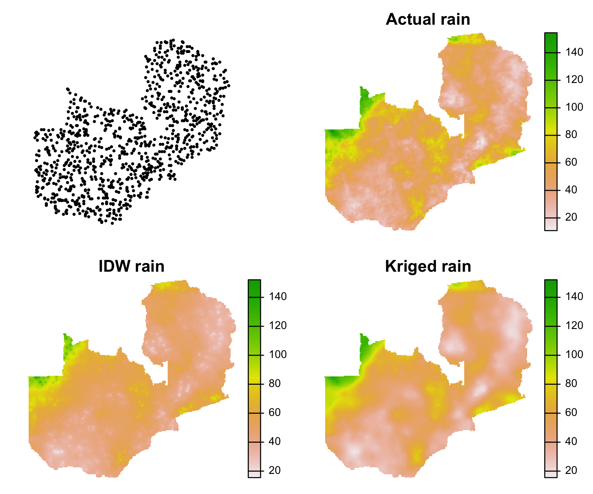

```{r setup, include = FALSE}
knitr::opts_chunk$set(
  collapse = TRUE,
  fig.align = "center",
  comment = "#>"
)
library(knitr)
options(width = 100)
```

# Working with raster data{#working-with-raster-data}

We are now going to start working with the `raster` package. `raster` is a highly developed but older package than `sf`, so it was not written with the tidyverse or `sf` in mind. The upshot of this is that operations involving raster-vector interactions will often require coercion of `sf` to `sp` objects. That is not a major obstacle, however. 

The material in this section assumes that the reader is familiar with standard raster GIS operations and concepts, ranging from projections and transformations to moving windows, raster algebra, terrain analysis, and the like. 

We'll use the following datasets in this section:
```{r datasets, message=FALSE, warning=FALSE}
library(geospaar)
farmers <- system.file("extdata/farmer_spatial.csv", package = "geospaar") %>%    read_csv() 
roads <- system.file("extdata/roads.shp", package = "geospaar") %>% st_read
districts <- system.file("extdata/districts.shp", package = "geospaar") %>% 
  st_read
```


# raster basics{#raster-basics}
## Raster* classes
We'll start off by learning about the basic `raster` classes, which we will do by building our own objects from scratch, starting with a `RasterLayer`

### RasterLayer
```{r rasterlayer, out.width="50%"}
# Chunk 1
# #1
e <- extent(c("xmin" = 27, "xmax" = 29, "ymin" = -16, "ymax" = -14))  
#
# #2
r <- raster(x = e, res = 0.25, crs = crs(districts))
#
# #3            
set.seed(1)  
values(r) <- sample(1:100, size = ncell(r), replace = TRUE)  # 3
# r[] <- sample(1:100, size = ncell(r), replace = TRUE) 
# r <- setValues(x = r, values = sample(1:100, size = ncell(r), replace = TRUE))

par(mar = c(0, 0, 0, 4))
plot(st_geometry(districts), col = "grey", reset = FALSE)
plot(r, add = TRUE)
```

We just used several functions from the `raster` package to create a random `raster` named `r` that has a 1/4 degree resolution and covers an area of 2 X 2 degrees in southern Zambia. This particular raster is a temporary one that lives in memory. 

Let's walk through the labelled code. In # 1, we use `raster`'s `extent` function to define the boundaries of the raster, and then in # 2 use the `raster` function to create a raster from the resulting `r class(e)` object `e`, assigning a CRS using the "crs" argument, which in turn uses `raster`'s `crs` to extract the crs from `districts` (#3). `crs` is similar to `sf::st_crs`, but outputs a different class of object that can't be used by `raster`. The `raster` function can create a raster from many different types of input objects (passed to argument "x"), per `?raster`:

> filename (character), Extent, Raster*, SpatialPixels*, SpatialGrid*, object, 'image', matrix, im, or missing. Supported file types are the 'native' raster package format and those that can be read via rgdal

Line # 2 creates an empty raster `r` with no cell values, so in # 3 we assign some randomly selected values into `r`. Note the method of assignment, using the `values` function; there are two other lines commented out below # 3 that show different ways of doing the same job. 

The plot of `r` over `districts` uses the `plot` method defined for `raster*` objects. Note that it automatically creates a continuous legend, and also note that `raster::plot` can work with `sf::plot`. 

Let's look now at the structure of the object `r`.

```{r rasterstructure}
# Chunk 2
r
class(r)
typeof(r)
slotNames(r)
values(r)
# slot(slot(r, "data"), "values")  # identical to values(r)
res(r)
```

`r` is an S4 object that has fairly different slots compared to `sf` objects. We are not going to go into all of them, but it is useful to know the @file, @data, @extent, and @crs slots. @file itself holds a number of slots, but you should know the @file@name slot, which contains the file name and path for grids that that are read in from disk (it is empty in the case of `r`, since it is held in memory). @data contains many slots also, but the main one of interest is the @data@values slot, which can be accessed with the `values` function directly, or less directly using `slot` (both approaches are shown above). Interestingly, the resolution information is not stored in any of the slots of `r`, but rather calculated from the @extent and @ncols and @nrows slots by the `res` function.  

### RasterStack and RasterBrick

We have just seen how to create a `RasterLayer` and learned a bit about the structure of this kind of object, which is two-dimensional. We are now going to learn about three-dimensional rasters, which come in two flavors: `RasterStack` and `RasterBrick`. Before we proceed, we first need to create some new data. 

```{r stacksandbricks}
# Chunk 3
r2 <- r > 50
r3 <- r
set.seed(1)
values(r3) <- rnorm(n = ncell(r3), mean = 10, sd = 2)
l <- list(r, r2, r3)
```

We used r to create two new rasters, `r2` and `r3`. `r2` was made by using a logical operator (`>`) to find the locations where `r`'s values exceed 50, creating a binary `raster` where 1 indicates the matching pixels, and 0 those that don't.  `r3` was made by using `r` as a template, then overwriting the values with numbers generated randomly from a normal distribution (`rnorm`).  These were then combined into list `l`. 

```{r dummybrick, fig.width=7, fig.height=2.5}
# Chunk 4
s <- stack(l)
# s <- stack(r, r2, r3)  # also works
names(s) <- c("r", "r2", "r3")
s

b <- brick(s)
b

plot(b, nr = 1)
```

In the preceding code blocks, we use `l` to create a `RasterStack` and `RasterBrick`. These are very similar things, but have a few key differences. A `RasterStack` is a series of rasters that have the same extent and resolution, which are "stacked" on top of one another in the order that they are given in the input list. The stacked layers can from any number of files stored in different areas on disk. A `RasterBrick` does the same thing (stacks `RasterLayers` on top of one another), but is more restrictive because the layers, if read off disk, must be contained within a single file. This makes the `RasterBrick` less flexible than the `RasterStack`, but it has the advantage of faster processing times (according to `?brick`). 

Applying `plot` to a stack or brick results in the automatic plotting of each layer into its own sub-window, with coordinates along the plot axes. You can specify numbers of rows and columns in your plotting device using the "nc" and "nr" arguments to `raster::plot`. 

Here's a more informative (by putting it over a map of Zambia) way of plotting the layers in `s` (works for `b` also):

```{r distplot, fig.width=7, fig.height=2.5}
# Chunk 5
par(mfrow = c(1, 3), mar = c(0, 0, 0, 4))
for(i in 1:nlayers(s)) {
  districts %>% st_geometry %>% plot(col = "grey")
  plot(s[[i]], add = TRUE)
}
```

## Reading and writing rasters

So far we have used `Raster*` data that are held in memory. Let's write these out onto disk and then read them back in. Write these to your `notebooks/data` folder (per instructions in [Unit 2 module 1 vignette](unit2-module1.html#set-up). 

```{r rastreadwrite, eval = FALSE}
# Chunk 6
# #1 - write to disk
writeRaster(r, filename = file.path(tempdir(), "r.tif"))
writeRaster(r2, filename = file.path(tempdir(), "r2.tif"))
writeRaster(r3, filename = file.path(tempdir(), "r3.tif"))
writeRaster(b, filename = file.path(tempdir(), "b.tif"))

# #2 - read back in each individual raster and recreate stack
r <- raster(file.path(tempdir(), "r.tif"))
r2 <- raster(file.path(tempdir(), "r2.tif"))
r3 <- raster(file.path(tempdir(), "r3.tif"))
s <- stack(list(r, r2, r3))  # recreate stack

# #3 - programmatic creation of stack
fs <- dir(tempdir(), pattern = "r.*.tif", full.names = TRUE)
l <- lapply(fs, raster)
s <- stack(l)
# s <- fs %>% lapply(raster) %>% stack  # pipeline approach works, too

# #4 - read in brick
b <- raster(file.path(tempdir(), "b.tif"))  # incorrect, reads in just 1st layer
b <- brick(file.path(tempdir(), "b.tif"))  # correct, reads in whole brick
```

In #1 above, we use `writeRaster` to write out each of the three individual rasters to a geotiff, and write `b` to a three-band geotiff. In #2 we use the `raster` function to read back in the individual rasters, and then recreate stack `s` from those. #3 is a more programmatic way of doing #2, using the `dir` function to read the directory, looking for filenames matching a pattern, and returning the full paths to the matching files. These paths are then used in an `lapply` to read the files in with `raster`, recreating list `l`, which is then stacked. The pipeline approach that wraps up these commands in one line is shown commented out below that. 

Blocks #2 and #3 illustrate how `stack` can be used to create a three-dimensional grid from different files, which differ from what you see next in #4, where the "b.tif" is read back into a brick. You will see the comment there that says that the first line in #4 is incorrect, because using `raster` only results in the first `raster` being read in. 

## From vector to raster and back again

Now that you know the major `Raster*` classes, and how to read and write them to disk, let's figure out how to change between raster and vector types. 

### Vector to raster
We have several vector datasets that come with `geospaar` which we can rasterize, starting with the district boundaries.   
```{r rasterize, out.width="50%"}
# Chunk 7
# #1
zamr <- raster(x = extent(districts), crs = crs(districts), res = 0.1)
values(zamr) <- 1:ncell(zamr)
#
# #2
districts <- districts %>% mutate(ID = 1:nrow(.))
distsr <- districts %>% rasterize(x = ., y = zamr, field = "ID") %>% print()

par(mar = c(0, 0, 0, 4))
plot(distsr, axes = FALSE, box = FALSE)
```

In #1, we took an initial step to define a raster (`zamr`) that has the  properties of resolution (0.1 decimal degrees), CRS, and extent that we want our rasterized vector to have. We set the extent of this raster to that of `districts`, using `extent` to get the bounding box coordinates (`extent` retrieves the same parameters as `sf::st_bbox`, but the output is in a different format). 

In #2, we use `rasterize` to (as the name says) rasterize `districts`. The "y" argument is where we feed in `zamr`, the raster object that is the "target" for rasterizing `districts`. The "field" argument supplies the column names of the values that we want rasterized. In this case, we have to first create an "ID" variable for `districts`, in order to give an integer for each district name, as the district names (a character variable) cannot be written to the raster. Notice that we have constructed this as a pipeline (with `print` as the last step, to show the `raster` metadata). The commented out code below it shows how it can be done with more conventional syntax. 

Our plot removes the coordinate-labelled axes and box that otherwise drawn around raster plots by default. 

Next we rasterize the `farmers` dataset, which requires a little more prep to be meaningful: 

```{r rasterize2, out.width="50%"}
# Chunk 8
# #1
zamr2 <- raster(x = extent(districts), crs = crs(districts), res = 0.25)
values(zamr2) <- 1:ncell(zamr2)

# #2
farmersr <- farmers %>% distinct(uuid, .keep_all = TRUE) %>% 
  dplyr::select(x, y) %>% mutate(count = 1) %>% 
  st_as_sf(coords = c("x", "y"), crs = 4326) %>% 
  rasterize(x = ., y = zamr2, field = "count", fun = sum) %>% print()

# #3
par(mar = c(0, 0, 1, 4))
districts %>% st_union %>% 
  plot(col = "grey", border = "grey", 
       main = expression(paste("N farmers per 0.25", degree, " cell")))
plot(farmersr, add = TRUE)
```

In #1, we create a coarser scale (0.25 degree) version of `zamr` (`zamr2`), because we want our final raster how count how many farmers responding to our survey are found in each grid cell. The resolution of 0.1 degrees used for `zamr` is a bit too fine to convey the information nicely in a plot.  

In #2, we do the rasterization as part of a pipeline.  The first two lines prepare the `farmers` dataset. Recall that `farmers` consists of weekly reporting data sent to us by a large number of farmers, which means that we have multiple reports sent by the same farmer (and thus repeated coordinates for each farmer). So we need to reduce `farmers` down to just one row for each individual farmer, so that we have just a single set of coordinates for each. We do that by using `distinct` on the *uuid* variable, using `.keep_all = TRUE` so that we retain the coordinates, and add a new `count` variable (which assigns a value of 1 to each farmer) before converting farmers to `sf` in the third line. We then `rasterize` the *count* variable, using the `sum` function to aggregate the number of farmers per 0.25$\circ$ grid cell.  

The resulting plot (#3) shows that most cells have less than 20 farmers. We add an extra plot decoration step, using `expression` with `paste` to add a superscript degree symbol to our plot title. 

You can also rasterize line features, much as we did for points and polygons, but `rasterize` is exceedingly slow for lines, so we are not doing that here. However, there is code below that shows how one could so that with the `roads` dataset (subset to roads greater than 100 km long):
```{r rasterizeroads, eval = FALSE}
# Chunk 9
roadsr <- roads %>% filter(as.numeric(st_length(.)) > 1000000) %>% 
  mutate(ID = 1:nrow(.)) %>% st_transform(crs = 4326) %>% 
  rasterize(., zamr, field = "ID")
```

### Raster to vector

`raster` gives us functions that allow us to transform rasters to vectors. 

```{r polygonize, eval=FALSE}
# Chunk 10
# #1
dists_fromr <- rasterToPolygons(x = distsr, dissolve = TRUE) %>% st_as_sf

# #2
farmers_fromr <- rasterToPoints(x = farmersr, spatial = TRUE) %>% st_as_sf

par(mar = c(0, 0, 0, 0))
dists_fromr %>% st_geometry %>% plot(col = topo.colors(n = nrow(districts)))
farmers_fromr %>% plot(pch = 20, col = "red", add = TRUE)
```

```{r, echo=FALSE, eval=FALSE}
png(here::here("vignettes/fig/u2m2_polygonize.png"), height = 400, width = 600)
par(mar = c(0, 0, 0, 0))
dists_fromr %>% st_geometry %>% plot(col = topo.colors(n = nrow(districts)))
farmers_fromr %>% plot(pch = 20, col = "red", add = TRUE)
dev.off()
```
```{r, echo = FALSE, out.width="60%"}
knitr::include_graphics("fig/u2m2_polygonize.png")
```


Vectorizing rasters and vectorizing back again means that you end up with lower  resolution vectors if the raster is fairly coarse. You will note that this has occurred here, both in converting the rasterized districts back to polygons (#1) and the rasterized farmer counts back to points (#2). There are several things to note here. First, we used different functions for vectorizing polygons and points. Second, we piped each vectorization output to `st_as_sf`, because the endresult of the `rasterTo*` functions is an `sp` object, so the extra coerces those to `sf`.

## Projections

Up until now, our `Raster*` data have been in geographic coordinates systems. Let's transform these to projected coordinates, using the rasterized districts as an example. 

```{r projections1, fig.width=7, fig.height=2.5}
# Chunk 11
# #1
zamr_alb <- projectRaster(from = zamr, res = 11000, crs = crs(roads), 
                          method = "ngb")

# #2
distsr_alb <- projectRaster(from = distsr, to = zamr_alb, method = "ngb")

par(mfrow = c(1, 2), mar = c(0, 0, 1, 4))
plot(distsr, main = "GCS rasterized districts", axes = FALSE, box = FALSE)
plot(distsr_alb, main = "Albers rasterized districts", axes = FALSE, 
     box = FALSE)
```

In our first step (#1), we apply `projectRaster` to our `zamr` object, transforming it to the Albers projection used by `roads` (the "crs" argument). We define an output "res" of 11,000 m, or 11 km, which is reasonably close to the 1/10th of a degree resolution of `zamr`. We also choose a "method" for calculating the transformed values in the new raster. In this case, since `zamr` has values that are basically an integer index of grid cells, we use the "ngb" (nearest neighbor) option, to avoid the bilinear interpolation that would occur by default (see `?projectRaster`). 

The result, `zamr_alb`, then becomes a reference raster (i.e. the raster defining the parameters) for other rasters that need to be reprojected, which is how we use it when reprojecting `distsr_alb` (# 2). In this case, we pass `zamr_alb` to the "to" argument, and don't need the "res" or "crs" arguments (because the function reads those values from "zamr_alb"). Here we again use the "ngb" method so that we do not change the values of the categorical identifier of each district. You can see how the interpolation choice matters in the plot below, which compares the bilinear to ngb method--see how the bilinear approach changes values along district boundaries?

```{r bilinear_vs_nn, fig.width=7, fig.height=2.5}
# Chunk 12
distsr_alb2 <- projectRaster(from = distsr, to = zamr_alb, method = "bilinear")

par(mfrow = c(1, 2), mar = c(0, 0, 1, 4))
plot(distsr_alb2, main = "Bilinear reprojection", axes = FALSE, box = FALSE)
plot(distsr_alb, main = "Nearest neighbor", axes = FALSE, box = FALSE)
```

A bilinear interpolation is more appropriate for a raster of continuous values, or one where it makes sense to have values averaged during the reprojection process, such as the `farmersr` dataset. 

## Practice
### Questions
1. What is a primary difference between `sf` and `s4` object classes? 

2. What function should you use to read and write a multi-layer raster? 

3. What are the difference between `stack` and `brick`? 

4. What class of object do `raster`'s vectorization functions produce? 

### Code
1. Create a new raster `r4`, using `r3` (above) as a template. Update the values of `r4` using numbers randomly selected from a uniform distribution ranging between 0 and 1. Create another raster `r5` by finding the values greater than 0.5 in r4. Recreate the list `l` with `r`, `r2`, `r3`, `r4`, and `r5`, and then create and plot stack `s2`.

2. Create a new brick `b2` by applying the `brick` function to `s2` and writing it out to disk as `b2.tif`, specifying the path to your `notebooks/data` folder.

3. Following the steps in Chunk 8, recreate `farmersr` by re-rasterizing `farmers` at a 0.2 degree resolution. Plot the result. 

4. Project the new 0.2 degree resolution `farmersr` to an Albers projection with a target resolution of 20 km (20,000 m), calling it `farmersr_alb`. Chunk 11 is your guide, but reproject using a bilinear rather than nearest neighbor interpolation (see `?projectRaster`). Make a two panel plot comparing `farmersr` on the left, plotted over the unioned districts of Zambia in grey, with `farmersr_alb` on the right, plotted over the unioned districts of Zambia in grey (and transformed to Albers). Code in Chunks 8 and 11 can help.   

5. Convert `distsr` to an `sf` polygons object, using `rasterToPolygons` with `dissolve = TRUE`. Plot the result without coercing to `st_geometry`. 

# Pre-processing and local to global statistics 
This unit starts to focus on some of the analyses you can do with raster data, focusing specifically on calculating statistics from rasters. We will start in on that after doing a bit more raster processing and preparation.  

## Pre-processing

We will keep working with the data from the previous sections, adding in a new dataset that loads with `geospaar`, `chirps`. 

```{r chirpsload}
# Chunk 13
data("chirps")
```

Since we are recycling some of the objects from the previous section but you might have cleared your workspace, we have provided hidden code (in the RMarkdown document right below this paragraph), which will allow you to quickly rebuild the necessary objects without hunting back through the previous section.
```{r datareload, eval = FALSE, echo = FALSE, message=FALSE, warning=FALSE}
zamr <- raster(x = extent(districts), crs = crs(districts), res = 0.1)
values(zamr) <- 1:ncell(zamr)

distsr <- system.file("extdata/districts.shp", package = "geospaar") %>% 
  st_read %>% mutate(ID = 1:nrow(.)) %>% 
  rasterize(x = ., y = zamr, field = "ID")

zamr2 <- raster(x = extent(districts), crs = crs(districts), res = 0.25)
farmersr <- system.file("extdata/farmer_spatial.csv", package = "geospaar") %>%   read_csv() %>% distinct(uuid, .keep_all = TRUE) %>% 
  dplyr::select(x, y) %>% mutate(count = 1) %>% 
  st_as_sf(coords = c("x", "y"), crs = 4326) %>% 
  rasterize(x = ., y = zamr2, field = "count", fun = sum)
```

There a few important things we missed doing in the first section. But first let's talk about the new data we just loaded, `chirps`. We have a help file in `geospaar` describing the dataset, which provides daily rainfall values at ~5 km resolution, estimated from satellite observations (of cloud top temperature, I believe) and corrected by weather station observations. CHIRPS is a near global product that extends back to the 1970s (read more about it [here](http://chg.geog.ucsb.edu/data/chirps/)), but we have just subset 28 days of data over Zambia. 

```{r chirpsstruct}
# Chunk 14
chirps
# names(chirps) <- paste0("Y", 16299:16326)
names(chirps)
```

That tells us a bit more about the `chirps` subset that we have, including the names we have given to each of the layers, which correspond to the particular day in the rainfall time series, beginning with Y16299 (Y16 = 2016, 299 = julian day 299, or October 25th) and ending with Y16326 (11/22/2016). Note that `chirps` is actually a `RasterBrick` that we have saved as an .rda file that installs with `geospaar` for convenience. 

Let's have a look at a few of the days in `chirps`: 

```{r chirpsplot, fig.width=7, fig.height=2.5}
# Chunk 15
par(mfrow = c(1, 3), mar = c(0, 0, 1, 4))
for(i in 1:3) {
  leg <- ifelse(i == 3, yes = TRUE, no = FALSE)  # 1
  plot(chirps[[i]], main = names(chirps)[[i]], axes = FALSE, box = FALSE,
       zlim = c(0, max(chirps[1:3])), legend = leg)  # 2
  districts %>% st_union %>% plot(add = TRUE)
}
```

The above plots the first three dates in `chirps` and drapes Zambia's outline over it. These data are obviously not just confined to Zambia, so that sets up our next set of processing steps we need to do.  But let's first examine the plotting code a bit more, which shows us two new things. First, there is the use of `ifelse`, which we use to set up a conditional placement of a legend for iteration 3. When `i == 3`, we tell `plot` to add the legend to the figure panel being plotted by making the variable `leg == TRUE` (otherwise it is `FALSE`). `leg` is passed to the "legend" argument of `plot`. We did this because we wanted just one legend that reflects the range set by the "zlim" argument within `plot`. "zlim" sets a limit on the range of data values that are plotted, which in this case falls between 0 and the maximum rainfall value observed across all three of the plotted dates (`max(chirps[1:3])`). That gives all three plots a common scale, so, given that, why clutter up the plots with three legends showing the same thing?  

The second thing: we haven't discussed this yet, but you will see in the example above that indexing into a `RasterStackBrick` to select a particular layer or layers is achieved through `[[]]`. This applies to both single (`[[x]]`) and multiple/recursive (`[[x:y]]`) indexing, which differs from indexing into a `list`, where you use `[x:y]` for multiple selection. Selection by layer names also works (`chirps[[c("Y16299", "Y16300")]]`; `chirps[["Y16299"]]`)

### Masking

We are interested in the rainfall data within Zambia's borders, so we need to mask out the values of `chirps` that fall outside of Zambia: 

```{r mask1, eval=FALSE}
# Chunk 16
test_m <- mask(x = chirps[[1]], mask = districts)
par(mar = c(0, 0, 0, 4))
plot(test_m, axes = FALSE, box = FALSE)  
```

```{r, echo=FALSE, eval=FALSE}
png(here::here("vignettes/fig/u2m2_chirpsmsk1.png"), height = 400, width = 600)
test_m <- mask(x = chirps[[1]], mask = districts)
par(mar = c(0, 0, 0, 4))
plot(test_m, axes = FALSE, box = FALSE)  
dev.off()
```
```{r, echo = FALSE, out.width="60%"}
knitr::include_graphics("fig/u2m2_chirpsmsk1.png")
```


In the code above, we use the `districts` data to `mask` out the portions of `chirps` (the first day in the time series only) falling outside of Zambia. Let's apply that to the entire `chirps` dataset:

```{r mask2, echo=FALSE, eval=FALSE}
# save this out for lazy load
chirpsz <- mask(x = chirps, mask = districts) * 1
usethis::use_data(chirpsz)
```

```{r mask3, eval=FALSE}
# Chunk 17
chirpsz <- mask(x = chirps, mask = districts)

set.seed(1)
ind <- sample(1:nlayers(chirpsz), size = 3)
plot(chirpsz[[ind]], axes = FALSE, box = FALSE, nr = 1)
```

```{r, fig.width=7, fig.height=2, warning=FALSE, echo=FALSE}
data("chirpsz")
set.seed(1)
ind <- sample(1:nlayers(chirpsz), size = 3)
plot(chirpsz[[ind]], axes = FALSE, box = FALSE, nr = 1)
```

The new `chirpsz` dataset contains all rainfall days with the values outside of Zambia converted to NA. The three plots are randomly selected from the layers of `chirpsz`, as a check to confirm that the masking was applied to all layers. 

### Cropping

If we need to chop a raster down to a smaller region, we can `crop` it. `crop` uses the extent of another object to achieve this. 

```{r crop, fig.width=5, fig.height=2.75, warning = FALSE, message=FALSE}
# Chunk 18
chirps1_dist72 <- crop(x = chirpsz[[1]], y = districts %>% slice(72))

par(mar = c(0, 0, 0, 2))
chirps1_dist72 %>% plot(axes = FALSE, box = FALSE)
districts %>% st_geometry %>% plot(add = TRUE)
districts %>% st_centroid %>% st_coordinates %>% 
  text(x = ., labels = row.names(.))
```

The above uses the extent of district 72 (`dist72`) to crop the first layer of `chirpsz`. Note that in the plotting step we can pipe the cropped raster to `plot`, and also that we can label the district numbers on the plot by extracting their centroid coordinates and passing these into the "x" argument of `text`, and then using the `row.names` of the piped-in data.frame of centroid coordinates as the labels. 

Cropping is important if we want to confine further analyses to a particular sub-region.  However, if we just want to focus our plot to a particular region, then we can simply zoom the plot to that region (without cropping) using an extent object. 

```{r zoom, fig.width=5, fig.height=2.75, warning = FALSE}
# Chunk 19
par(mar = c(0, 0, 0, 2))
plot(chirpsz[[1]], axes = FALSE, box = FALSE, ext = extent(districts[72, ]))
districts %>% st_geometry %>% plot(add = TRUE)
districts %>% st_centroid %>% st_coordinates %>% 
  text(x = ., labels = row.names(.))
```

#### A function-writing detour
As we write this, we find ourselves growing weary of repeatedly writing "axes = FALSE, box = FALSE" into the `plot` function, even with RStudio's handy tab completion. This repeated use of the exact same code is the sort of situation that calls for writing your own function.  

```{r plot_noaxes, eval = FALSE}
# Chunk 20
plot_noaxes <- function(x, axes = FALSE, box = FALSE, mar = c(0, 0, 1, 4), 
                        ...) {
  if(!class(x) %in% c("RasterLayer", "RasterStack", "RasterBrick", "Extent")) {
    stop("This function is intended for rasters only", call. = FALSE)
  }
  par(mar = mar)
  plot(x, axes = axes, box = axes, ...)
}
```

The function above (not run in the block above, because it is written into `geospaar`) takes care of the axes and box problem by setting their default arguments to FALSE. It also sets the default plot margins to the ones we have mostly been using so far (leaving room on the right for the legend and at the top for a title), and it checks whether the object being passed to it belongs to one of the raster classes (failing if it doesn't). Otherwise, it retains all of the other functionality of `raster::plot`, and has the "..." argument, meaning you can pass other eligible arguments to it. 

Let's see how it works:
```{r plot_noaxes_plot, out.width = "50%"}
# Chunk 21
plot_noaxes(chirpsz[[1]])
# chirpsz[[1]] %>% plot_noaxes  # also works in a pipeline
```

That will make plotting easier moving forward.  

### Aggregating/disaggregating

To change to resolution of a raster object, you can use `aggregate` to make a coarser resolution, or disaggregate to decrease the resolution. To make `chirpsz` match the 0.1 resolution of `distsr` (the rasterized districts), we do this:

```{r aggregate}
# Chunk 21
chirpsz1agg <- aggregate(x = chirpsz[[1]], fact = 2, fun = mean)
chirpsz1agg
```

We aggregate the first layer of `chirpsz` by a factor of 2 (`fact = 2`), taking the average of the aggregated pixels (`fun = mean`). Since the starting resolution was 0.05, doubling the pixel size takes it to 0.1. We could have chosen to aggregate all layers, and we could have chosen a different aggregation function (e.g. `sum`, `max`).

To disaggregate, there are two options:
```{r disaggregate}
# Chunk 22
chirpsz1km <- disaggregate(x = chirpsz[[1]], fact = 5)
# chirpsz1km <- disaggregate(x = chirpsz[[1]], fact = 5, method = "bilinear") 
chirpsz1km
```

The first option is the default one, which just breaks apart each pixel into the number of smaller new pixels specified by the factor, assigning each new pixel the same value as its larger parent. Here we specified a factor of 5, leading to an output resolution of 0.01 (~1 km), and thus 25 times the number of pixels as in the original `chirpsz[[1]]` (run `ncell(chirpsz1km) / ncell(chirpsz[[1]])` to see).

The second way (commented out), is to set `method = bilinear`, which interpolates during disaggregation. In this case, `disaggregate` does the job using the `resample` function, which we will see next.  

### Resampling

Resampling is done for many reasons, but one particularly common case is as a final step following aggregation or disaggregation, when it is needed to co-register the resulting grid to another grid. 

```{r agg_extenterror, error=TRUE, out.width="60%"}
# Chunk 23
chirps125 <- aggregate(x = chirpsz[[1]], fact = 5)  # no fun b/c default is mean
s <- stack(chirps125, farmersr)  # fails 

par(mar = c(1, 1, 1, 1))
plot(extent(chirps125), axes = FALSE, col = "blue")
plot(extent(farmersr), add = TRUE, col = "red")
```

After aggregating `chirpsz` layer 1, we try and fail to stack the result with `farmersr`, because (as the plot of extents show, and the warning tells) the two objects have different extents. So, another approach is needed: 

```{r resample, fig.height=2.5, fig.width=7}
# Chunk 24
farmersr_rs <- resample(x = farmersr, y = chirps125) 
s <- stack(chirps125, farmersr_rs)  
names(s) <- c("rain", "farmer_count")
plot_noaxes(s)
```

We resample `farmersr` to `chirps125rs`, since `chirps125rs` has the larger extent. However, there is one more thing we should do before using these data, and that is an adjustment to `farmersr`. Have a look at this:

```{r farmersrnas, out.width="50%"}
plot_noaxes(s$farmer_count >= 0)
plot(st_geometry(st_union(districts)), add = TRUE)
```

This shows that there are no places where there are 0 farmers--because the original data contributing to `farmersr` (the second layer in `s`) was derived from point locations representing the approximate locations of where farmers were interviewed. The data thus have no points where there were 0 farmers interviewed (it would be silly to conduct an interview with no subject), thus everywhere outside of interview locations is assigned a no data value. These are not analyzed in raster operations. So we have to fix this if we want to have the full area of Zambia in the second layer of our stack.

```{r fixnas}
s$farmer_count[is.na(s$farmer_count)] <- 0
s$farmer_count <- mask(s$farmer_count, s$rain)
plot(s$farmer_count)
plot(st_geometry(st_union(districts)), add = TRUE)
```

Now all the areas in `s$farmer_counts` where no interviews were conducted area set to 0. 

We can then stack and perform subsequent analyses that draw on both layers, e.g. finding areas where rainfall exceeded 1 mm and where there was more than 1 farmer:

```{r rasterlogic, out.width="50%", results='hold'}
# Chunk 25
plot_noaxes(s$farmer_count > 1 & s$rain > 1)
# (s$rain > 1 & s$farmer_count > 1) %>% plot_noaxes  # also works
```

## Analyses

Let's move on now to some analyses with raster data. 

### Global statistics

The most basic analyses to perform on rasters is to calculate global summary statistics, i.e. statistics calculated across all cell values:

```{r cellstats}
# Chunk 26
cellStats(x = chirpsz[[1]], stat = "mean")  # for a single date
cellStats(x = chirpsz[[c(5, 7, 14)]], stat = "mean")
summary(chirpsz[[1:3]])
```

`cellStats` lets you calculate specific statistics from the cell values of a lone `RasterLayer`, or for a single, multiple, or all layers in a `RasterStackBrick`. `summary` (a generic) returns the quintile values and counts the number of `NA` or no data cells. Both functions by default remove NA values (which are in many if not most rasters), which is something that usually has to be specified when trying to apply these statistical functions to an ordinary vector, e.g. 

```{r rastervalues}
# Chunk 27
v <- values(chirpsz[[1]])
mean(v) 
mean(v, na.rm = TRUE)
```

`v` is a vector of all of the values from the first layer in the rainfall brick, including its NA values. `mean` returns an `NA` if you don't tell the function to remove `NA` values first. This is important to remember, because both spatial and non-spatial data often have missing values, so you will have to deal with them explicitly in many cases. 

Here's a more programmatic way of using `cellStats`:

```{r cellstats2, fig.width=7, fig.height=4, warning=FALSE, message=FALSE}
# Chunk 28
# #1
rain_stats <- lapply(list(mean, sum, sd, cv), function(x) {
  cellStats(x = chirpsz, stat = x)
})
names(rain_stats) <- c("mean", "sum", "sd", "cv")

# #2
rain_statsf <- do.call(cbind, rain_stats) %>% data.frame %>% 
  mutate(date = as.Date(gsub("Y", "", row.names(.)), "%y%j"))
# do.call(cbind, rain_stats) %>% data.frame
# do.call(cbind, rain_stats) %>% row.names %>% gsub("Y", "", .)
# do.call(cbind, rain_stats) %>% row.names %>% gsub("Y", "", .) %>%
#   as.Date(., "%y%j")

# #3
ps <- lapply(c("mean", "sum", "sd", "cv"), function(x) { # x <- "mean"
  ggplot(rain_statsf %>% dplyr::select(date, all_of(x))) + 
    geom_line(aes_string("date", x)) + xlab("")
})
cowplot::plot_grid(plotlist = ps)
```

In #1 we use `lapply` to calculate 4 different statistics over all dates in `chirpsz`, meaning that we get a time series for each statistic as calculated over all of Zambia. 

In #2, we use a pipeline to bind the summary time series vectors into a `data.frame` (one statistic per column), and then do some gymnastics to convert the row names of the `data.frame`, which are constructed from the layer names of `chirpsz` (which are stored as "Y16XXX", where XXX is the julian day) to a vector of dates. Work through the commented out code below this line, which breaks down the steps used to create the *date* variable.   `gsub` first replaces the "Y" in each name, and then `as.Date` parses the remaining numbers into an actual date. The "%y%j" construction tells `as.Date` which parts of the character string relate to which part of a date: %y = two digit year; %j = julian day; placed next to one another %y%j means these two elements are immediately adjacent to one another in the string. 

We use `lapply` to set up four `ggplot` objects in #3 (note the use of `aes_string` rather than `aes`, which allows the variable names to be passed as string, rather than unquoted), and then use `cowplot::plot_grid` to put those plots in a grid, using the "plotlist" argument to receive the input list of `ggplot`s. 

The results in the plot above are actually quite interesting. The top two panels show when the rainy season gets underway in earnest (just after Nov 8). The bottom two panels show two measures of variability, the standard deviation (SD) and coefficient of variation (CV, i.e. SD / mean). These two measures summarize the spatial variability of rainfall falling across Zambia on each day--SD increases as the amount of rain increases (which is expected--SD is usually positively correlated with the mean), whereas CV declines as rainfall increases, indicating that a progressively larger area of the country receives rainfall as the month progresses, so there is less spatial variability. There is a big spike in CV on November 8, which corresponds to a drop in mean and total rainfall. However, that drop masks the fact that there are a few small patches that received a decent amount of rainfall, thus leading to a high CV (see next plot below).  

```{r cvplot, fig.width=5, fig.height=4}
# Chunk 29
plot_noaxes(chirpsz[[15]], main = paste("CV =", round(rain_stats$cv[15])))
```

Another way to summarize raster data is visually, using a histogram (raster has a generic `hist` function)
```{r histogram, fig.width=7, fig.height=4}
# Chunk 30
par(mfrow = c(1, 3))
hist(chirpsz[[15:17]], col = "blue", xlab = "mm")
```

This variant plots a histogram per layer in the `Raster*` object (but we told it to plot 1 row, 3 columns, instead of the default (2 rows, 2 columns)).  

`freq` is another way to summarize raster values that is similar to `hist` but without the automatic plot.
```{r freq}
# Chunk 31
f <- freq(chirpsz[[1]]) %>% print()
```

Here we apply `freq` to a dataset with continuous values, although this function is probably best reserved for categorical rasters. However, it produces reasonable results here.

### Local statistics

The previous section showed us how to produce statistics calculated across the entire raster. Now we will learn to calculate local, or neighborhood, statistics.

#### Zonal

One way local statistics can be calculated is by defining zones and then calculating statistics within those zones. 

```{r zonal, error=TRUE}
# Chunk 32
# #1
zonemu <- zonal(x = chirpsz, z = distsr, fun = "mean")  # fails b/c extent

# #2
distsr_rs <- resample(x = distsr, y = chirpsz, method = "ngb")  # match extent
zonemu <- zonal(x = chirpsz, z = distsr_rs, fun = "mean")
head(zonemu)[, 1:5]
```

That creates a matrix (truncated here to show the first 6 rows and 5 columns) of mean rainfall within each zone ( district), by date. The first attempt to run `zonal` (#1) failed because of mismatched extents, so we used `resample` in #2 to align extents before re-running `zonal`. 

To map zonal statistics back onto their zones, we need to use another function, `subs`.

```{r, out.width="50%"}
# Chunk 33
distr_rfmu <- zonemu %>% data.frame %>% dplyr::select(1:2) %>% 
  subs(x = distsr_rs, y = ., by = "zone")
plot_noaxes(distr_rfmu)
```

`subs` replaces the values in a raster by other values contained within a `data.frame` (we converted `zonemu` from `matrix` and selected the first two columns, with column containing the zone number) that correspond to a variable that has the same values as those in the raster (in this case the district IDs). `subs` can be slow-ish on big rasters. 

#### Focal
Another way of calculating image statistics is to use a moving window/neighborhood approach. This is done with the `focal` function, which can be used to calculate a large number of different statistics. Here's we'll just show you the mean (also known as a low pass filter), with a few permutations to illustrate the concept. **Disclaimer:** This section assumes that you have applied moving window functions/low pass/high pass filters in your GIS/remote sensing classes so far, and thus are familiar with the calculations. If not, please be sure to ask about this in class.  

```{r focal, out.width="60%"}
# Chunk 34
# #1
wmat <- matrix(1 / 9, nrow = 3, ncol = 3) 
chirps1_focmu1 <- focal(x = chirpsz[[1]], w = wmat) 

# #2
wmat <- matrix(1, nrow = 3, ncol = 3) 
chirps1_focmu2 <- focal(x = chirpsz[[1]], w = wmat, fun = mean) 

# #3
wmat <- matrix(1, nrow = 5, ncol = 5) 
chirps1_focmu3 <- focal(x = chirpsz[[1]], w = wmat, fun = mean) 

# #4 
wmat <- matrix(1, nrow = 5, ncol = 5) 
chirps1_focmu4 <- focal(x = chirpsz[[1]], w = wmat, fun = mean, na.rm = TRUE) 

# #5
wmat <- matrix(1 / 9, nrow = 5, ncol = 5) 
chirps1_focmu5 <- focal(x = chirpsz[[1]], w = wmat, na.rm = TRUE) 

# plots
l <- list(chirps1_focmu1, chirps1_focmu3, chirps1_focmu4, chirps1_focmu5)
titles <- c("3X3 NAs not removed", "5X5 NAs not removed", 
            "5X5 NAs removed properly", "5X5 NAs removed improperly")
par(mfrow = c(2, 2))
for(i in 1:length(l)) {
  plot_noaxes(l[[i]], main = titles[i])
}
```

We have 5 variants above. In #1, we calculate the focal mean the recommended way, which is to: 

- Define a matrix (`wmat`) that contains the weights that `focal` applies to each pixel when making neighborhood calculations.  In this case, the matrix is 3X3, which is the size of our moving window, and the weights are distributed equally across all pixels and sum to 1 (each gets a weight of 1/9)
- `focal` then passes over each image pixel, and multiplies those weights by each pixel value in the neighborhood, and then sums those to get the mean 
- It sums the values because `sum` is the default value of the argument "fun" in the function `focal`, which is why we have not even specified the argument "fun" in Block 1

Note that the way `focal` is coded here does not remove NA pixels, thus any neighborhood having even a single NA pixel is itself turned into NA, i.e. all 9 pixels in the neighborhood. Thus the entire boundary of Zambia is trimmed down accordingly (by 2 pixels). This result is illustrated in the upper left panel of the plot above. 

The code in #2 is a slower way of doing the same thing. It passes the `mean` function to `focal`'s "fun" argument. The weights matrix in this case has 1s throughout; since we are not using the default "fun=sum" in `focal` and `mean` is doing the work, we can't modify (by weighting) the pixel values if we want the correct mean. We also do not remove NA values from the calculation, so the results are identical (and thus not plotted). 

In #3, we use the same approach as in #2, but expand the neighborhood to 5X5. You will see in the upper right plot that Zambia shrank even more (by 4 pixels). 

In #4, we again pass `mean` to `focal`, and have a 5X5 neighborhood, but here we specify `na.rm = TRUE`, which means that focal passes `TRUE` to the "na.rm" argument of `mean`. This results in NAs being removed from each neighborhood before calculating the mean, thus boundary pixels are not lost (note the larger area in the lower left plot above). This is the correct way to remove NAs when calculating focal means.  

The improper way of removing NAs from focal calculations is shown in #5, this time using the faster approach demonstrated in Block 1. The lower right plot shows how pixels near Zambia's border have artificially low values. This result is because the approach relies on a weighted mean, and because NAs are removed, the weights do not sum to 1 and thus the mean is underestimated. 

### Analyzing the Z dimension

If we have a `RasterStackBrick`, we have three dimensions (x, y, z). Often we want to analyze the values in the Z dimension (which may represent time, spectral bands, or unrelated spatial predictors in a model) without altering the x and y dimensions. 

The workhorse for doing this sort of analysis is `calc`, which allows you to apply pretty much any function to the Z-dimension of a `RasterStackBrick`. 

```{r, eval = FALSE, echo=FALSE}
# Prep for Chunk35 (calc) and algebra2
# behavior after R upgrade
rain_zmu <- calc(x = chirpsz, fun = mean) * 1
rain_zsd <- calc(x = chirpsz, fun = sd) * 1
rain_zrng <- calc(x = chirpsz, fun = range) * 1
raintot <- calc(chirpsz, fun = sum) * 1
raincv <- calc(chirpsz, fun = cv) * 1
highrain_highcv <- (raintot > 80 & raincv > 200)
dist54 <- distsr_rs == 54  * 1 # a
distrain <- dist54 * raintot   # b
distrain[dist54 == 0] <- NA  # c
meandistrain <- distrain > cellStats(distrain, mean)
rain_gt_mu <- raintot > cellStats(raintot, mean)

rain_stack <- stack(rain_zmu, rain_zsd, rain_zrng, raintot, raincv,
                     highrain_highcv, distrain, meandistrain, rain_gt_mu)
titles <- c("Totalrain", "RainCV", "Highrain, highCV", "Dist54rain", 
            "Dist54_rain_gt_mean", "Rain_gt_mean")

names(rain_stack) <- c(c("Mean", "StDev", "Min", "Max"), titles)
usethis::use_data(rain_stack, overwrite = TRUE)
```

```{r calc, eval=FALSE}
# Chunk 35
# #1
rain_zmu <- calc(x = chirpsz, fun = mean)
rain_zsd <- calc(x = chirpsz, fun = sd)
rain_zrng <- calc(x = chirpsz, fun = range)

# #2
rain_zstack <- stack(rain_zmu, rain_zsd, rain_zrng)
names(rain_zstack) <- c("Mean", "StDev", "Min", "Max")

plot_noaxes(rain_zstack)
```

```{r, echo=FALSE, out.width="60%"}
# plotting chunk
data("rain_stack")
plot_noaxes(rain_stack[[1:4]])
```

In #1 we pass `mean`, `sd`, and `range` to "fun" in `calc`. Note that `range` always returns two values, so `calc` conveniently returns a two-layer brick that contains the minimum in the first layer and the maximum in the second. 

In #2 we then stack the three outputs, and rename the layers something meaningful so that `plot_noaxes` can plot them all at once. 

You will see from the resulting plot that "Min" has only one value, 0, which makes sense for a rainfall time series (every pixel is likely to have at least one day of no rainfall over the course of a month).

## Practice
### Questions
1. How do `cellStats`, `focal`, and `zonal` differ from one another? 

2. How do you `disaggregate` a raster with interpolation? 

3. How do you run `calc` on images with different resolutions or extents? 

### Code
1. Run `as.Date("10-11-2017", "%m-%d-%Y")`, `as.Date("10-11-17", "%m-%d-%y")`,
`as.Date("101117", "%m%d%y")`, and `as.Date("10112017", "%m%d%Y")`
 to get a better sense of date vectors work. Also try out `lubridate::mdy("10-11-2017")` and `lubridate::as_date("20171011")`.

2. Convert `farmers` to a 0.1 degree raster (`farmersr2`) that contains the count of farmers per grid cell.  Use `distsr` as the target raster so that the extents align. 

3. Use `zonal` on `farmersr2` to calculate the total number of farmers per district (use `distsr` to provide the zones), and then map them back onto the districts/zones using `subs`. Plot the result. 

4. Use `focal` to calculate for `chirpsz[[20]]` the i) standard deviation within a 3X3 and 5X5 window, and ii) the maximum value in each 3X3 and 5X5 neighborhood. Do not remove NAs. Combine the results in a `stack`, as above, and then plot them  using `plot_noaxes`. 

5. Crop `chirpsz[[1]]` using the extent of `districts[57, ]`, and disaggregate it to 0.01 resolution using both the default and bilinear methods. Plot the results side by side using `plot_noaxes`.

6. Use `calc` with `chirpsz` to calculate the total rainfall in the time series, the coefficient of variation, and the median. Stack the results and plot with meaningful titles using `plot_noaxes` (hint: name the layers of the `stack`), outputting plots on 1 row with 3 columns. 

# Algebra, categorizing, and sampling

Let's move on and look at some additional raster-based analyses. This section, like the previous, will depend on objects created in earlier sections. The code to recreate those can be found hidden in the RMarkdown below

```{r, eval = FALSE, echo = FALSE}
data("chirps")
districts <- system.file("extdata/districts.shp", package = "geospaar") %>% 
  st_read %>% mutate(ID = 1:nrow(.))
chirpsz <- mask(x = chirps, mask = districts)

zamr <- raster(x = extent(districts), crs = crs(districts), res = 0.1)
values(zamr) <- 1:ncell(zamr)
zamr2 <- raster(x = extent(districts), crs = crs(districts), res = 0.25)
values(zamr2) <- 1:ncell(zamr2)

distsr <- rasterize(x = districts, y = zamr, field = "ID")
distsr_rs <- resample(x = distsr, y = chirpsz, method = "ngb")  # match extent

farmers <- system.file("extdata/farmer_spatial.csv", package = "geospaar") %>%   read_csv
farmersr <- farmers %>% distinct(uuid, .keep_all = TRUE) %>% 
  dplyr::select(x, y) %>% mutate(count = 1) %>% 
  st_as_sf(coords = c("x", "y"), crs = 4326) %>% 
  rasterize(x = ., y = zamr2, field = "count", fun = sum) %>% print()
```

## Algebra and selection
We can do any number of raster calculations using basic mathematical expressions. Here are some very basic ones:

```{r algebra1, out.width="60%"}
# Chunk 36
r1 <- chirpsz[[1]] / chirpsz[[2]]
r2 <- chirpsz[[1]] + chirpsz[[2]]
r3 <- chirpsz[[1]] - chirpsz[[2]]
r4 <- chirpsz[[1]] * chirpsz[[2]]

s <- stack(r1, r2, r3, r4)
names(s) <- c("divide", "sum", "subtract", "multiply")
plot_noaxes(s)
```

As you have seen in the previous section, we can also perform logical operations on rasters, selecting cells that meet certain criteria. 

```{r algebra2, eval=FALSE}
# Chunk 37
# #1
raintot <- calc(chirpsz, fun = sum)
raincv <- calc(chirpsz, fun = cv)

# #2
highrain_highcv <- raintot > 80 & raincv > 200  

# #3
dist54 <- distsr_rs == 54  # a
distrain <- dist54 * raintot  # b
distrain[dist54 == 0] <- NA  # c
# distrain <- mask(raintot, dist54, maskvalue = 0)  # d

# #4
meandistrain <- distrain > cellStats(distrain, mean)

# #5
rain_gt_mu <- raintot > cellStats(raintot, mean)

s <- stack(raintot, raincv, highrain_highcv, distrain, meandistrain, rain_gt_mu)
titles <- c("Total rain", "Rain CV", "High rain, high CV", "Dist 54 rain", 
            "Dist 54 rain > mean", "Rain > mean")
plot_noaxes(s, main = titles)  
```
```{r, echo=FALSE, fig.width = 6, fig.height=4}
data("rain_stack")
titles <- c("Total rain", "Rain CV", "High rain, high CV", "Dist 54 rain", 
            "Dist 54 rain > mean", "Rain > mean")
plot_noaxes(rain_stack[[-c(1:4)]], main = titles)  
```


In #1, we use `calc` to sum rainfall and calculate its CV across the 28 days in `chirpsz`. Then, in #2, we identify which cells have both high rainfall (>80 mm) and high rainfall variability (CV > 200) during the 28 day time period. 

In #3, we examine total rainfall within district 54. This is done in several steps. First (line a), we create a mask, where cells in district 54 are 1, and everywhere else 0. Next (line b), we multiply this mask by `raintot`, thereby masking out rainfall values outside the district. At this point, if we calculated any subsequent statistics on district 54 rainfall, they would be invalid because there would be a lot of 0 values for rainfall outside of district 54 that would be included in the calculation (run `plot(distrain)` right after line b to see). This would result in a very low mean rainfall, for example. Therefore, in line c, we identify the indices of the cells in `dist54` that have 0s (`dist54 == 0`), and use those indices to set all the values in `distrain` to NA. Lines b and c show the raster algebraic way of doing what could also be achieved with `mask`, shown in the commented out line d.  

Having made `distrain` safe for calculating statistics, in #4 we then identify the areas in district 54 that received more rainfall than the district mean rainfall during the 28 days. In #5, we do the same thing, but for all of Zambia.  

## Categorizing
Sometimes you will want to create a categorical raster from a continuous one. We will look at two different ways of doing that. 

Method 1:
```{r, echo=FALSE}
raintot <- rain_stack[[5]]
```

```{r cut, out.width="50%"}
# Chunk 38
qtiles <- quantile(raintot, probs = seq(0, 1, 1 / 3))
raintotcut <- cut(x = raintot, breaks = qtiles, include.lowest = TRUE)

cols <- c("tan", "yellow3", "green4")
plot_noaxes(raintotcut, legend = FALSE, main = "Total Rainfall", col = cols, 
            mar = c(0, 0, 1, 0))
legend(x = "bottomright", legend = c("High", "Intermediate", "Low"), 
       pch = 15, pt.cex = 3, col = rev(cols), bty = "n")
```

Using the `cut`-based approach is perhaps the easiest way of categorizing a continuous raster. `cut` is a raster-based implementation of base `R` function designed for converting numeric vectors to factors. We first define the tercile values (i.e 33.3rd, 66.6th, and 100th percentiles) for `raintot`, and pass those into the "breaks" argument of `cut`. We pass the argument `include.lowest = TRUE` because we want to include all values that are greater than or equal to the lowest value in each category. Our plot of the results has a customized legend, which we chose because we have a categorical raster and thus wanted a categorical, rather than continuous (the default for `raster::plot`, and thus `plot_noaxes`), legend.

Method 2 is somewhat more involved:
```{r reclassify, out.width = "50%"}
# Chunk 39
rclmat <- cbind(qtiles[1:3], qtiles[2:4], 1:3)
rclmat
raintotrcl <- reclassify(x = raintot, rcl = rclmat, include.lowest = TRUE)

plot_noaxes(raintotrcl, legend = FALSE, main = "Total Rainfall", col = cols, 
            mar = c(0, 0, 1, 0))
legend(x = "bottomright", legend = c("High", "Intermediate", "Low"), 
       pch = 15, pt.cex = 3, col = rev(cols), bty = "n")
```

In the first step, we reuse the previously calculated terciles to create a reclassification matrix (`rclmat`). This matrix contains the lower bound of the range of the category in column 1, the upper bound in column 2, and then the new class value that will be assigned in column 3. There are three rows, one per category. This matrix is passed to the `rcl` argument of `reclassify`, in which we also specify the same `include.lowest = TRUE` argument. 

This approach requires slightly more work, but there are cases where you might need to use it, e.g. to reclassify another categorical raster using non-sequential categories. 

## Sampling

Many analyses use data sampled from a raster. For example, you might have coordinates for places where you collected field data, and need to collect rasterized environmental data for those locations. The `extract` function is great for this.

### Extract

From the description of `extract`, the function's purpose is to:

> Extract values from a Raster* object at the locations of other spatial data. You can use coordinates (points), lines, polygons or an Extent (rectangle) object. You can also use cell numbers to extract values.

Here we will use points and polygons:

```{r extract, out.width="50%"}
# Chunk 40
# #1
farmers_env <- farmers %>% distinct(uuid, .keep_all = TRUE) %>% 
  dplyr::select(uuid, x, y) %>% st_as_sf(coords = c("x", "y")) %>% 
  mutate(rain = raster::extract(x = raintot, y = .)) %>%
  mutate(district = raster::extract(x = distsr_rs, y = .)) %>% print

# #2
farmdistid <- farmers_env %>% drop_na %>% distinct(district) %>% pull
distrain <- districts %>% filter(ID %in% farmdistid) %>% 
  raster::extract(x = raintot, y = ., fun = mean) %>% print

# #3
rain_stats <- bind_rows(
  farmers_env %>% drop_na %>% dplyr::select(rain) %>% mutate(dat = "Farmers"), 
  tibble(rain = distrain, dat = "Districts")
)

# #4
bp_theme <- theme(legend.title = element_blank(), axis.text.x = element_blank(),
                  axis.ticks.x = element_blank(), 
                  panel.grid.major.x = element_blank(), 
                  panel.grid.minor.x = element_blank(), 
                  panel.background = element_rect(fill = "grey95"))
rain_stats %>% ggplot() +
  geom_boxplot(mapping = aes(y = rain, fill = dat), position = "dodge2") +
  scale_fill_manual(values = c("steelblue", "cadetblue")) + 
  ggtitle("Rainfall distributions") + xlab(NULL) + ylab("mm") + bp_theme
```

In #1, we use a pipeline to create a new `farmer_env` `sf` (first selecting just the unique *uuid* and corresponding *x* and *y*), and we pass that to the "y" argument of `raster::extract`. The first `extract` is done from the `raintot` raster, the second from the `dists_rs` raster. Both extractions are wrapped in `mutate`, in order to create two new variables for `farmers_env`. Note that we have to specify `raster::extract` because it is masked by `dplyr::extract`, as `geospaar` loads `tidyverse` after `raster` (remember section 1.2.2 in Unit 1 Module 2). The resulting `sf` contains rainfall sum (over the 28 days) and district numbers for each farmer's location. 

In #2, we first pull out of `farmer_env` a vector of the distinct district IDs. Because `farmers` contains a few bad coordinates that fall outside of Zambia, and there had `NA` values, we inserted `drop_na` into the pipeline to get rid of those. We then used `farmdistid` to filter out the districts the farmers live in from `districts`, and used the result to extract from `raintot` the mean rainfall from the pixels of `raintot` falling within each selected district. When using `raster::extract` with polygons, if you don't pass a value to the "fun" argument, a list is returned, in which each element contains the extracted pixel values corresponding to a particular polyon. If you give "fun" an argument (e.g. `mean`, as in this case), you get back a vector or matrix (if your function gives back more than one value, e.g. `range`) containing the resulting statistic(s) for each polygon. 

In #3, we do some gymnastics in preparation for setting up `ggplot` boxplots (#4) that compare the distributions of rainfall values. That is, we set up a tibble that binds by row the extracted district and farmer rainfall values, which allows `ggplot` to automatically create side-by-side boxplots using `fill = dat`. We create some theme options for `ggplot` ahead of that `bp_theme`, so that we can recycle these in the next example. The plot shows that the rainfall data selected at farmer locations provide a biased estimate of district mean rainfall.  

### Random sampling
Alternatively, you might want to draw a random sample directly from a raster, without all the trials and tribulations of field work (field logistics often make it hard to capture truly randomized, and thus representative, samples). `raster` has functions for this, and we will build off the previous example to demonstrate them. 

```{r samplestrat, out.width="50%"}
# Chunk 41
# #1
farmdistsr <- distsr_rs %in% farmdistid
distsrfarm <- mask(x = distsr_rs, mask = farmdistsr, maskvalue = 0)
# plot_noaxes(distsrfarm)

# #2
set.seed(1)
distsamp <- sampleRandom(x = distsrfarm, size = nrow(farmers_env), cells = TRUE)
randrain <- raintot[distsamp[, 1]]

# #3
set.seed(1)
distsamp_str <- sampleStratified(x = distsrfarm, 
                                 size = nrow(farmers_env) / length(farmdistid),                                  cells = TRUE)
stratrandrain <- raintot[distsamp_str[, 1]]

# #4
rand_rain_stats <- bind_rows(
  tibble(rain = distrain, dat = "Districts"),
  tibble(rain = randrain, dat = "Simple"),
  tibble(rain = stratrandrain, dat = "Stratified")
) %>% drop_na

rand_rain_stats %>% ggplot() +
  geom_boxplot(mapping = aes(y = rain, fill = dat), position = "dodge2") +
  scale_fill_manual(values = c("lightblue", "steelblue", "cadetblue")) + 
  ggtitle("Rainfall distributions") + xlab(NULL) + ylab("mm") + bp_theme
```

In this case, we first (#1) mask the raster to exclude districts having no farmers (you can run the commented-out code to see the map). #2 uses the function `raster::sampleRandom` to take a straight random sample from the farmer-hosting districts. We set the "size" argument so that it is equal to `nrow(farmers_env)`, i.e. our sample is equal to the number of farmers in `farmers_env` (793). We use the argument `cells = TRUE` to select the cell numbers, which is what we are really interested in (if we didn't, we would just get the values of those cells, i.e. the district IDs). We then use those cell ids (the first column of `distsamp`) to extract the rainfall values from `raintot`. We can use the cell IDs selected from one raster to extract values from another only if the two rasters have an identical number of cells and extents, as is the case here. You can confirm that this is the case for `distsrfarm` and `raintot` by running `identical(ncell(raintot), ncell(distsrfarm))` and `identical(extent(raintot), extent(distsrfarm))`.

In #3 we apply the more correct way of collecting a representative sample from units of varying size, which is to stratify the sample by districts.  To do this, we uses the function `sampleStratified`, which uses the district IDs in `distsrfarm` to create the strata, and the "size" argument specifies the size of the sample that should be drawn from __each stratum__ (i.e. district). To estimate that size, we divide `nrow(farmers_env)` by the number of farmer-hosting districts, so that we end up with a total sample equal to `r nrow(farmers_env)`. Note that this function merely ensures that the same sample size is drawn from each stratum (district), and does not make the sample size in each stratum proportional to its area. 

In #4, we redo the boxplots, showing the results from the two approaches to random sampling alongside the distribution of district mean rainfall values (extracted in Chunk 40). Both approaches produce statistics that are quite representative of the district rainfall. The stratified approach is closest, as the median aligns more closely with that of `distrain`. 

## Practice
### Questions
1. What are two ways of converting a continuous to categorical raster? 

2. What are two methods of sampling from a `raster`? Are the others (a look in `raster`s help files will be informative)?

### Code
1. Use `calc` to find the standard deviation of rainfall for each cell in `chirpsz`. 

2. Use raster algebra to find the country-wide average standard deviation, and then identify which areas of Zambia have values **less** than that. 

3. Create a new categorical raster from `raintot`, using the quantile to define the new category boundaries together with `cut`. Use `plot_noaxes` to show the result. 

4. Create a new sub-sample of rasterized districts, `randdistsr`, totaling 15 districts randomly selected using `dplyr::sample_n` (use a seed of 11) from `districts`. Use `raintot` as the rasterization target. Mask `raintot` so that it is confined to those districts (with NAs values replacing the values in the other districts). Call it `newrandrain`. 

5. Use `sampleRandom` with a size of 300 to get a random sample of rainfall values from `newrandrain` (use a seed of 1), saving the result as `randsamp`. Use `sampleStratified` with `cell = TRUE` to get a sample of 300 / 15 samples from `randdistsr`. Use the cell IDs to extract the rainfall values from `newrandrain`, saving the output vector as `stratsamp`. Create a tibble that binds these two vectors by row (as in Chunk 41 #4), and then plot the two results as side-by-side boxplots with `ggplot`. 

# Terrain analysis, interpolation, and modeling

We'll round out this module with some additional raster-based analyses and a bit of modeling. Use the hidden code to create the objects you need from prior sections. 

```{r, eval = FALSE, echo = FALSE}
# Chunk 42
data("chirps")
districts <- system.file("extdata/districts.shp", package = "geospaar") %>% 
  st_read %>% mutate(ID = 1:nrow(.))
chirpsz <- mask(x = chirps, mask = districts)

roads <- system.file("extdata/roads.shp", package = "geospaar") %>% st_read

zamr <- raster(x = extent(districts), crs = crs(districts), res = 0.1)
values(zamr) <- 1:ncell(zamr)
zamr2 <- raster(x = extent(districts), crs = crs(districts), res = 0.25)
values(zamr2) <- 1:ncell(zamr2)

distsr <- rasterize(x = districts, y = zamr, field = "ID")
distsr_rs <- resample(x = distsr, y = chirpsz, method = "ngb")  # match extent

farmers <- system.file("extdata/farmer_spatial.csv", package = "geospaar") %>%    read_csv
farmers_env <- farmers %>% distinct(uuid, .keep_all = TRUE) %>% 
  dplyr::select(uuid, x, y) %>% st_as_sf(coords = c("x", "y"))

farmersr <- farmers_env %>% mutate(count = 1) %>% 
  st_as_sf(coords = c("x", "y"), crs = 4326) %>% 
  rasterize(x = ., y = zamr2, field = "count", fun = sum) %>% print()

raintot <- calc(chirpsz, sum)
```

## Terrain analysis

We'll start off this section doing some terrain analysis, with a few little asides on the way to illustrate pixel area and some more plotting skills. 

First we need a digital elevation model. `raster` has a very nice function that allows us to download several different gridded geographic datasets, which includes DEMs:

```{r dem, eval=FALSE}
# Chunk 42
dem <- getData(name = "alt", country = "ZMB", path = tempdir())
plot_noaxes(dem, main = "Zambia DEM", legend.args = list(text = "meters"))
```

```{r, eval = FALSE, echo = FALSE}
dem <- dem * 1
save(dem, file = "data/dem.rda")

zamr_alb <- projectRaster(from = zamr, res = 1000, crs = crs(roads), 
                          method = "ngb")
demalb <- projectRaster(from = dem, to = zamr_alb)  # default is bilinear
# #2
# slope <- terrain(x = demalb, opt = 'slope', unit = 'degrees')  # slope
# aspect <- terrain(x = demalb, opt = 'aspect', unit = 'degrees')  # aspect
# flowdir <- terrain(x = demalb, opt = 'flowdir')  # flow direction
# tri <- terrain(x = demalb, opt = 'tri')  # topographic roughness index
vars <- c("slope", "aspect", "flowdir", "tri")
terrvars <- stack(lapply(1:length(vars), function(x) {
  tv <- terrain(x = demalb, opt = vars[x], unit = "degrees")
}))
names(terrvars) <- vars

writeRaster(demalb, file = here::here("inst/extdata/demalb.tif"))
brick(terrvars, file = here::here("inst/extdata/terrvars.tif"))
```

```{r, echo = FALSE, out.width="70%"}
data("dem")
plot_noaxes(dem, main = "Zambia DEM", legend.args = list(text = "meters"))
```

The help file for `getData` tells us the following datasets are available:

> Data set name, currently supported are 'GADM', 'countries', 'SRTM', 'alt', and 'worldclim'. See Details for more info

You can explore those further at your leisure. In our example, we choose the aggregated version of the SRTM DEM, and specify that we want it for Zambia. 

### Pixel resolution/area 

The DEM we downloaded is in decimal degrees with a resolution of `r raster::res(dem)[1]`&deg;, which means the area of each pixel varies through Zambia. To illustrate that, we use a nice function that `raster` provides, which lets you calculate the pixel areas, even when the raster is in geographic coordinates:

```{r demarea, out.width="60%"}
# Chunk 43
demarea <- area(dem)
plot_noaxes(demarea, legend.args = list(text = expression("km"^2)), 
            main = paste("DEM pixel area, mean = ", 
                         round(cellStats(demarea, mean), 3)))
districts %>% st_geometry %>% plot(add = TRUE)
```

The result is in km$^2$, and you can see that the area of each pixel falls as the distance from the equator increases (this is why we use equal area projections to calculate area). 

### An aside on plot annotation
Although we covered graphics in the previous unit, let's look a bit more at plot adornments for a second. Notice in the last two plots how we use the "legend.args" argument in `plot_noaxes` to put a title over the legend bar. And in the last one, we use `expression` to turn km2 into km$^2$. `expression` and several other functions can be used to annotate plots with more complex mathematical expressions:

```{r fancylabels1, fig.width=5, fig.height=5}
# Chunk 44
set.seed(1)
a <- sapply(20:100, function(x) rnorm(n = 100, mean = x, sd = x / 10))
mu <- colMeans(a)  # means
mumu <- round(mean(mu), 2) # mean of mean
sdev <- apply(a, 2, sd)  # stdevs
musd <- round(mean(sdev), 2)  # mean of stdevs
plot(mu, sdev, xlab = expression(mu), ylab = expression(sigma), pch = 20, 
     main = expression(paste("Mean (", mu, ") versus StDev (", sigma, ")")))
text(x = 20, y = 10, pos = 4,
     label = substitute(paste("Overall ", mu, "=", a), list(a = mumu)))
text(x = 20, y = 9, pos = 4,
     label = substitute(paste("Overall ", sigma, "=", a), list(a = musd)))
```

```{r fancylabels2, echo=FALSE, eval=FALSE}
# ggplot once we work out the annotations: currently switched off
lab1 <- bquote(sigma == .(mumu))
ggplot(tibble(mu, sdev)) + geom_point(aes(mu, sdev)) + 
  ggtitle(expression(paste("Mean (", mu, ") versus StDev (", sigma, ")"))) + 
  # geom_text(aes(x = 20, y = 10, 
  #               label = paste("Overall", "m", "=", mumu)), parse = TRUE)
  annotate("text", x = 20, y = 10,
           label = bquote(sigma == .(mumu)), parse = TRUE)
           label = substitute(paste("Overall", mu, "=", a), list(a = mumu)))
```


The example above shows how more advanced plot annotations can be done. It also shows that the code can get somewhat complicated; it always takes a ton of time and a number of internet searches to figure out how to do this. We won't explain this in detail here, but the code provides a template that you can hack at if you want to get fancy with labelling your plots. 

### Basic terrain variables

`raster::terrain` allows us to calculate five different terrain variables, four of which we show below: 
```{r, eval=FALSE, echo=FALSE}
terrvars <- brick(system.file("extdata", "terrvars.tif", package = "geospaar"))
vars <- c("slope", "aspect", "flowdir", "tri")
names(terrvars) <- vars

png(here::here("vignettes/fig/u2m2_terrainvars.png"), height = 400, 
    width = 600)
plot_noaxes(terrvars)
dev.off()
```
```{r terrain, eval=FALSE}
# Chunk 45
# #1
zamr <- raster(x = extent(districts), crs = crs(districts), res = res(dem))
values(zamr) <- 1:ncell(zamr)
zamr_alb <- projectRaster(from = zamr, res = 1000, crs = crs(roads), 
                          method = "ngb")
demalb <- projectRaster(from = dem, to = zamr_alb)  # default is bilinear

# #2
# slope <- terrain(x = demalb, opt = 'slope', unit = 'degrees')  # slope
# aspect <- terrain(x = demalb, opt = 'aspect', unit = 'degrees')  # aspect
# flowdir <- terrain(x = demalb, opt = 'flowdir')  # flow direction
# tri <- terrain(x = demalb, opt = 'tri')  # topographic roughness index
vars <- c("slope", "aspect", "flowdir", "tri")
terrvars <- stack(lapply(1:length(vars), function(x) {
  tv <- terrain(x = demalb, opt = vars[x], unit = "degrees")
}))
names(terrvars) <- vars

plot_noaxes(terrvars)
```
```{r, echo=FALSE, out.width="60%"}

```

We need the DEM in a projected coordinate system for `terrain` to work, per the help file: 

> Compute slope, aspect and other terrain characteristics from a raster with elevation data. The elevation data should be in map units (typically meter) for projected (planar) raster data. They should be in meters when the coordinate reference system (CRS) is longitude/latitude.

So we create (#1) a 1 km projected version of the DEM, allowing the default bilinear interpolation to do its work during reprojection. 

In #2 we calculate slope, aspect, flow direction, and the topographic ruggedness index. The commented out code illustrates how each of these variables can be calculated separately, although we prefer to do the job using `lapply`. Note that in the `lapply` we pass the "unit" argument into the calculation of all four variables, even though it only is used for slope and aspect; this is fine, because `terrain` simply ignores the argument value in calculating flow direction or TRI. 

## Interpolation

Interpolating between point values is a fairly common GIS analysis. The `interpolate` function of raster allows you to do this using a number of different types of models, such as kriging and inverse distance weighting. We are going to demonstrate both approaches, drawing on functions provided by the `gstat` package (please install it):

```{r interpolate, eval=FALSE}
# Chunk 46
# install.packages("gstat")
library(gstat)

# #1
raintotalb <- projectRaster(from = raintot, res = 5000, crs = crs(roads))
names(raintotalb) <- "rain"
r <- raster(extent(raintotalb), res = res(raintotalb), crs = crs(raintotalb), 
            vals = 1)

# #2
set.seed(1)
rainsamp <- sampleRandom(raintotalb, size = 1000, xy = TRUE)
rainsamp <- as.data.frame(rainsamp)
# head(rainsamp)

# #3
invdist <- gstat(id = "rain", formula = rain ~ 1, locations = ~x + y, 
                 data = rainsamp)
invdistr <- interpolate(object = r, model = invdist)
invdistrmsk <- mask(x = invdistr, mask = raintotalb)

# #4
coordinates(rainsamp) <- ~x + y  # a
crs(rainsamp) <- crs(roads)  # b
v <- variogram(object = rain ~ 1, data = rainsamp)  # c
m <- fit.variogram(object = v, model = vgm("Sph"))  # d
m
plot(variogramLine(m, max(v[, 2])), type = "l")  # e
points(v[, 2:3], pch = 20)  # f
legend("bottomright", legend = c("variogram fit", "variogram"), 
       lty = c(1, NA), pch = c(NA, 20), bty = "n") # g
```
```{r, echo=FALSE, eval=FALSE}
invdist <- gstat(id = "rain", formula = rain ~ 1, locations = ~x + y, 
                 data = rainsamp)
invdistr <- interpolate(object = r, model = invdist)
invdistrmsk <- mask(x = invdistr, mask = raintotalb)

# #4
coordinates(rainsamp) <- ~x + y  # a
crs(rainsamp) <- crs(roads)  # b
v <- variogram(object = rain ~ 1, data = rainsamp)  # c
m <- fit.variogram(object = v, model = vgm("Sph"))  # d
m
png("fig/u2m2-1.png", height = 4, width = 4, units = "in", res = 300)
plot(variogramLine(m, max(v[, 2])), type = "l")  # e
points(v[, 2:3], pch = 20)  # f
legend("bottomright", legend = c("variogram fit", "variogram"), 
       lty = c(1, NA), pch = c(NA, 20), bty = "n") # g
dev.off()
```
```{r, echo = FALSE, out.width="60%"}
knitr::include_graphics("fig/u2m2-1.png")
```
```{r, eval = FALSE}
# #5
ordkrig <- gstat(id = "rain", formula = rain ~ 1, data = rainsamp, model= m)
ordkrigr <- interpolate(object = r, model = ordkrig)
ordkrigrmsk <- mask(x = ordkrigr, mask = raintotalb)

raininterp <- stack(raintotalb, invdistrmsk, ordkrigrmsk)
titles <- c("Actual rain", "IDW rain", "Kriged rain")
par(mfrow = c(2, 2), mar = c(0, 0, 1, 0))
plot(rainsamp, pch = 20, cex = 0.5)
for(i in 1:3) plot_noaxes(raininterp[[i]], main = titles[i])
```

```{r, eval = FALSE, echo = FALSE}
png("fig/u2m2-2.png", height = 400, width = 600)
raininterp <- stack(raintotalb, invdistrmsk, ordkrigrmsk)
names(raininterp) <- c("Actual rain", "IDW rain", "Kriged rain")
par(mfrow = c(2, 2), mar = c(0, 0, 1, 0))
plot(rainsamp, pch = 20, cex = 0.5)
for(i in 1:3) plot_noaxes(raininterp[[i]], main = titles[i])
dev.off()
```

```{r, echo = FALSE, out.width="60%"}

```

This example is reasonably complex, both conceptually and with respect to code. We will refer you to other, non-R literature to explain how  [interpolation](http://gisgeography.com/inverse-distance-weighting-idw-interpolation/) and [kriging](http://gisgeography.com/kriging-interpolation-prediction/) work, and confine our explanations to the code. 

Block #1 creates an Albers projected version of `raintot` (which is roughly 5 km on a side), and sets up a dummy raster (`r`) that will be our interpolation target, i.e. it provides the parameters we want our prediction surface to have. #2 then draws a random sample from across the reprojected rainfall raster, providing a set of point observations of rainfall. #3 runs the code for an inverse distance weighted (IDW) interpolation (each cell between the sample points is given a new value that is the weighted mean of the rainfall values collected at the points nearest to it; the weight is determined by the distance to each point). The interpolation model is set up by the `gstat` function, using the coordinates x and y as the locations. `raster::interpolate` takes the model and applies it to `r`, making the new `invdistr` raster, which we then mask to the outline of Zambia (`invdistrmsk`). 

In #4, we provide the initial steps for implementing ordinary kriging. In line a and b, we have to first convert `rainsamp` from a `data.frame` into a `SpatialPointsDataFrame`. Line c calculates the variogram, which measures the spatial autocorrelation between rainfall values--this requires a spatial object, hence the need for lines a and b. Line d fits a spherical variogram model. Lines e-g plot the variogram (changes in semivariances with distance) and the spherical model we fit to estimate that semivariance.  

Block #5 takes the fitted variogram model (`m`) and uses that to create the rainfall surface. The steps in this block are basically the same as in #3, except that we use the kriging model. 

```{r, echo=FALSE}
# rebuild raintotalb
raintotalb <- projectRaster(from = raintot, res = 5000, crs = crs(roads))
names(raintotalb) <- "rain"
```

## Distance
If you want to calculate how far any point on a grid is from a particular point or points, `raster` offers a few functions for finding euclidean distances:

```{r distance, fig.width=6.5, fig.height=4}
# Chunk 47
# #1
set.seed(1)
randsamp <- sampleRandom(raintotalb, size = 10, xy = TRUE) %>% as_tibble %>%   st_as_sf(coords = c("x", "y"))

# #2
ptdistr <- distanceFromPoints(object = raintotalb, xy = as_Spatial(randsamp))
ptdistrmsk <- mask(ptdistr, raintotalb)

# #3
randsampr <- rasterize(randsamp, y = raintotalb)[[2]]
ptdistr2 <- distance(randsampr)
ptdistrmsk2 <- mask(ptdistr2, raintotalb)

s <- stack(ptdistrmsk, ptdistrmsk2) / 1000
names(s) <- c("distanceFromPoints", "distance")
par(mfrow = c(1, 2))
for(i in 1:nlayers(s)) {
  plot_noaxes(s[[i]], main = names(s)[i])
  plot(randsamp %>% st_geometry, pch = 20, cex = 0.5, add = TRUE)
}
```

In #1, we draw 10 randomly selected points from `raintotalb` and create a `SpatialPointsDataFrame` called `randsamp`. Here we are interested just in the spatial locations, not the values.  

In #2, we use the `distanceFromPoints` function to find how far any given point in an input raster (`raintotalb`) is from the xy locations contained in `randsamp`. `raintotalb` serves here simply to provide the dimensions of the raster surface from which we want to calculate distance values. We mask the resulting distance surface (`ptdistr`) to confine the results to Zambia's borders.

Block #3 does pretty much the same thing, but in this case we use the `distance` function, which takes a set of rasterized points (where the only cells having values are the cells underlying the points that were rasterized--the rest are NA) and calculates the distances from every other cell (the NA values) to the nearest rasterized point having a non-NA value.  

The plot shows that the two approaches produce identical results. 

Beyond this, there are more sophisticated distance analyses that can be done, such as cost distance analysis, which are provided by the package `gdistance`. 

## Model prediction

Although there are many, many more analyses and capabilities we could illustrate with rasters, we will end this section with a relatively simple modeling example. In this, we will use ordinary linear regression to try model rainfall values collected at point locations, based on their correlations with certain predictors.  

First, we will use `getData` to download the Worldclim global precipitation layer (at a resolutMion of 2.5 minutes of a degree), then `crop` the data to Zambia's extent, sum the resulting cropped monthly values into a single annual value, mask the result, and then save it so that it becomes available as a lazy load with the `geospaar` package. The code for doing this is below, which doesn't execute as part of this vignette.  
```{r getworldclim, eval = FALSE}
# Chunk 48
wcprec <- getData("worldclim", var = "prec", res = 2.5, path = p_data)
zamprec <- crop(wcprec, y = districts)
zamprec <- mask(calc(zamprec, sum), districts)
save(zamprec, file = "data/zamprec.rda")
```

After doing that (and rebuilding `geospaar`), we can do our analysis, loading in the `zamprec` data as we need it.
```{r, echo=FALSE}
demalb <- raster(system.file("extdata", "demalb.tif", package = "geospaar"))
```

```{r predict, fig.width=7, fig.height = 3}
# Chunk 49
# #1
data(zamprec)
zamprecalb <- projectRaster(from = zamprec, to = raintotalb)
names(zamprecalb) <- "rain"
elev <- resample(aggregate(x = demalb, fact = 5), y = raintotalb)

# #2
set.seed(1)
pts <- sampleRandom(x = zamprecalb, size = 500, sp = TRUE) %>% st_as_sf
pts <- pts %>% mutate(elev = raster::extract(x = elev, y = .)) 
pts_dat <- bind_cols(
  pts %>% data.frame %>% dplyr::select(-geometry) %>% as_tibble, 
  st_coordinates(pts) %>% as_tibble
) %>% drop_na
  
# #3
p1 <- ggplot(pts_dat) + geom_point(aes(X, rain), col = "steelblue") +
  ylab("Rainfall (mm)")
p2 <- ggplot(pts_dat) + geom_point(aes(Y, rain), col = "blue2") + ylab("")
p3 <- ggplot(pts_dat) + geom_point(aes(elev, rain), col = "darkblue") + ylab("")
cowplot::plot_grid(p1, p2, p3, nrow = 1)

# #4
rain_lm <- lm(rain ~ X + Y + elev, data = pts_dat)
summary(rain_lm)

# #5
xs <- xFromCell(object = raintotalb, cell = 1:ncell(raintotalb))
ys <- yFromCell(object = raintotalb, cell = 1:ncell(raintotalb))
X <- Y <- raintotalb
values(X) <- xs
values(Y) <- ys

# #6
predst <- stack(X, Y, elev)
names(predst) <- c("X", "Y", "elev")
predrainr <- predict(object = predst, model = rain_lm)

# #7
s <- stack(zamprecalb, predrainr, (predrainr - zamprecalb) / zamprecalb * 100)
mae <- round(cellStats(abs(zamprecalb - predrainr), mean), 1)  

pnames <- c("'Observed' Rainfall", "Predicted Rainfall", "% Difference")
par(mfrow = c(1, 3), mar = c(0, 0, 1, 4))
for(i in 1:3) {
  plot_noaxes(s[[i]], main = pnames[i])
  if(i %in% 1:2) {
    pts %>% st_geometry %>% 
      plot(pch = 20, cex = 0.2, col = "grey70", add = TRUE)
  } else {
    mtext(side = 1, line = -3, cex = 0.8, 
          text = paste("Mean abs err =", mae, "mm"))
  }
}
```

This example demonstrates a very crude model that uses elevation, latitude, and longitude to predict the mean annual rainfall for Zambia. This is not really how you would want to go about predicting rainfall, but the point here is to show how you can combine statistical models with spatial data to make prediction maps. Despite the crudeness, the model more or less captures the spatial pattern of rainfall.

Let's examine the code a bit:

Block #1 projects the `zamprec` layer to Albers and to the same 5 km resolution as `raintotalb` (using bilinear interpolation), and then aggregates and resamples `demalb` to that same resolution/extent (calling it `elev`). 

Block #2 selects 500 points at random from `zamprecalb`, which gives a sample of rainfall values from that raster. We then use the same points to extract elevation values from `elev`, and convert all that to an ordinary `tibble` (rather than an `sf` object) that contains rainfall, elevation, X coordinate (longitude), and Y coordinate (latitude) values for each point location. 

Block #3 plots *X*, *Y*, and *elev* against rainfall to see if there are any obvious correlations. It seems pretty clear that rainfall increases with both elevation and latitude (note that there is a also a correlation between latitude and elevation, which we choose to ignore here in violation of regression assumptions), and a weak to perhaps non-existent connection between longitude and rainfall.   

In #4, we use `lm` to fit a multiple regression model, in which *X*, *Y*, and *elev* are used to predict rainfall. The `summary` of the model `rain_lm` shows that the model explains about 75% of the variance in rainfall using those three predictors, and that all predictors are significant (with *X* having the least influence). 

In #5, we set about creating gridded versions of *X* and *Y*, which we need to do if we want to make a prediction map. We use the `raster` helper functions `xFromCell` and `yFromCell` to get the x and y coordinates for all cell numbers in `raintotalb` (our target raster). We populate new rasters `X` and `Y` with the extracted coordinate values.

Block #6 sets up a stack that has all the predictor grids, which, importantly, have the same names as the predictor variables used in the `lm` (*X*, *Y*, and *elev*). That is necessary to prevent a failure in running the last line, which uses the generic `predict` function (this one designed to work for rasters) to apply the model coefficients to the spatial predictors, and create the predicted rainfall surface. If the variables in the input stack of spatial predictors don't match the predictor variable names in the model object, the function will fail. 

We plot three maps in #7 for comparison: the "actual" rainfall (the scare quotes are there because the WorldClim dataset is itself the result of a fair bit of modeling), the new `lm`-predicted surface, and then a map of the differences between the two layers, expressed as a percent difference relative to the values of `zamprecalb`. The mean absolute error (in mm) is printed onto the map, using the `mtext` function.   

So that's about it for this module. 

## Practice
### Questions
1. How do we estimate the pixel area of rasters when they are in non-projected coordinate systems? 

2. How can you add mathematical symbols and other special characters (e.g. superscripts) to graphics? 

3. When you want to apply a fitted model to a stack or brick of rasters (e.g. `pred_stack` that provide the model predictor layers, what do we have to remember to do with `names(pred_stack)`? 

### Code
1. Crop `demalb` down to the extent of district 42 (bear in mind that `districts` needs to be in the same projection as `demalb`, so transform it first). Then calculate slope, aspect, and TPI on the cropped DEM. Plot the results so that they appear in 3 side by side panels.

2. Using the code in Chunk 46 blocks #1-#3 as your template, re-create IDW interpolations using the original 1000 randomly sampled points. Then create two new ones based on 1) 500 and 2) 250 randomly selected points (use the same seed). Stacking the results in this order: `raintotalb`, the 1000 point IDW, the 500 point IDW, and the 250 IDW. Plot these in a single call to `plot_noaxes`, setting `zlim = c(0, 150)` and passing informative titles to the "main" argument (e.g. "CHIRPS", "1000 pt IDW", "500 pt IDW", etc). There are two ways of doing this: i) the hard way, by copying, pasting, and changing code blocks #2 and #3 for each version of the IDW; ii) the programmatic way, by creating the three IDWs in an `lapply`. Note: if you choose the elegant way, to make the stack, you will either need to `stack(c(raintotalb, idw_list))` or `stack(raintotalb, stack(idw_list))` stack the list of three idws, and then stack that with `raintotalb`.

3. Select (`filter`) districts 15, 20, 25, 30, 35, 40, 45, and 50 out of `districts`. Convert the resulting subset of districts to Albers projection, and then extract the centroids of those districts. Convert the centroids to an `sp` object using `as_Spatial`. Using `raintotalb` as your target, use `distance` or `distanceFromPoints` to calculate the distances from any point in Zambia to the centroids of those selected districts. Mask the result (you can use `raintotalb` again for the mask target) and plot it using `plot_noaxes`. 

4. Redo the code in Chunk 49, but use a new random draw of just 25 points to collect the predictors (ref. #2). How much more poorly does this model do than the one with denser observations?

# Unit assignment
## Set-up
Make sure you are working in the master branch of your project (you should not be working on the a4 branch). Create a new vignette named "unit2-module2.Rmd". You will use this to document the tasks you undertake for this assignment. 

There are no package functions to create for this assignment. All work is to be done in the vignette. 

## Vignette tasks
1. Create a subset of `districts` by extracting districts 22, 26, 53, and 54. Call it `districts_ss`. Use the extent of `districts_ss` (`extent(districts_ss)`) to define the extent of a new raster `r`, which should have a resolution of 0.1&deg;. Use `r` as a template for creating two new rasters, `rsamp` and `runi`. `rsamp` should be filled with randomly selected integers ranging between 10 and 50. `rrandn` should be filled with random numbers drawn from a normal distribution (`rnorm`) that has a mean of 30 and standard deviation of 5. Use a seed of 1 in `set.seed`. Stack `rsamp` and `runi` (name the stack `s`), mask that by `districts_ss`, and plot `s` using `plot_noaxes`. (Ref: Chunks 1, 3, 4, 16)

2. Disaggregate `s[[1]]` to a resolution of 0.025&deg;, using bilinear interpolation, calling the result `s2_1d`. Select all areas of `s2_1d` that have values > 35, creating a new raster `s2_1gt35`. Set the values of `s2_1gt35` that equal 0 to NA. Then convert the resulting raster into an `sf` object called `s2poly`. Plot the resulting polygons over `s2_1d`. (Ref: Chunks 10, 22, 37) 

3. Create a new grid from the extent of `districts` that has a resolution of 0.5&deg; (call it `zamr`), assigning all cells a value of 1. Then recreate the `farmersr` dataset--a raster that sums the number of farmers falling within each grid cell. Mask the results using `districts`, and then plot the result onto a grey background of Zambia. (Ref: Chunk 8, 37)

4. Convert the rasterized farmers counts (`farmersr`) back into an `sf` points object `farmersrpts`. Create a new version of `zamr` at 0.05&deg;, and then calculate the distance between these points and every other location in Zambia, creating an output grid of distances, called `dist_to_farmers`, which you mask by `districts`. Plot `dist_to_farmers` in kilometers (i.e. divide it by 1000) using `plot_no_axes`, with `farmersrpts` overlaid as black solid circles. (Ref: Chunks 8, 10, 47)

5. Use `raster`'s `getData` function to grab WorldClim's mean temperature ("tmean") dataset at a resolution of 2.5 (note this is not degrees, but minutes of a degree), and download it to somewhere on your local disk. That will give a global scale `RasterBrick` with 12 layers, with each layer representing the average monthly temperature for each grid cell on the planet. Crop that brick to the extent of `districts`, and then calculate the annual mean temperature for each cell. Mask the result using `districts`, and divide it by 10 to get temperature in &deg;C in your final raster, `zamtmean`. Plot the result. (Ref: Chunk 17, 18, 48)

6. Classify the temperature data into three categories, low, medium, and high, using <20&deg;, 20-24&deg;, and >24&deg; as the break points for determining the classes.  Use the `reclassify` function rather than the `cut` function, which means you need to set up a reclassification matrix, which you should do like this:

    ```{r, eval = FALSE}
    trng <- cellStats(zamtmean, range)
    reclmat <- cbind(c(floor(trng[1]), 20, 24), c(20, 24, ceiling(trng[2])), 1:3)
    ```

    Here `cellStats` is helping to find the values of tmin and tmax, which respectively define the lower bound of the "low" class and the upper bound of the "high" class. What are the functions `floor` and `ceiling` doing (answer this in your vignette)? Call the reclassified temperature raster `zamtclass`. Make the map using `plot_noaxes` with a categorical legend, and using the colors "blue", "yellow2", and "red" for the three classes. (Ref: Chunk 26, 39)

7. Load up the `zamprec` dataset (`data(zamprec)`) that comes with `geospaar`, then calculate the mean precipitation within each temperature zone defined by `zamtclass`. Call the resulting matrix `z`. Map the mean zonal precipitation values in `z` onto each temperature zone (using the `subs` function with `zamtclass` as the target; remember that `zonal` returns a matrix, and that `subs` requires a `data.frame` or `tibble` for its y argument). Call the new raster `zamprecz`, and then plot it using `plot_noaxes`, with a custom legend (as done in Task 6), using the rounded zonal mean values (rounded) as the legend labels (`legend = round(z$mean)`). Use colors "yellow2", "green3", and "blue" for the three classes (Ref: Chunks 32, 33, 39)

8. Use `getData` again to download the elevation raster for Zambia (call it `dem`). Aggregate it to the same resolution as `zamtmean`, using the default mean aggregation (the factor you need is 5). Call that `dem5`. Use `terrain` to calculate aspect from `dem5` (call it `aspect`), selecting degrees as the output value. Then find all west-facing aspects (aspects >247.5 and <292.5), and all east facing aspects (>67.5 and <112.5), making new rasters respectively named `west` and `east`, e.g. `west <- aspect > 247.5 & aspect < 292.5)`. Stack these together with `aspect` and make a three-panel plot with `plot_noaxes` with titles "Aspect", "West", and "East". (Ref: Chunks 37, 42)

9. Using a random seed of 1, create two random samples of 100 each. The first one should be collected from within the west-facing cells (i.e. only be drawn from cells in `west` that have a cell of one), and the second from east-facing cells. To do this, set the cells equal to 0 in `east` and `west` to NA (e.g. `west[west == 0] <- NA`). Once you have collected those, convert the resulting `sp` objects to `sf`, and use those two sets of points to extract temperature values from `zamtmean` into a tibble `temp_stats`, which is going to look this: 

    ```{r, eval=FALSE}
    temp_stats <- bind_rows(
      tibble(temp = raster::extract(zamtmean, westpts), dat = "West"), 
      tibble(temp = raster::extract(zamtmean, eastpts), dat = "East")
    )
    ```

    Then use `temp_stats` with `ggplot` to make side-by-side boxplots to compare the distributions of west and east facing temperatures, modeled on the example in Chunk 40 #4. (Ref: Chunks 37, 40)

10. **Extra credit worth (5 points).** Extract the centroids from each district in `districts` (call it `dcent`), and reproject the points to Albers, using the `st_crs(roads)`. Reproject `zamtmean` to Albers also, making the new resolution (5 km, i.e. 5000 m), using bilinear interpolation (call it `zamtmeanalb`). Then use `dcent` to extract the temperature values from `zamtmeanalb` (add the values to `dcent` as a new variable "temp" using `mutate`). Use `gstat` to create an IDW model (call it `idw`). To make the IDW work, which isn't `sf` compliant, some extra work will be required, as shown below (this is the step needed after the extract of temperature values)

    ```{r, eval = FALSE}
    dcent <- bind_cols(
      dcent %>% data.frame %>% dplyr::select(-geometry) %>% as_tibble, 
      st_coordinates(dcent) %>% as_tibble
    ) %>% rename(x = X, y = Y)
    ```
    
    This yields a `tibble` with columns *x* and *y* that are needed by `gstat`. After running `gstat`, map the interpolated temperatures using `zamtmeanalb` as a target object (it won't be overwritten) and `idw` as the model. Make sure you mask the result to the boundaries of Zambia, using `zamtmeanalb` as the mask. Call the new interpolated, masked grid `zamtidw`. Plot the result side by side with `zamtmeanalb` for comparison using `plot_noaxes` with titles "Real Temperature" and "IDW Temperature". (Refs: Chunks 46, 49)

## Assignment output
Refer to [Unit 1 Module 4's assignment output section](unit1-module4.html#assignment-output) for submission instructions. The only differences are as follows:

1. Your submission should be on a new side branch "a5";
2. You should increment your package version number by 1 on the lowest number (e.g. from 0.0.2 to 0.0.3) in the DESCRIPTION;
3. Do not worry about #3 in those instructions

***
<center>
[Back to home](toc.html)
</center>
***


