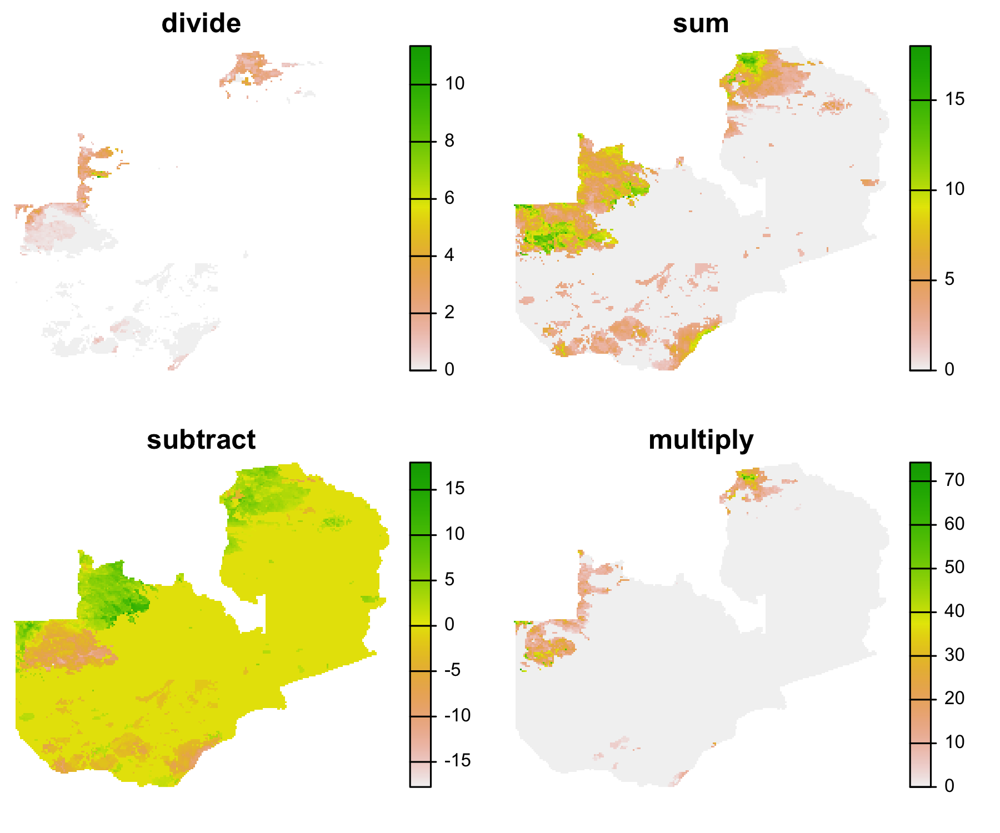
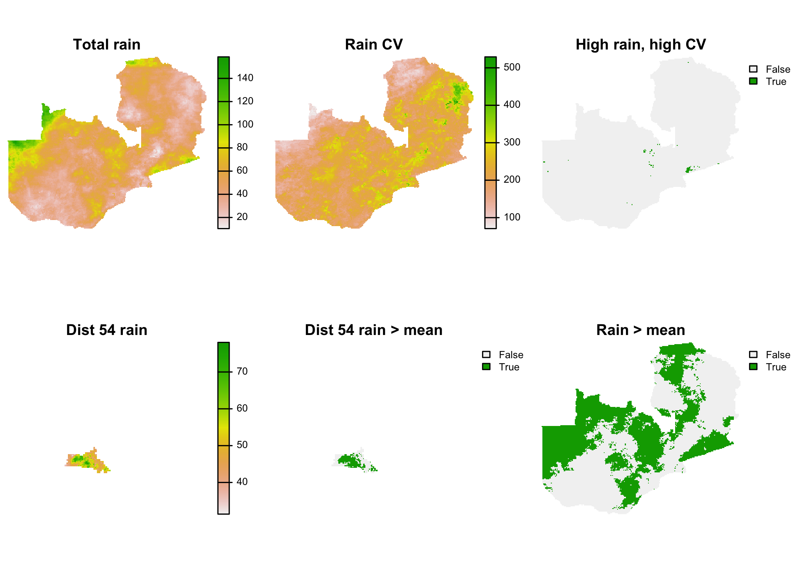
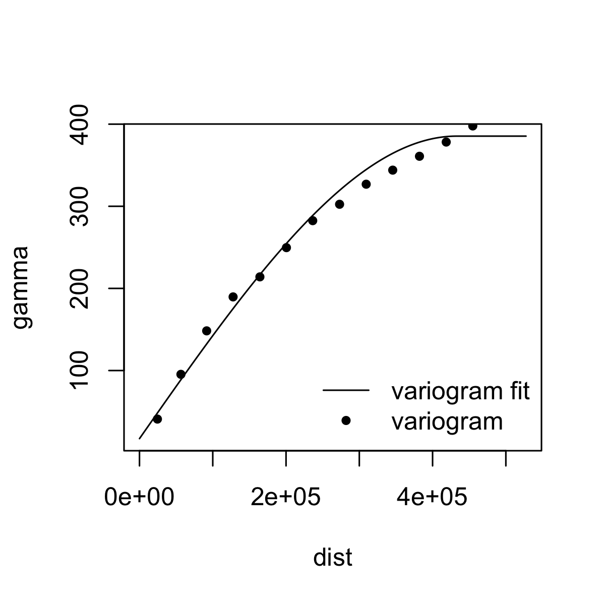

```{r setup, include = FALSE}
knitr::opts_chunk$set(
  collapse = TRUE,
  fig.align = "center",
  comment = "#>"
)
library(knitr)
library(geospaar)
options(width = 100)
```

# Algebra, categorizing, and sampling

Let's move on and look at some additional raster-based analyses. The next few sections depend on objects created in the previous sections (Unit 2 Module 2a). The code to recreate those is here:

```{r, eval=FALSE}
library(geospaar)
data("chirps")
districts <- system.file("extdata/districts.shp", package = "geospaar") %>% 
  st_read %>% mutate(ID = 1:nrow(.))
chirpsz <- mask(x = chirps, mask = districts)

zamr <- raster(x = extent(districts), crs = crs(districts), res = 0.1)
values(zamr) <- 1:ncell(zamr)
zamr2 <- raster(x = extent(districts), crs = crs(districts), res = 0.25)
values(zamr2) <- 1:ncell(zamr2)

distsr <- rasterize(x = districts, y = zamr, field = "ID")
distsr_rs <- resample(x = distsr, y = chirpsz, method = "ngb")  # match extent

farmers <- system.file("extdata/farmer_spatial.csv", package = "geospaar") %>%
  read_csv
farmersr <- farmers %>% distinct(uuid, .keep_all = TRUE) %>% 
  dplyr::select(x, y) %>% mutate(count = 1) %>% 
  st_as_sf(coords = c("x", "y"), crs = 4326) %>% 
  rasterize(x = ., y = zamr2, field = "count", fun = sum) %>% print()
#> class      : RasterLayer 
#> dimensions : 39, 47, 1833  (nrow, ncol, ncell)
#> resolution : 0.25, 0.25  (x, y)
#> extent     : 21.99978, 33.74978, -17.97621, -8.226213  (xmin, xmax, ymin, ymax)
#> crs        : ++proj=longlat +datum=WGS84 +no_defs 
#> source     : memory
#> names      : layer 
#> values     : 1, 152  (min, max)

roads <- system.file("extdata/roads.shp", package = "geospaar") %>% st_read
```

## Algebra and selection
We can do any number of raster calculations using basic mathematical expressions. Here are some very basic ones:

```{r algebra1, out.width="60%", eval=FALSE}
# Chunk 36
r1 <- chirpsz[[1]] / chirpsz[[2]]
r2 <- chirpsz[[1]] + chirpsz[[2]]
r3 <- chirpsz[[1]] - chirpsz[[2]]
r4 <- chirpsz[[1]] * chirpsz[[2]]

s <- stack(r1, r2, r3, r4)
names(s) <- c("divide", "sum", "subtract", "multiply")
plot_noaxes(s)
```
```{r, echo=FALSE, out.width="80%"}

```

As you have seen in the previous section, we can also perform logical operations on rasters, selecting cells that meet certain criteria. 

```{r algebra2, eval=FALSE}
# Chunk 37
# #1
raintot <- calc(chirpsz, fun = sum)
raincv <- calc(chirpsz, fun = cv)

# #2
highrain_highcv <- raintot > 80 & raincv > 200  

# #3
dist54 <- distsr_rs == 54  # a
distrain <- dist54 * raintot  # b
distrain[dist54 == 0] <- NA  # c
# distrain <- mask(raintot, dist54, maskvalue = 0)  # d

# #4
meandistrain <- distrain > cellStats(distrain, mean)

# #5
rain_gt_mu <- raintot > cellStats(raintot, mean)

s <- stack(raintot, raincv, highrain_highcv, distrain, meandistrain, rain_gt_mu)
titles <- c("Total rain", "Rain CV", "High rain, high CV", "Dist 54 rain", 
            "Dist 54 rain > mean", "Rain > mean")
plot_noaxes(s, main = titles)  
```
```{r, echo=FALSE, out.width="80%"}

```

In #1, we use `calc` to sum rainfall and calculate its CV across the 28 days in `chirpsz`. Then, in #2, we identify which cells have both high rainfall (>80 mm) and high rainfall variability (CV > 200) during the 28 day time period. 

In #3, we examine total rainfall within district 54. This is done in several steps. First (line a), we create a mask, where cells in district 54 are 1, and everywhere else 0. Next (line b), we multiply this mask by `raintot`, thereby masking out rainfall values outside the district. At this point, if we calculated any subsequent statistics on district 54 rainfall, they would be invalid because there would be a lot of 0 values for rainfall outside of district 54 that would be included in the calculation (run `plot(distrain)` right after line b to see). This would result in a very low mean rainfall, for example. Therefore, in line c, we identify the indices of the cells in `dist54` that have 0s (`dist54 == 0`), and use those indices to set all the values in `distrain` to NA. Lines b and c show the raster algebraic way of doing what could also be achieved with `mask`, shown in the commented out line d.  

Having made `distrain` safe for calculating statistics, in #4 we then identify the areas in district 54 that received more rainfall than the district mean rainfall during the 28 days. In #5, we do the same thing, but for all of Zambia.  

## Categorizing
Sometimes you will want to create a categorical raster from a continous one. We will look at two different ways of doing that. 

Method 1:
```{r cutfig, eval=FALSE}
# Chunk 38
qtiles <- quantile(raintot, probs = seq(0, 1, 1 / 3))
raintotcut <- cut(x = raintot, breaks = qtiles, include.lowest = TRUE)

cols <- c("tan", "yellow3", "green4")
plot_noaxes(raintotcut, legend = FALSE, main = "Total Rainfall", col = cols, 
            mar = c(0, 0, 1, 0))
legend(x = "bottomright", legend = c("High", "Intermediate", "Low"), 
       pch = 15, pt.cex = 3, col = rev(cols), bty = "n")
```
```{r, echo = FALSE, out.width="60%"}
knitr::include_graphics("fig/u2m2_cutfig.png")
```


Using the `cut`-based approach is perhaps the easiest way of categorizing a continuous raster. `cut` is a raster-based implementation of base `R` function designed for converting numeric vectors to factors. We first define the tercile values (i.e 33.3rd, 66.6th, and 100th percentiles) for `raintot`, and pass those into the "breaks" argument of `cut`. We pass the argument `include.lowest = TRUE` because we want to include all values that are greater than or equal to the lowest value in each category. Our plot of the results has a customized legend, which we chose because we have a categorical raster and thus wanted a categorical, rather than continuous (the default for `raster::plot`, and thus `plot_noaxes`), legend.

Method 2 is somewhat more involved:
```{r reclassify, eval=FALSE}
# Chunk 39
rclmat <- cbind(qtiles[1:3], qtiles[2:4], 1:3)
rclmat
#>               [,1]      [,2] [,3]
#> 0%        10.39840  40.42806    1
#> 33.33333% 40.42806  55.41104    2
#> 66.66667% 55.41104 158.54463    3
raintotrcl <- reclassify(x = raintot, rcl = rclmat, include.lowest = TRUE)

plot_noaxes(raintotrcl, legend = FALSE, main = "Total Rainfall", col = cols, 
            mar = c(0, 0, 1, 0))
legend(x = "bottomright", legend = c("High", "Intermediate", "Low"), 
       pch = 15, pt.cex = 3, col = rev(cols), bty = "n")
```
```{r, echo = FALSE, out.width="60%"}
knitr::include_graphics("fig/u2m2_reclassify.png")
```
In the first step, we reuse the previously calculated terciles to create a reclassification matrix (`rclmat`). This matrix contains the lower bound of the range of the category in column 1, the upper bound in column 2, and then the new class value that will be assigned in column 3. There are three rows, one per category. This matrix is passed to the `rcl` argument of `reclassify`, in which we also specify the same `include.lowest = TRUE` argument. 

This approach requires slightly more work, but there are cases where you might need to use it, e.g. to reclassify another categorical raster using non-sequential categories. 

## Sampling

Many analyses use data sampled from a raster. For example, you might have coordinates for places where you collected field data, and need to collect rasterized environmental data for those locations. The `extract` function is great for this.

### Extract

From the description of `extract`, the function's purpose is to:

> Extract values from a Raster* object at the locations of other spatial data. You can use coordinates (points), lines, polygons or an Extent (rectangle) object. You can also use cell numbers to extract values.

Here we will use points and polygons:

```{r extract, eval=FALSE}
# Chunk 40
# #1
farmers_env <- farmers %>% distinct(uuid, .keep_all = TRUE) %>% 
  dplyr::select(uuid, x, y) %>% st_as_sf(coords = c("x", "y")) %>% 
  mutate(rain = raster::extract(x = raintot, y = .)) %>%
  mutate(district = raster::extract(x = distsr_rs, y = .)) %>% print
#> Simple feature collection with 793 features and 3 fields
#> geometry type:  POINT
#> dimension:      XY
#> bbox:           xmin: 24.777 ymin: -18.222 xmax: 33.332 ymax: -8.997
#> CRS:            NA
#> # A tibble: 793 x 4
#>    uuid             geometry  rain district
#>  * <chr>             <POINT> <dbl>    <dbl>
#>  1 009a8424 (27.256 -16.926)  66.9       11
#>  2 00df166f (26.942 -16.504)  72.0       11
#>  3 02671a00 (27.254 -16.914)  66.9       11
#>  4 03f4dcca (27.237 -16.733)  69.8       11
#>  5 042cf7b3 (27.138 -16.807)  75.1       11
#>  6 05618404 (26.875 -16.611)  66.1       11
#>  7 064beba0 (26.752 -16.862)  58.4       20
#>  8 083a46a2 (26.977 -16.765)  70.4       11
#>  9 08eb2224 (26.912 -16.248)  54.0       59
#> 10 0ab761d6  (27.113 -16.95)  72.4       11
#> # … with 783 more rows

# #2
farmdistid <- farmers_env %>% drop_na %>% distinct(district) %>% pull
distrain <- districts %>% filter(ID %in% farmdistid) %>% 
  raster::extract(x = raintot, y = ., fun = mean) %>% print
#>           [,1]
#>  [1,] 58.35027
#>  [2,] 36.46143
#>  [3,] 67.99078
#>  [4,] 45.12769
#>  [5,] 44.12176
#>  [6,] 69.70491
#>  [7,] 41.09122
#>  [8,] 44.15476
#>  [9,] 54.94505
#> [10,] 63.98032
#> [11,] 52.09214
#> [12,] 49.01939
#> [13,] 51.98236
#> [14,] 46.55391
#> [15,] 61.68815
#> [16,] 53.98820
#> [17,] 60.90310

# #3
rain_stats <- bind_rows(
  farmers_env %>% drop_na %>% dplyr::select(rain) %>% mutate(dat = "Farmers"), 
  tibble(rain = distrain, dat = "Districts")
)

# #4
bp_theme <- theme(legend.title = element_blank(), axis.text.x = element_blank(),
                  axis.ticks.x = element_blank(), 
                  panel.grid.major.x = element_blank(), 
                  panel.grid.minor.x = element_blank(), 
                  panel.background = element_rect(fill = "grey95"))
rain_stats %>% ggplot() +
  geom_boxplot(mapping = aes(y = rain, fill = dat), position = "dodge2") +
  scale_fill_manual(values = c("steelblue", "cadetblue")) + 
  ggtitle("Rainfall distributions") + xlab(NULL) + ylab("mm") + bp_theme
```
```{r, echo=FALSE, out.width="60%"}
knitr::include_graphics("fig/u2m2_extract.png")
```

In #1, we use a pipeline to create a new `farmer_env` `sf` (first selecting just the unique *uuid* and corresponding *x* and *y*), and we pass that to the "y" argument of `raster::extract`. The first `extract` is done from the `raintot` raster, the second from the `dists_rs` raster. Both extractions are wrapped in `mutate`, in order to create two new variables for `farmers_env`. Note that we have to specify `raster::extract` because it is masked by `dplyr::extract`, as `geospaar` loads `tidyverse` after `raster` (remember section 1.2.2 in Unit 1 Module 2). The resulting `sf` contains rainfall sum (over the 28 days) and district numbers for each farmer's location. 

In #2, we first pull out of `farmer_env` a vector of the distinct district IDs. Because `farmers` contains a few bad coordinates that fall outside of Zambia, and there had `NA` values, we inserted `drop_na` into the pipeline to get rid of those. We then used `farmdistid` to filter out the districts the farmers live in from `districts`, and used the result to extract from `raintot` the mean rainfall from the pixels of `raintot` falling within each selected district. When using `raster::extract` with polygons, if you don't pass a value to the "fun" argument, a list is returned, in which each element contains the extracted pixel values corresponding to a particular polyon. If you give "fun" an argument (e.g. `mean`, as in this case), you get back a vector or matrix (if your function gives back more than one value, e.g. `range`) containing the resulting statistic(s) for each polygon. 

In #3, we do some gymnastics in preparation for setting up `ggplot` boxplots (#4) that compare the distributions of rainfall values. That is, we set up a tibble that binds by row the extracted district and farmer rainfall values, which allows `ggplot` to automatically create side-by-side boxplots using `fill = dat`. We create some theme options for `ggplot` ahead of that `bp_theme`, so that we can recycle these in the next example. The plot shows that the rainfall data selected at farmer locations provide a biased estimate of district mean rainfall.  

### Random sampling
Alternatively, you might want to draw a random sample directly from a raster, without all the trials and tribulations of field work (field logistics often make it hard to capture truly randomized, and thus representative, samples). `raster` has functions for this, and we will build off the previous example to demonstrate them. 

```{r samplestrat, eval=FALSE}
# Chunk 41
# #1
farmdistsr <- distsr_rs %in% farmdistid
distsrfarm <- mask(x = distsr_rs, mask = farmdistsr, maskvalue = 0)
# plot_noaxes(distsrfarm)

# #2
set.seed(1)
distsamp <- sampleRandom(x = distsrfarm, size = nrow(farmers_env), cells = TRUE)
randrain <- raintot[distsamp[, 1]]

# #3
set.seed(1)
distsamp_str <- sampleStratified(x = distsrfarm, 
                                 size = nrow(farmers_env) / length(farmdistid),                                  cells = TRUE)
stratrandrain <- raintot[distsamp_str[, 1]]

# #4
rand_rain_stats <- bind_rows(
  tibble(rain = distrain, dat = "Districts"),
  tibble(rain = randrain, dat = "Simple"),
  tibble(rain = stratrandrain, dat = "Stratified")
) %>% drop_na

rand_rain_stats %>% ggplot() +
  geom_boxplot(mapping = aes(y = rain, fill = dat), position = "dodge2") +
  scale_fill_manual(values = c("lightblue", "steelblue", "cadetblue")) + 
  ggtitle("Rainfall distributions") + xlab(NULL) + ylab("mm") + bp_theme
```
```{r, echo=FALSE, out.width="60%"}
knitr::include_graphics("fig/u2m2_samplestrat.png")
```

In this case, we first (#1) mask the raster to exclude districts having no farmers (you can run the commented-out code to see the map). #2 uses the function `raster::sampleRandom` to take a straight random sample from the farmer-hosting districts. We set the "size" argument so that it is equal to `nrow(farmers_env)`, i.e. our sample is equal to the number of farmers in `farmers_env` (793). We use the argument `cells = TRUE` to select the cell numbers, which is what we are really interested in (if we didn't, we would just get the values of those cells, i.e. the district IDs). We then use those cell ids (the first column of `distsamp`) to extract the rainfall values from `raintot`. We can use the cell IDs selected from one raster to extract values from another only if the two rasters have an identical number of cells and extents, as is the case here. You can confirm that this is the case for `distsrfarm` and `raintot` by running `identical(ncell(raintot), ncell(distsrfarm))` and `identical(extent(raintot), extent(distsrfarm))`.

In #3 we apply the more correct way of collecting a representative sample from units of varying size, which is to stratify the sample by districts.  To do this, we uses the function `sampleStratified`, which uses the district IDs in `distsrfarm` to create the strata, and the "size" argument specifies the size of the sample that should be drawn from __each stratum__ (i.e. district). To estimate that size, we divide `nrow(farmers_env)` by the number of farmer-hosting districts, so that we end up with a total sample equal to `r nrow(farmers_env)`. Note that this function merely ensures that the same sample size is drawn from each stratum (district), and does not make the sample size in each stratum proportional to its area. 

In #4, we redo the boxplots, showing the results from the two approaches to random sampling alongside the distribution of district mean rainfall values (extracted in Chunk 40). Both approaches produce statistics that are quite representative of the district rainfall. The stratified approach is closest, as the median aligns more closely with that of `distrain`. 

## Practice
### Questions
1. What are two ways of converting a continous to categorical raster? 

2. What are two methods of sampling from a `raster`? Are the others (a look in `raster`s help files will be informative)?

### Code
1. Use `calc` to find the standard deviation of rainfall for each cell in `chirpsz`. 

2. Use raster algebra to find the country-wide average standard deviation, and then identify which areas of Zambia have values **less** than that. 

3. Create a new categorical raster from `raintot`, using the quintiles to define the new category boundaries together with `cut`. Use `plot_noaxes` to show the result. 

4. Create a new sub-sample of rasterized districts, `randdistsr`, totalling 15 districts randomly selected using `dplyr::sample_n` (use a seed of 11) from `districts`. Use `raintot` as the rasterization target. Mask `raintot` so that it is confined to those districts (with NAs values replacing the values in the other districts). Call it `newrandrain`. 

5. Use `sampleRandom` with a size of 300 to get a random sample of rainfall values from `newrandrain` (use a seed of 1), saving the result as `randsamp`. Use `sampleStratified` with `cell = TRUE` to get a sample of 300 / 15 samples from `randdistsr`. Use the cell IDs to extract the rainfall values from `newrandrain`, saving the output vector as `stratsamp`. Create a tibble that binds these two vectors by row (as in Chunk 41 #4), and then plot the two results as side-by-side boxplots with `ggplot`. 

# Terrain analysis, interpolation, and modeling

We'll round out this module with some additional raster-based analyses and a bit of modeling. The code below recreates the objects made during prior section needed for this analysis. 

## Terrain analysis

We'll start off this section doing some terrain analysis, with a few little asides on the way to illustrate pixel area and some more plotting skills. 

First we need a digital elevation model. `raster` has a very nice function that allows us to download several different gridded geographic datasets, which includes DEMs:

```{r dem, eval=FALSE}
# Chunk 42
dem <- getData(name = "alt", country = "ZMB", path = tempdir())
plot_noaxes(dem, main = "Zambia DEM", legend.args = list(text = "meters"))
```
```{r, echo=FALSE, out.width="60%"}

```

The help file for `getData` tells us the following datasets are available:

> Data set name, currently supported are 'GADM', 'countries', 'SRTM', 'alt', and 'worldclim'. See Details for more info

You can explore those further at your leisure. In our example, we choose the aggregated version of the SRTM DEM, and specify that we want it for Zambia. 

### Pixel resolution/area 

The DEM we downloaded is in decimal degrees with a resolution of `r raster::res(dem)[1]`&deg;, which means the area of each pixel varies through Zambia. To illustrate that, we use a nice function that `raster` provides, which lets you calculate the pixel areas, even when the raster is in geographic coordinates:

```{r demarea, eval=FALSE}
# Chunk 43
demarea <- area(dem)
plot_noaxes(demarea, legend.args = list(text = expression("km"^2)), 
            main = paste("DEM pixel area, mean = ", 
                         round(cellStats(demarea, mean), 3)))
districts %>% st_geometry %>% plot(add = TRUE)
```
```{r, echo=FALSE, out.width="60%"}
knitr::include_graphics("fig/u2m2_demarea.png")
```

The result is in km$^2$, and you can see that the area of each pixel falls as the distance from the equator increases (this is why we use equal area projections to calculate area). 

### An aside on plot annotation
Although we covered graphics in the previous unit, let's look a bit more at plot adornments for a second. Notice in the last two plots how we use the "legend.args" argument in `plot_noaxes` to put a title over the legend bar. And in the last one, we use `expression` to turn km2 into km$^2$. `expression` and several other functions can be used to annotate plots with more complex mathematical expressions:

```{r fancylabels1, eval=FALSE}
# Chunk 44
set.seed(1)
a <- sapply(20:100, function(x) rnorm(n = 100, mean = x, sd = x / 10))
mu <- colMeans(a)  # means
mumu <- round(mean(mu), 2) # mean of mean
sdev <- apply(a, 2, sd)  # stdevs
musd <- round(mean(sdev), 2)  # mean of stdevs
plot(mu, sdev, xlab = expression(mu), ylab = expression(sigma), pch = 20, 
     main = expression(paste("Mean (", mu, ") versus StDev (", sigma, ")")))
text(x = 20, y = 10, pos = 4,
     label = substitute(paste("Overall ", mu, "=", a), list(a = mumu)))
text(x = 20, y = 9, pos = 4,
     label = substitute(paste("Overall ", sigma, "=", a), list(a = musd)))
```
```{r, echo=FALSE, out.width="60%"}
knitr::include_graphics("fig/u2m2_fancylabels1.png")
```

```{r fancylabels2, echo=FALSE, eval=FALSE}
# ggplot once we work out the annotations: currently switched off
lab1 <- bquote(sigma == .(mumu))
ggplot(tibble(mu, sdev)) + geom_point(aes(mu, sdev)) + 
  ggtitle(expression(paste("Mean (", mu, ") versus StDev (", sigma, ")"))) + 
  # geom_text(aes(x = 20, y = 10, 
  #               label = paste("Overall", "m", "=", mumu)), parse = TRUE)
  annotate("text", x = 20, y = 10,
           label = bquote(sigma == .(mumu)), parse = TRUE)
           label = substitute(paste("Overall", mu, "=", a), list(a = mumu)))
```


The example above shows how more advanced plot annotations can be done. It also shows that the code can get somewhat complicated; it always takes a ton of time and a number of internet searches to figure out how to do this. We won't explain this in detail here, but the code provides a template that you can hack at if you want to get fancy with labelling your plots. 

### Basic terrain variables

`raster::terrain` allows us to calculate five different terrain variables, four of which we show below: 
```{r terrain, eval=FALSE}
# Chunk 45
# #1
zamr <- raster(x = extent(districts), crs = crs(districts), res = res(dem))
values(zamr) <- 1:ncell(zamr)
zamr_alb <- projectRaster(from = zamr, res = 1000, crs = crs(roads), 
                          method = "ngb")
demalb <- projectRaster(from = dem, to = zamr_alb)  # default is bilinear

# #2
# slope <- terrain(x = demalb, opt = 'slope', unit = 'degrees')  # slope
# aspect <- terrain(x = demalb, opt = 'aspect', unit = 'degrees')  # aspect
# flowdir <- terrain(x = demalb, opt = 'flowdir')  # flow direction
# tri <- terrain(x = demalb, opt = 'tri')  # topographic roughness index
vars <- c("slope", "aspect", "flowdir", "tri")
terrvars <- stack(lapply(1:length(vars), function(x) {
  tv <- terrain(x = demalb, opt = vars[x], unit = "degrees")
}))
names(terrvars) <- vars

plot_noaxes(terrvars)
```
```{r, echo=FALSE, out.width="80%"}
knitr::include_graphics("fig/u2m2_terrainvars.png")
```

We need the DEM in a projected coordinate system for `terrain` to work, per the help file: 

> Compute slope, aspect and other terrain characteristics from a raster with elevation data. The elevation data should be in map units (typically meter) for projected (planar) raster data. They should be in meters when the coordinate reference system (CRS) is longitude/latitude.

So we create (#1) a 1 km projected version of the DEM, allowing the default bilinear interpolation to do its work during reprojection. 

In #2 we calculate slope, aspect, flow direction, and the topographic ruggedness index. The commented out code illustrates how each of these variables can be calculated separately, although we prefer to do the job using `lapply`. Note that in the `lapply` we pass the "unit" argument into the calculation of all four variables, even though it only is used for slope and aspect; this is fine, because `terrain` simply ignores the argument value in calculating flow direction or TRI. 

## Interpolation

Interpolating between point values is a fairly common GIS analysis. The `interpolate` function of raster allows you to do this using a number of different types of models, such as kriging and inverse distance weighting. We are going to demonstrate both approaches, drawing on functions provided by the `gstat` package (please install it):

```{r interpolate, eval=FALSE}
# Chunk 46
# install.packages("gstat")
library(gstat)

# #1
raintotalb <- projectRaster(from = raintot, res = 5000, crs = crs(roads))
names(raintotalb) <- "rain"
r <- raster(extent(raintotalb), res = res(raintotalb), 
            crs = crs(raintotalb), vals = 1)

# #2
set.seed(1)
rainsamp <- sampleRandom(raintotalb, size = 1000, xy = TRUE)
rainsamp <- as.data.frame(rainsamp)
# head(rainsamp)

# #3
invdist <- gstat(id = "rain", formula = rain ~ 1, locations = ~x + y, 
                 data = rainsamp)
invdistr <- interpolate(object = r, model = invdist)
invdistrmsk <- mask(x = invdistr, mask = raintotalb)

# #4
coordinates(rainsamp) <- ~x + y  # a
crs(rainsamp) <- crs(roads)  # b
v <- variogram(object = rain ~ 1, data = rainsamp)  # c
m <- fit.variogram(object = v, model = vgm("Sph"))  # d
m
#> model    psill    range
#> 1   Nug  14.1009      0.0
#> 2   Sph 380.2139 457427.7

plot(variogramLine(m, max(v[, 2])), type = "l")  # e
points(v[, 2:3], pch = 20)  # f
legend("bottomright", legend = c("variogram fit", "variogram"), 
       lty = c(1, NA), pch = c(NA, 20), bty = "n") # g
```
```{r, echo = FALSE, out.width="60%"}

```
```{r, eval = FALSE}
# #5
ordkrig <- gstat(id = "rain", formula = rain ~ 1, data = rainsamp, model= m)
ordkrigr <- interpolate(object = r, model = ordkrig)
ordkrigrmsk <- mask(x = ordkrigr, mask = raintotalb)

raininterp <- stack(raintotalb, invdistrmsk, ordkrigrmsk)
titles <- c("Actual rain", "IDW rain", "Kriged rain")
par(mfrow = c(2, 2), mar = c(0, 0, 1, 0))
plot(rainsamp, pch = 20, cex = 0.5)
for(i in 1:3) plot_noaxes(raininterp[[i]], main = titles[i])
```

```{r, echo = FALSE, out.width="80%"}
knitr::include_graphics("fig/u2m2-2.png")
```

This example is reasonably complex, both conceptually and with respect to code. We will refer you to other, non-R literature to explain how  [interpolation](http://gisgeography.com/inverse-distance-weighting-idw-interpolation/) and [kriging](http://gisgeography.com/kriging-interpolation-prediction/) work, and confine our explanations to the code. 

Block #1 creates an Albers projected version of `raintot` (which is roughly 5 km on a side), and sets up a dummy raster (`r`) that will be our interpolation target, i.e. it provides the parameters we want our prediction surface to have. #2 then draws a random sample from across the reprojected rainfall raster, providing a set of point observations of rainfall. #3 runs the code for an inverse distance weighted (IDW) interpolation (each cell between the sample points is given a new value that is the weighted mean of the rainfall values collected at the points nearest to it; the weight is determined by the distance to each point). The interpolation model is set up by the `gstat` function, using the coordinates x and y as the locations. `raster::interpolate` takes the model and applies it to `r`, making the new `invdistr` raster, which we then mask to the outline of Zambia (`invdistrmsk`). 

In #4, we provide the initial steps for implementing ordinary kriging. In line a and b, we have to first convert `rainsamp` from a `data.frame` into a `SpatialPointsDataFrame`. Line c calculates the variogram, which measures the spatial autocorrelation between rainfall values--this requires a spatial object, hence the need for lines a and b. Line d fits a spherical variogram model. Lines e-g plot the variogram (changes in semivariances with distance) and the spherical model we fit to estimate that semivariance.  

Block #5 takes the fitted variogram model (`m`) and uses that to create the rainfall surface. The steps in this block are basically the same as in #3, except that we use the kriging model. 

## Distance
If you want to calculate how far any point on a grid is from a particular point or points, `raster` offers a few functions for finding euclidean distances:

```{r distance, eval=FALSE}
# Chunk 47
# #1
set.seed(1)
randsamp <- sampleRandom(raintotalb, size = 10, xy = TRUE) %>% as_tibble %>%   st_as_sf(coords = c("x", "y"))

# #2
ptdistr <- distanceFromPoints(object = raintotalb, xy = as_Spatial(randsamp))
ptdistrmsk <- mask(ptdistr, raintotalb)

# #3
randsampr <- rasterize(randsamp, y = raintotalb)[[2]]
ptdistr2 <- distance(randsampr)
ptdistrmsk2 <- mask(ptdistr2, raintotalb)

s <- stack(ptdistrmsk, ptdistrmsk2) / 1000
names(s) <- c("distanceFromPoints", "distance")
par(mfrow = c(1, 2), oma = c(0, 0, 0, 1))
for(i in 1:nlayers(s)) {
  plot_noaxes(s[[i]], main = names(s)[i])
  plot(randsamp %>% st_geometry, pch = 20, cex = 0.5, add = TRUE)
}
```
```{r, echo = FALSE, out.width="80%"}

```

In #1, we draw 10 randomly selected points from `raintotalb` and create a `SpatialPointsDataFrame` called `randsamp`. Here we are interested just in the spatial locations, not the values.  

In #2, we use the `distanceFromPoints` function to find how far any given point in an input raster (`raintotalb`) is from the xy locations contained in `randsamp`. `raintotalb` serves here simply to provide the dimensions of the raster surface from which we want to calculate distance values. We mask the resulting distance surface (`ptdistr`) to confine the results to Zambia's borders.

Block #3 does pretty much the same thing, but in this case we use the `distance` function, which takes a set of rasterized points (where the only cells having values are the cells underlying the points that were rasterized--the rest are NA) and calculates the distances from every other cell (the NA values) to the nearest rasterized point having a non-NA value.  

The plot shows that the two approaches produce identical results. 

Beyond this, there are more sophisticated distance analyses that can be done, such as cost distance analysis, which are provided by the package `gdistance`. 

## Model prediction

Although there are many, many more analyses and capabilities we could illustrate with rasters, we will end this section with a relatively simple modeling example. In this, we will use ordinary linear regression to try model rainfall values collected at point locations, based on their correlations with certain predictors.  

First, we will use `getData` to download the Worldclim global precipitation layer (at a resolutMion of 2.5 minutes of a degree), then `crop` the data to Zambia's extent, sum the resulting cropped monthly values into a single annual value, mask the result, and then save it so that it becomes available as a lazy load with the `geospaar` package. The code for doing this is below, which doesn't execute as part of this vignette.  
```{r getworldclim, eval = FALSE}
# Chunk 48
wcprec <- getData("worldclim", var = "prec", res = 2.5, path = p_data)
zamprec <- crop(wcprec, y = districts)
zamprec <- mask(calc(zamprec, sum), districts)

save(zamprec, file = "data/zamprec.rda")
```

After doing that (and rebuilding `geospaar`), we can do our analysis, loading in the `zamprec` data as we need it.

```{r predict, eval=FALSE}
# Chunk 49
# #1
data(zamprec)
zamprecalb <- projectRaster(from = zamprec, to = raintotalb)
names(zamprecalb) <- "rain"
elev <- resample(aggregate(x = demalb, fact = 5), y = raintotalb)

# #2
set.seed(1)
pts <- sampleRandom(x = zamprecalb, size = 500, sp = TRUE) %>% st_as_sf
pts <- pts %>% mutate(elev = raster::extract(x = elev, y = .)) 
pts_dat <- bind_cols(
  pts %>% data.frame %>% dplyr::select(-geometry) %>% as_tibble, 
  st_coordinates(pts) %>% as_tibble
) %>% drop_na
  
# #3
p1 <- ggplot(pts_dat) + geom_point(aes(X, rain), col = "steelblue") +
  ylab("Rainfall (mm)")
p2 <- ggplot(pts_dat) + geom_point(aes(Y, rain), col = "blue2") + ylab("")
p3 <- ggplot(pts_dat) + geom_point(aes(elev, rain), col = "darkblue") + ylab("")
cowplot::plot_grid(p1, p2, p3, nrow = 1)
```

```{r, echo = FALSE, out.width="80%"}
knitr::include_graphics("fig/u2m2_rfpredict.png")
```

```{r, eval=FALSE}
# #4
rain_lm <- lm(rain ~ X + Y + elev, data = pts_dat)
summary(rain_lm)

# #5
xs <- xFromCell(object = raintotalb, cell = 1:ncell(raintotalb))
ys <- yFromCell(object = raintotalb, cell = 1:ncell(raintotalb))
X <- Y <- raintotalb
values(X) <- xs
values(Y) <- ys

# #6
predst <- stack(X, Y, elev)
names(predst) <- c("X", "Y", "elev")
predrainr <- predict(object = predst, model = rain_lm)

# #7
s <- stack(zamprecalb, predrainr, (predrainr - zamprecalb) / zamprecalb * 100)
mae <- round(cellStats(abs(zamprecalb - predrainr), mean), 1)  

pnames <- c("'Observed' Rainfall", "Predicted Rainfall", "% Difference")
par(mfrow = c(1, 3), mar = c(0, 0, 1, 4))
for(i in 1:3) {
  plot_noaxes(s[[i]], main = pnames[i])
  if(i %in% 1:2) {
    pts %>% st_geometry %>% 
      plot(pch = 20, cex = 0.2, col = "grey70", add = TRUE)
  } else {
    mtext(side = 1, line = -3, cex = 0.8, 
          text = paste("Mean abs err =", mae, "mm"))
  }
}
```
```{r, echo = FALSE, out.width="80%"}

```

This example demonstrates a very crude model that uses elevation, latitude, and longitude to predict the mean annual rainfall for Zambia. This is not really how you would want to go about predicting rainfall, but the point here is to show how you can combine statistical models with spatial data to make prediction maps. Despite the crudeness, the model more or less captures the spatial pattern of rainfall.

Let's examine the code a bit:

Block #1 projects the `zamprec` layer to Albers and to the same 5 km resolution as `raintotalb` (using bilinear interpolation), and then aggregates and resamples `demalb` to that same resolution/extent (calling it `elev`). 

Block #2 selects 500 points at random from `zamprecalb`, which gives a sample of rainfall values from that raster. We then use the same points to extract elevation values from `elev`, and convert all that to an ordinary `tibble` (rather than an `sf` object) that contains rainfall, elevation, X coordinate (longitude), and Y coordinate (latitude) values for each point location. 

Block #3 plots *X*, *Y*, and *elev* against rainfall to see if there are any obvious correlations. It seems pretty clear that rainfall increases with both elevation and latitude (note that there is a also a correlation between latitude and elevation, which we choose to ignore here in violation of regression assumptions), and a weak to perhaps non-existent connection between longitude and rainfall.   

In #4, we use `lm` to fit a multiple regression model, in which *X*, *Y*, and *elev* are used to predict rainfall. The `summary` of the model `rain_lm` shows that the model explains about 75% of the variance in rainfall using those three predictors, and that all predictors are significant (with *X* having the least influence). 

In #5, we set about creating gridded versions of *X* and *Y*, which we need to do if we want to make a prediction map. We use the `raster` helper functions `xFromCell` and `yFromCell` to get the x and y coordinates for all cell numbers in `raintotalb` (our target raster). We populate new rasters `X` and `Y` with the extracted coordinate values.

Block #6 sets up a stack that has all the predictor grids, which, importantly, have the same names as the predictor variables used in the `lm` (*X*, *Y*, and *elev*). That is necessary to prevent a failure in running the last line, which uses the generic `predict` function (this one designed to work for rasters) to apply the model coefficients to the spatial predictors, and create the predicted rainfall surface. If the variables in the input stack of spatial predictors don't match the predictor variable names in the model object, the function will fail. 

We plot three maps in #7 for comparison: the "actual" rainfall (the scare quotes are there because the WorldClim dataset is itself the result of a fair bit of modeling), the new `lm`-predicted surface, and then a map of the differences between the two layers, expressed as a percent difference relative to the values of `zamprecalb`. The mean absolute error (in mm) is printed onto the map, using the `mtext` function.   

So that's about it for this module. 

## Practice
### Questions
1. How do we estimate the pixel area of rasters when they are in non-projected coordinate systems? 

2. How can you add mathematical symbols and other special characters (e.g. superscripts) to graphics? 

3. When you want to apply a fitted model to a stack or brick of rasters (e.g. `pred_stack` that provide the model predictor layers, what do we have to remember to do with `names(pred_stack)`? 

### Code
1. Crop `demalb` down to the extent of district 42 (bear in mind that `districts` needs to be in the same projection as `demalb`, so transform it first). Then calculate slope, aspect, and TPI on the cropped DEM. Plot the results so that they appear in 3 side by side panels.

2. Using the code in Chunk 46 blocks #1-#3 as your template, re-create IDW interpolations using the original 1000 randomly sampled points. Then create two new ones based on 1) 500 and 2) 250 randomly selected points (use the same seed). Stacking the results in this order: `raintotalb`, the 1000 point IDW, the 500 point IDW, and the 250 IDW. Plot these in a single call to `plot_noaxes`, setting `zlim = c(0, 150)` and passing informative titles to the "main" argument (e.g. "CHIRPS", "1000 pt IDW", "500 pt IDW", etc). There are two ways of doing this: i) the hard way, by copying, pasting, and changing code blocks #2 and #3 for each version of the IDW; ii) the programmatic way, by creating the three IDWs in an `lapply`. Note: if you choose the elegant way, to make the stack, you will either need to `stack(c(raintotalb, idw_list))` or `stack(raintotalb, stack(idw_list))` stack the list of three idws, and then stack that with `raintotalb`.

3. Select (`filter`) districts 15, 20, 25, 30, 35, 40, 45, and 50 out of `districts`. Convert the resulting subset of districts to Albers projection, and then extract the centroids of those districts. Convert the centroids to an `sp` object using `as_Spatial`. Using `raintotalb` as your target, use `distance` or `distanceFromPoints` to calculate the distances from any point in Zambia to the centroids of those selected districts. Mask the result (you can use `raintotalb` again for the mask target) and plot it using `plot_noaxes`. 

4. Redo the code in Chunk 49, but use a new random draw of just 25 points to collect the predictors (ref. #2). How much more poorly does this model do than the one with denser observations?


# Unit assignment
## Set-up
Make sure you are working in the master branch of your project (you should not be working on the a4 branch). Create a new vignette named "unit2-module2.Rmd". You will use this to document the tasks you undertake for this assignment. 

There are no package functions to create for this assignment. All work is to be done in the vignette. 

## Vignette tasks
1. Create a subset of `districts` by extracting districts 22, 26, 53, and 54. Call it `districts_ss`. Use the extent of `districts_ss` (`extent(districts_ss)`) to define the extent of a new raster `r`, which should have a resolution of 0.1&deg;. Use `r` as a template for creating two new rasters, `rsamp` and `runi`. `rsamp` should be filled with randomly selected integers ranging between 10 and 50. `rrandn` should be filled with random numbers drawn from a normal distribution (`rnorm`) that has a mean of 30 and standard deviation of 5. Use a seed of 1 in `set.seed`. Stack `rsamp` and `runi` (name the stack `s`), mask that by `districts_ss`, and plot `s` using `plot_noaxes`. (Ref: Chunks 1, 3, 4, 16)

2. Disaggregate `s[[1]]` to a resolution of 0.025&deg;, using bilinear interpolation, calling the result `s2_1d`. Select all areas of `s2_1d` that have values > 35, creating a new raster `s2_1gt35`. Set the values of `s2_1gt35` that equal 0 to NA. Then convert the resulting raster into an `sf` object called `s2poly`. Plot the resulting polygons over `s2_1d`. (Ref: Chunks 10, 22, 37) 

3. Create a new grid from the extent of `districts` that has a resolution of 0.5&deg; (call it `zamr`), assigning all cells a value of 1. Then recreate the `farmersr` dataset--a raster that sums the number of farmers falling within each grid cell. Mask the results using `districts`, and then plot the result onto a grey background of Zambia. (Ref: Chunk 8, 37)

4. Convert the rasterized farmers counts (`farmersr`) back into an `sf` points object `farmersrpts`. Create a new version of `zamr` at 0.05&deg;, and then calculate the distance between these points and every other location in Zambia, creating an output grid of distances, called `dist_to_farmers`, which you mask by `districts`. Plot `dist_to_farmers` in kilometers (i.e. divide it by 1000) using `plot_no_axes`, with `farmersrpts` overlaid as black solid circles. (Ref: Chunks 8, 10, 47)

5. Use `raster`'s `getData` function to grab WorldClim's mean temperature ("tmean") dataset at a resolution of 2.5 (note this is not degrees, but minutes of a degree), and download it to somewhere on your local disk. That will give a global scale `RasterBrick` with 12 layers, with each layer representing the average monthly temperature for each grid cell on the planet. Crop that brick to the extent of `districts`, and then calculate the annual mean temperature for each cell. Mask the result using `districts`, and divide it by 10 to get temperature in &deg;C in your final raster, `zamtmean`. Plot the result. (Ref: Chunk 17, 18, 48)

6. Classify the temperature data into three categories, low, medium, and high, using <20&deg;, 20-24&deg;, and >24&deg; as the break points for determining the classes.  Use the `reclassify` function rather than the `cut` function, which means you need to set up a reclassification matrix, which you should do like this:

    ```{r, eval = FALSE}
    trng <- cellStats(zamtmean, range)
    reclmat <- cbind(c(floor(trng[1]), 20, 24), c(20, 24, ceiling(trng[2])), 1:3)
    ```

    Here `cellStats` is helping to find the values of tmin and tmax, which respectively define the lower bound of the "low" class and the upper bound of the "high" class. What are the functions `floor` and `ceiling` doing (answer this in your vignette)? Call the reclassified temperature raster `zamtclass`. Make the map using `plot_noaxes` with a categorical legend, and using the colors "blue", "yellow2", and "red" for the three classes. (Ref: Chunk 26, 39)

7. Load up the `zamprec` dataset (`data(zamprec)`) that comes with `geospaar`, then calculate the mean precipitation within each temperature zone defined by `zamtclass`. Call the resulting matrix `z`. Map the mean zonal precipitation values in `z` onto each temperature zone (using the `subs` function with `zamtclass` as the target; remember that `zonal` returns a matrix, and that `subs` requires a `data.frame` or `tibble` for its y argument). Call the new raster `zamprecz`, and then plot it using `plot_noaxes`, with a custom legend (as done in Task 6), using the rounded zonal mean values (rounded) as the legend labels (`legend = round(z$mean)`). Use colors "yellow2", "green3", and "blue" for the three classes (Ref: Chunks 32, 33, 39)

8. Use `getData` again to download the elevation raster for Zambia (call it `dem`). Aggregate it to the same resolution as `zamtmean`, using the default mean aggregation (the factor you need is 5). Call that `dem5`. Use `terrain` to calculate aspect from `dem5` (call it `aspect`), selecting degrees as the output value. Then find all west-facing aspects (aspects >247.5 and <292.5), and all east facing aspects (>67.5 and <112.5), making new rasters respectively named `west` and `east`, e.g. `west <- aspect > 247.5 & aspect < 292.5)`. Stack these together with `aspect` and make a three-panel plot with `plot_noaxes` with titles "Aspect", "West", and "East". (Ref: Chunks 37, 42)

9. Using a random seed of 1, create two random samples of 100 each. The first one should be collected from within the west-facing cells (i.e. only be drawn from cells in `west` that have a cell of one), and the second from east-facing cells. To do this, set the cells equal to 0 in `east` and `west` to NA (e.g. `west[west == 0] <- NA`). Once you have collected those, convert the resulting `sp` objects to `sf`, and use those two sets of points to extract temperature values from `zamtmean` into a tibble `temp_stats`, which is going to look this: 

    ```{r, eval=FALSE}
    temp_stats <- bind_rows(
      tibble(temp = raster::extract(zamtmean, westpts), dat = "West"), 
      tibble(temp = raster::extract(zamtmean, eastpts), dat = "East")
    )
    ```

    Then use `temp_stats` with `ggplot` to make side-by-side boxplots to compare the distributions of west and east facing temperatures, modeled on the example in Chunk 40 #4. (Ref: Chunks 37, 40)

10. **Extra credit worth (5 points).** Extract the centroids from each district in `districts` (call it `dcent`), and reproject the points to Albers, using the `st_crs(roads)`. Reproject `zamtmean` to Albers also, making the new resolution (5 km, i.e. 5000 m), using bilinear interpolation (call it `zamtmeanalb`). Then use `dcent` to extract the temperature values from `zamtmeanalb` (add the values to `dcent` as a new variable "temp" using `mutate`). Use `gstat` to create an IDW model (call it `idw`). To make the IDW work, which isn't `sf` compliant, some extra work will be required, as shown below (this is the step needed after the extract of temperature values)

    ```{r, eval = FALSE}
    dcent <- bind_cols(
      dcent %>% data.frame %>% dplyr::select(-geometry) %>% as_tibble, 
      st_coordinates(dcent) %>% as_tibble
    ) %>% rename(x = X, y = Y)
    ```
    
    This yields a `tibble` with columns *x* and *y* that are needed by `gstat`. After running `gstat`, map the interpolated temperatures using `zamtmeanalb` as a target object (it won't be overwritten) and `idw` as the model. Make sure you mask the result to the boundaries of Zambia, using `zamtmeanalb` as the mask. Call the new interpolated, masked grid `zamtidw`. Plot the result side by side with `zamtmeanalb` for comparison using `plot_noaxes` with titles "Real Temperature" and "IDW Temperature". (Refs: Chunks 46, 49)

## Assignment output
Refer to [Unit 1 Module 4's assignment output section](unit1-module4.html#assignment-output) for submission instructions. The only differences are as follows:

1. Your submission should be on a new side branch "a5";
2. You should increment your package version number by 1 on the lowest number (e.g. from 0.0.2 to 0.0.3) in the DESCRIPTION;
3. Do not worry about #3 in those instructions

***
<center>
[Back to home](index.html)
</center>
***

